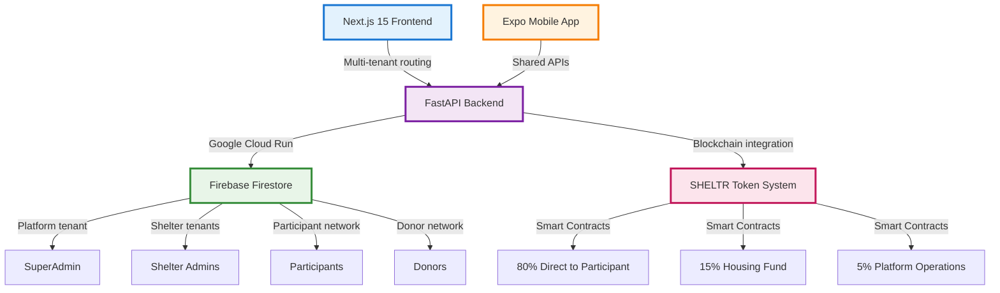

# 🏠 SHELTR-AI
**Hacking homelessness through technology.** 

The next generation platform for transparent charitable giving and homelessness support built on modern cloud infrastructure.

[](https://firebase.google.com)
[](https://fastapi.tiangolo.com)
[](https://reactjs.org)
[](https://expo.dev)
[](https://github.com/mrj0nesmtl/sheltr-ai)
[](https://opensource.org/licenses/MIT)
[](https://www.python.org/downloads/)

---

## 🎯 Mission

**Hacking homelessness through technology.** SHELTR-AI empowers direct, transparent charitable giving through QR-code enabled donations, blockchain verification, and AI-driven insights. Every donation follows our SmartFund™ distribution: 80% direct to participants, 15% to sustainable housing, 5% to platform operations.

## 🚀 Quick Start

### For Developers
```bash
# 1. Clone and setup the new repository
git clone https://github.com/mrj0nesmtl/sheltr-ai.git
cd sheltr-ai

# 2. Backend setup (FastAPI + Python 3.11)
cd apps/api
python -m venv .venv
source .venv/bin/activate  # On Windows: .venv\Scripts\activate
pip install -r requirements.txt

# 3. Frontend setup (Next.js 15)
cd ../web
npm install
npm run dev

# 4. Mobile setup (Expo)
cd ../mobile
npm install
npx expo start

# 5. Environment setup
cp .env.example .env.local
# Configure Firebase, OpenAI, and blockchain settings
```

### Test Your Python Environment
```bash
# In apps/api with virtual environment activated
python test_setup.py
```

**→ [Complete Development Setup](docs/04-development/environment-setup.md)**

### For Users
- **🌐 Web App**: [sheltr-ai.web.app](https://sheltr-ai.web.app) ✅ **LIVE NOW!**
- **📱 Mobile App**: iOS/Android *(Q2 2025)*
- **🔗 API Docs**: [api.sheltr.ai/docs](https://api.sheltr.ai/docs) *(Coming Soon)*
- **Donors**: [Donor Quick Start Guide](docs/06-user-guides/donor-guide.md)
- **Participants**: [Participant Registration Guide](docs/06-user-guides/participant-guide.md)
- **Shelter Admins**: [Shelter Management Guide](docs/06-user-guides/shelter-admin-guide.md)
- **Platform Admins**: [SuperAdmin Guide](docs/06-user-guides/super-admin-guide.md)

---

## 🏗️ Architecture Overview

SHELTR-AI is built on a modern, scalable multi-tenant SaaS architecture powered by **Google Cloud Platform** and **Firebase**:



### **🆕 New Architecture Highlights**
- **🔥 Firebase-First**: Firestore multi-tenant database with real-time sync
- **☁️ Google Cloud Run**: Serverless FastAPI backend deployment
- **🔒 Firebase Auth**: Robust authentication with custom claims
- **🌐 Firebase Hosting**: Global CDN for web application
- **📦 Monorepo Structure**: TurboRepo for streamlined development
- **🐍 Python 3.11**: Modern async FastAPI with type hints
- **⚡ Real-time**: Live updates across all platforms

**→ [Full Architecture Documentation](docs/02-architecture/README.md)**

---

## 📁 **New Monorepo Structure**

SHELTR-AI now uses a modern monorepo structure for better organization and development velocity:

```
sheltr-ai/
├── apps/
│   ├── web/              # Next.js 15 Frontend
│   ├── mobile/           # Expo Mobile App  
│   └── api/              # FastAPI Backend (Python 3.11)
│       ├── .venv/        # Python virtual environment
│       ├── main.py       # FastAPI application entry
│       ├── requirements.txt # Python dependencies
│       └── test_setup.py # Environment verification
├── packages/
│   ├── shared/           # Shared utilities
│   ├── ui/               # Design system components
│   ├── types/            # TypeScript definitions
│   └── config/           # Shared configuration
├── docs/                 # Comprehensive documentation
│   ├── 01-overview/      # Getting started guides
│   ├── 02-architecture/  # System design docs
│   ├── 03-api/          # API documentation
│   └── [... 10 sections total]
├── tools/                # Development tools
├── scripts/              # Automation scripts
├── .vscode/              # Cursor/VS Code settings
│   ├── settings.json     # Multi-language setup
│   └── extensions.json   # Recommended extensions
├── CHANGELOG.md          # Version history
├── CONTRIBUTING.md       # Contribution guidelines
├── LICENSE.md           # MIT License with charitable terms
└── README.md            # This file
```

---

## 📚 Documentation Sections

### 🌟 [01. Overview](docs/01-overview/)
- [Getting Started](docs/01-overview/getting-started.md)
- [Architecture Overview](docs/01-overview/architecture-overview.md)
- [Feature Comparison](docs/01-overview/feature-comparison.md)
- [Development Roadmap](docs/01-overview/roadmap.md)

### 🏗️ [02. Architecture](docs/02-architecture/)
- [System Design](docs/02-architecture/system-design.md)
- [Multi-Tenant Design](docs/02-architecture/multi-tenant-design.md)
- [Database Schema](docs/02-architecture/database-schema.md)
- [Blockchain Architecture](docs/02-architecture/blockchain-architecture.md)
- **🆕** [Firebase Integration](docs/02-architecture/firebase-integration.md)
- **🆕** [Google Cloud Architecture](docs/02-architecture/google-cloud-architecture.md)

### 🔌 [03. API Documentation](docs/03-api/)
- [API Overview](docs/03-api/README.md)
- [Authentication](docs/03-api/authentication.md)
- [User Management](docs/03-api/user-management.md)
- [Donation System](docs/03-api/donation-system.md)
- [QR Management](docs/03-api/qr-management.md)
- **🆕** [FastAPI Endpoints](docs/03-api/fastapi-endpoints.md)
- **🆕** [Firebase Functions](docs/03-api/firebase-functions.md)

### 👩‍💻 [04. Development](docs/04-development/)
- [Environment Setup](docs/04-development/environment-setup.md)
- [Firebase Setup](docs/04-development/firebase-setup.md)
- [Coding Standards](docs/04-development/coding-standards.md)
- [Testing Guide](docs/04-development/testing-guide.md)
- **🆕** [Python Development](docs/04-development/python-development.md)
- **🆕** [Cursor IDE Setup](docs/04-development/cursor-ide-setup.md)
- **🆕** [Monorepo Workflow](docs/04-development/monorepo-workflow.md)

### 🚀 [05. Deployment](docs/05-deployment/)
- [Firebase Deployment](docs/05-deployment/firebase-deployment.md)
- [Google Cloud Run](docs/05-deployment/google-cloud-run.md)
- [Smart Contract Deployment](docs/05-deployment/smart-contract-deployment.md)
- [Mobile App Stores](docs/05-deployment/mobile-app-stores.md)
- **🆕** [Docker Containerization](docs/05-deployment/docker-setup.md)
- **🆕** [CI/CD Pipeline](docs/05-deployment/github-actions.md)

### 👥 [06. User Guides](docs/06-user-guides/)
- [SuperAdmin Guide](docs/06-user-guides/super-admin-guide.md)
- [Shelter Admin Guide](docs/06-user-guides/shelter-admin-guide.md)
- [Participant Guide](docs/06-user-guides/participant-guide.md)
- [Donor Guide](docs/06-user-guides/donor-guide.md)
- [Mobile App Guide](docs/06-user-guides/mobile-app-guide.md)

### 📖 [07. Reference](docs/07-reference/)
- [API Reference](docs/07-reference/api-reference.md)
- [Database Reference](docs/07-reference/database-reference.md)
- [Component Library](docs/07-reference/component-library.md)
- [Smart Contract Reference](docs/07-reference/smart-contract-reference.md)

### 🔗 [08. Integrations](docs/08-integrations/)
- [Firebase Integration](docs/08-integrations/firebase-integration.md)
- [Blockchain Integration](docs/08-integrations/blockchain-integration.md)
- [Payment Integration](docs/08-integrations/payment-integration.md)
- [Third-Party APIs](docs/08-integrations/third-party-apis.md)
- **🆕** [Google Cloud Services](docs/08-integrations/google-cloud-services.md)
- **🆕** [AI/ML Integration](docs/08-integrations/ai-ml-integration.md)

### 🔄 [09. Migration](docs/09-migration/)
- [From Supabase](docs/09-migration/from-supabase.md)
- [Legacy SHELTR Migration](docs/09-migration/legacy-sheltr-migration.md)
- [Data Migration Guide](docs/09-migration/data-migration-guide.md)
- **🆕** [Repository Migration](docs/09-migration/repository-migration.md)
- **🆕** [Database Recovery](docs/09-migration/database-recovery.md)

### 📦 [10. Resources](docs/10-resources/)
- [Design System](docs/10-resources/design-system.md)
- [Brand Guidelines](docs/10-resources/brand-guidelines.md)
- [Security Checklist](docs/10-resources/security-checklist.md)
- [Performance Benchmarks](docs/10-resources/performance-benchmarks.md)
- **🆕** [Contributing Templates](docs/10-resources/templates/)
- **🆕** [Development Tools](docs/10-resources/development-tools.md)

---

## 🎯 Four-Role System

SHELTR-AI operates on a comprehensive four-role user system designed for maximum flexibility and security:

| Role | Description | Access Level | Tenant Location | **🆕 New Features** |
|------|-------------|--------------|-----------------|-------------------|
| **👑 SuperAdmin** | SHELTR Founders & Platform Operators | Global system control | `tenants/platform/` | Advanced analytics, blockchain oversight |
| **👨‍💼 Admin** | Shelter Operators & Staff | Shelter management | `tenants/shelter-{id}/` | Multi-shelter dashboards, participant management |
| **👤 Participant** | Donation Recipients (Homeless Individuals) | Personal QR & donations | `tenants/shelter-{id}/participants/` or `tenants/participant-network/` | **🆕 Independent registration, QR code generation** |
| **💝 Donor** | People Making Donations | Donation & impact tracking | `tenants/donor-network/` | Real-time impact tracking, donation history |

### **🆕 Participant Independence**
Participants can now register **independently** of shelters, creating a more inclusive network:
- **Direct Registration**: QR code generation without shelter affiliation
- **Cross-Shelter Mobility**: Maintain identity across multiple locations
- **Personal Agency**: Own their donation profile and impact story

---

## 🪙 SHELTR Token & Blockchain System

### **🆕 Enhanced Token Architecture**

We've expanded our blockchain integration with multiple token options and enhanced smart contract functionality:

#### **Token Options**
1. **🔵 USDC Integration** - Price-stable donations with immediate utility
2. **🟢 Custom SHLTR Token** - Platform-native with governance features  
3. **🟡 Hybrid System** - USDC for donations + SHLTR for governance + NFT impact certificates

#### **SmartFund™ Smart Contracts**
Every donation automatically distributes through audited smart contracts:

```solidity
// SmartFund™ Distribution
function processDonation(address participant, uint256 amount) external {
    uint256 toParticipant = (amount * 80) / 100;  // 80% direct
    uint256 toHousing = (amount * 15) / 100;      // 15% housing fund
    uint256 toOperations = (amount * 5) / 100;    // 5% platform ops
    
    // Instant, transparent distribution
    token.transfer(participant, toParticipant);
    token.transfer(housingFund, toHousing);
    token.transfer(operationsFund, toOperations);
}
```

#### **🆕 Blockchain Features**
- **🔍 Public Explorer**: Real-time transaction tracking
- **🏆 Impact NFTs**: Donation certificates and achievement badges
- **🗳️ DAO Governance**: Community-driven platform decisions
- **⚡ Layer 2**: Polygon integration for low-cost transactions
- **🛡️ Multi-sig**: Enhanced security for fund management

**→ [Complete Blockchain Documentation](docs/02-architecture/blockchain-architecture.md)**

---

## 🛠️ Technology Stack

### **🆕 Updated Stack - SHELTR-AI 2.0**

#### Frontend & Mobile
- **Web**: Next.js 15 + React 18 + TypeScript 5.0+
- **Mobile**: Expo SDK 50 + React Native
- **UI**: Tailwind CSS + Shadcn/UI + Radix UI
- **State**: Zustand + React Hook Form + Zod validation
- **Real-time**: Firebase SDK v9+ with real-time listeners

#### Backend & Database  
- **API**: FastAPI + Python 3.11 + Async/Await
- **Database**: Firebase Firestore (multi-tenant architecture)
- **Auth**: Firebase Authentication + custom claims + role-based access
- **Storage**: Firebase Storage + Google Cloud Storage
- **Queue**: Google Cloud Tasks + Pub/Sub

#### **🆕 Blockchain & AI**
- **Blockchain**: Ethereum + Polygon + Smart Contracts (Solidity)
- **Token**: Multi-option system (USDC/SHLTR/Hybrid)
- **AI**: OpenAI GPT-4 + LangChain + Custom analytics
- **ML**: Google Cloud AI for predictive insights

#### **🆕 Infrastructure & DevOps**
- **Hosting**: Firebase Hosting + Google Cloud Run (serverless)
- **Deployment**: Docker + GitHub Actions + automated testing  
- **Monitoring**: Google Cloud Monitoring + Sentry + custom dashboards
- **CDN**: Firebase CDN + Cloud Storage global distribution
- **Security**: Google Cloud Security Command Center + automated audits

#### **🆕 Development Tools**
- **IDE**: Cursor (Claude 4 Sonnet integration) + VS Code settings
- **Monorepo**: TurboRepo + shared packages + optimized builds
- **Testing**: Jest + Cypress + Playwright + Python pytest
- **Code Quality**: ESLint + Prettier + Black + MyPy + pre-commit hooks

---

## 🌟 Key Features

✅ **QR-Code Donations** - Instant scan-and-give system  
✅ **Blockchain Verification** - Transparent, immutable transactions  
✅ **Multi-Tenant SaaS** - Scalable shelter management  
✅ **AI-Powered Analytics** - Data-driven impact insights  
✅ **Mobile-First Design** - Native iOS/Android experience  
✅ **Real-Time Dashboards** - Live donation tracking  
✅ **SmartFund™ Distribution** - Automated 80/15/5 allocation  
✅ **Role-Based Access** - Four-tier permission system  

### **🆕 New Features in SHELTR-AI 2.0**
🆕 **Independent Participant Registration** - No shelter requirement  
🆕 **Firebase Real-time Sync** - Live updates across all platforms  
🆕 **Google Cloud Run Backend** - Serverless, auto-scaling API  
🆕 **Enhanced Blockchain Integration** - Multi-token support + NFTs  
🆕 **Advanced AI Analytics** - Predictive insights + impact modeling  
🆕 **Monorepo Architecture** - Streamlined development workflow  
🆕 **Docker Containerization** - Consistent deployment environments  
🆕 **Automated CI/CD** - GitHub Actions + automated testing  

---

## 🚀 **Development Status & Roadmap**

### **🎯 Current Phase: LIVE WEBSITE ✅**
- ✅ Repository structure and documentation
- ✅ Python virtual environment setup  
- ✅ FastAPI backend foundation
- ✅ Firebase project configuration
- ✅ **LIVE WEBSITE**: https://sheltr-ai.web.app
- ✅ **Complete UI**: All stakeholder pages, tokenomics, impact dashboard
- ✅ **Professional Design**: Shadcn UI with theme toggle
- ✅ **Mobile Responsive**: Perfect mobile experience
- 🔄 Core API endpoints
- 🔄 Authentication system
- ⏳ Database schema implementation

### **📅 Upcoming Milestones**
- **Week 3-4**: Core API + Authentication
- **Week 5-8**: Frontend development + Mobile app  
- **Week 9-12**: Blockchain integration + Smart contracts
- **Week 13-14**: Testing + Production deployment

**→ [Complete Roadmap](docs/01-overview/roadmap.md)**

---

## 🤝 Contributing

We welcome contributions from developers, designers, and advocates! SHELTR-AI is **hacking homelessness through technology** and we need all the help we can get.

### **🆕 New Contributor Onboarding**
1. **🔧 Setup**: Follow our [Development Setup Guide](docs/04-development/environment-setup.md)
2. **🎯 Pick an Issue**: Check our [Good First Issues](https://github.com/mrj0nesmtl/sheltr-ai/labels/good%20first%20issue)
3. **💬 Join Discussion**: [GitHub Discussions](https://github.com/mrj0nesmtl/sheltr-ai/discussions)
4. **📝 Submit PR**: Use our [PR Template](docs/10-resources/templates/pr-template.md)

### **Ways to Contribute**
- 🔧 **Code**: Backend (Python), Frontend (TypeScript), Mobile (React Native)
- 🎨 **Design**: UI/UX, accessibility improvements, brand development
- 📝 **Documentation**: Guides, tutorials, translations
- 🧪 **Testing**: Quality assurance, user testing, security audits
- 💡 **Ideas**: Feature suggestions, architecture feedback
- 🌍 **Community**: Outreach, partnerships, user research

### **Quick Links**
- [Contributing Guidelines](CONTRIBUTING.md)
- [Bug Report Template](docs/10-resources/templates/bug-report-template.md)
- [Feature Request Template](docs/10-resources/templates/feature-request-template.md)
- [Pull Request Template](docs/10-resources/templates/pr-template.md)
- [Coding Standards](docs/04-development/coding-standards.md)

---

## 📊 **Platform Metrics & Impact**

### **🎯 2025 Goals**
| Metric | Current | Target 2025 | Progress |
|--------|---------|-------------|----------|
| 🌐 **Live Website** | ✅ **DEPLOYED** | ✅ Complete | 🎉 **ACHIEVED** |
| 🏠 **Shelter Partners** | 0 | 50 | 🚀 Ready for onboarding |
| 👤 **Registered Participants** | 0 | 1,000 | 📈 Platform ready |
| 💝 **Active Donors** | 0 | 5,000 | 🌱 Accepting pre-registrations |
| 💰 **Total Donations** | $0 | $100,000 | 💪 Smart contracts designed |
| 🌍 **Cities Deployed** | 0 | 3 | 🎯 Stakeholder outreach ready |
| 🔗 **Blockchain Transactions** | 0 | 10,000 | ⚡ Base network integration complete |

### **🏆 Success Metrics**
- **📱 Mobile App Downloads**: Target 10,000+ by Q4 2025
- **⚡ Donation Speed**: Sub-30 second QR to wallet transfer
- **🔍 Transparency Score**: 100% blockchain-verified donations
- **🌐 Platform Uptime**: 99.9% availability SLA
- **🔒 Security Incidents**: Zero tolerance for data breaches

---

## 📄 License

This project is licensed under the **MIT License** with additional terms for charitable use - see the [LICENSE.md](LICENSE.md) file for details.

### **🆕 Enhanced Licensing**
- **🎗️ Charitable Use**: Special provisions for non-profit organizations
- **🔒 Third-Party Services**: Clear terms for Firebase, Google Cloud, blockchain networks
- **🌍 Open Source**: Commitment to open-source development principles
- **🤝 Community**: Guidelines for community contributions and usage

---

## 🆘 Support & Community

### **For Developers**
- 📖 **Documentation**: [SHELTR-AI Docs](https://docs.sheltr.ai) *(Coming Soon)*
- 🐛 **Issues**: [GitHub Issues](https://github.com/mrj0nesmtl/sheltr-ai/issues)
- 💬 **Discussions**: [GitHub Discussions](https://github.com/mrj0nesmtl/sheltr-ai/discussions)
- 🔧 **API Reference**: [api.sheltr.ai/docs](https://api.sheltr.ai/docs) *(Coming Soon)*

### **For Users & Organizations**
- 📧 **General Support**: support@sheltr.ai
- 🏠 **Shelter Partnerships**: partnerships@sheltr.ai  
- 📚 **Training & Onboarding**: training@sheltr.ai
- 🔧 **Technical Support**: tech@sheltr.ai
- 🌐 **Website**: [sheltr.ai](https://sheltr.ai) *(Coming Soon)*

### **🆕 Community Channels**
- 💬 **Discord**: [Join SHELTR-AI Community](https://discord.gg/sheltr-ai) *(Coming Soon)*
- 🐦 **Twitter**: [@SheltrAI](https://twitter.com/SheltrAI) *(Coming Soon)*
- 📘 **LinkedIn**: [SHELTR-AI Company](https://linkedin.com/company/sheltr-ai) *(Coming Soon)*
- 📺 **YouTube**: Development vlogs and tutorials *(Coming Soon)*

---

## 🌟 **What Makes SHELTR-AI Different**

### **🎯 Direct Impact**
- **80% Direct**: Highest percentage to participants in the industry
- **⚡ Instant**: Blockchain transactions complete in seconds
- **🔍 Transparent**: Every donation tracked on public blockchain
- **📱 Accessible**: QR codes work on any smartphone

### **🏗️ Technical Excellence**  
- **☁️ Cloud-Native**: Built for scale on Google Cloud Platform
- **🔥 Real-time**: Firebase powers live updates across all platforms
- **🐍 Modern Backend**: Python 3.11 + FastAPI for performance
- **📦 Monorepo**: Streamlined development with shared packages

### **🤝 Community-Driven**
- **🌍 Open Source**: Transparent development process
- **🗳️ DAO Governance**: Community decisions through blockchain voting
- **🎓 Educational**: Learn blockchain + social impact development
- **🌱 Sustainable**: Self-funding through transparent fee structure

---

## 🙏 Acknowledgments

**Hacking homelessness through technology** - built with ❤️ by the SHELTR-AI team and our amazing community.

### **🆕 Special Recognition**
- **🏠 Homeless Advocacy Community**: For guidance, feedback, and real-world insights
- **🤝 Shelter Partners**: For trust, collaboration, and field testing
- **👨‍💻 Open Source Contributors**: Making transparent charitable giving possible
- **🔗 Blockchain Community**: For innovation in transparent transactions
- **☁️ Google Cloud**: For providing robust, scalable infrastructure
- **🔥 Firebase Team**: For real-time database and authentication services
- **🐍 FastAPI Community**: For the modern, fast Python web framework

---

**🏠 Hacking homelessness, one QR code at a time. ✨**

*"Technology should bridge the gap between those who need help and those who want to help."*

**🌐 [Visit Live Site](https://sheltr-ai.web.app) | 🚀 [Get Started](docs/01-overview/getting-started.md) | 🤝 [Contribute](CONTRIBUTING.md) | 💝 [Donate](https://sheltr-ai.web.app/scan-give) | 📖 [Learn More](docs/)**

---

### **Repository Stats**


