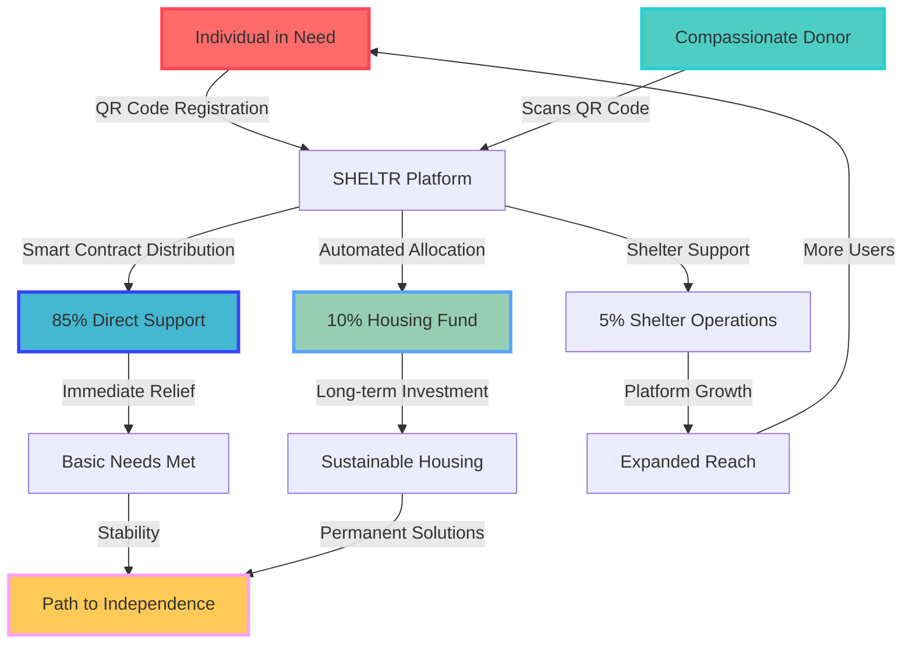

# 🌟 SHELTR Overview

**Revolutionizing charitable giving through technology-driven transparency and direct impact**

---

## 🎯 Mission & Vision

### Our Mission
**Hacking homelessness through technology.** We believe that by combining cutting-edge technology with compassionate action, we can create measurable, verifiable impact in the fight against homelessness.

### Our Vision
A world where every act of giving is transparent, every donation reaches its intended recipient, and every person experiencing homelessness has access to the tools and resources they need to rebuild their lives.

### Core Values
- **Empowerment**: Providing tools for individuals to take control of their futures
- **Transparency**: Every transaction visible and verifiable on the blockchain
- **Automation**: Streamlining processes for maximum efficiency and impact
- **Sustainability**: Building long-term solutions, not just short-term fixes
- **Innovation**: Leveraging the latest technology to solve age-old problems

---

## 🏠 The SHELTR Difference

### What Makes Us Unique

#### 🎯 Four-Role Ecosystem
Unlike traditional donation platforms, SHELTR recognizes four distinct user types:
- **SuperAdmin**: Platform founders and operators
- **Admin**: Shelter operators and staff
- **Participant**: Individuals receiving donations (the heart of our platform)
- **Donor**: Contributors making a difference

#### 🪙 SmartFund™ Distribution
Every donation automatically distributes through blockchain smart contracts:
- **85%** → Direct to participant's digital wallet
- **10%** → Sustainable housing fund for long-term solutions
- **5%** → Participant's registered shelter operations support

#### 📱 QR-Powered Direct Giving
- Instant scan-and-give technology
- No intermediaries or delayed transfers
- Real-time confirmation and tracking
- Works offline for reliability

#### ⛓️ Blockchain Transparency
- Every transaction permanently recorded
- Public verification of impact
- Immutable donation history
- Smart contract automation

---

## 🚀 Key Features

### For Participants
✅ **Personal QR Codes** - Unique donation identifiers  
✅ **Digital Wallets** - Direct control over received funds  
✅ **Impact Tracking** - See your progress and support  
✅ **Verification System** - Build trust with donors  
✅ **Mobile Access** - Manage everything from your phone  

### For Donors
✅ **Instant Donations** - Scan and give in seconds  
✅ **Full Transparency** - Track every dollar's impact  
✅ **Impact Analytics** - See your cumulative difference  
✅ **Social Features** - Share and engage with community  
✅ **Tax Documentation** - Automatic receipt generation  

### For Shelter Admins
✅ **Participant Management** - Onboard and support individuals  
✅ **Real-time Dashboards** - Monitor donations and impact  
✅ **Location Services** - Help donors find your shelter  
✅ **Analytics** - Data-driven insights for operations  
✅ **Multi-tenant Support** - Secure, isolated data  

### For Platform Admins
✅ **System Monitoring** - Real-time platform health  
✅ **Global Analytics** - Cross-platform impact metrics  
✅ **User Management** - Comprehensive admin tools  
✅ **Security Controls** - Multi-layer protection  
✅ **Blockchain Management** - Smart contract oversight  

---

## 📊 Impact Model

### Theory of Change

### Success Metrics

| Metric | Target (Year 1) | Current Status |
|--------|----------------|----------------|
| **Active Participants** | 10,000 | Implementation Phase |
| **Monthly Donations** | $2M | Implementation Phase |
| **Housing Fund** | $5M | Implementation Phase |
| **Shelter Partners** | 500 | Implementation Phase |
| **Success Rate** | 65% | Implementation Phase |

---

## 🔄 From Legacy to SHELTr

### Evolution from Original SHELTR

| Aspect | Legacy SHELTR | SHELTR |
|--------|---------------|-----------|
| **Architecture** | Supabase + Single-tenant | Firebase + Multi-tenant SaaS |
| **User Roles** | 3 roles (Admin, Donor, basic users) | 4 roles (SuperAdmin, Admin, Participant, Donor) |
| **Backend** | Supabase functions | FastAPI + Python 3.11 |
| **Mobile** | Responsive web | Native Expo app |
| **Blockchain** | Basic integration | Full token system with smart contracts |
| **AI** | Limited analytics | Advanced AI with OpenAI + LangChain |
| **Scalability** | Single deployment | Multi-tenant, globally scalable |

### Key Improvements
- **Enhanced Participant Focus**: Dedicated role and features for donation recipients
- **Enterprise Scalability**: Multi-tenant architecture supports unlimited growth
- **Advanced AI**: Predictive analytics and automated insights
- **Mobile-First**: Native iOS/Android apps with offline capabilities
- **Blockchain Native**: Full token system with automated smart contracts

---

## 🛠️ Technology Philosophy

### Why Firebase + FastAPI?
- **Firebase**: Real-time capabilities, global CDN, enterprise security
- **FastAPI**: Modern Python framework, automatic API documentation, high performance
- **Multi-tenant**: Secure data isolation, infinite scalability
- **Cloud Native**: Auto-scaling, global deployment, enterprise reliability

### Why Blockchain?
- **Transparency**: Every transaction publicly verifiable
- **Automation**: Smart contracts eliminate manual processes
- **Trust**: Immutable records build donor confidence
- **Innovation**: Position SHELTR as a technology leader

### Why Mobile-First?
- **Accessibility**: Participants often rely on mobile devices
- **Convenience**: Donors want instant, frictionless giving
- **Reach**: Mobile apps enable global user adoption
- **Features**: Camera access for QR scanning, push notifications

---

## 🌍 Global Impact Vision

### Phase 1: Foundation (2025)
- Launch in major US cities
- Partner with 100 shelters
- Onboard 1,000 participants
- Process $500K in donations

### Phase 2: Expansion (2026)
- National US coverage
- International pilot programs
- 10,000 participants
- $10M in donations processed

### Phase 3: Global Scale (2027+)
- Multi-country deployment
- White-label platform licensing
- 100,000+ participants
- $100M+ in donations annually

---

## 🤝 Community & Ecosystem

### For Developers
- **Open Source Components**: Contributing to the greater good
- **API Access**: Build integrations and extensions
- **Documentation**: Comprehensive guides and examples
- **Community**: Active developer community and support

### For Partners
- **Shelter Integration**: Easy onboarding and management tools
- **White-label Solutions**: Branded versions for organizations
- **API Integration**: Connect with existing systems
- **Training & Support**: Comprehensive partner success program

### For Researchers
- **Anonymized Data**: Insights for homelessness research
- **Impact Studies**: Measuring effectiveness of direct giving
- **Technology Research**: Blockchain and AI applications
- **Academic Partnerships**: Collaboration opportunities

---

## 📚 Next Steps

### For New Users
1. **Read**: [Getting Started Guide](getting-started.md)
2. **Understand**: [Architecture Overview](architecture-overview.md)
3. **Compare**: [Feature Comparison](feature-comparison.md)
4. **Plan**: [Development Roadmap](roadmap.md)

### For Developers
1. **Setup**: [Development Environment](../04-development/environment-setup.md)
2. **Learn**: [Coding Standards](../04-development/coding-standards.md)
3. **Build**: [API Documentation](../03-api/README.md)
4. **Deploy**: [Deployment Guide](../05-deployment/README.md)

### For Users
1. **Donors**: [Donor Guide](../06-user-guides/donor-guide.md)
2. **Participants**: [Participant Guide](../06-user-guides/participant-guide.md)
3. **Shelter Staff**: [Admin Guide](../06-user-guides/shelter-admin-guide.md)
4. **Platform Admins**: [SuperAdmin Guide](../06-user-guides/super-admin-guide.md)

---

**SHELTR represents the future of charitable giving - where technology amplifies compassion and every donation creates lasting change.** 🏠✨ 