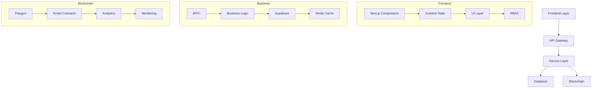
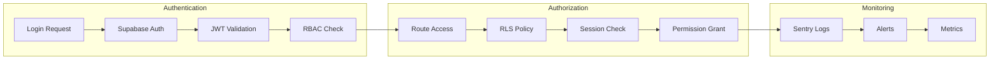

### Feb 1, 2025
### Status: RELEASE CANDIDATE 1 (RC1)

#### 📝 Abstract
SHELTR-R1 represents our production-ready platform that revolutionizes charitable giving through cutting-edge technology. By combining QR-code enabled direct donations, blockchain verification, and AI-driven insights, SHELTR-R1 creates a transparent, efficient, and impactful giving ecosystem.

Our SmartFund™️ distribution model remains core to our mission: 80% to direct support, 15% to sustainable housing initiatives, and 5% to operational costs. This model ensures immediate assistance while building long-term solutions.

We're "hacking homelessness" by merging technological innovation with compassionate action, creating measurable impact through verifiable transactions, and fostering an engaged community of donors and supported individuals.

#### 🎯 Development Status
SHELTR-R1 is entering its final development phase with key features implemented:
- 🔵 Next.js 14 + TypeScript 5.0 foundation planned
- 🔵 Supabase integration planned
- 🔵 Role-based authentication planned
- 🔵 Core UI components planned
- 🔵 QR donation system planned
- 🔵 Blockchain integration planned
- 🔵 Analytics dashboard planned
- 🔵 AI features planned

#### 🦾 Core Features & Capabilities
| Feature | Status | Description |
|---------|--------|-------------|
| User Management | 🔵 | Role-based access with Supabase Auth |
| QR Donations | 🔵 | Instant scan-and-give system |
| Content System | 🔵 | Dynamic markdown with MDX |
| Admin Dashboard | 🔵 | Complete system monitoring |
| Shelter Dashboard | 🔵 | Resource and participant management |
| Role-Based Access | 🔵 | Protected routes and authentication |
| Dark Theme | 🔵 | Enhanced accessibility |
| Map Integration | 🔵 | Location services with PostGIS |
| Mobile Support | 🔵 | Progressive Web App optimization |
| Social Features | 🔵 | Community engagement tools |
| Blockchain | 🔵 | Polygon network integration |
| Smart Contracts | 🔵 | OpenZeppelin-based contracts |
| AI Analytics | 🔵 | Predictive insights system |

#### 💫 Technology Stack
Our technology stack is carefully chosen to provide maximum scalability, security, and performance.

```typescript
interface TechStack {
  frontend: {
    framework: 'React 18',
    language: 'TypeScript 5.0',
    state: 'Zustand',
    styling: 'Tailwind CSS',
    ui: 'Shadcn/ui',
    routing: 'React Router v6',
    auth: 'Supabase Auth'
  },
  backend: {
    database: 'Supabase',
    api: 'REST + WebSocket',
    blockchain: 'Polygon',
    analytics: 'Custom + Recharts',
    caching: 'Redis',
    search: 'PostgreSQL + PostGIS'
  },
  infrastructure: {
    hosting: 'Vercel',
    ci_cd: 'GitHub Actions',
    monitoring: 'Sentry',
    performance: 'Lighthouse',
    security: 'Supabase RLS + Custom RBAC'
  },
  testing: {
    unit: 'Vitest',
    integration: 'Cypress',
    e2e: 'Playwright',
    coverage: 'Istanbul'
  }
}
```

#### 📊 System Architecture
The SHELTR platform is built on a modern, scalable architecture that prioritizes security, performance, and user experience.



#### 🔐 Security Implementation


### 📈 Implementation Progress

#### Development Timeline
```mermaid
gantt
    title RC1 Development Timeline
    dateFormat  YYYY-MM-DD
    section Core
 
```

### Impact Metrics
| Metric | Target | Current | Progress |
|--------|---------|----------|-----------|
| Core Features | 100% | 0% |  |
| Security | 100% | 0% |  |
| Performance | 100% | 0% |  |
| Documentation | 100% | 0% |  |
| Testing | 100% | 0% |  |
| Mobile Support | 100% | 0% |  |
| Blockchain | 100% | 0% |  |
| Analytics | 100% | 0% |  |

---

<div align="center">

**SHELTR-R1: Building a Better Future**
[Documentation](https://docs.sheltr.dev) • [GitHub](https://github.com/mrj0nesmtl/SHELTR-R1) • [Community](https://bsky.app/profile/sheltrops.bsky.social)

</div>
