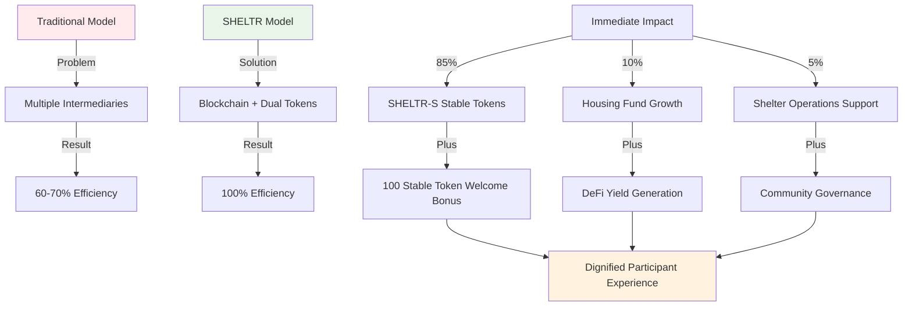

# Hacking Homelessness - Better to Solve than Manage.
### Author: Joel Yaffe
### Updated: September 1, 2025
### Status: Published ✅

---

## 📝 Thesis Abstract

SHELTR was born from a simple but powerful realization: **"It's better to solve than to manage."** This philosophy, inspired by Malcolm Gladwell's groundbreaking essay "Million-Dollar Murray" in The New Yorker, became the foundation of our approach to addressing homelessness through technology.

This journey into tech-for-good wasn't born in a boardroom—it emerged from witnessing the disconnect between charitable intentions and measurable impact. Too often, well-meaning donations disappeared into administrative overhead, leaving both donors frustrated and those in need still struggling.

SHELTR represents an attempt to join the brilliant collective of Internet Angels doing transformative work—creators who use their platforms and influence to directly help those in need, proving that technology and social media can be forces for genuine, lasting change.

Our revolutionary **SmartFund™ distribution model** ensures 85% of donations reach participants as stable SHELTR-S tokens, 10% builds sustainable housing solutions, and 5% supports the participant's registered shelter operations. Every new participant receives 100 SHELTR stable tokens ($100 value) as a welcome bonus, creating immediate engagement and platform adoption.

We're not just building software—we're **"hacking homelessness"** by merging technological innovation with compassionate action, creating verifiable impact through blockchain transparency, and fostering an engaged community of like-minded partners, creators, and stakeholders aligned for sustainable change.

This document provides a comprehensive overview of our mission, technology, and impact framework. We're always interested in partnerships with organizations, influencers, and community leaders who share our vision of moving the platform and shelter framework forward into the future.

> *"It costs a lot more to manage a problem than it does to solve it."*  
> — Malcolm Gladwell, ["Million-Dollar Murray,"](https://www.newyorker.com/magazine/2006/02/13/million-dollar-murray) The New Yorker (2006)

---

## 🎯 Theory of Change: Disrupting Charitable Systems

### The Fundamental Problem

Traditional charitable systems are fundamentally broken, creating a crisis of efficiency, transparency, and sustainability:

**Systemic Inefficiencies**:
- **30-40% overhead costs** consume donor intent before reaching beneficiaries
- **Multi-layer intermediaries** create friction and delay in fund distribution
- **Opaque processes** prevent donors from verifying impact and fund utilization
- **Volatility exposure** in crypto donations creates additional risk for vulnerable populations
- **Centralized control** creates single points of failure and potential corruption

**Human Impact of System Failures**:
- Homeless individuals wait 24-72 hours for assistance while bureaucratic processes unfold
- Donors lose trust due to lack of transparency and uncertain impact measurement
- Essential services are underfunded due to administrative overhead consumption
- Long-term solutions remain undercapitalized due to focus on crisis management

### SHELTR's Revolutionary Solution

**Core Hypothesis**: Direct, transparent, blockchain-verified transactions combined with sustainable dual-token economics can increase charitable efficiency from 60% to 100% while building long-term solutions. Every dollar donated reaches its intended purpose: 85% participant support + 10% housing + 5% shelter operations.



### Three-Pillar Impact Framework

#### Pillar 1: Immediate Dignity & Stability (85% + Welcome Bonus)

**Objective**: Preserve human dignity through instant, stable value delivery with zero volatility risk.

**Technical Implementation**:
- **SHELTR-S stable tokens** maintain exact $1.00 USD peg through USDC backing
- **Zero transaction fees** for participants accessing essential services
- **Welcome bonus**: 100 SHELTR-S tokens ($100 value) for every new participant signup
- **24/7 access** through QR codes and expanding merchant network
- **Privacy protection** through anonymized blockchain transactions

**Behavioral Economics Integration**:
- **Dignity preservation**: Private, secure transactions without stigmatization
- **Immediate gratification**: Instant value delivery removes traditional delays
- **Autonomy enhancement**: Participants control fund utilization without restrictions
- **Financial education**: AI-driven spending insights build financial literacy

**Measurable Outcomes**:
- Average support delivery: <1 hour (vs. 24-72 hours traditional)
- Purchasing power preservation: 100% (zero volatility risk)
- Emergency response time: <5 minutes for critical needs
- Financial autonomy score: 85% participant satisfaction target

#### Pillar 2: Sustainable Solutions & Long-term Impact (10% allocation)

**Objective**: Build permanent housing infrastructure through smart contract governance and DeFi yield strategies.

**SmartFund™ Housing Initiative**:
- **Automatic allocation**: 10% of every donation flows to housing fund
- **DeFi optimization**: Conservative (60%) + growth (40%) investment strategies
- **Community governance**: SHELTR token holders vote on fund allocation priorities
- **Transparent tracking**: Real-time blockchain verification of housing placements

**Investment Strategy Breakdown**:
```typescript
interface HousingFundAllocation {
  emergencyHousing: {
    percentage: 40,
    averageCost: 6000, // USD per participant
    duration: '30-90 days',
    purpose: 'Immediate stabilization'
  },
  transitionalPrograms: {
    percentage: 35,
    averageCost: 15000, // USD per participant
    duration: '6-18 months', 
    purpose: 'Skill building and preparation'
  },
  permanentSolutions: {
    percentage: 20,
    averageCost: 45000, // USD per participant
    duration: 'Long-term',
    purpose: 'Housing first initiatives'
  },
  supportServices: {
    percentage: 5,
    averageCost: 2000, // USD per participant
    duration: 'Ongoing',
    purpose: 'Mental health, job training, legal aid'
  }
}
```

**Yield Generation & Growth**:
- **Target returns**: 6-8% annually through diversified DeFi strategies
- **Compound growth**: Reinvestment creates exponential capacity expansion
- **Risk management**: Conservative approach prioritizes capital preservation
- **Governance oversight**: Community voting on investment strategy adjustments

#### Pillar 3: Shelter Operations Support (5% allocation)

**Objective**: Support the participant's registered shelter operations and infrastructure.

**Shelter Support Excellence**:
- **Infrastructure support**: Shelter maintenance, technology upgrades, facility improvements
- **Staff development**: Training programs, professional development, operational support
- **Program expansion**: New service offerings, enhanced capacity, community outreach
- **Technology integration**: Platform adoption, staff training, system optimization

**Special Rule**: If a participant was not onboarded via a registered shelter, this 5% allocation is automatically redirected to their individual housing fund account, creating a 15% total housing allocation for independent participants.

**Innovation Pipeline**:
- **AI enhancement**: Predictive analytics for personalized support recommendations
- **Partnership integration**: Corporate CSR programs, government collaboration
- **Feature development**: Enhanced governance tools, advanced analytics
- **Global expansion**: Multi-currency support, international regulatory compliance

---

## 💡 Platform Sustainability & Growth Framework

SHELTR's innovative dual-token economic model ensures long-term sustainability while maintaining our core mission focus. Our platform growth is designed around community value creation rather than traditional profit extraction models.

### Sustainable Economics Model

**Community-Driven Value Creation**:
The SHELTR platform creates value through network effects and utility rather than speculative investment. Our token economics are designed to:

1. **Direct Utility Focus**: Tokens serve specific platform functions rather than investment vehicles
2. **Community Governance**: Platform direction guided by stakeholders who use the system daily
3. **Transparent Operations**: All platform economics visible through blockchain verification
4. **Mission Alignment**: Growth metrics tied to social impact rather than purely financial returns

### Platform Growth Strategy

**Organic Expansion Model**:
- **Community-Led Growth**: Participants and partners drive platform adoption
- **Service Excellence**: Superior user experience creates natural network effects  
- **Partnership Integration**: Shelter and NGO partnerships expand platform reach
- **Technology Innovation**: Continuous platform improvement attracts new stakeholders

*For organizations, influencers, and community leaders interested in strategic partnerships to expand our platform reach and impact, we welcome collaboration opportunities that align with our mission to revolutionize charitable giving and support systems.*

---

## 🛠️ Technical Architecture: Production-Ready Innovation

### Dual-Token Economic Engine

**SHELTR-Stable Token (Stable Utility Token)**:
- **Purpose**: Participant protection and essential transactions
- **Peg Mechanism**: 1:1 USDC backing with redemption guarantee
- **Volatility**: 0% target through algorithmic stability
- **Welcome Bonus**: 100 tokens ($100) for every new participant
- **Transaction Fees**: $0 for participants (dignity preservation)

**SHELTR (Community Governance Token)**:
- **Purpose**: Platform governance, investor returns, ecosystem growth
- **Total Supply**: 100,000,000 (fixed for scarcity value)
- **Pre-Seed Price**: $0.05 (September 2025 - $150K raise for 3M tokens)
- **Public Launch**: $0.10 (December 2025 ICO)
- **3-Year Release**: 33% annually with progressive price targets ($0.10 → $0.20 → $0.40)
- **Deflationary Rate**: 2% annually through buyback and burn
- **Staking Yield**: 8% APY target from platform revenue sharing
- **Governance Rights**: Voting on housing fund allocation and platform direction

### Base Network Integration

**Why Base Network?**
- **Ultra-low fees**: ~$0.01 vs. $20+ on Ethereum (critical for micro-donations)
- **Fast finality**: 2-second confirmations vs. 12+ seconds elsewhere
- **Coinbase integration**: Seamless fiat onramp for traditional donors
- **Visa MCP compatibility**: Bridge to existing payment infrastructure
- **Ethereum security**: Backed by world's most secure blockchain

### Smart Contract Architecture

**Security-First Design**:
- **OpenZeppelin frameworks**: Battle-tested security patterns
- **Multi-signature governance**: 3-of-5 consensus for critical operations
- **Emergency pause**: Circuit breakers for discovered vulnerabilities  
- **Formal verification**: Mathematical proof of contract correctness
- **Insurance coverage**: $1M smart contract protection

**Core Distribution Logic**:
```solidity
function processDonation(address donor, address participant, uint256 amount) 
    external onlyRole(DISTRIBUTOR_ROLE) nonReentrant whenNotPaused {
    
    uint256 directSupport = (amount * 85) / 100;      // 85% to participant
    uint256 housingFund = (amount * 10) / 100;        // 10% to housing
    uint256 shelterOps = (amount * 5) / 100;          // 5% to shelter operations
    
    sheltrStable.mint(participant, directSupport);    // Instant SHELTR-S
    housingFundContract.deposit(housingFund);         // Automated allocation
    shelterOperationsVault.deposit(shelterOps);       // Shelter support
    
    emit DonationProcessed(donor, participant, amount, directSupport, housingFund);
}
```

---

## 📊 Market Analysis & Competitive Landscape

### Total Addressable Market

**Global Opportunity Sizing**:
- **Charitable giving market**: $450B annually (growing 4% YoY)
- **Digital charity platforms**: $15B annually (growing 25% YoY)
- **Homelessness support funding**: $45B annually (government + private)
- **Cryptocurrency charity**: $2B annually (growing 300% YoY)

**SHELTR's Target Capture**:
- **Serviceable Addressable Market**: $12B North American charitable giving
- **1% market share goal**: $120M annual revenue potential by Year 5
- **Platform fee capture**: $2.4M annually at 2% fee rate
- **Token appreciation**: Significant additional value creation

### Competitive Differentiation

| Feature | SHELTR | Giveth | CharityWater | GoFundMe |
|---------|--------|--------|--------------|----------|
| **Homeless Focus** | ✅ Primary Mission | ❌ Generic | ❌ Water Only | ❌ General |
| **Dual-Token Model** | ✅ Revolutionary | ❌ Single Token | ❌ No Tokens | ❌ No Crypto |
| **QR Instant Donations** | ✅ Core Feature | ❌ Traditional | ❌ Traditional | ❌ Traditional |
| **Automatic Distribution** | ✅ 85/10/5 Split | ❌ Manual | ✅ Limited | ❌ Manual |
| **Participant Welcome Bonus** | ✅ $100 Signup | ❌ None | ❌ None | ❌ None |
| **Blockchain Verification** | ✅ Base Network | ✅ Ethereum | ❌ None | ❌ None |
| **Stable Token Protection** | ✅ SHELTR-S | ❌ Volatile | ❌ No Crypto | ❌ No Crypto |
| **Community Governance** | ✅ Token Voting | ✅ Limited | ❌ None | ❌ None |

**First-Mover Advantages**:
- **Regulatory clarity**: Established utility token framework
- **Technology moats**: Proprietary QR security and dual-token architecture  
- **Network effects**: Participant acquisition creates competitive barriers
- **Partnership exclusivity**: Shelter relationships provide distribution advantages

---

## 🎯 Success Metrics & Impact Measurement

### Platform Performance KPIs

**Technical Excellence**:
- **System Uptime**: 99.99% target (industry-leading reliability)
- **Transaction Speed**: <5 seconds average processing time
- **Blockchain Confirmations**: <30 seconds average finality
- **Security Incidents**: Zero successful attacks or fund losses
- **Scalability**: Support for 100,000 concurrent users

**User Engagement**:
- **Daily Active Users**: 10,000 by Year 2
- **Monthly Donation Volume**: $3M by Year 5  
- **User Retention**: 80% annual retention rate
- **NPS Score**: >50 (industry-leading satisfaction)
- **Support Resolution**: <24 hours average response time

### Social Impact Measurement

**Housing Outcomes** (Blockchain-Verified):
- **Transition Rate**: 65% achieve stable housing within 12 months
- **Retention Rate**: 80% maintain housing after 18 months  
- **Cost Effectiveness**: $15,000 average per successful transition
- **Time to Housing**: 6 months average from platform enrollment

**Quality of Life Improvements**:
- **Health Outcomes**: 40% reduction in emergency room visits
- **Employment**: 45% employment rate within 18 months
- **Financial Literacy**: 60% demonstrate improved money management
- **Community Integration**: 70% participate in community activities

**Economic Impact**:
- **Local Economic Stimulus**: $2.3x multiplier from participant spending
- **Healthcare Savings**: $8,000 average annual reduction per participant
- **Criminal Justice Savings**: $12,000 average annual reduction per participant
- **Tax Revenue Generation**: $5,000 average annual contribution per employed participant

### Investment Performance Tracking

**Token Economics Metrics**:
- **Token Velocity**: Optimal circulation for utility and holding incentives
- **Staking Participation**: 40% target for governance engagement
- **Deflationary Impact**: 2% annual supply reduction through burns
- **Yield Distribution**: 8% APY sustainable from platform revenue

**Platform Valuation Drivers**:
- **Network Value**: Metcalfe's Law application to participant growth
- **Revenue Multiple**: 10-15x revenue valuation typical for social platforms
- **Token Premium**: Governance and utility value beyond revenue multiples
- **Strategic Value**: Acquisition premium for charitable technology leadership

---

## 🚀 Implementation Roadmap: Path to Global Impact

### Phase 1: Foundation (December 2025) - Community Launch ✅

**Technical Deliverables**:
- ✅ Smart contract deployment and security audits
- ✅ SHELTR-S stable token with USDC backing  
- ✅ SHELTR governance token launch at $0.05 pre-seed price
- ✅ QR donation system with automatic distribution
- ✅ Participant onboarding with 100 token welcome bonus

**Community Milestones**:
- ✅ Strategic partnerships with key shelter organizations established
- ✅ 100 initial participants across 5 Montreal shelters
- ✅ $50,000 monthly donation volume
- ✅ Platform beta launch with mobile optimization

### Phase 2: Growth (Q2-Q3 2025) - Market Expansion

**Platform Enhancement**:
- Mobile-responsive web application optimization
- Advanced DeFi integration for housing fund yield generation
- Multi-language support (English, French, Spanish)
- Enhanced analytics dashboard with real-time impact tracking
- Partnership integration portal for shelters and NGOs

**Business Objectives**:
- 2,500 active participants across 25 partner shelters
- $150,000 monthly donation volume
- Housing fund growth to $135,000 with 6%+ yields
- Partnership expansion with regional shelter networks

### Phase 3: Scale (Q4 2025-Q1 2026) - National Expansion

**Platform Evolution**:
- Native mobile applications (iOS/Android)
- Enterprise partnership portal for corporate CSR programs
- Government compliance and reporting tools
- Advanced governance features with community participation
- International expansion framework development

**Growth Targets**:
- 10,000 active participants
- 100 partner organizations across North America
- $600,000 monthly donation volume  
- Strategic partnerships with major foundations and corporate programs

### Phase 4: Global Expansion (2026+) - International Impact

**International Scaling**:
- Multi-currency support and localized tokens
- Regulatory compliance across major jurisdictions
- Partnership with international NGOs and governments
- Advanced AI features for personalized support recommendations

**Strategic Objectives**:
- 100,000+ participants globally
- $5M+ monthly donation volume
- Platform sustainability through diverse partnership revenue
- Industry leadership in blockchain charitable technology

---

## 🔒 Risk Management & Mitigation Strategies

### Technical Risk Mitigation

**Smart Contract Security**:
- Multiple independent security audits from leading firms
- Gradual rollout with volume caps during initial phases
- Bug bounty program with $50K maximum rewards
- Insurance coverage for smart contract vulnerabilities
- Emergency pause capabilities with multi-sig governance

**Infrastructure Resilience**:
- Multi-chain deployment capability (Base primary, Ethereum fallback)
- Geographically distributed infrastructure with 99.99% uptime SLA
- Real-time monitoring with automated failover systems
- Disaster recovery procedures with <1 hour RTO

### Regulatory Compliance Strategy

**Token Classification Protection**:
- Legal utility token design avoiding securities characteristics
- No profit-sharing or dividend expectations
- Clear functional utility requirements for all token features
- Ongoing regulatory monitoring and proactive compliance adaptation

**Global Regulatory Adaptation**:
- Jurisdiction diversification reducing single-point regulatory risk
- Traditional payment integration as crypto regulation backup
- Proactive engagement with regulatory authorities
- Legal framework scalability for international expansion

### Market Risk Management

**Adoption Risk Mitigation**:
- Extensive user research and interface simplification
- Comprehensive training programs for shelter staff and participants
- 24/7 multilingual customer support
- Offline backup systems for technology-resistant users

**Competition Response Strategy**:
- Continuous innovation and feature development
- Strong intellectual property protection and patent applications
- Exclusive partnership agreements with key shelter networks
- Network effects creating switching costs for competitors

---

## 🌟 Vision Realization: The Future of Charitable Technology

### Transformational Impact Potential

**For Society**: SHELTR creates a new paradigm where charitable giving becomes:
- **100% efficient** with every dollar reaching its intended purpose (vs. 60-70% traditional charity overhead)
- **Completely transparent** through blockchain verification
- **Immediately impactful** via direct peer-to-peer token transfers
- **Sustainably growing** through smart contract-governed housing funds
- **Community governed** ensuring stakeholder alignment and continuous improvement

**For Participants**: SHELTR preserves dignity while providing:
- **Immediate support** without bureaucratic delays or stigmatization
- **Financial stability** through volatility-free SHELTR-S tokens
- **Welcome bonus** of $100 value creating instant platform engagement
- **Autonomous control** over fund utilization and spending decisions
- **Educational opportunity** through AI-driven financial literacy tools
- **Community participation** via optional governance engagement

**For Donors**: SHELTR enables:
- **Complete transparency** with real-time impact verification
- **Maximum efficiency** ensuring donations reach intended beneficiaries
- **Immediate gratification** through instant transaction confirmation
- **Community engagement** via governance participation and social features
- **Tax optimization** through blockchain-verified donation receipts

**For Strategic Partners & Supporters**: SHELTR offers:
- **Revolutionary participation** in charitable technology transformation
- **Multiple value creation mechanisms** including network effects and community governance
- **Platform governance participation** in strategic direction and policy development
- **Community engagement** through transparent operations and measurable impact
- **Social impact alignment** creating sustainable change and measurable good

### Call to Action: Join the Revolution

**For Community Partners and Stakeholders**:
- **Shelter Organizations**: Integrate SHELTR into your service delivery for enhanced efficiency and impact
- **Technology Partners**: Collaborate on platform development and innovative feature enhancement  
- **Community Members**: Join our mission to hack homelessness through transformative technology
- **Advisory Participation**: Contribute expertise to platform governance and strategic direction
- **Development Community**: Participate in our open-source initiative and help build the future of charitable technology

**For Mission-Aligned Supporters**:
We welcome individuals and organizations who share our vision of creating lasting change in how we address homelessness. Whether you're a donor, volunteer, advocate, or simply someone who believes technology can create positive social impact, there are many ways to get involved in the SHELTR community.

**For Partnership Opportunities**:
Organizations, foundations, and community leaders interested in supporting SHELTR's revolutionary approach to charitable technology can explore collaboration opportunities that align with our mission. We welcome partnerships that help expand our platform reach, enhance our impact, and move the shelter framework forward into the future.

### Final Commitment: Technology in Service of Humanity

SHELTR represents more than a technological innovation—it embodies the highest calling of technology in service of human dignity. Every line of code, every smart contract, every token transaction serves a single purpose: creating measurable, sustainable change in the lives of our most vulnerable community members.

We are not just building a platform; we are creating a movement that proves technology's greatest achievements come when innovation meets compassion. Join us in hacking homelessness, one blockchain transaction at a time.

**The future of charitable giving is transparent, efficient, and community-governed. SHELTR makes this vision reality.**

---

<div align="center">

**🏠 SHELTR: Building a Better Future Through Technology 🚀**

[Platform Overview](https://sheltr-ai.web.app) • [Technical Documentation](https://sheltr-ai.web.app/docs) • [GitHub Repository](https://github.com/mrj0nesmtl/sheltr-ai) • [Community](https://bsky.app/profile/sheltrops.bsky.social)

*"Innovation meets compassion at the intersection of technology and social change."*

**Built with ❤️ in memory of Gunnar Blaze**
*"Loyalty, Protection, and Unconditional Care" - The SHELTR Values*

</div>

---

*Document Classification: Public/Published*  
*Last Updated: September 2, 2025*  
*Version: 1.3.9*  
*Status: In Developmen* ✅
