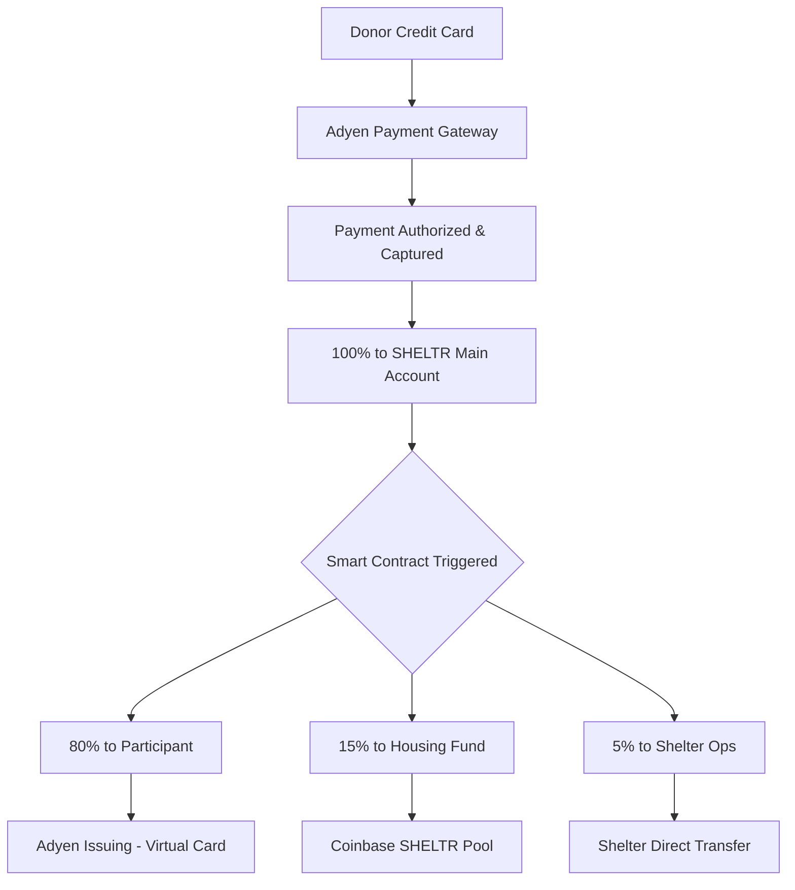

# 🎯 SHELTR Adyen Integration - Strategic Analysis & Implementation Plan

**Document Version**: 1.0.0  
**Created**: October 24, 2025  
**Status**: Pre-Implementation Strategic Review  
**Lead**: Joel Yaffe (Platform Architect) + DK (CFO & Payments Expert)

---

## 🚨 **Executive Summary**

Based on comprehensive analysis of Adyen's documentation and SHELTR's unique payment flow requirements, this document outlines the **optimal Adyen integration model** for our SmartFund™ 80-15-5 distribution architecture.

### **Critical Decision: Which Adyen Model?**

After analyzing Adyen's three primary models, **we recommend the Adyen for Platforms (Balanced Model)** for SHELTR's use case.

| Model | Best For | SHELTR Fit | Complexity | Cost |
|-------|----------|------------|------------|------|
| **Standard Merchant** | Single entity payments | ❌ Cannot handle splits | Low | Lowest |
| **Marketplaces** | Two-party transactions | ⚠️ Limited (only 2-way splits) | Medium | Medium |
| **Platforms (Balanced)** | Multi-party splits + issuing | ✅ **PERFECT FIT** | High | Higher |

---

## 💡 **Why Adyen for Platforms (Balanced Model)?**

### **SHELTR's Unique Requirements**



### **Why Balanced Model Wins**

✅ **Multi-Party Splits**: Native support for 3+ way splits (80-15-5)  
✅ **Adyen Issuing**: Built-in virtual card issuance for participants  
✅ **Balance Accounts**: Separate accounts for each entity (participants, housing fund, shelters)  
✅ **Automated Transfers**: Programmatic fund distribution via API  
✅ **Legal Entity Management**: Onboard participants and shelters as sub-entities  
✅ **Compliance Built-In**: KYC/AML handled by Adyen  
✅ **Unified Reporting**: Single dashboard for all payment flows  

---

## 🏗️ **Recommended Architecture: Adyen for Platforms**

### **Phase 1: Account Structure**

```typescript
interface SHELTRAdyenStructure {
  platformAccount: {
    type: 'Adyen for Platforms - Balanced',
    entity: 'SHELTR Platform Inc.',
    capabilities: [
      'receivePayments',
      'sendPayments', 
      'issueCard',
      'receiveFromPlatformPayments'
    ]
  },
  
  balanceAccounts: {
    // Main platform account receives all donations
    platformMain: {
      id: 'BA_SHELTR_MAIN',
      purpose: 'Receive all donations, distribute via transfers'
    },
    
    // Housing fund pool account
    housingFund: {
      id: 'BA_HOUSING_FUND',
      purpose: 'Receive 15% allocation, transfer to Coinbase'
    },
    
    // Per-participant accounts (created dynamically)
    participantAccounts: {
      pattern: 'BA_PARTICIPANT_{ID}',
      purpose: 'Receive 80% allocation, load to virtual card',
      linkedCard: 'Virtual Debit Card via Adyen Issuing'
    },
    
    // Per-shelter accounts
    shelterAccounts: {
      pattern: 'BA_SHELTER_{ID}',
      purpose: 'Receive 5% operations allocation'
    }
  }
}
```

### **Phase 2: Payment Flow Implementation**

#### **Step 1: Donation Capture**
```typescript
// Donor makes donation via QR code or payment link
const donationRequest = {
  amount: {
    value: 10000, // $100.00 in cents
    currency: 'USD'
  },
  reference: `SHELTR-DONATION-${participantId}-${timestamp}`,
  merchantAccount: 'SHELTR_PLATFORM',
  
  // Metadata for smart contract trigger
  metadata: {
    participant_id: participantId,
    shelter_id: shelterId,
    smartfund_split: '80-15-5',
    blockchain_tracking: true
  },
  
  // Capture to platform main balance account
  captureDelayHours: 0, // Immediate capture
  
  // Return URL for success page
  returnUrl: `https://sheltr-ai.web.app/donation/success?donation_id={donationId}`
};
```

#### **Step 2: Automated Split via Transfers API**
```typescript
// After successful payment, trigger automated transfers
async function executeSmart FundSplit(donationId: string, amount: number) {
  const splits = {
    participant: Math.round(amount * 0.80), // 80%
    housing: Math.round(amount * 0.15),     // 15%
    shelter: Math.round(amount * 0.05)      // 5%
  };
  
  // Transfer 1: 80% to Participant Balance Account
  await adyen.transfers.post({
    amount: {
      value: splits.participant,
      currency: 'USD'
    },
    balanceAccountId: 'BA_SHELTR_MAIN',
    category: 'platformPayment',
    counterparty: {
      balanceAccountId: `BA_PARTICIPANT_${participantId}`
    },
    reference: `PARTICIPANT-${donationId}`,
    description: 'SmartFund™ Participant Allocation (80%)'
  });
  
  // Transfer 2: 15% to Housing Fund Balance Account
  await adyen.transfers.post({
    amount: {
      value: splits.housing,
      currency: 'USD'
    },
    balanceAccountId: 'BA_SHELTR_MAIN',
    category: 'platformPayment',
    counterparty: {
      balanceAccountId: 'BA_HOUSING_FUND'
    },
    reference: `HOUSING-${donationId}`,
    description: 'SmartFund™ Housing Fund Allocation (15%)'
  });
  
  // Transfer 3: 5% to Shelter Balance Account
  await adyen.transfers.post({
    amount: {
      value: splits.shelter,
      currency: 'USD'
    },
    balanceAccountId: 'BA_SHELTR_MAIN',
    category: 'platformPayment',
    counterparty: {
      balanceAccountId: `BA_SHELTER_${shelterId}`
    },
    reference: `SHELTER-${donationId}`,
    description: 'SmartFund™ Shelter Operations (5%)'
  });
  
  // Trigger blockchain recording
  await recordOnBlockchain(donationId, splits);
}
```

#### **Step 3: Adyen Issuing - Virtual Cards for Participants**
```typescript
// Create virtual debit card for participant
async function issueParticipantCard(participantId: string) {
  const cardRequest = {
    balanceAccountId: `BA_PARTICIPANT_${participantId}`,
    formFactor: 'virtual',
    brand: 'mc', // Mastercard
    
    // Card configuration
    configuration: {
      configurationProfileId: 'CP_SHELTR_PARTICIPANT',
      
      // Spending controls
      spendingLimits: [
        {
          amount: { value: 50000, currency: 'USD' }, // $500 daily limit
          interval: 'daily'
        }
      ],
      
      // Allowed merchant categories
      allowedMerchantCategories: [
        '5411', // Grocery stores
        '5912', // Drug stores and pharmacies
        '5541', // Service stations
        '5812', // Eating places and restaurants
        '4111', // Local and suburban transit
      ],
      
      // Block cash withdrawals initially
      restrictions: {
        atmWithdrawals: false,
        cashback: false
      }
    },
    
    // Cardholder details
    deliveryContact: {
      name: participantData.displayName,
      email: participantData.email,
      phoneNumber: participantData.phone
    }
  };
  
  const card = await adyen.balancePlatform.paymentInstruments.create(cardRequest);
  
  return {
    cardId: card.id,
    panToken: card.panToken, // For display in app
    expiryMonth: card.expiryMonth,
    expiryYear: card.expiryYear,
    cvv: card.cvv // Encrypted, for secure display
  };
}
```

---

## 📋 **Implementation Phases**

### **Phase 1: Foundation (Weeks 1-4)**

#### **Week 1: Adyen Account Setup**
- [ ] Apply for Adyen for Platforms account
- [ ] Complete merchant verification (SHELTR Platform Inc.)
- [ ] Set up test environment
- [ ] Generate API credentials (API key, Client key, HMAC keys)
- [ ] Configure webhook endpoints

#### **Week 2: Legal Entity Onboarding**
```typescript
// Create platform legal entity
const platformEntity = await adyen.legalEntityManagement.post({
  type: 'organization',
  organization: {
    legalName: 'SHELTR Platform Inc.',
    registeredAddress: {
      country: 'US',
      stateOrProvince: 'CA',
      city: 'San Francisco',
      street: '123 Mission St',
      postalCode: '94103'
    },
    taxInformation: [{
      type: 'us',
      number: 'EIN_NUMBER'
    }],
    businessDetails: {
      type: 'nonProfit', // Or 'forProfit' depending on structure
      industryCode: '8399' // Social services
    }
  },
  capabilities: {
    receivePayments: { requested: true },
    sendPayments: { requested: true },
    issueCard: { requested: true }
  }
});
```

#### **Week 3: Balance Account Configuration**
- [ ] Create main platform balance account
- [ ] Create housing fund balance account
- [ ] Set up automated sweep rules (housing fund → Coinbase)
- [ ] Configure balance account webhooks

#### **Week 4: Testing & Validation**
- [ ] Test payment capture to main account
- [ ] Test transfer API for splits
- [ ] Validate balance account updates
- [ ] Test webhook delivery

---

### **Phase 2: Participant Onboarding & Card Issuance (Weeks 5-8)**

#### **Week 5: Participant Legal Entity Template**
```typescript
// Simplified participant onboarding
const participantEntity = await adyen.legalEntityManagement.post({
  type: 'individual',
  individual: {
    name: {
      firstName: participant.firstName,
      lastName: participant.lastName
    },
    birthData: {
      dateOfBirth: participant.dob // YYYY-MM-DD
    },
    residentialAddress: {
      country: 'US',
      stateOrProvince: participant.state,
      city: participant.city,
      street: participant.street,
      postalCode: participant.zip
    },
    // Minimal KYC for participants
    identificationData: {
      type: 'nationalIdNumber',
      number: participant.ssn_last4 // Last 4 digits only
    }
  },
  capabilities: {
    receiveFromPlatformPayments: { requested: true }
  }
});
```

#### **Week 6: Card Issuing Integration**
- [ ] Set up Adyen Issuing configuration profile
- [ ] Define spending controls and merchant restrictions
- [ ] Implement card creation API
- [ ] Build card display UI (PAN token rendering)

#### **Week 7: Virtual Card Management**
- [ ] Implement card activation flow
- [ ] Build card freeze/unfreeze functionality
- [ ] Set up card transaction webhooks
- [ ] Create real-time balance updates

#### **Week 8: Participant Testing**
- [ ] End-to-end test: Donation → Split → Card Load
- [ ] Test card transactions at various merchants
- [ ] Validate spending limits and restrictions
- [ ] Test card management features

---

### **Phase 3: Shelter Integration (Weeks 9-10)**

#### **Week 9: Shelter Onboarding**
```typescript
// Shelter legal entity (organization)
const shelterEntity = await adyen.legalEntityManagement.post({
  type: 'organization',
  organization: {
    legalName: shelter.legalName,
    doingBusinessAs: shelter.displayName,
    registeredAddress: shelter.address,
    taxInformation: [{
      type: 'us',
      number: shelter.ein
    }],
    businessDetails: {
      type: 'nonProfit',
      industryCode: '8322' // Individual and family social services
    }
  },
  capabilities: {
    receiveFromPlatformPayments: { requested: true }
  }
});
```

#### **Week 10: Shelter Payout Configuration**
- [ ] Link shelter bank accounts for payouts
- [ ] Set up automated payout schedules (daily/weekly)
- [ ] Configure payout webhooks
- [ ] Test shelter fund distribution

---

### **Phase 4: Housing Fund & Coinbase Integration (Weeks 11-12)**

#### **Week 11: Housing Fund Automation**
```typescript
// Automated sweep from housing fund to Coinbase
const sweepConfiguration = {
  balanceAccountId: 'BA_HOUSING_FUND',
  schedule: {
    type: 'daily',
    cronExpression: '0 0 * * *' // Daily at midnight
  },
  sweepAmount: {
    type: 'allFunds' // Sweep entire balance
  },
  counterparty: {
    bankAccount: {
      accountNumber: coinbase.accountNumber,
      routingNumber: coinbase.routingNumber,
      accountHolderName: 'SHELTR Housing Fund'
    }
  },
  reason: 'Transfer to Coinbase for stablecoin purchase'
};
```

#### **Week 12: Coinbase Integration**
- [ ] Set up Coinbase Prime/Institutional account
- [ ] Configure automated USDT purchase on receipt
- [ ] Deploy SHELTR stablecoin smart contract on Base
- [ ] Test end-to-end housing fund flow

---

### **Phase 5: Smart Contract Integration (Weeks 13-16)**

#### **Week 13-14: Smart Contract Development**
```solidity
// SHELTR Payment Distribution Contract
contract SHELTRSmartFund {
    event DonationProcessed(
        bytes32 indexed donationId,
        address indexed participant,
        uint256 totalAmount,
        uint256 participantAmount,
        uint256 housingAmount,
        uint256 shelterAmount,
        uint256 timestamp
    );
    
    function recordDonation(
        bytes32 donationId,
        address participant,
        uint256 totalAmount,
        uint256 participantAmount,
        uint256 housingAmount,
        uint256 shelterAmount
    ) external onlyAuthorized {
        // Validate split percentages
        require(
            participantAmount == (totalAmount * 80) / 100 &&
            housingAmount == (totalAmount * 15) / 100 &&
            shelterAmount == (totalAmount * 5) / 100,
            "Invalid split percentages"
        );
        
        // Record on blockchain
        emit DonationProcessed(
            donationId,
            participant,
            totalAmount,
            participantAmount,
            housingAmount,
            shelterAmount,
            block.timestamp
        );
        
        // Update participant lifetime totals
        participantTotals[participant] += participantAmount;
        
        // Update housing fund pool
        housingFundTotal += housingAmount;
    }
}
```

#### **Week 15: Blockchain Integration**
- [ ] Deploy smart contract to Base mainnet
- [ ] Integrate contract calls into Adyen webhook handlers
- [ ] Set up blockchain event listeners
- [ ] Build blockchain explorer integration for transparency

#### **Week 16: End-to-End Testing**
- [ ] Complete donation flow with blockchain recording
- [ ] Validate all splits and transfers
- [ ] Test participant card usage
- [ ] Verify housing fund automation
- [ ] Test shelter payouts

---

## 💰 **Cost Analysis**

### **Adyen for Platforms Pricing**

| Component | Cost | Notes |
|-----------|------|-------|
| **Payment Processing** | 2.9% + $0.30/txn | Standard credit card rates |
| **Platform Fee** | 0.5% - 1.0% | Negotiable based on volume |
| **Adyen Issuing** | $2-5/card + $0.10/txn | Virtual card costs |
| **Transfers API** | $0.10/transfer | 3 transfers per donation |
| **Balance Accounts** | Free | Unlimited accounts |
| **Webhooks** | Free | Unlimited webhooks |

### **Example: $100 Donation**

```
Donation Amount:           $100.00
Adyen Processing Fee:      -$3.20  (3.2%)
Platform Fee (0.75%):      -$0.75
Net to Distribute:         $96.05

SmartFund™ Split:
├── Participant (80%):     $76.84
├── Housing Fund (15%):    $14.41
└── Shelter Ops (5%):      $4.80

Transfer Costs:
├── 3 transfers × $0.10:   -$0.30

Participant Card Load:     $76.84
Housing Fund (to Coinbase): $14.41
Shelter Operations:        $4.80
```

**Total Platform Cost**: ~4.25% all-in (competitive with alternatives)

---

## 🔐 **Security & Compliance**

### **Adyen Handles**
✅ PCI DSS Level 1 Compliance  
✅ KYC/AML for all entities  
✅ 3D Secure authentication  
✅ Fraud detection & prevention  
✅ Money Transmitter Licenses (all 50 states)  
✅ SOC 2 Type II certified  

### **SHELTR Responsibilities**
- [ ] Participant identity verification (shelter-assisted)
- [ ] Shelter legal entity verification
- [ ] Smart contract security audit
- [ ] Data privacy compliance (GDPR, CCPA)
- [ ] Transparent reporting to donors

---

## 📊 **Success Metrics**

### **Technical KPIs**
- Payment success rate: >99.5%
- Split execution time: <30 seconds
- Card issuance time: <60 seconds
- Transfer success rate: >99.9%
- Webhook delivery: >99.9%

### **Business KPIs**
- Donor conversion rate: >60%
- Participant card activation: >90%
- Card usage rate: >80% monthly
- Housing fund growth: $1M+ Year 1
- Shelter partner satisfaction: >4.5/5.0

---

## 🚀 **Next Steps (Immediate)**

### **This Week**
1. ✅ Complete strategic analysis (this document)
2. [ ] Schedule Adyen partnership call
3. [ ] Begin Adyen for Platforms application
4. [ ] Set up test environment access

### **Next Week**
1. [ ] Create detailed technical specifications
2. [ ] Design database schema for Adyen integration
3. [ ] Build API service layer architecture
4. [ ] Set up development environment

### **Month 1 Goals**
- [ ] Adyen account approved and configured
- [ ] Test environment fully operational
- [ ] First successful test donation with splits
- [ ] Virtual card issued in test mode

---

## 📚 **Key Adyen Documentation References**

### **Essential Reading**
1. [Adyen for Platforms Overview](https://docs.adyen.com/marketplaces-and-platforms/adyen-for-platforms-model/)
2. [Balance Platform API](https://docs.adyen.com/api-explorer/balanceplatform/latest/overview)
3. [Transfers API](https://docs.adyen.com/api-explorer/transfers/latest/overview)
4. [Issuing API](https://docs.adyen.com/issuing/)
5. [Legal Entity Management](https://docs.adyen.com/api-explorer/legalentity/latest/overview)
6. [Webhooks Configuration](https://docs.adyen.com/development-resources/webhooks/)

### **Code Examples**
- [Payment Splits Example](https://docs.adyen.com/api-explorer/Checkout/latest/post/payments#examples-request-split)
- [Transfer to Balance Account](https://docs.adyen.com/api-explorer/transfers/latest/post/transfers#examples-request-payout-to-transfer-instrument)
- [Create Legal Entity](https://docs.adyen.com/api-explorer/legalentity/latest/post/legalEntities#examples-request-createLegalEntityOrganizationNL)

---

## 🎯 **Conclusion**

**Adyen for Platforms (Balanced Model)** is the optimal solution for SHELTR's unique SmartFund™ architecture. It provides:

✅ **Native multi-party splits** (80-15-5)  
✅ **Integrated card issuing** for participants  
✅ **Automated fund distribution** via Transfers API  
✅ **Complete compliance** (KYC/AML/PCI)  
✅ **Scalable architecture** for growth  
✅ **Transparent reporting** for all stakeholders  

This architecture positions SHELTR to deliver on our mission: **maximum impact, zero risk, complete transparency**.

---

**Status**: Ready for Partnership Discussions  
**Next Milestone**: Adyen Account Approval  
**Target Go-Live**: Q2 2026  

---

*Built with ❤️ for those who need it most*

