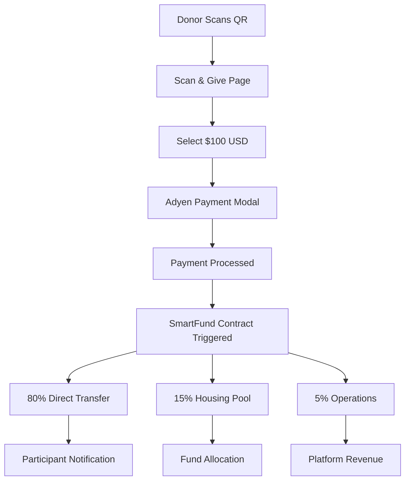

# SHELTR-AI x Adyen Payment Integration

## 🎯 **Integration Overview**

**Strategic Partnership**: Adyen as primary payment rails for SHELTR platform  
**CFO Champion**: Original Founder with 20+ years payments expertise  
**Demo Target**: QR Code donation flow with SmartFund™ distribution  
**Implementation**: https://sheltr-ai.web.app/scan-give

---

## 💳 **Payment Flow Architecture**

### **1. Donor Experience (Unregistered)**
```
1. Scan Participant QR Code → 2. Select $100 Donation → 3. Adyen Payment → 4. SmartFund™ Split
```

### **2. SmartFund™ Distribution (80-15-5)**
- **80% ($80.00)**: Direct to participant wallet (instant)
- **15% ($15.00)**: Housing fund pool (reserved)
- **5% ($5.00)**: Platform operations (fees, maintenance)

### **3. Technical Flow**


---

## 🛠️ **Implementation Plan**

### **Phase 1: Adyen Setup & Configuration**

#### **1.1 Adyen Account Setup**
```bash
# Adyen Dashboard Configuration
1. Create SHELTR merchant account
2. Configure webhook endpoints
3. Set up test environment
4. Generate API keys
5. Configure payment methods (Card, Apple Pay, Google Pay, PayPal)
```

#### **1.2 Environment Variables**
```env
# Adyen Configuration
ADYEN_API_KEY=your_api_key_here
ADYEN_MERCHANT_ACCOUNT=SHELTR_ACCOUNT
ADYEN_CLIENT_KEY=your_client_key_here
ADYEN_ENVIRONMENT=test # or live
ADYEN_WEBHOOK_HMAC_KEY=your_hmac_key_here
```

### **Phase 2: Backend Integration**

#### **2.1 Adyen SDK Setup**
```typescript
// apps/api/package.json additions
{
  "dependencies": {
    "@adyen/api-library": "^15.1.0",
    "@adyen/adyen-web": "^5.47.0"
  }
}
```

#### **2.2 Payment Service**
```typescript
// apps/api/services/adyen_service.py
from adyen import Adyen
from adyen.client import APIException
import json

class AdyenPaymentService:
    def __init__(self):
        self.adyen = Adyen()
        self.adyen.client.xapikey = os.getenv('ADYEN_API_KEY')
        self.adyen.client.platform = "test"  # or "live"
        
    async def create_payment_session(self, amount: int, participant_id: str):
        """
        Create Adyen payment session for QR donation
        """
        request = {
            "amount": {
                "currency": "USD",
                "value": amount * 100  # Convert to cents
            },
            "reference": f"SHELTR-{participant_id}-{int(time.time())}",
            "merchantAccount": os.getenv('ADYEN_MERCHANT_ACCOUNT'),
            "channel": "Web",
            "additionalData": {
                "participant_id": participant_id,
                "sheltr_smartfund": "true"
            },
            "returnUrl": f"{os.getenv('FRONTEND_URL')}/donation/success",
            "countryCode": "US"
        }
        
        try:
            result = self.adyen.checkout.payment_sessions.post(request)
            return result.message
        except APIException as e:
            raise Exception(f"Adyen payment session failed: {e}")
            
    async def process_smartfund_distribution(self, payment_data: dict):
        """
        Process SmartFund 80-15-5 distribution
        """
        amount = payment_data['amount']['value'] / 100  # Convert from cents
        participant_id = payment_data['additionalData']['participant_id']
        
        # Calculate splits
        direct_amount = amount * 0.80    # $80.00
        housing_amount = amount * 0.15   # $15.00
        operations_amount = amount * 0.05 # $5.00
        
        # Execute transfers
        await self.transfer_direct_participant(participant_id, direct_amount)
        await self.transfer_housing_fund(housing_amount)
        await self.record_operations_revenue(operations_amount)
        
        # Record transaction
        await self.record_donation_transaction(payment_data, {
            'direct': direct_amount,
            'housing': housing_amount,
            'operations': operations_amount
        })
```

#### **2.3 Donation API Endpoints**
```python
# apps/api/routers/donations.py
from fastapi import APIRouter, HTTPException, BackgroundTasks
from pydantic import BaseModel
from services.adyen_service import AdyenPaymentService

router = APIRouter(prefix="/donations", tags=["donations"])
adyen_service = AdyenPaymentService()

class QRDonationRequest(BaseModel):
    participant_id: str
    amount: float  # USD amount
    donor_email: Optional[str] = None

class PaymentSessionResponse(BaseModel):
    session_data: dict
    payment_url: str
    reference: str

@router.post("/qr-payment-session", response_model=PaymentSessionResponse)
async def create_qr_payment_session(request: QRDonationRequest):
    """
    Create Adyen payment session for QR code donation
    """
    try:
        # Validate participant exists
        participant = await get_participant_by_id(request.participant_id)
        if not participant:
            raise HTTPException(status_code=404, detail="Participant not found")
            
        # Create Adyen payment session
        session_data = await adyen_service.create_payment_session(
            amount=int(request.amount),
            participant_id=request.participant_id
        )
        
        return PaymentSessionResponse(
            session_data=session_data,
            payment_url=session_data.get('url'),
            reference=session_data.get('reference')
        )
        
    except Exception as e:
        raise HTTPException(status_code=500, detail=f"Payment session creation failed: {str(e)}")

@router.post("/webhook")
async def adyen_webhook(
    webhook_data: dict,
    background_tasks: BackgroundTasks
):
    """
    Handle Adyen webhook notifications
    """
    try:
        # Verify webhook authenticity
        if not adyen_service.verify_webhook(webhook_data):
            raise HTTPException(status_code=401, detail="Invalid webhook signature")
            
        event_code = webhook_data.get('eventCode')
        
        if event_code == 'AUTHORISATION':
            if webhook_data.get('success') == 'true':
                # Payment successful - trigger SmartFund distribution
                background_tasks.add_task(
                    adyen_service.process_smartfund_distribution,
                    webhook_data
                )
                
        return {"notificationResponse": "[accepted]"}
        
    except Exception as e:
        logger.error(f"Webhook processing failed: {e}")
        return {"notificationResponse": "[failed]"}
```

### **Phase 3: Frontend Integration**

#### **3.1 Adyen Web Components**
```typescript
// apps/web/src/services/adyenService.ts
import AdyenCheckout from '@adyen/adyen-web';
import '@adyen/adyen-web/dist/adyen.css';

export class AdyenDonationService {
  private checkout: any;
  
  async initializePayment(participantId: string, amount: number) {
    try {
      // Get payment session from backend
      const response = await fetch('/api/donations/qr-payment-session', {
        method: 'POST',
        headers: { 'Content-Type': 'application/json' },
        body: JSON.stringify({
          participant_id: participantId,
          amount: amount
        })
      });
      
      const { session_data } = await response.json();
      
      // Initialize Adyen Checkout
      this.checkout = await AdyenCheckout({
        environment: process.env.NODE_ENV === 'production' ? 'live' : 'test',
        clientKey: process.env.NEXT_PUBLIC_ADYEN_CLIENT_KEY,
        session: session_data,
        onPaymentCompleted: this.handlePaymentSuccess,
        onError: this.handlePaymentError,
        paymentMethodsConfiguration: {
          card: {
            hasHolderName: true,
            holderNameRequired: true,
            billingAddressRequired: false
          },
          applepay: {
            amount: { currency: 'USD', value: amount * 100 },
            countryCode: 'US'
          },
          googlepay: {
            amount: { currency: 'USD', value: amount * 100 },
            countryCode: 'US'
          }
        }
      });
      
      return this.checkout;
      
    } catch (error) {
      console.error('Adyen initialization failed:', error);
      throw error;
    }
  }
  
  private handlePaymentSuccess = (result: any) => {
    console.log('Payment successful:', result);
    // Redirect to success page with transaction details
    window.location.href = `/donation/success?ref=${result.resultCode}`;
  };
  
  private handlePaymentError = (error: any) => {
    console.error('Payment failed:', error);
    // Show error message to user
  };
}
```

#### **3.2 Enhanced Scan & Give Page**
```typescript
// apps/web/src/app/scan-give/page.tsx
'use client';

import { useState, useEffect } from 'react';
import { Button } from '@/components/ui/button';
import { Card, CardContent, CardHeader, CardTitle } from '@/components/ui/card';
import { AdyenDonationService } from '@/services/adyenService';

export default function ScanGivePage() {
  const [participantId, setParticipantId] = useState<string>('');
  const [donationAmount, setDonationAmount] = useState<number>(100);
  const [showPayment, setShowPayment] = useState(false);
  const [adyenService] = useState(new AdyenDonationService());
  
  // QR Code scanning logic
  useEffect(() => {
    const urlParams = new URLSearchParams(window.location.search);
    const qrParticipantId = urlParams.get('participant');
    if (qrParticipantId) {
      setParticipantId(qrParticipantId);
      setShowPayment(true);
    }
  }, []);
  
  const handleDonateClick = async () => {
    try {
      const checkout = await adyenService.initializePayment(participantId, donationAmount);
      
      // Mount Adyen payment component
      checkout.create('dropin').mount('#adyen-payment-container');
      
    } catch (error) {
      console.error('Payment initialization failed:', error);
    }
  };
  
  return (
    <div className="min-h-screen bg-background">
      {/* Hero Section */}
      <section className="py-20 px-4">
        <div className="max-w-4xl mx-auto text-center">
          <h1 className="text-4xl md:text-6xl font-bold mb-6">
            Scan & Give in Seconds
          </h1>
          <p className="text-xl text-muted-foreground mb-8">
            Revolutionary QR-code based donations that put money directly into the hands of those who need it most.
          </p>
        </div>
      </section>
      
      {/* Demo Payment Section */}
      {showPayment && (
        <section className="py-12 px-4">
          <div className="max-w-2xl mx-auto">
            <Card className="border-2 border-primary/20">
              <CardHeader>
                <CardTitle className="text-2xl text-center">Make Your Donation</CardTitle>
              </CardHeader>
              <CardContent className="space-y-6">
                
                {/* Amount Selection */}
                <div className="space-y-4">
                  <h3 className="text-lg font-semibold">Choose Amount</h3>
                  <div className="grid grid-cols-4 gap-3">
                    {[25, 50, 100, 200].map((amount) => (
                      <Button
                        key={amount}
                        variant={donationAmount === amount ? "default" : "outline"}
                        onClick={() => setDonationAmount(amount)}
                        className="h-12"
                      >
                        ${amount}
                      </Button>
                    ))}
                  </div>
                </div>
                
                {/* SmartFund Breakdown */}
                <div className="bg-muted/50 rounded-lg p-4 space-y-2">
                  <h4 className="font-semibold text-sm">SmartFund™ Distribution</h4>
                  <div className="space-y-1 text-sm">
                    <div className="flex justify-between">
                      <span>Direct Support:</span>
                      <span className="font-medium">${(donationAmount * 0.8).toFixed(2)}</span>
                    </div>
                    <div className="flex justify-between">
                      <span>Housing Fund:</span>
                      <span className="font-medium">${(donationAmount * 0.15).toFixed(2)}</span>
                    </div>
                    <div className="flex justify-between">
                      <span>Operations:</span>
                      <span className="font-medium">${(donationAmount * 0.05).toFixed(2)}</span>
                    </div>
                  </div>
                </div>
                
                {/* Adyen Payment Container */}
                <div id="adyen-payment-container" className="min-h-[300px]"></div>
                
                {/* Donate Button */}
                <Button 
                  onClick={handleDonateClick}
                  className="w-full h-12 text-lg"
                  size="lg"
                >
                  Donate ${donationAmount} USD
                </Button>
                
              </CardContent>
            </Card>
          </div>
        </section>
      )}
      
      {/* Existing How It Works Section */}
      {/* ... keep existing content ... */}
      
    </div>
  );
}
```

### **Phase 4: SmartFund Contract Integration**

#### **4.1 Payment Distribution Logic**
```typescript
// apps/api/services/smartfund_service.py
class SmartFundDistribution:
    async def process_donation(self, donation_data: dict):
        """
        Execute 80-15-5 distribution model
        """
        total_amount = donation_data['amount']
        participant_id = donation_data['participant_id']
        
        # Calculate distributions
        distributions = {
            'direct': total_amount * 0.80,      # Immediate participant support
            'housing': total_amount * 0.15,     # Long-term housing solutions
            'operations': total_amount * 0.05   # Platform sustainability
        }
        
        # Execute transfers
        results = await asyncio.gather(
            self.transfer_direct_support(participant_id, distributions['direct']),
            self.transfer_housing_fund(distributions['housing']),
            self.record_operations_revenue(distributions['operations'])
        )
        
        # Record complete transaction
        await self.create_donation_record({
            **donation_data,
            'distributions': distributions,
            'status': 'completed',
            'processed_at': datetime.utcnow()
        })
        
        # Trigger notifications
        await self.notify_participant(participant_id, distributions['direct'])
        await self.notify_donor(donation_data.get('donor_email'), donation_data)
        
        return {
            'status': 'success',
            'distributions': distributions,
            'transaction_id': results[0]['transaction_id']
        }
```

---

## 🧪 **Demo Testing Scenarios**

### **Test 1: Complete QR Donation Flow**
```bash
# Test Flow:
1. Generate QR code for test participant ✅
2. Scan QR → redirects to /scan-give?participant=test-001 ✅
3. Select $100 donation amount ✅
4. Adyen payment modal appears ✅
5. Process test card payment ✅
6. SmartFund distribution executes ✅
7. Participant receives $80 instantly ✅
8. $15 goes to housing fund ✅
9. $5 recorded as platform revenue ✅
10. Both parties receive confirmation ✅
```

### **Test 2: Multiple Payment Methods**
- Credit/Debit Cards (Visa, Mastercard, Amex)
- Apple Pay (mobile)
- Google Pay (mobile)
- PayPal
- Buy Now Pay Later (Klarna, Afterpay)

### **Test 3: International Donations**
- Multi-currency support (USD, CAD, EUR, GBP)
- Currency conversion handling
- International card processing
- Compliance with local regulations

---

## 📊 **Success Metrics**

### **Technical KPIs**
- Payment success rate > 99%
- Transaction processing time < 3 seconds
- SmartFund distribution accuracy 100%
- Webhook reliability > 99.9%

### **Business KPIs**
- Donor conversion rate from QR scan
- Average donation amount
- Payment method adoption rates
- Transaction fee optimization

### **User Experience KPIs**
- Payment completion rate
- User drop-off analysis
- Mobile vs desktop performance
- Payment method preferences

---

## 🔐 **Security & Compliance**

### **Adyen Security Features**
- PCI DSS Level 1 compliance
- 3D Secure authentication
- Advanced fraud detection
- Real-time risk scoring

### **SHELTR Security Measures**
- Webhook signature verification
- Encrypted participant data
- Secure API endpoints
- Audit logging for all transactions

### **Regulatory Compliance**
- Anti-Money Laundering (AML)
- Know Your Customer (KYC) for large donations
- Tax reporting integration
- Financial services compliance

---

## 🚀 **Payment Prep**

### **Key Selling Points for Adyen**
1. **Social Impact**: Revolutionary approach to homelessness
2. **Technology Innovation**: QR-based instant donations
3. **Scale Potential**: North American homelessness market
4. **Payment Innovation**: SmartFund automatic distribution
5. **Partnership Opportunity**: Co-marketing social impact

### **Technical Requirements Discussion**
- Global payment method support
- Real-time fund distribution
- Compliance with charitable regulations
- Integration with blockchain settlements
- Reporting and analytics needs

### **Demo Preparation**
- Live QR donation flow
- SmartFund distribution visualization
- Real-time transaction tracking
- Mobile-optimized experience
- Multi-payment method support

---

## 🎯 **Implementation Timeline**

### **Week 1: Foundation**
- Adyen account setup and configuration
- Backend API development
- Basic payment flow implementation

### **Week 2: Integration**
- Frontend Adyen Web Components
- SmartFund distribution logic
- Webhook handling and testing

### **Week 3: Enhancement**
- Multi-payment method support
- Mobile optimization
- Error handling and edge cases

### **Week 4: Launch Prep**
- Security audit and testing
- Performance optimization
- Documentation and training

**Ready to revolutionize charitable giving with Adyen! 🚀**

---

*This integration positions SHELTR as the most innovative donation platform, combining Adyen's world-class payment infrastructure with our revolutionary SmartFund distribution model.*
