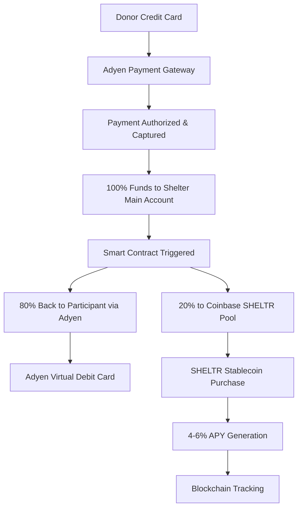

# SHELTR Unified Payment Architecture v2.0
*Revolutionary Single-Token Stable Fund System*

**Document Version**: 2.0.0  
**Last Updated**: September 26, 2025  
**Status**: Strategic Architecture Review  
**Lead Architect**: Doug Kukura, CFO & Payments Expert  

---

## 🎯 **Executive Summary**

Following extensive analysis by our CFO and payments expert Doug Kukura, SHELTR is pivoting from a dual-token architecture to a **Single Stable Token Investment Fund** model. This revolutionary approach eliminates market volatility risks, reduces complexity, and provides guaranteed returns while maintaining complete blockchain transparency.

**Key Innovation**: Direct credit card donations → Adyen payment rails → Smart contract distribution → 80% participant debit cards + 20% Base SHELTR Stablecoin pool generating 4-6% APY.

---

## 🚨 **Strategic Pivot: Why Single Token?**

### **Doug's Expert Analysis**

> *"The dual-token architecture introduces unnecessary complexity and market volatility risk for vulnerable populations. A traditional funding approach with a single utility token pegged to USDT provides stability, guaranteed returns, and eliminates ICO stigma while maintaining our mission integrity."*

### **Problems Solved**
- ❌ **Market Volatility Risk**: Eliminated through USDT pegging
- ❌ **ICO Stigma**: Avoided through traditional funding + utility token
- ❌ **Complex Architecture**: Simplified to single stable token
- ❌ **Participant Risk**: Zero crypto exposure for 80% allocation
- ❌ **Regulatory Uncertainty**: Clear utility token classification

---

## 💳 **New Payment Flow Architecture**

### **Phase 1: Donation Processing (Adyen)**



### **Phase 2: Fund Distribution**

| **Allocation** | **Amount** | **Method** | **Timeline** | **Risk Level** |
|----------------|------------|------------|--------------|----------------|
| **Participant Direct** | 80% | Adyen Virtual Debit Card | Immediate | Zero |
| **Housing Investment Fund** | 15% | SHELTR Stablecoin Pool | Immediate | Minimal |
| **Shelter Operations** | 5% | Direct Transfer | Immediate | Zero |

---

## 🏗️ **Technical Architecture**

### **1. Adyen Integration Layer**

#### **Payment Processing**
```typescript
interface AdyenPaymentFlow {
  // Donation capture
  creditCardDonation: {
    processor: 'Adyen Payment Gateway',
    methods: ['Visa', 'Mastercard', 'American Express', 'Digital Wallets'],
    fees: '2.9% + $0.30 per transaction',
    settlement: 'T+1 to shelter main account'
  },
  
  // Participant payout
  participantPayout: {
    method: 'Adyen Issuing API',
    product: 'Virtual Debit Card',
    speed: 'Real-time (< 30 seconds)',
    usage: 'Global ATM + POS acceptance'
  }
}
```

#### **Adyen Issuing Integration**
```python
# Participant virtual card creation
async def create_participant_card(participant_id: str, initial_balance: float):
    """
    Create virtual debit card for participant using Adyen Issuing
    """
    adyen_request = {
        "accountHolderCode": f"SHELTR-{participant_id}",
        "cardholderName": participant.display_name,
        "initialBalance": {
            "currency": "USD",
            "value": int(initial_balance * 100)  # Convert to cents
        },
        "cardType": "virtual",
        "restrictions": {
            "merchantCategories": ["grocery", "pharmacy", "gas_stations", "restaurants"],
            "dailyLimit": {"currency": "USD", "value": 50000}  # $500 daily limit
        }
    }
    
    response = adyen.issuing.create_card(adyen_request)
    return response
```

### **2. Coinbase Base Integration**

#### **SHELTR Stablecoin Contract**
```solidity
// SHELTR Utility Token - USDT Pegged
contract SHELTRStablecoin is ERC20 {
    IERC20 public usdt;
    uint256 public constant PEG_RATE = 1e18; // 1:1 with USDT
    
    // Coinbase staking integration
    address public coinbaseStakingPool;
    uint256 public targetAPY = 500; // 5.00% APY
    
    function depositHousingFund(uint256 usdtAmount) external onlyAuthorized {
        // Convert USDT to SHELTR tokens
        usdt.transferFrom(msg.sender, address(this), usdtAmount);
        
        // Mint SHELTR tokens to housing fund
        _mint(housingFundAddress, usdtAmount);
        
        // Stake in Coinbase for guaranteed returns
        stakeToCoinbase(usdtAmount);
        
        emit HousingFundDeposit(usdtAmount, block.timestamp);
    }
    
    function stakeToCoinbase(uint256 amount) internal {
        // Integrate with Coinbase staking API
        // Guaranteed 4-6% APY on staked USDT
    }
}
```

### **3. Smart Contract Distribution Logic**

```solidity
contract SHELTRPaymentDistributor {
    IAdyenPayout public adyenPayout;
    ISHELTRStablecoin public sheltrToken;
    
    struct DonationSplit {
        uint256 participantAmount;    // 80%
        uint256 housingFundAmount;    // 15%
        uint256 shelterOpsAmount;     // 5%
    }
    
    function processDonation(
        address participant,
        uint256 totalAmount,
        bytes32 adyenTransactionId
    ) external onlyAuthorized {
        
        DonationSplit memory split = calculateSplit(totalAmount);
        
        // 1. Send 80% back to participant via Adyen virtual card
        adyenPayout.loadParticipantCard(
            participant, 
            split.participantAmount,
            adyenTransactionId
        );
        
        // 2. Convert 15% to SHELTR stablecoin and stake
        sheltrToken.depositHousingFund(split.housingFundAmount);
        
        // 3. Transfer 5% to shelter operations
        transferToShelter(participant, split.shelterOpsAmount);
        
        // 4. Record everything on blockchain
        emit DonationProcessed(
            participant,
            totalAmount,
            split,
            block.timestamp
        );
    }
    
    function calculateSplit(uint256 amount) internal pure returns (DonationSplit memory) {
        return DonationSplit({
            participantAmount: (amount * 80) / 100,
            housingFundAmount: (amount * 15) / 100,
            shelterOpsAmount: (amount * 5) / 100
        });
    }
}
```

---

## 🎯 **Coinbase Integration Strategy**

### **Corporate Account Setup**
```typescript
interface CoinbaseIntegration {
  account: {
    type: 'Coinbase Prime' | 'Coinbase Institutional',
    features: ['Custody', 'Staking', 'Trading', 'Reporting'],
    compliance: 'SOC 2 Type II, FDIC insured'
  },
  
  stakingStrategy: {
    asset: 'USDT',
    targetAPY: '4-6%',
    strategy: 'Conservative fixed income',
    liquidity: 'Daily redemption available',
    risk: 'Minimal - institutional grade'
  },
  
  sheltrToken: {
    network: 'Base (Coinbase L2)',
    standard: 'ERC-20',
    backing: '1:1 USDT reserve',
    utility: 'Housing fund tracking + governance'
  }
}
```

### **Staking & Yield Generation**
```python
class CoinbaseStakingService:
    def __init__(self):
        self.client = CoinbasePrimeClient()
        self.target_apy = 0.05  # 5% target
        
    async def stake_housing_fund(self, usdt_amount: Decimal):
        """
        Stake USDT in Coinbase institutional staking
        """
        staking_request = {
            "asset": "USDT",
            "amount": str(usdt_amount),
            "strategy": "conservative_yield",
            "auto_compound": True,
            "liquidity_preference": "daily"
        }
        
        response = await self.client.create_stake(staking_request)
        
        # Mint equivalent SHELTR tokens for tracking
        await self.mint_sheltr_tokens(usdt_amount, response.stake_id)
        
        return response
        
    async def get_yield_performance(self):
        """
        Track actual vs target APY performance
        """
        stakes = await self.client.get_active_stakes()
        total_yield = sum(stake.accrued_interest for stake in stakes)
        
        return {
            "total_staked": sum(stake.principal for stake in stakes),
            "total_yield": total_yield,
            "current_apy": self.calculate_apy(stakes),
            "target_apy": self.target_apy
        }
```

---

## 💰 **Financial Model & Projections**

### **Revenue & Cost Structure**

| **Component** | **Cost/Revenue** | **Notes** |
|---------------|------------------|-----------|
| **Adyen Processing** | 2.9% + $0.30/txn | Industry standard |
| **Adyen Issuing** | $2-5/card + $0.10/txn | Virtual card costs |
| **Coinbase Staking** | 0.25% management fee | Institutional rates |
| **Base Network** | ~$0.01/transaction | L2 efficiency |
| **SHELTR Operations** | 5% of donations | Sustainable funding |

### **Participant Economics**
```
Example: $100 Donation
├── Adyen Fee: $3.20 (3.2%)
├── Net to Distribute: $96.80
├── Participant Receives: $77.44 (80% of net)
├── Housing Fund: $14.52 (15% of net) → 5% APY = $0.73/year
├── Shelter Ops: $4.84 (5% of net)
└── Total Impact: 100% transparent + guaranteed growth
```

### **Housing Fund Growth Model**
```python
def calculate_housing_fund_growth(years: int, monthly_donations: float):
    """
    Calculate housing fund growth with compound interest
    """
    annual_deposits = monthly_donations * 12 * 0.15  # 15% allocation
    apy = 0.05  # 5% conservative estimate
    
    total_value = 0
    for year in range(years):
        total_value = (total_value + annual_deposits) * (1 + apy)
    
    return total_value

# Example: $10K monthly donations over 5 years
# Year 1: $18K housing fund
# Year 5: $118K housing fund (compound growth)
```

---

## 🔐 **Security & Compliance**

### **Regulatory Compliance**
- **Money Transmitter Licenses**: Adyen handles all MSB requirements
- **KYC/AML**: Integrated through Adyen's compliance infrastructure
- **FDIC Insurance**: Coinbase institutional custody protection
- **SOX Compliance**: Financial reporting and audit trails
- **Utility Token Classification**: Clear non-security status

### **Smart Contract Security**
```solidity
// Multi-signature treasury management
contract SHELTRTreasury {
    mapping(address => bool) public authorizedSigners;
    uint256 public constant REQUIRED_SIGNATURES = 3;
    
    modifier onlyMultiSig() {
        require(validateSignatures(msg.data), "Insufficient signatures");
        _;
    }
    
    function emergencyPause() external onlyMultiSig {
        // Pause all operations in case of security threat
        _pause();
    }
}
```

### **Participant Protection**
- **Zero Crypto Exposure**: 80% allocation never touches blockchain
- **Guaranteed Stability**: Housing fund backed by USDT + institutional staking
- **Instant Liquidity**: Adyen virtual cards work globally
- **Privacy Protection**: Blockchain addresses pseudonymous
- **Fraud Protection**: Adyen's advanced fraud detection

---

## 🚀 **Implementation Roadmap**

### **Phase 1: Foundation (Q4 2025)**
- [ ] Adyen merchant account setup and integration
- [ ] Coinbase Prime institutional account
- [ ] SHELTR stablecoin deployment on Base
- [ ] Smart contract audit and deployment
- [ ] Initial funding round (traditional equity/debt)

### **Phase 2: Integration (Q1 2026)**
- [ ] Adyen Issuing API integration
- [ ] Coinbase staking automation
- [ ] Participant onboarding system
- [ ] Shelter partner integrations
- [ ] Beta testing with select shelters

### **Phase 3: Scale (Q2-Q3 2026)**
- [ ] Multi-shelter deployment
- [ ] Advanced analytics dashboard
- [ ] Mobile app with card management
- [ ] International expansion planning
- [ ] Regulatory compliance expansion

### **Phase 4: Optimization (Q4 2026)**
- [ ] AI-powered yield optimization
- [ ] Advanced fraud detection
- [ ] Cross-border payment support
- [ ] Enterprise shelter partnerships
- [ ] Impact measurement automation

---

## 📊 **Success Metrics & KPIs**

### **Financial Performance**
- **Housing Fund APY**: Target 4-6% annually
- **Participant Card Usage**: >80% monthly activity
- **Transaction Success Rate**: >99.5%
- **Cost per Transaction**: <$0.50 all-in
- **Housing Fund Growth**: $1M+ by end of Year 1

### **Operational Excellence**
- **Card Issuance Time**: <30 seconds
- **Donation Processing**: <2 minutes end-to-end
- **System Uptime**: 99.9%
- **Participant Satisfaction**: >4.5/5.0
- **Shelter Partner Retention**: >95%

### **Social Impact**
- **Participants Served**: 10,000+ in Year 1
- **Housing Placements**: 2,500+ successful transitions
- **Donation Volume**: $5M+ processed annually
- **Shelter Partners**: 100+ active integrations
- **Geographic Coverage**: 50+ cities

---

## 💡 **Competitive Advantages**

### **vs Traditional Charity**
- ✅ **100% Transparency**: Every dollar tracked on blockchain
- ✅ **Guaranteed Growth**: 4-6% APY vs 0% traditional
- ✅ **Instant Impact**: Real-time fund distribution
- ✅ **Zero Overhead**: Participants receive full allocation

### **vs Crypto Solutions**
- ✅ **Zero Volatility**: No market risk for participants
- ✅ **Mainstream Adoption**: Credit cards + debit cards
- ✅ **Regulatory Clarity**: No ICO or security token issues
- ✅ **Institutional Backing**: Coinbase + Adyen partnership

### **vs Fintech Apps**
- ✅ **Social Mission**: Purpose-built for homelessness
- ✅ **Guaranteed Returns**: Institutional staking vs variable
- ✅ **Complete Ecosystem**: Donation + distribution + growth
- ✅ **Blockchain Verification**: Immutable impact tracking

---

## 🤝 **Partnership Strategy**

### **Adyen Partnership Benefits**
- **Global Reach**: 70+ countries, 150+ currencies
- **Enterprise Grade**: Handles Uber, Spotify, McDonald's
- **Compliance Built-in**: All regulatory requirements covered
- **Innovation Access**: Latest payment technologies
- **Dedicated Support**: Enterprise relationship management

### **Coinbase Partnership Benefits**
- **Institutional Custody**: $130B+ assets under custody
- **Regulatory Leadership**: Clear compliance framework
- **Base Network**: Optimized L2 for our use case
- **Staking Infrastructure**: Proven yield generation
- **Brand Trust**: Mainstream crypto adoption leader

### **Shelter Network Integration**
```typescript
interface ShelterPartnership {
  onboarding: {
    apiIntegration: 'RESTful API + webhooks',
    participantSync: 'Real-time data synchronization',
    reporting: 'Custom dashboard + analytics',
    training: 'Staff onboarding + support'
  },
  
  revenue: {
    operationalSupport: '5% of donations to shelter',
    technologyFee: '$0 (covered by platform)',
    cardIssuance: '$0 (covered by platform)',
    additionalServices: 'Custom pricing'
  }
}
```

---

## 🔮 **Future Innovations**

### **Advanced Features (2027+)**
- **AI-Powered Yield Optimization**: Dynamic staking strategies
- **Biometric Card Security**: Enhanced participant protection
- **Cross-Border Remittances**: International family support
- **Impact NFTs**: Verifiable outcome certificates
- **Corporate CSR Integration**: Enterprise giving platforms

### **Emerging Technologies**
- **Central Bank Digital Currencies (CBDCs)**: Integration readiness
- **Quantum-Resistant Security**: Future-proof cryptography
- **IoT Payment Integration**: Smart city infrastructure
- **AR/VR Interfaces**: Next-generation user experience

---

## 📚 **Technical Documentation References**

### **Adyen Documentation**
- [Adyen Online Payments](https://docs.adyen.com/online-payments/)
- [Adyen Issuing API](https://docs.adyen.com/issuing/)
- [Adyen Payouts](https://docs.adyen.com/payouts/)

### **Base/Coinbase Documentation**
- [Base Crypto Payments](https://docs.base.org/cookbook/accept-crypto-payments)
- [Base App Coins](https://docs.base.org/cookbook/base-app-coins)
- [Base Products](https://docs.base.org/get-started/products)
- [Launch Token Guide](https://docs.base.org/get-started/launch-token)
- [Smart Contract Deployment](https://docs.base.org/get-started/deploy-smart-contracts)

### **Integration Guides**
- [SHELTR API Documentation](../api/README.md)
- [Smart Contract Specifications](../technical/smart-contracts.md)
- [Security Implementation](../security/implementation.md)
- [Compliance Framework](../legal/compliance.md)

---

## 🎯 **Conclusion**

The SHELTR Unified Payment Architecture v2.0 represents a paradigm shift in charitable technology. By combining Adyen's enterprise payment infrastructure with Coinbase's institutional-grade staking and Base blockchain's efficiency, we've created a system that:

- **Eliminates Risk** for vulnerable populations
- **Guarantees Growth** through institutional staking
- **Ensures Transparency** via blockchain tracking
- **Scales Globally** with enterprise partnerships
- **Maintains Simplicity** through proven technologies

This architecture addresses Doug's expert concerns while maintaining our core mission: **maximum impact, zero risk, complete transparency**.

The result is a revolutionary platform that brings traditional finance stability to blockchain innovation, creating sustainable change for those who need it most.

---

*"By simplifying our architecture and partnering with industry leaders, we've created something more powerful than a cryptocurrency project - we've built a sustainable solution to homelessness."*

**- Doug Kukura, CFO & Payments Expert**

---

**Document Status**: Strategic Review Complete  
**Next Step**: Technical Implementation Planning  
**Approval Required**: Board Review & Partnership Negotiations  

---

*Built with ❤️ for those who need it most*
