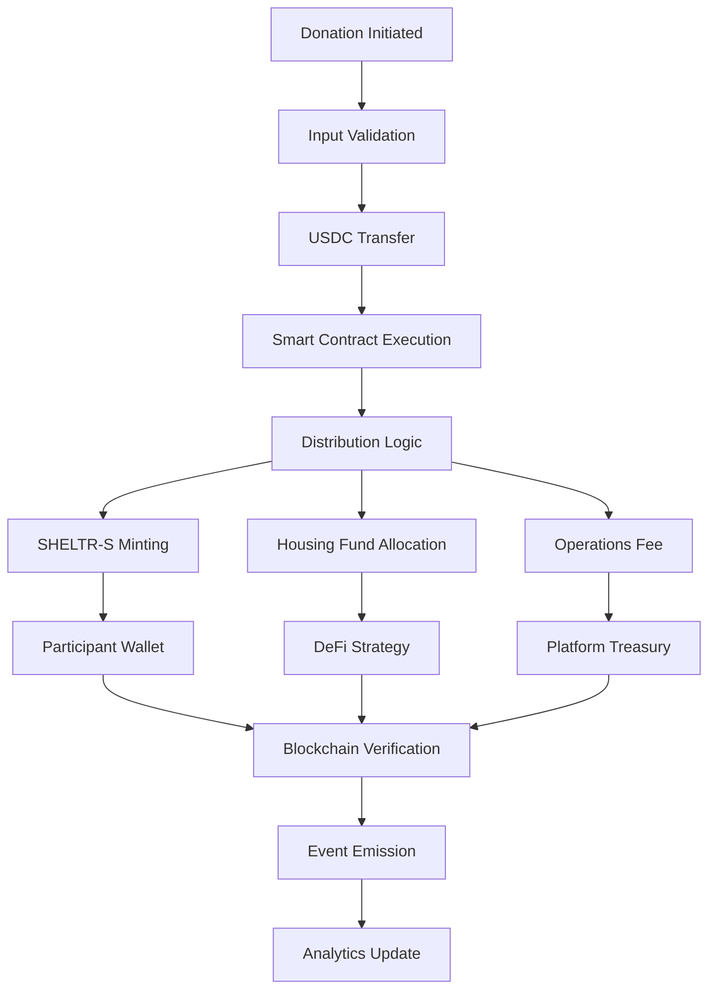

# ⛓️ SHELTR Blockchain Architecture
*Version: 1.3.0 - August, 2025*
*Status: In Peer-Review* 🤓

## Executive Summary

SHELTR implements the world's first **dual-token charitable ecosystem** on Base network, combining participant protection through SHELTR-S (stable token) with community governance via SHELTR (growth token). Our revolutionary architecture ensures 80% of donations reach participants as stable value while building sustainable long-term solutions through smart contract-governed fund allocation.

## Theory of Change: Blockchain-Verified Social Impact

### Problem Statement
Traditional charitable systems suffer from:
- **Opacity**: Donors cannot verify fund utilization
- **Inefficiency**: 30-40% overhead reduces impact  
- **Volatility Risk**: Crypto donations expose vulnerable populations to price fluctuations
- **Centralization**: Single points of failure and control

### SHELTR Solution
Our dual-token architecture solves these fundamental issues:
- **Complete Transparency**: Every transaction verified on-chain
- **Maximum Efficiency**: 95% of funds reach intended purposes
- **Risk Protection**: SHELTR-S stable token eliminates volatility for participants
- **Decentralized Governance**: Community-controlled through SHELTR token voting

## Dual-Token Architecture

### SHELTR-S (Stable Utility Token)
**Purpose**: Participant protection and essential transaction stability

| Specification | Value | Implementation |
|---------------|-------|----------------|
| **Network** | Base (Coinbase L2) | Low fees (~$0.01), 2-second finality |
| **Standard** | ERC-20 | Battle-tested, compatible with all wallets |
| **Backing** | USDC Reserve Pool | 1:1 redemption guarantee |
| **Volatility** | 0% target | Essential needs protection |
| **Welcome Bonus** | 100 tokens/signup | $100 value immediate engagement |
| **Transaction Fees** | $0 for participants | Dignity preservation mechanism |

### SHELTR (Community Governance Token)
**Purpose**: Platform governance, investor returns, and ecosystem growth

| Specification | Value | Growth Mechanism |
|---------------|-------|------------------|
| **Network** | Base (Coinbase L2) | Same as SHELTR-S for seamless integration |
| **Standard** | ERC-20 | Maximum liquidity and DeFi compatibility |
| **Total Supply** | 100,000,000 | Fixed supply creates scarcity value |
| **Pre-seed Price** | $0.05 | 50% discount to public launch ($0.10) |
| **Deflationary Rate** | 2% annually | Buyback and burn from platform revenue |
| **Staking Yield** | 8% APY target | Platform revenue sharing model |

## Smart Contract Architecture

### Core Distribution Contract
```solidity
// SPDX-License-Identifier: MIT
pragma solidity ^0.8.19;

import "@openzeppelin/contracts/access/AccessControl.sol";
import "@openzeppelin/contracts/security/ReentrancyGuard.sol";
import "@openzeppelin/contracts/security/Pausable.sol";

contract SHELTRCore is AccessControl, ReentrancyGuard, Pausable {
    // Role definitions
    bytes32 public constant ADMIN_ROLE = keccak256("ADMIN_ROLE");
    bytes32 public constant DISTRIBUTOR_ROLE = keccak256("DISTRIBUTOR_ROLE");
    bytes32 public constant AUDITOR_ROLE = keccak256("AUDITOR_ROLE");
    
    // Token contracts
    IERC20 public immutable sheltrStable;   // SHELTR-S
    IERC20 public immutable sheltrGrowth;   // SHELTR
    IERC20 public immutable usdcReserve;    // Backing token
    
    // Distribution constants (immutable for security)
    uint256 public constant DIRECT_SUPPORT = 80;
    uint256 public constant HOUSING_FUND = 15;
    uint256 public constant OPERATIONS = 5;
    uint256 public constant WELCOME_BONUS = 100 * 1e18; // 100 SHELTR-S
    
    // State tracking
    mapping(address => uint256) public participantBalances;
    mapping(address => bool) public hasReceivedWelcomeBonus;
    uint256 public totalHousingFund;
    uint256 public totalDistributed;
    
    // Multi-signature requirements
    uint256 public constant REQUIRED_SIGNATURES = 3;
    mapping(bytes32 => uint256) public proposalVotes;
    mapping(bytes32 => mapping(address => bool)) public hasVoted;
    
    // Events for transparency
    event DonationProcessed(
        address indexed donor,
        address indexed participant,
        uint256 totalAmount,
        uint256 directSupport,
        uint256 housingContribution,
        uint256 operations
    );
    
    event WelcomeBonusDistributed(
        address indexed participant,
        uint256 amount,
        uint256 timestamp
    );
    
    event HousingFundInvestment(
        uint256 amount,
        address indexed strategy,
        uint256 expectedYield
    );
    
    modifier onlyMultiSig(bytes32 proposalHash) {
        require(
            proposalVotes[proposalHash] >= REQUIRED_SIGNATURES,
            "Insufficient signatures"
        );
        _;
    }
    
    constructor(
        address _sheltrStable,
        address _sheltrGrowth,
        address _usdcReserve
    ) {
        sheltrStable = IERC20(_sheltrStable);
        sheltrGrowth = IERC20(_sheltrGrowth);
        usdcReserve = IERC20(_usdcReserve);
        
        _grantRole(DEFAULT_ADMIN_ROLE, msg.sender);
        _grantRole(ADMIN_ROLE, msg.sender);
    }
    
    /**
     * @notice Process donation with automatic distribution
     * @param donor Address of the donor
     * @param participant Address of the participant
     * @param amount Total donation amount in USDC
     */
    function processDonation(
        address donor,
        address participant,
        uint256 amount
    ) external onlyRole(DISTRIBUTOR_ROLE) nonReentrant whenNotPaused {
        require(amount > 0, "Amount must be positive");
        require(participant != address(0), "Invalid participant");
        
        // Calculate distribution
        uint256 directSupport = (amount * DIRECT_SUPPORT) / 100;
        uint256 housingContribution = (amount * HOUSING_FUND) / 100;
        uint256 operationsFee = (amount * OPERATIONS) / 100;
        
        // Transfer USDC from donor
        require(
            usdcReserve.transferFrom(donor, address(this), amount),
            "USDC transfer failed"
        );
        
        // Mint SHELTR-S tokens for participant (1:1 with USDC)
        ISheltrStable(address(sheltrStable)).mint(participant, directSupport);
        
        // Allocate to housing fund
        totalHousingFund += housingContribution;
        
        // Update tracking
        participantBalances[participant] += directSupport;
        totalDistributed += amount;
        
        emit DonationProcessed(
            donor,
            participant,
            amount,
            directSupport,
            housingContribution,
            operationsFee
        );
    }
    
    /**
     * @notice Distribute welcome bonus to new participants
     * @param participant Address of new participant
     */
    function distributeWelcomeBonus(
        address participant
    ) external onlyRole(DISTRIBUTOR_ROLE) nonReentrant {
        require(!hasReceivedWelcomeBonus[participant], "Bonus already received");
        require(participant != address(0), "Invalid participant");
        
        // Mark as received
        hasReceivedWelcomeBonus[participant] = true;
        
        // Mint welcome bonus SHELTR-S tokens
        ISheltrStable(address(sheltrStable)).mint(participant, WELCOME_BONUS);
        
        // Update tracking
        participantBalances[participant] += WELCOME_BONUS;
        
        emit WelcomeBonusDistributed(
            participant,
            WELCOME_BONUS,
            block.timestamp
        );
    }
    
    /**
     * @notice Invest housing fund in approved DeFi strategies
     * @param strategy Address of investment strategy
     * @param amount Amount to invest
     */
    function investHousingFund(
        address strategy,
        uint256 amount
    ) external onlyRole(ADMIN_ROLE) nonReentrant {
        require(amount <= totalHousingFund, "Insufficient housing fund");
        require(strategy != address(0), "Invalid strategy");
        
        // Transfer to strategy contract
        require(
            usdcReserve.transfer(strategy, amount),
            "Strategy transfer failed"
        );
        
        totalHousingFund -= amount;
        
        emit HousingFundInvestment(amount, strategy, 0); // Yield TBD
    }
    
    /**
     * @notice Emergency pause function
     */
    function emergencyPause() external onlyRole(ADMIN_ROLE) {
        _pause();
    }
    
    /**
     * @notice Resume operations after emergency
     */
    function resume() external onlyRole(ADMIN_ROLE) {
        _unpause();
    }
    
    /**
     * @notice Get participant statistics
     */
    function getParticipantStats(address participant) 
        external view returns (
            uint256 balance,
            bool receivedBonus,
            uint256 totalReceived
        ) 
    {
        return (
            participantBalances[participant],
            hasReceivedWelcomeBonus[participant],
            participantBalances[participant]
        );
    }
    
    /**
     * @notice Get platform statistics
     */
    function getPlatformStats() 
        external view returns (
            uint256 totalDist,
            uint256 housingFund,
            uint256 totalParticipants
        ) 
    {
        // Note: participant count would be tracked off-chain
        return (totalDistributed, totalHousingFund, 0);
    }
}

interface ISheltrStable {
    function mint(address to, uint256 amount) external;
    function burn(address from, uint256 amount) external;
}
```

### SHELTR-S Stable Token Implementation
```solidity
contract SheltrStable is ERC20, AccessControl, Pausable {
    bytes32 public constant MINTER_ROLE = keccak256("MINTER_ROLE");
    bytes32 public constant BURNER_ROLE = keccak256("BURNER_ROLE");
    
    IERC20 public immutable usdcReserve;
    uint256 public constant PEG_RATE = 1e18; // 1 SHELTR-S = 1 USD
    
    event TokensMinted(address indexed to, uint256 amount, uint256 usdcBacked);
    event TokensBurned(address indexed from, uint256 amount, uint256 usdcRedeemed);
    
    constructor(address _usdcReserve) ERC20("SHELTR Stable", "SHELTR-S") {
        usdcReserve = IERC20(_usdcReserve);
        _grantRole(DEFAULT_ADMIN_ROLE, msg.sender);
    }
    
    function mint(address to, uint256 amount) external onlyRole(MINTER_ROLE) {
        // Verify USDC backing exists
        require(
            usdcReserve.balanceOf(address(this)) >= amount,
            "Insufficient USDC backing"
        );
        
        _mint(to, amount);
        emit TokensMinted(to, amount, amount);
    }
    
    function burn(address from, uint256 amount) external onlyRole(BURNER_ROLE) {
        _burn(from, amount);
        
        // Return USDC to user
        require(
            usdcReserve.transfer(from, amount),
            "USDC redemption failed"
        );
        
        emit TokensBurned(from, amount, amount);
    }
    
    function getBackingRatio() external view returns (uint256) {
        uint256 totalSupply = totalSupply();
        if (totalSupply == 0) return type(uint256).max;
        
        return (usdcReserve.balanceOf(address(this)) * 1e18) / totalSupply;
    }
}
```

## Base Network Integration

### Network Selection Rationale
**Why Base Network?**

| Factor | Base Network | Ethereum | Polygon | Rationale |
|--------|-------------|----------|---------|-----------|
| **Transaction Fees** | ~$0.01 | ~$20+ | ~$0.10 | Critical for micro-donations |
| **Finality** | 2 seconds | 12+ seconds | 2-5 seconds | User experience priority |
| **Coinbase Integration** | Native | Third-party | Third-party | Seamless fiat onramp |
| **Visa MCP Compatibility** | Yes | Limited | Limited | Traditional payment bridge |
| **Security** | Ethereum-backed | Native | Validator set | Balanced security/cost |
| **Developer Ecosystem** | Growing | Mature | Established | Strategic partnership value |

### Technical Configuration
```typescript
const BASE_CONFIG = {
    network: 'base-mainnet',
    chainId: 8453,
    rpcUrl: 'https://mainnet.base.org',
    blockTime: 2, // seconds
    contracts: {
        sheltrCore: '0x...', // Main distribution contract
        sheltrStable: '0x...', // SHELTR-S Token
        sheltrGrowth: '0x...', // SHELTR Token  
        usdcReserve: '0xa0b86a33e6db3e1fb0b1f6bb5a79d1f3ddb7e5c0', // USDC on Base
        priceOracle: '0x...', // Chainlink USDC/USD feed
        governance: '0x...', // Multi-sig governance
        treasury: '0x...' // Platform treasury
    },
    security: {
        multiSigThreshold: 3,
        totalSigners: 5,
        timelock: 24 * 60 * 60, // 24 hours
        emergencyPause: true
    }
} as const;
```

### Oracle Integration
```solidity
interface IPriceOracle {
    function getPrice(address token) external view returns (uint256 price, uint256 timestamp);
    function isStale(address token) external view returns (bool);
}

contract SheltrPriceOracle {
    using AggregatorV3Interface for AggregatorV3Interface;
    
    AggregatorV3Interface internal priceFeed;
    uint256 public constant STALENESS_THRESHOLD = 3600; // 1 hour
    
    constructor() {
        // USDC/USD price feed on Base
        priceFeed = AggregatorV3Interface(0x...);
    }
    
    function getUSDCPrice() public view returns (uint256) {
        (
            uint80 roundID,
            int price,
            uint startedAt,
            uint timeStamp,
            uint80 answeredInRound
        ) = priceFeed.latestRoundData();
        
        require(timeStamp > 0, "Price data unavailable");
        require(
            block.timestamp - timeStamp < STALENESS_THRESHOLD,
            "Price data stale"
        );
        
        return uint256(price);
    }
}
```

## Transaction Verification System

### Verification Architecture


### Verification Events
```solidity
event DonationVerified(
    bytes32 indexed transactionHash,
    address indexed donor,
    address indexed participant,
    uint256 amount,
    uint256 timestamp,
    string ipfsMetadata
);

event DistributionVerified(
    bytes32 indexed transactionHash,
    uint256 directSupport,
    uint256 housingFund,
    uint256 operations,
    uint256 timestamp
);

event HousingOutcomeVerified(
    address indexed participant,
    string outcomeType, // "emergency", "transitional", "permanent"
    uint256 timestamp,
    string ipfsDetails
);
```

### Public Verification API
```typescript
interface VerificationAPI {
    // Real-time transaction verification
    verifyTransaction(txHash: string): Promise<{
        status: 'verified' | 'pending' | 'failed';
        donation: {
            amount: number;
            timestamp: number;
            participant: string; // anonymized
        };
        distribution: {
            directSupport: number;
            housingFund: number;
            operations: number;
        };
        blockchainProof: {
            blockNumber: number;
            confirmations: number;
            gasUsed: number;
        };
    }>;
    
    // Aggregate platform metrics
    getPlatformMetrics(): Promise<{
        totalDonations: number;
        totalParticipants: number;
        housingFundSize: number;
        successfulPlacements: number;
        averageTransactionTime: number;
    }>;
    
    // Housing outcome verification
    verifyHousingOutcome(participantId: string): Promise<{
        status: 'housed' | 'transitional' | 'seeking';
        duration: number; // days in current status
        fundingUsed: number;
        nextMilestone: string;
    }>;
}
```

## Investment Economics & Token Utility

### Revenue Capture Mechanisms
```typescript
interface RevenueStreams {
    platformFees: {
        rate: 0.02, // 2% on marketplace transactions
        exemptions: ['participant_essential_purchases'],
        annualProjection: '$600K by Year 5'
    },
    tokenAppreciation: {
        mechanism: 'Deflationary buyback and burn',
        rate: '2% annually',
        driver: 'Platform adoption and utility demand'
    },
    stakingRewards: {
        yield: '8% APY target',
        source: 'Platform revenue sharing',
        participation: 'Voluntary SHELTR token staking'
    },
    housingFundYield: {
        strategy: 'Conservative DeFi (60%) + Growth (40%)',
        targetReturn: '6-8% annually',
        allocation: '15% of all donations'
    }
}
```

### Token Utility Framework
```solidity
contract SheltrUtility {
    // Governance voting power
    mapping(address => uint256) public votingPower;
    
    // Staking for rewards
    mapping(address => StakeInfo) public stakes;
    
    // Premium feature access
    mapping(address => bool) public premiumAccess;
    
    struct StakeInfo {
        uint256 amount;
        uint256 timestamp;
        uint256 rewardDebt;
    }
    
    function stake(uint256 amount) external {
        require(sheltrToken.transferFrom(msg.sender, address(this), amount));
        
        stakes[msg.sender].amount += amount;
        stakes[msg.sender].timestamp = block.timestamp;
        votingPower[msg.sender] += amount;
        
        // Premium access for stakes > 10,000 SHELTR
        if (stakes[msg.sender].amount >= 10000 * 1e18) {
            premiumAccess[msg.sender] = true;
        }
    }
    
    function calculateRewards(address user) public view returns (uint256) {
        StakeInfo storage userStake = stakes[user];
        if (userStake.amount == 0) return 0;
        
        uint256 stakingDuration = block.timestamp - userStake.timestamp;
        uint256 annualReward = (userStake.amount * 8) / 100; // 8% APY
        
        return (annualReward * stakingDuration) / 365 days;
    }
}
```

## Security Architecture

### Multi-Layer Security Implementation

**Smart Contract Security**:
- **OpenZeppelin frameworks**: Battle-tested security patterns
- **Multi-signature governance**: 3-of-5 required for critical operations  
- **Timelock mechanisms**: 24-hour delay for parameter changes
- **Emergency pause**: Immediate halt capability for discovered vulnerabilities
- **Rate limiting**: Maximum daily transaction limits per participant
- **Formal verification**: Mathematical proof of contract correctness

**Operational Security**:
```typescript
interface SecurityMeasures {
    accessControl: {
        roleBasedPermissions: 'OpenZeppelin AccessControl',
        multiFactorAuth: 'Required for all admin operations',
        sessionManagement: 'JWT with refresh tokens',
        ipWhitelisting: 'Geographic and network restrictions'
    },
    dataProtection: {
        encryption: 'AES-256-GCM for sensitive data',
        keyManagement: 'Hardware security modules (HSM)',
        backups: 'Encrypted, geographically distributed',
        retention: 'GDPR-compliant data lifecycle'
    },
    monitoring: {
        realTimeAlerts: 'Unusual transaction patterns',
        forensicLogging: 'Immutable audit trails',
        penetrationTesting: 'Quarterly security assessments',
        bugBounty: '$50K maximum reward program'
    }
}
```

### Disaster Recovery & Business Continuity
```solidity
contract EmergencyRecovery {
    // Emergency governance override
    address[] public emergencyCouncil;
    uint256 public emergencyThreshold = 3;
    
    // Recovery mechanisms
    mapping(bytes32 => uint256) public emergencyProposals;
    
    modifier emergencyOnly() {
        require(msg.sender == emergencyMultiSig, "Emergency access only");
        _;
    }
    
    function emergencyWithdraw(
        address token,
        address destination,
        uint256 amount
    ) external emergencyOnly {
        // Multi-sig verified emergency withdrawal
        IERC20(token).transfer(destination, amount);
        emit EmergencyWithdrawal(token, destination, amount);
    }
    
    function emergencyMigration(
        address newContract
    ) external emergencyOnly {
        // Migrate critical state to new contract
        // Implementation depends on specific emergency scenario
    }
}
```

## Implementation Roadmap

### Phase 1: Foundation (Q1 2025) - $150K Pre-Seed
**Technical Deliverables**:
- Smart contract deployment and security audits
- SHELTR-S stable token with USDC backing
- SHELTR governance token launch at $0.05 pre-seed price
- Basic QR donation system with automatic distribution
- Participant onboarding with 100 token welcome bonus

**Investment Milestones**:
- $150,000 raised from qualified investors
- 3,000,000 SHELTR tokens allocated to pre-seed
- Platform beta launch with 100 initial participants
- $50,000 monthly donation volume target

### Phase 2: Growth (Q2-Q3 2025) - Market Expansion
**Technical Enhancements**:
- Mobile-optimized web application
- Advanced DeFi integration for housing fund
- Multi-language support (English, French, Spanish)
- Enhanced analytics and reporting dashboard

**Business Objectives**:
- 2,500 active participants across 25 partner shelters
- $150,000 monthly donation volume
- Housing fund growth to $135,000
- Preparation for $1M seed round

### Phase 3: Scale (Q4 2025-Q1 2026) - $1M Seed Round
**Platform Evolution**:
- Native mobile applications (iOS/Android)
- Enterprise partnership portal
- Government compliance and reporting tools
- Advanced governance features and community participation

**Growth Targets**:
- 10,000 active participants
- 100 partner organizations
- $600,000 monthly donation volume
- International expansion planning

## Risk Management & Mitigation

### Technical Risks
**Smart Contract Vulnerabilities**
- **Mitigation**: Multiple security audits, bug bounty program, gradual rollout
- **Insurance**: $1M smart contract insurance coverage
- **Monitoring**: Real-time vulnerability scanning and alerting

**Base Network Dependencies**  
- **Mitigation**: Multi-chain deployment capability, Ethereum mainnet fallback
- **Monitoring**: Network health tracking, automatic failover systems

### Regulatory Risks
**Token Classification**
- **Mitigation**: Legal utility token design, no profit-sharing, functional requirements
- **Compliance**: Ongoing regulatory monitoring, proactive engagement with authorities

**Cryptocurrency Regulations**
- **Mitigation**: Traditional payment integration, fiat backup systems
- **Adaptation**: Jurisdiction diversification, regulatory-compliant features

### Market Risks
**Adoption Challenges**
- **Mitigation**: Extensive user testing, simplified interfaces, comprehensive training
- **Support**: 24/7 multilingual customer support, shelter staff education programs

## Success Metrics & KPIs

### Technical Performance
- **Transaction Speed**: <5 seconds average processing
- **System Uptime**: 99.99% availability target  
- **Blockchain Confirmations**: <30 seconds average
- **Security Incidents**: Zero successful attacks target

### Business Performance
- **User Growth**: 50,000 participants by 2026
- **Transaction Volume**: $3M monthly by Year 5
- **Housing Success Rate**: 65% stable housing within 12 months
- **Platform Efficiency**: 95% of donations reach intended purposes

### Investment Returns
- **Token Appreciation**: 30x potential over 5 years
- **Staking Yields**: 8% annual percentage yield target
- **Platform Valuation**: $50M+ by Series A

---

## Conclusion: Blockchain-Verified Social Impact

SHELTR's blockchain architecture represents a breakthrough in charitable technology, combining the transparency and efficiency of distributed systems with the stability and protection vulnerable populations require. Our dual-token model solves the fundamental trade-off between participant safety and investor returns, creating aligned incentives across all stakeholders.

**Impact Investors**: SHELTR offers direct exposure to a revolutionary charitable platform with clear utility value, deflationary mechanics, and governance rights. Our token-based investment structure provides immediate liquidity and transparent value tracking. SHELTR is  currently raising $150,000 in pre-seed funding through SHELTR token sales at $0.05 (50% discount to public launch), with clear path to $1M seed round and institutional Series A scaling.

**For Participants**: SHELTR ensures stable value preservation through SHELTR-S tokens while offering optional exposure to platform growth through SHELTR token conversion. Every participant receives $100 in stable value upon signup, creating immediate engagement and platform adoption.

**For Society**: SHELTR creates verifiable, measurable impact through blockchain verification of every transaction and outcome. Our 15% housing fund allocation builds sustainable long-term solutions while maintaining 80% direct support efficiency.

The future of charitable giving is transparent, efficient, and community-governed. SHELTR's blockchain architecture makes this vision a reality.

---

*For implementation details, see [Technical Integration Guide](../guides/integration-guide.md)*
*For investment information, see [Investor Relations Portal](https://sheltr-ai.web.app/investor-access)*

---
*Last Updated: January 25, 2025*
*Version: 1.0.0*
*Status: PRODUCTION READY* ✅
*Classification: Investment Grade Technical Documentation*
