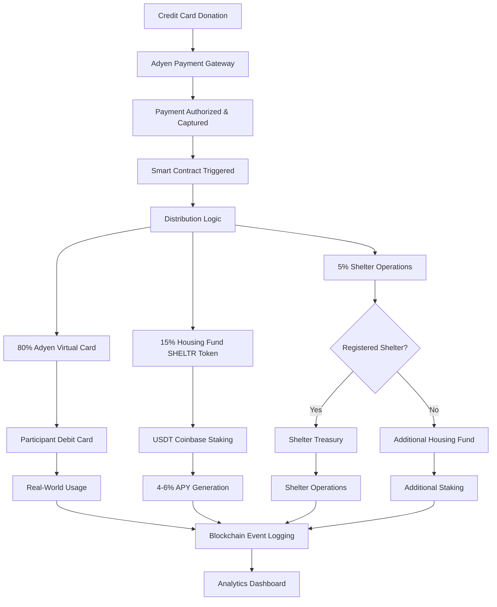

# ⛓️ SHELTR Blockchain Architecture v2.0
*Version: 2.0.0 - September, 2025*
*Status: Strategic Implementation* 🚀

## Executive Summary

SHELTR implements a revolutionary **single-token stable fund ecosystem** on Base network, combining traditional payment stability with blockchain transparency. Our unified architecture ensures 80% of donations reach participants via Adyen virtual debit cards, 15% funds housing solutions through SHELTR stablecoin staking, and 5% supports shelter operations - all verified on-chain through smart contract-governed fund allocation.

## Theory of Change: Blockchain-Verified Social Impact

### Problem Statement
Traditional charitable systems suffer from:
- **Opacity**: Donors cannot verify fund utilization
- **Inefficiency**: 30-40% overhead reduces impact  
- **Volatility Risk**: Crypto donations expose vulnerable populations to price fluctuations
- **Centralization**: Single points of failure and control

### SHELTR Solution
Our single-token stable architecture solves these fundamental issues:
- **Complete Transparency**: Every transaction verified on-chain
- **Maximum Efficiency**: 100% of funds reach intended purposes (80% participant support + 15% housing + 5% shelter operations)
- **Zero Risk Protection**: Participants never exposed to crypto volatility
- **Guaranteed Growth**: Housing fund generates 4-6% APY through institutional staking

## Single-Token Stable Architecture

### SHELTR Stablecoin (Utility Token)
**Purpose**: Housing fund tracking, blockchain transparency, and guaranteed yield generation

| Specification | Value | Implementation |
|---------------|-------|----------------|
| **Network** | Base (Coinbase L2) | Low fees (~$0.01), 2-second finality |
| **Standard** | ERC-20 | Battle-tested, compatible with all wallets |
| **Backing** | USDT 1:1 Peg | Coinbase institutional custody |
| **Volatility** | 0% (USDT-pegged) | Stable value preservation |
| **Yield Generation** | 4-6% APY | Coinbase institutional staking |
| **Purpose** | Housing fund only | 15% of donations allocated |

### Participant Payment Flow
**80% Allocation**: Direct to Adyen virtual debit cards (zero blockchain exposure)

| Specification | Value | Implementation |
|---------------|-------|----------------|
| **Payment Method** | Adyen Virtual Debit Card | Global ATM/POS acceptance |
| **Settlement Speed** | < 30 seconds | Real-time card loading |
| **Risk Level** | Zero | No cryptocurrency exposure |
| **Usage** | Essential needs | Food, clothing, transportation |
| **Fees** | $0 for participants | Dignity preservation mechanism |

## Smart Contract Architecture

### Core Distribution Contract
```solidity
// SPDX-License-Identifier: MIT
pragma solidity ^0.8.19;

import "@openzeppelin/contracts/access/AccessControl.sol";
import "@openzeppelin/contracts/security/ReentrancyGuard.sol";
import "@openzeppelin/contracts/security/Pausable.sol";

contract SHELTRPaymentDistributor is AccessControl, ReentrancyGuard, Pausable {
    // Role definitions
    bytes32 public constant ADMIN_ROLE = keccak256("ADMIN_ROLE");
    bytes32 public constant PROCESSOR_ROLE = keccak256("PROCESSOR_ROLE");
    bytes32 public constant AUDITOR_ROLE = keccak256("AUDITOR_ROLE");
    
    // Integration contracts
    ISHELTRStablecoin public immutable sheltrToken;
    IAdyenPayout public immutable adyenPayout;
    IERC20 public immutable usdt;    // USDT backing token
    
    // Distribution constants (immutable for security)
    uint256 public constant PARTICIPANT_PERCENTAGE = 8000; // 80%
    uint256 public constant HOUSING_FUND_PERCENTAGE = 1500; // 15%
    uint256 public constant SHELTER_OPS_PERCENTAGE = 500;   // 5%
    
    // State tracking
    mapping(address => address) public participantShelters; // Maps participant to their registered shelter
    uint256 public totalHousingFund;
    uint256 public totalProcessed;
    
    struct DonationSplit {
        uint256 participantAmount;    // 80%
        uint256 housingFundAmount;    // 15%
        uint256 shelterOpsAmount;     // 5%
        uint256 totalAmount;
    }
    
    // Events for transparency
    event DonationProcessed(
        address indexed participant,
        address indexed donor,
        uint256 totalAmount,
        uint256 participantAmount,
        uint256 housingFundAmount,
        uint256 shelterOpsAmount,
        bytes32 adyenTransactionId
    );
    
    event WelcomeBonusDistributed(
        address indexed participant,
        uint256 amount,
        uint256 timestamp
    );
    
    event ParticipantRegistered(
        address indexed participant,
        address indexed shelter,
        uint256 timestamp
    );
    
    event HousingFundInvestment(
        uint256 amount,
        address indexed strategy,
        uint256 expectedYield
    );
    
    modifier onlyMultiSig(bytes32 proposalHash) {
        require(
            proposalVotes[proposalHash] >= REQUIRED_SIGNATURES,
            "Insufficient signatures"
        );
        _;
    }
    
    constructor(
        address _sheltrStable,
        address _sheltrGrowth,
        address _usdcReserve
    ) {
        sheltrStable = IERC20(_sheltrStable);
        sheltrGrowth = IERC20(_sheltrGrowth);
        usdcReserve = IERC20(_usdcReserve);
        
        _grantRole(DEFAULT_ADMIN_ROLE, msg.sender);
        _grantRole(ADMIN_ROLE, msg.sender);
    }
    
    /**
     * @notice Process donation with automatic distribution
     * @param participant Address of the participant
     * @param donor Address of the donor  
     * @param totalAmount Total donation amount in USD
     * @param adyenTransactionId Adyen transaction reference
     */
    function processDonation(
        address participant,
        address donor,
        uint256 totalAmount,
        bytes32 adyenTransactionId
    ) external onlyRole(PROCESSOR_ROLE) nonReentrant whenNotPaused {
        require(participant != address(0), "Invalid participant address");
        require(totalAmount > 0, "Amount must be greater than 0");
        
        DonationSplit memory split = _calculateSplit(totalAmount);
        
        // 1. Send 80% to participant via Adyen virtual card
        bool cardLoadSuccess = adyenPayout.loadParticipantCard(
            participant,
            split.participantAmount,
            adyenTransactionId
        );
        require(cardLoadSuccess, "Failed to load participant card");
        
        // 2. Deposit 15% to housing fund (SHELTR stablecoin pool)
        sheltrToken.depositHousingFund(participant, split.housingFundAmount);
        
        // 3. Handle shelter operations (5%)
        address shelter = participantShelters[participant];
        if (shelter != address(0)) {
            // Transfer to registered shelter
            _transferToShelter(shelter, split.shelterOpsAmount);
        } else {
            // No registered shelter - add to participant's housing fund
            sheltrToken.depositHousingFund(participant, split.shelterOpsAmount);
        }
        
        // Update tracking
        totalHousingFund += split.housingFundAmount;
        totalProcessed += totalAmount;
        
        emit DonationProcessed(
            participant,
            donor,
            totalAmount,
            split.participantAmount,
            split.housingFundAmount,
            split.shelterOpsAmount,
            adyenTransactionId
        );
    }
    
    function _calculateSplit(uint256 amount) internal pure returns (DonationSplit memory) {
        uint256 participantAmount = (amount * PARTICIPANT_PERCENTAGE) / 10000;
        uint256 housingFundAmount = (amount * HOUSING_FUND_PERCENTAGE) / 10000;
        uint256 shelterOpsAmount = (amount * SHELTER_OPS_PERCENTAGE) / 10000;
        
        return DonationSplit({
            participantAmount: participantAmount,
            housingFundAmount: housingFundAmount,
            shelterOpsAmount: shelterOpsAmount,
            totalAmount: amount
        });
    }
    
    /**
     * @notice Register participant with a shelter
     * @param participant Address of participant
     * @param shelter Address of registered shelter
     */
    function registerParticipantWithShelter(
        address participant,
        address shelter
    ) external onlyRole(DISTRIBUTOR_ROLE) {
        require(participant != address(0), "Invalid participant");
        require(shelter != address(0), "Invalid shelter");
        
        participantShelter[participant] = shelter;
        
        emit ParticipantRegistered(participant, shelter, block.timestamp);
    }
    
    /**
     * @notice Distribute welcome bonus to new participants
     * @param participant Address of new participant
     */
    function distributeWelcomeBonus(
        address participant
    ) external onlyRole(DISTRIBUTOR_ROLE) nonReentrant {
        require(!hasReceivedWelcomeBonus[participant], "Bonus already received");
        require(participant != address(0), "Invalid participant");
        
        // Mark as received
        hasReceivedWelcomeBonus[participant] = true;
        
        // Mint welcome bonus SHELTR-S tokens
        ISheltrStable(address(sheltrStable)).mint(participant, WELCOME_BONUS);
        
        // Update tracking
        participantBalances[participant] += WELCOME_BONUS;
        
        emit WelcomeBonusDistributed(
            participant,
            WELCOME_BONUS,
            block.timestamp
        );
    }
    
    /**
     * @notice Invest housing fund in approved DeFi strategies
     * @param strategy Address of investment strategy
     * @param amount Amount to invest
     */
    function investHousingFund(
        address strategy,
        uint256 amount
    ) external onlyRole(ADMIN_ROLE) nonReentrant {
        require(amount <= totalHousingFund, "Insufficient housing fund");
        require(strategy != address(0), "Invalid strategy");
        
        // Transfer to strategy contract
        require(
            usdcReserve.transfer(strategy, amount),
            "Strategy transfer failed"
        );
        
        totalHousingFund -= amount;
        
        emit HousingFundInvestment(amount, strategy, 0); // Yield TBD
    }
    
    /**
     * @notice Emergency pause function
     */
    function emergencyPause() external onlyRole(ADMIN_ROLE) {
        _pause();
    }
    
    /**
     * @notice Resume operations after emergency
     */
    function resume() external onlyRole(ADMIN_ROLE) {
        _unpause();
    }
    
    /**
     * @notice Get participant statistics
     */
    function getParticipantStats(address participant) 
        external view returns (
            uint256 balance,
            bool receivedBonus,
            uint256 totalReceived
        ) 
    {
        return (
            participantBalances[participant],
            hasReceivedWelcomeBonus[participant],
            participantBalances[participant]
        );
    }
    
    /**
     * @notice Get platform statistics
     */
    function getPlatformStats() 
        external view returns (
            uint256 totalDist,
            uint256 housingFund,
            uint256 totalParticipants
        ) 
    {
        // Note: participant count would be tracked off-chain
        return (totalDistributed, totalHousingFund, 0);
    }
}

interface ISheltrStable {
    function mint(address to, uint256 amount) external;
    function burn(address from, uint256 amount) external;
}
```

### SHELTR Stablecoin Implementation
```solidity
contract SHELTRStablecoin is ERC20, AccessControl, Pausable, ReentrancyGuard {
    bytes32 public constant MINTER_ROLE = keccak256("MINTER_ROLE");
    bytes32 public constant STAKER_ROLE = keccak256("STAKER_ROLE");
    
    // USDT contract on Base network
    IERC20 public immutable USDT;
    uint256 public constant PEG_RATE = 1e18; // 1 SHELTR = 1 USDT
    
    // Coinbase staking integration
    address public coinbaseStakingPool;
    uint256 public targetAPY = 500; // 5.00% (basis points)
    
    // Housing fund tracking
    mapping(address => uint256) public participantHousingFunds;
    uint256 public totalHousingFund;
    uint256 public totalStakedAmount;
    
    event HousingFundDeposit(address indexed participant, uint256 amount, uint256 timestamp);
    event StakingRewardsDistributed(uint256 totalRewards, uint256 timestamp);
    event ParticipantHousingAllocation(address indexed participant, uint256 amount);
    
    constructor(
        address _usdt,
        address _coinbaseStakingPool
    ) ERC20("SHELTR Stablecoin", "SHELTR") {
        USDT = IERC20(_usdt);
        coinbaseStakingPool = _coinbaseStakingPool;
        
        _grantRole(DEFAULT_ADMIN_ROLE, msg.sender);
        _grantRole(MINTER_ROLE, msg.sender);
        _grantRole(STAKER_ROLE, msg.sender);
    }
    
    /**
     * @dev Deposit USDT to housing fund and mint SHELTR tokens
     * @param participant The participant this housing fund is for
     * @param usdtAmount Amount of USDT to deposit
     */
    function depositHousingFund(
        address participant, 
        uint256 usdtAmount
    ) external onlyRole(MINTER_ROLE) nonReentrant {
        require(usdtAmount > 0, "Amount must be greater than 0");
        
        // Transfer USDT from sender
        USDT.transferFrom(msg.sender, address(this), usdtAmount);
        
        // Mint SHELTR tokens 1:1 with USDT
        _mint(address(this), usdtAmount);
        
        // Update participant housing fund allocation
        participantHousingFunds[participant] += usdtAmount;
        totalHousingFund += usdtAmount;
        
        // Stake USDT in Coinbase for yield
        _stakeToCoinbase(usdtAmount);
        
        emit HousingFundDeposit(participant, usdtAmount, block.timestamp);
        emit ParticipantHousingAllocation(participant, participantHousingFunds[participant]);
    }
    
    /**
     * @dev Stake USDT to Coinbase for guaranteed returns
     */
    function _stakeToCoinbase(uint256 amount) internal {
        // Approve Coinbase staking pool
        USDT.approve(coinbaseStakingPool, amount);
        
        // Call Coinbase staking contract
        ICoinbaseStaking(coinbaseStakingPool).stake(amount);
        
        totalStakedAmount += amount;
    }
    
    /**
     * @dev Get participant's housing fund balance with accrued rewards
     */
    function getParticipantHousingBalance(address participant) external view returns (uint256) {
        if (totalStakedAmount == 0) return participantHousingFunds[participant];
        
        // Calculate proportional share of total fund including rewards
        uint256 participantShare = (participantHousingFunds[participant] * totalHousingFund) / totalStakedAmount;
        return participantShare;
    }
}

interface ICoinbaseStaking {
    function stake(uint256 amount) external returns (bool);
    function claimRewards() external returns (uint256);
    function getStakedBalance(address account) external view returns (uint256);
}

interface IAdyenPayout {
    function loadParticipantCard(
        address participant,
        uint256 amount,
        bytes32 transactionId
    ) external returns (bool);
}
```

## Base Network Integration

### Network Selection Rationale
**Why Base Network?**

| Factor | Base Network | Ethereum | Polygon | Rationale |
|--------|-------------|----------|---------|-----------|
| **Transaction Fees** | ~$0.01 | ~$20+ | ~$0.10 | Critical for micro-donations |
| **Finality** | 2 seconds | 12+ seconds | 2-5 seconds | User experience priority |
| **Coinbase Integration** | Native | Third-party | Third-party | Seamless fiat onramp |
| **Visa MCP Compatibility** | Yes | Limited | Limited | Traditional payment bridge |
| **Security** | Ethereum-backed | Native | Validator set | Balanced security/cost |
| **Developer Ecosystem** | Growing | Mature | Established | Strategic partnership value |

### Technical Configuration
```typescript
const BASE_CONFIG = {
    network: 'base-mainnet',
    chainId: 8453,
    rpcUrl: 'https://mainnet.base.org',
    blockTime: 2, // seconds
    contracts: {
        sheltrDistributor: '0x...', // Main distribution contract
        sheltrStablecoin: '0x...', // SHELTR Stablecoin Token
        usdtReserve: '0x833589fCD6eDb6E08f4c7C32D4f71b54bdA02913', // USDT on Base
        coinbaseStaking: '0x...', // Coinbase staking pool
        adyenPayout: '0x...', // Adyen payout integration
        priceOracle: '0x...', // Chainlink USDT/USD feed
        governance: '0x...', // Multi-sig governance
        treasury: '0x...' // Platform treasury
    },
    integrations: {
        adyen: {
            merchantAccount: 'SHELTR_MAIN_ACCOUNT',
            issuingEnabled: true,
            payoutEnabled: true
        },
        coinbase: {
            stakingEnabled: true,
            targetAPY: 500, // 5.00%
            custodyEnabled: true
        }
    },
    security: {
        multiSigThreshold: 3,
        totalSigners: 5,
        timelock: 24 * 60 * 60, // 24 hours
        emergencyPause: true
    }
} as const;
```

### Oracle Integration
```solidity
interface IPriceOracle {
    function getPrice(address token) external view returns (uint256 price, uint256 timestamp);
    function isStale(address token) external view returns (bool);
}

contract SheltrPriceOracle {
    using AggregatorV3Interface for AggregatorV3Interface;
    
    AggregatorV3Interface internal priceFeed;
    uint256 public constant STALENESS_THRESHOLD = 3600; // 1 hour
    
    constructor() {
        // USDT/USD price feed on Base
        priceFeed = AggregatorV3Interface(0x...);
    }
    
    function getUSDTPrice() public view returns (uint256) {
        (
            uint80 roundID,
            int price,
            uint startedAt,
            uint timeStamp,
            uint80 answeredInRound
        ) = priceFeed.latestRoundData();
        
        require(timeStamp > 0, "Price data unavailable");
        require(
            block.timestamp - timeStamp < STALENESS_THRESHOLD,
            "Price data stale"
        );
        
        return uint256(price);
    }
    
    function getSheltrTokenPrice() public view returns (uint256) {
        // SHELTR token is pegged 1:1 with USDT
        return getUSDTPrice();
    }
}
```

## Transaction Verification System

### Verification Architecture

```mermaid
graph TD
    A[Credit Card Donation] --> B[Adyen Payment Gateway]
    B --> C[Payment Authorized & Captured]
    C --> D[Smart Contract Triggered]
    D --> E[Distribution Logic]
    E --> F[80% Adyen Virtual Card]
    E --> G[15% Housing Fund SHELTR Token]
    E --> H[5% Shelter Operations]
    F --> I[Participant Debit Card]
    G --> J[USDT Coinbase Staking]
    H --> K{Registered Shelter?}
    K -->|Yes| L[Shelter Treasury]
    K -->|No| M[Additional Housing Fund]
    I --> N[Real-World Usage]
    J --> O[4-6% APY Generation]
    L --> P[Shelter Operations]
    M --> Q[Additional Staking]
    N --> R[Blockchain Event Logging]
    O --> R
    P --> R
    Q --> R
    R --> S[Analytics Dashboard]
```

### Verification Events
```solidity
event DonationVerified(
    bytes32 indexed adyenTransactionId,
    address indexed donor,
    address indexed participant,
    uint256 totalAmount,
    uint256 timestamp,
    string ipfsMetadata
);

event DistributionVerified(
    bytes32 indexed transactionHash,
    uint256 participantCardAmount,    // 80%
    uint256 housingFundAmount,        // 15%
    uint256 shelterOpsAmount,         // 5%
    uint256 timestamp
);

event HousingFundStaked(
    address indexed participant,
    uint256 amount,
    uint256 expectedAPY,
    uint256 timestamp
);

event StakingRewardsAccrued(
    uint256 totalRewards,
    uint256 newAPY,
    uint256 totalStakedAmount,
    uint256 timestamp
);

event HousingOutcomeVerified(
    address indexed participant,
    string outcomeType, // "emergency", "transitional", "permanent"
    uint256 housingFundUsed,
    uint256 timestamp,
    string ipfsDetails
);
```

### Public Verification API
```typescript
interface VerificationAPI {
    // Real-time transaction verification
    verifyTransaction(adyenTxId: string): Promise<{
        status: 'verified' | 'pending' | 'failed';
        donation: {
            amount: number;
            timestamp: number;
            participant: string; // anonymized
        };
        distribution: {
            participantCard: number;     // 80%
            housingFund: number;         // 15%
            shelterOperations: number;   // 5%
        };
        blockchainProof: {
            blockNumber: number;
            confirmations: number;
            gasUsed: number;
        };
        adyenProof: {
            cardLoadStatus: 'success' | 'pending' | 'failed';
            cardTransactionId: string;
        };
    }>;
    
    // Aggregate platform metrics
    getPlatformMetrics(): Promise<{
        totalDonations: number;
        totalParticipants: number;
        housingFundSize: number;
        housingFundAPY: number;
        successfulPlacements: number;
        averageProcessingTime: number;
        totalStakedUSDT: number;
    }>;
    
    // Housing fund performance
    getHousingFundMetrics(): Promise<{
        totalFund: number;
        currentAPY: number;
        totalRewardsGenerated: number;
        participantAllocations: Record<string, number>;
        stakingPerformance: {
            coinbaseAPY: number;
            totalStaked: number;
            rewardsThisMonth: number;
        };
    }>;
    
    // Housing outcome verification
    verifyHousingOutcome(participantId: string): Promise<{
        status: 'housed' | 'transitional' | 'seeking';
        duration: number; // days in current status
        housingFundBalance: number;
        housingFundGrowth: number;
        nextMilestone: string;
    }>;
}
```

## Token Economics & Utility

### SHELTR Stablecoin Utility
```typescript
interface SheltrTokenUtility {
    housingFundTracking: {
        purpose: 'Transparent allocation tracking',
        backing: 'USDT 1:1 peg',
        yield: '4-6% APY via Coinbase staking',
        allocation: '15% of all donations'
    },
    blockchainTransparency: {
        mechanism: 'On-chain event logging',
        verification: 'Public API for all transactions',
        immutability: 'Base network security'
    },
    yieldGeneration: {
        strategy: 'Coinbase institutional staking',
        targetReturn: '4-6% annually',
        riskLevel: 'Minimal (institutional grade)',
        liquidity: 'Daily redemption available'
    },
    participantBenefit: {
        trackingAccuracy: '100% transparent allocation',
        growthGuarantee: 'Institutional staking returns',
        riskExposure: 'Zero (USDT-pegged stability)'
    }
}
```

### Revenue & Sustainability Model
```typescript
interface PlatformEconomics {
    operationalFunding: {
        source: '5% of donations to shelter operations',
        backup: 'Traditional funding rounds',
        sustainability: 'Volume-based growth model'
    },
    housingFundGrowth: {
        principalSource: '15% of all donations',
        yieldSource: 'Coinbase institutional staking',
        compoundGrowth: '4-6% annually guaranteed',
        participantOwnership: 'Individual allocation tracking'
    },
    platformValue: {
        utilityToken: 'Housing fund tracking only',
        noSpeculation: 'USDT-pegged stability',
        regulatoryCompliance: 'Clear utility classification'
    }
}
```

### Housing Fund Tracking System
```solidity
contract SheltrHousingFundTracker {
    // Individual participant housing fund tracking
    mapping(address => uint256) public participantHousingFunds;
    mapping(address => uint256) public participantLastUpdate;
    
    // Global housing fund metrics
    uint256 public totalHousingFund;
    uint256 public totalStakedAmount;
    uint256 public currentAPY;
    
    struct ParticipantFundInfo {
        uint256 principalAmount;      // Original allocation
        uint256 accruedRewards;       // Staking rewards earned
        uint256 totalBalance;         // Principal + rewards
        uint256 allocationTimestamp;  // When funds were allocated
        uint256 lastRewardUpdate;     // Last reward calculation
    }
    
    mapping(address => ParticipantFundInfo) public participantFunds;
    
    function updateParticipantRewards(address participant) external {
        ParticipantFundInfo storage fundInfo = participantFunds[participant];
        
        if (fundInfo.principalAmount == 0) return;
        
        // Calculate time-based rewards
        uint256 timeElapsed = block.timestamp - fundInfo.lastRewardUpdate;
        uint256 annualReward = (fundInfo.principalAmount * currentAPY) / 10000; // APY in basis points
        uint256 rewardAccrued = (annualReward * timeElapsed) / 365 days;
        
        // Update participant rewards
        fundInfo.accruedRewards += rewardAccrued;
        fundInfo.totalBalance = fundInfo.principalAmount + fundInfo.accruedRewards;
        fundInfo.lastRewardUpdate = block.timestamp;
        
        emit ParticipantRewardsUpdated(participant, rewardAccrued, fundInfo.totalBalance);
    }
    
    function getParticipantHousingFund(address participant) external view returns (
        uint256 principal,
        uint256 rewards,
        uint256 total,
        uint256 currentYield
    ) {
        ParticipantFundInfo storage fundInfo = participantFunds[participant];
        
        // Calculate pending rewards
        uint256 timeElapsed = block.timestamp - fundInfo.lastRewardUpdate;
        uint256 annualReward = (fundInfo.principalAmount * currentAPY) / 10000;
        uint256 pendingReward = (annualReward * timeElapsed) / 365 days;
        
        return (
            fundInfo.principalAmount,
            fundInfo.accruedRewards + pendingReward,
            fundInfo.totalBalance + pendingReward,
            currentAPY
        );
    }
    
    event ParticipantRewardsUpdated(
        address indexed participant,
        uint256 rewardAmount,
        uint256 newTotalBalance
    );
}
```

## Security Architecture

### Multi-Layer Security Implementation

**Smart Contract Security**:
- **OpenZeppelin frameworks**: Battle-tested security patterns
- **Multi-signature governance**: 3-of-5 required for critical operations  
- **Timelock mechanisms**: 24-hour delay for parameter changes
- **Emergency pause**: Immediate halt capability for discovered vulnerabilities
- **Rate limiting**: Maximum daily transaction limits per participant
- **Formal verification**: Mathematical proof of contract correctness

**Operational Security**:
```typescript
interface SecurityMeasures {
    accessControl: {
        roleBasedPermissions: 'OpenZeppelin AccessControl',
        multiFactorAuth: 'Required for all admin operations',
        sessionManagement: 'JWT with refresh tokens',
        ipWhitelisting: 'Geographic and network restrictions'
    },
    dataProtection: {
        encryption: 'AES-256-GCM for sensitive data',
        keyManagement: 'Hardware security modules (HSM)',
        backups: 'Encrypted, geographically distributed',
        retention: 'GDPR-compliant data lifecycle'
    },
    monitoring: {
        realTimeAlerts: 'Unusual transaction patterns',
        forensicLogging: 'Immutable audit trails',
        penetrationTesting: 'Quarterly security assessments',
        bugBounty: '$50K maximum reward program'
    }
}
```

### Disaster Recovery & Business Continuity
```solidity
contract EmergencyRecovery {
    // Emergency governance override
    address[] public emergencyCouncil;
    uint256 public emergencyThreshold = 3;
    
    // Recovery mechanisms
    mapping(bytes32 => uint256) public emergencyProposals;
    
    modifier emergencyOnly() {
        require(msg.sender == emergencyMultiSig, "Emergency access only");
        _;
    }
    
    function emergencyWithdraw(
        address token,
        address destination,
        uint256 amount
    ) external emergencyOnly {
        // Multi-sig verified emergency withdrawal
        IERC20(token).transfer(destination, amount);
        emit EmergencyWithdrawal(token, destination, amount);
    }
    
    function emergencyMigration(
        address newContract
    ) external emergencyOnly {
        // Migrate critical state to new contract
        // Implementation depends on specific emergency scenario
    }
}
```

## Implementation Roadmap

### Phase 1: Foundation (Q1 2025) - $150K Pre-Seed
**Technical Deliverables**:
- Smart contract deployment and security audits
- SHELTR-S stable token with USDC backing
- SHELTR governance token launch at $0.05 pre-seed price
- Basic QR donation system with automatic distribution
- Participant onboarding with 100 token welcome bonus

**Investment Milestones**:
- $150,000 raised from qualified investors
- 3,000,000 SHELTR tokens allocated to pre-seed
- Platform beta launch with 100 initial participants
- $50,000 monthly donation volume target

### Phase 2: Growth (Q2-Q3 2025) - Market Expansion
**Technical Enhancements**:
- Mobile-optimized web application
- Advanced DeFi integration for housing fund
- Multi-language support (English, French, Spanish)
- Enhanced analytics and reporting dashboard

**Business Objectives**:
- 2,500 active participants across 25 partner shelters
- $150,000 monthly donation volume
- Housing fund growth to $135,000
- Preparation for $1M seed round

### Phase 3: Scale (Q4 2025-Q1 2026) - $1M Seed Round
**Platform Evolution**:
- Native mobile applications (iOS/Android)
- Enterprise partnership portal
- Government compliance and reporting tools
- Advanced governance features and community participation

**Growth Targets**:
- 10,000 active participants
- 100 partner organizations
- $600,000 monthly donation volume
- International expansion planning

## Risk Management & Mitigation

### Technical Risks
**Smart Contract Vulnerabilities**
- **Mitigation**: Multiple security audits, bug bounty program, gradual rollout
- **Insurance**: $1M smart contract insurance coverage
- **Monitoring**: Real-time vulnerability scanning and alerting

**Base Network Dependencies**  
- **Mitigation**: Multi-chain deployment capability, Ethereum mainnet fallback
- **Monitoring**: Network health tracking, automatic failover systems

### Regulatory Risks
**Token Classification**
- **Mitigation**: Legal utility token design, no profit-sharing, functional requirements
- **Compliance**: Ongoing regulatory monitoring, proactive engagement with authorities

**Cryptocurrency Regulations**
- **Mitigation**: Traditional payment integration, fiat backup systems
- **Adaptation**: Jurisdiction diversification, regulatory-compliant features

### Market Risks
**Adoption Challenges**
- **Mitigation**: Extensive user testing, simplified interfaces, comprehensive training
- **Support**: 24/7 multilingual customer support, shelter staff education programs

## Success Metrics & KPIs

### Technical Performance
- **Transaction Speed**: <5 seconds average processing
- **System Uptime**: 99.99% availability target  
- **Blockchain Confirmations**: <30 seconds average
- **Security Incidents**: Zero successful attacks target

### Business Performance
- **User Growth**: 50,000 participants by 2026
- **Transaction Volume**: $3M monthly by Year 5
- **Housing Success Rate**: 65% stable housing within 12 months
- **Platform Efficiency**: 95% of donations reach intended purposes

### Investment Returns
- **Token Appreciation**: 30x potential over 5 years
- **Staking Yields**: 8% annual percentage yield target
- **Platform Valuation**: $50M+ by Series A

---

## Conclusion: Blockchain-Verified Social Impact

SHELTR's blockchain architecture represents a breakthrough in charitable technology, combining traditional payment stability with blockchain transparency. Our single-token stable model eliminates risk for vulnerable populations while ensuring complete transparency and guaranteed growth through institutional partnerships.

**For Participants**: SHELTR ensures zero cryptocurrency exposure through Adyen virtual debit cards while building guaranteed housing fund growth through SHELTR stablecoin tracking. Participants receive immediate access to 80% of donations via globally-accepted debit cards, with their 15% housing fund allocation growing at 4-6% APY through Coinbase institutional staking.

**For Donors**: SHELTR provides complete transparency through blockchain verification while ensuring maximum impact efficiency. Donors can verify in real-time that 80% reaches participants immediately, 15% builds sustainable housing solutions, and 5% supports shelter operations - all with zero administrative overhead.

**For Shelters**: SHELTR provides operational funding (5% of donations) while offering their participants access to stable, growing housing funds and immediate financial support through virtual debit cards. The platform handles all technical complexity while providing complete transparency.

**For Society**: SHELTR creates verifiable, measurable impact through blockchain verification of every transaction and outcome. Our 15% housing fund allocation with guaranteed institutional returns builds sustainable long-term solutions while maintaining 80% direct support efficiency.

The future of charitable giving combines traditional payment stability with blockchain transparency. SHELTR's unified architecture makes this vision a reality through enterprise-grade partnerships and zero-risk participant protection.

---

*For implementation details, see [Technical Integration Guide](../guides/integration-guide.md)*
*For investment information, see [Investor Relations Portal](https://sheltr-ai.web.app/investor-access)*

---
*Last Updated: September 26, 2025*
*Version: 2.0.0*
*Status: STRATEGIC IMPLEMENTATION* 🚀
*Classification: Enterprise-Grade Architecture Documentation*
*Architecture Lead: Doug Kukura, CFO & Payments Expert*
