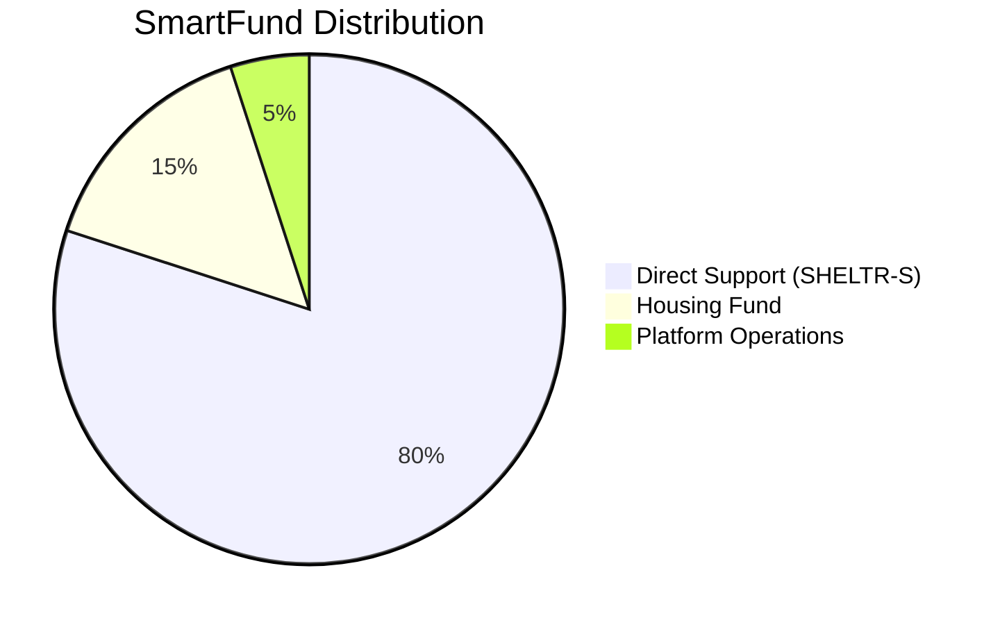
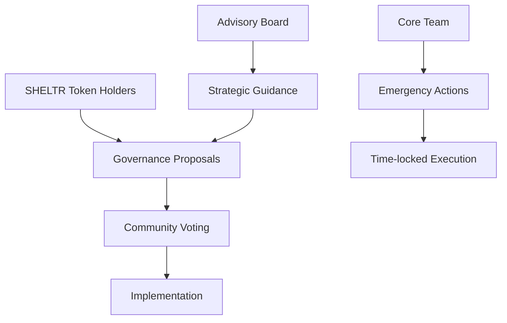

# 🪙 SHELTR Tokenomics: Dual-Token Architecture
*Version: 2.0.0 - August 2025*
*Status: Pre-ICO Launch* 🚀

## 🎯 **Q4 2025 TOKEN LAUNCH TIMELINE**

### **September 2025: Pre-Sale (Seed Round)**
- **Private Sale**: Accredited investors and strategic partners
- **Doug K. (CFO) Led**: 20+ years payments expertise driving institutional adoption
- **Target Raise**: Initial funding for public beta scaling
- **Token Allocation**: Early investor pricing with vesting schedule

### **December 2025: Public ICO Launch** 💎
- **Public Token Sale**: SHELTR utility token available to all
- **Exchange Listings**: Major DEX/CEX partnerships for immediate liquidity  
- **Mainnet Deployment**: Production smart contracts on Base network
- **DAO Activation**: Community governance and voting rights begin

## Abstract

SHELTR implements a revolutionary dual-token architecture that balances participant protection with community engagement. Our system combines **SHELTR-S** (stable utility token) with **SHELTR** (community governance token) to create a sustainable ecosystem that maximizes impact while protecting the vulnerable.

Built on Base network with Visa MCP integration, our tokenomics ensure 80% of all donations reach participants as stable value, 15% funds long-term housing solutions, and 5% supports platform operations - all verified on-chain for complete transparency.

---

## 🎯 Token Overview

### SHELTR-S (Stable Utility Token)
**Primary token for participants and essential transactions**

| Property | Value |
|----------|-------|
| **Symbol** | SHELTR-S |
| **Type** | USD-Pegged Stablecoin |
| **Backing** | USDC Reserve Pool |
| **Network** | Base (Coinbase L2) |
| **Standard** | ERC-20 |
| **Price** | $1.00 USD (Always Stable) |
| **Purpose** | Daily transactions, essential needs, Homeless Depot purchases |
| **Target Users** | Participants, Merchants, Basic transactions |

### SHELTR (Community Governance Token)
**Growth token for community engagement and platform governance**

| Property | Value |
|----------|-------|
| **Symbol** | SHELTR |
| **Type** | Utility + Governance Token |
| **Mechanism** | Deflationary with Staking Rewards |
| **Network** | Base (Coinbase L2) |
| **Standard** | ERC-20 |
| **Price** | Market-driven with growth potential |
| **Purpose** | Governance, staking, premium features, community rewards |
| **Target Users** | Donors, Organizations, Community members |

---

## 💰 SmartFund™ Distribution Model

### Automatic Allocation on Every Donation



### 1. Direct Participant Support (80%)
- **Immediate conversion** to SHELTR-S tokens
- **Zero volatility risk** for essential needs
- **Direct access** through QR codes and wallets
- **Use cases**: Food, clothing, transportation, healthcare, emergency expenses

### 2. Housing Fund Initiative (15%)
- **Smart contract governed** long-term investment
- **DeFi yield strategies** for fund growth
- **Transparent allocation** to housing programs:
  - Emergency housing (40%)
  - Transitional programs (35%)
  - Permanent solutions (20%)
  - Support services (5%)

### 3. Platform Operations (5%)
- **Sustainable development** funding
- **Revenue streams**:
  - Technical development and security
  - Community support and outreach
  - Platform scaling and infrastructure
  - Legal and regulatory compliance

---

## 🏗️ Technical Architecture

### Base Network Integration

```typescript
interface TechnicalSpecs {
  network: {
    name: 'Base (Coinbase L2)',
    chainId: 8453,
    blockTime: '~2 seconds',
    fees: '~$0.01 USD',
    finality: 'Instant'
  },
  standards: {
    tokens: 'ERC-20',
    governance: 'OpenZeppelin Governor',
    multisig: 'Gnosis Safe',
    oracles: 'Chainlink Price Feeds'
  },
  integration: {
    fiatOnRamp: 'Coinbase Connect',
    payments: 'Visa MCP Agent',
    defi: 'Aave, Compound Protocol',
    nft: 'ERC-721 (Future: Achievement NFTs)'
  }
}
```

### Smart Contract Architecture

```solidity
// Core distribution contract
contract SHELTRSmartFund {
    // Token contracts
    IERC20 public sheltrStable;   // SHELTR-S
    IERC20 public sheltrCommunity; // SHELTR
    
    // Distribution constants
    uint256 public constant DIRECT_SUPPORT = 80;
    uint256 public constant HOUSING_FUND = 15;
    uint256 public constant OPERATIONS = 5;
    
    // Core distribution function
    function processDonation(
        uint256 amount,
        address participant,
        address donor
    ) external returns (bool) {
        uint256 directSupport = (amount * DIRECT_SUPPORT) / 100;
        uint256 housingContribution = (amount * HOUSING_FUND) / 100;
        uint256 operationsFee = (amount * OPERATIONS) / 100;
        
        // Mint stable tokens for participant
        sheltrStable.mint(participant, directSupport);
        
        // Allocate to housing fund
        housingFund.deposit(housingContribution);
        
        // Platform operations
        treasury.deposit(operationsFee);
        
        emit DonationProcessed(
            donor, 
            participant, 
            amount, 
            directSupport, 
            housingContribution
        );
        
        return true;
    }
}
```

---

## 🔄 Token Conversion & Utility

### SHELTR-S Utility
- **Primary payment method** in Homeless Depot marketplace
- **Emergency fund access** 24/7 through partner locations
- **No transaction fees** for participants
- **Instant conversion** from donations
- **Stable value preservation** for essential purchases
- **Welcome bonus**: 100 SHELTR-S tokens ($100 value) for every new participant signup

### SHELTR Utility
- **Governance voting** on platform decisions
- **Staking rewards** from platform revenue
- **Premium marketplace features** and discounts
- **Community recognition** and achievement NFTs
- **Optional participation** for participants who choose growth exposure

### Conversion Mechanisms
```typescript
interface ConversionSystem {
  sheltrSToSheltr: {
    availability: 'Optional for participants',
    rate: 'Current market price',
    minimumAmount: '10 SHELTR-S',
    purpose: 'Enable upside participation'
  },
  sheltrToSheltrS: {
    availability: 'Always available',
    rate: 'Current market price',
    minimumAmount: '1 SHELTR',
    purpose: 'Convert to stable value'
  },
  emergencyConversion: {
    priority: 'Participants first',
    fees: 'Zero for participants',
    speed: 'Instant execution'
  }
}
```

---

## 📊 Economic Model & Sustainability

### Revenue Streams (Platform Sustainability)

1. **Marketplace Transaction Fees** (2-3%)
   - Applied to Homeless Depot purchases
   - Exempt for participants using SHELTR-S
   - Premium features for SHELTR holders

2. **SHELTR Token Appreciation**
   - Deflationary mechanism through buybacks
   - Staking rewards from platform revenue
   - Governance participation incentives

3. **Organization Premium Features**
   - Advanced analytics and reporting
   - Custom branding and white-label solutions
   - Priority support and onboarding

4. **Corporate Partnership Fees**
   - Enterprise integrations
   - Custom deployment and support
   - Revenue sharing agreements

5. **DeFi Yield Generation**
   - Housing fund investment returns
   - Conservative yield strategies (4-8% APY)
   - Risk-managed portfolio allocation

### Participant Protection Mechanisms

- **Guaranteed Stability**: SHELTR-S always equals $1.00 USD
- **Zero Transaction Fees**: No costs for essential services
- **Emergency Access**: 24/7 fund availability
- **Optional Participation**: Choice to engage with SHELTR token
- **Privacy Protection**: Anonymized on-chain transactions

---

## 🌟 Sample Transaction Examples

### Example 1: New Participant Onboarding
```
Input: New participant signup and verification

Welcome Package:
├── 100 SHELTR-S tokens ($100 stable value)
├── Digital wallet creation
├── QR code generation for donations
└── Access to Homeless Depot marketplace

Funding Source:
├── Platform development budget allocation
├── Sustainable onboarding program
└── Community growth investment
```

### Example 2: $100 Donation Processing
```
Input: $100 USD donation via QR code

Distribution:
├── $80.00 → 80 SHELTR-S tokens (to participant wallet)
├── $15.00 → Housing Fund (smart contract allocation)
└── $5.00 → Platform Operations (sustainable development)

Blockchain Records:
├── Transaction Hash: 0xa1b2c3d4e5f6789...
├── Gas Fee: $0.008 USD
├── Confirmation Time: ~2 seconds
└── Block Number: 8,234,567
```

### Example 3: Homeless Depot Purchase
```
Input: 25 SHELTR-S tokens for food kit

Transaction:
├── Participant pays: 25 SHELTR-S
├── Merchant receives: $25.00 USD equivalent
├── Platform fee: $0.00 (participant exempt)
└── Transaction verified on Base network

Impact:
├── Essential needs met immediately
├── Zero erosion of purchasing power
└── Dignified transaction experience
```

### Example 4: Community Governance
```
Input: 1,000 SHELTR tokens staked for governance

Benefits:
├── Voting power: 1,000 votes on platform decisions
├── Staking rewards: 8% APY in SHELTR tokens
├── Premium features: Enhanced marketplace access
└── Community recognition: Achievement NFT

Governance Topics:
├── Housing fund allocation strategies
├── New marketplace partner approvals
├── Platform feature development priorities
└── Community support program expansions
```

---

## 🚀 Implementation Roadmap

### Phase 1: Stable Foundation (Q1 2025) ✅
- [x] SHELTR-S deployment on Base network
- [x] USD-pegging mechanism via USDC reserves
- [x] Basic donation → stable token flow
- [x] SmartFund distribution contract
- [x] Homeless Depot marketplace integration

### Phase 2: Community Layer (Q2 2025) 🟡
- [ ] SHELTR governance token launch
- [ ] Staking and rewards mechanism
- [ ] Participant opt-in conversion system
- [ ] Community governance portal
- [ ] Enhanced analytics dashboard

### Phase 3: Advanced Features (Q3 2025) 🔵
- [ ] Cross-chain bridge capabilities
- [ ] Advanced DeFi strategies for housing fund
- [ ] Achievement NFT system
- [ ] Corporate partnership portal
- [ ] Mobile app with full token integration

### Phase 4: Global Scaling (Q4 2025) 🔵
- [ ] Multi-region deployment
- [ ] Additional stable token currencies
- [ ] Enhanced governance mechanisms
- [ ] Institutional investor access
- [ ] International regulatory compliance

---

## 📈 Growth Projections & KPIs

### 2025 Targets

| Metric | Q1 Target | Q2 Target | Q3 Target | Q4 Target |
|--------|-----------|-----------|-----------|-----------|
| **Active Participants** | 100 | 500 | 2,500 | 10,000 |
| **SHELTR-S Circulation** | $50K | $200K | $500K | $1M |
| **Housing Fund** | $7.5K | $30K | $75K | $150K |
| **Platform Revenue** | $2.5K | $10K | $25K | $50K |
| **SHELTR Market Cap** | $100K | $500K | $1M | $2M |

### Success Metrics
- **Participant Stability Rate**: 99.9% (SHELTR-S maintains $1.00)
- **Housing Placement Success**: 75% within 6 months
- **Platform Uptime**: 99.9%
- **Community Engagement**: 50% of donors hold SHELTR tokens
- **Transaction Speed**: < 2 seconds average confirmation

---

## 🔒 Security & Compliance

### Smart Contract Security
- **OpenZeppelin standards** for all token contracts
- **Multi-signature treasury** management (3-of-5)
- **Time-locked upgrades** with community governance
- **Regular security audits** by leading firms
- **Bug bounty program** with responsible disclosure

### Regulatory Compliance
- **CFTC compliance** for commodity token classification
- **SEC guidance** adherence for utility tokens
- **Anti-money laundering** (AML) compliance
- **Know Your Customer** (KYC) for high-value transactions
- **Data protection** under GDPR and CCPA

### Participant Privacy
- **Anonymized transactions** on public blockchain
- **Zero-knowledge proofs** for sensitive data
- **Pseudonymous addresses** for participant protection
- **Opt-in analytics** with granular permissions
- **Right to be forgotten** compliance

---

## 🤝 Community Governance

### Governance Structure


### Voting Mechanisms
- **1 SHELTR = 1 Vote** for standard proposals
- **Quadratic voting** for community fund allocation
- **Delegation** available for inactive holders
- **Minimum threshold**: 1% of total supply for proposal creation
- **Quorum requirement**: 10% participation for passage

### Governance Topics
- Housing fund investment strategies
- New marketplace partner approvals
- Platform fee adjustments
- Feature development priorities
- Emergency protocol updates

---

## 🌍 Environmental & Social Impact

### Environmental Considerations
- **Carbon-neutral operations** through Base network efficiency
- **Proof-of-stake consensus** minimizing energy consumption
- **Offset programs** for any residual carbon footprint
- **Green hosting** for all platform infrastructure

### Social Impact Goals
- **Housing First approach** in fund allocation
- **Dignified user experience** for all participants
- **Financial inclusion** through accessible technology
- **Community empowerment** via governance participation
- **Measurable outcomes** with transparent reporting

---

## 📚 Additional Resources

### Documentation
- [Technical Integration Guide](../technical/integration-guide.md)
- [Smart Contract Documentation](../technical/smart-contracts.md)
- [API Reference](../api/README.md)
- [Security Audit Reports](../security/audit-reports.md)

### Community
- [Discord Community](https://discord.gg/sheltr)
- [GitHub Repository](https://github.com/sheltr-ai/platform)
- [Twitter Updates](https://twitter.com/sheltr_ai)
- [Community Forum](https://community.sheltr.ai)

### Legal
- [Terms of Service](../legal/terms-of-service.md)
- [Privacy Policy](../legal/privacy-policy.md)
- [Token Sale Agreement](../legal/token-sale.md)
- [Regulatory Compliance](../legal/compliance.md)

---

## Conclusion

The SHELTR dual-token architecture represents a breakthrough in charitable technology, combining the stability needed to protect vulnerable populations with the growth mechanisms required for sustainable platform development. By ensuring 80% of donations reach participants as stable value while building a community-governed ecosystem, we're creating lasting change that honors both dignity and innovation.

Our commitment to transparency, security, and community governance ensures that SHELTR will continue evolving to serve those who need it most while building a sustainable foundation for the future of charitable giving.

---

*Built with ❤️ in memory of Gunnar Blaze*
*"Loyalty, Protection, and Unconditional Care" - The SHELTR Values*

---
*Last Updated: January 22, 2025*
*Version: 1.0.0*
*Status: IMPLEMENTED* ✅ 