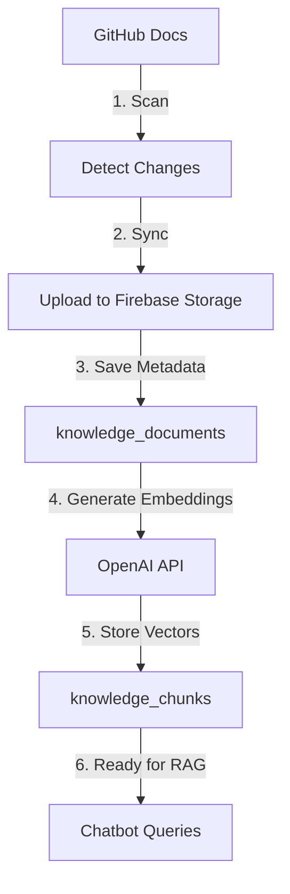
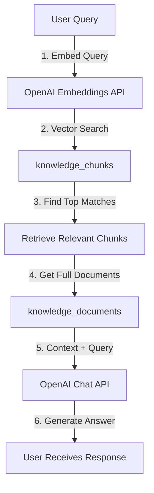

# Knowledge Base Firestore Collections - Architecture Explanation

**Created:** October 15, 2025  
**Status:** ✅ Production Ready  
**Related Issue:** Knowledge base sync not detecting files after clear

---

## 📊 **FIRESTORE STRUCTURE**

The SHELTR knowledge base uses **TWO** Firestore collections:

### 1️⃣ **`knowledge_documents`**
**Purpose:** Store document metadata and content

**Schema:**
```typescript
{
  id: string,                    // Auto-generated document ID
  title: string,                 // Document title (e.g., "README.md")
  content: string,               // Full document text content
  file_path: string,             // Firebase Storage path (e.g., "knowledge_base/docs/README.md")
  source: string,                // "github", "upload", "manual"
  category: string,              // "documentation", "guide", etc.
  tags: string[],                // ["setup", "api", "backend"]
  created_at: timestamp,         // When document was added
  updated_at: timestamp,         // Last modification
  version: string,               // Document version (e.g., "1.0.0")
  author: string,                // Document author
  public: boolean,               // Whether accessible to public chatbot
  authenticated_only: boolean    // Whether requires authentication
}
```

**Example:**
```json
{
  "id": "abc123",
  "title": "README.md",
  "content": "# SHELTR-AI Platform\n\nWelcome to...",
  "file_path": "knowledge_base/docs/01-overview/README.md",
  "source": "github",
  "category": "documentation",
  "tags": ["overview", "getting-started"],
  "created_at": "2025-10-15T20:30:00Z",
  "updated_at": "2025-10-15T20:30:00Z",
  "version": "1.0.0",
  "public": true,
  "authenticated_only": false
}
```

---

### 2️⃣ **`knowledge_chunks`**
**Purpose:** Store OpenAI embeddings for RAG (Retrieval-Augmented Generation)

**Schema:**
```typescript
{
  id: string,                    // Auto-generated chunk ID
  document_id: string,           // Reference to parent knowledge_document
  chunk_index: number,           // Position in document (0, 1, 2...)
  content: string,               // Chunk text content (~500-1000 chars)
  embedding: number[],           // OpenAI embedding vector (1536 dimensions)
  token_count: number,           // Number of tokens in chunk
  metadata: {
    file_path: string,           // Source file path
    title: string,               // Document title
    category: string,            // Document category
    section: string              // Section within document
  },
  created_at: timestamp          // When embedding was generated
}
```

**Example:**
```json
{
  "id": "chunk_xyz",
  "document_id": "abc123",
  "chunk_index": 0,
  "content": "# SHELTR-AI Platform\n\nWelcome to SHELTR-AI...",
  "embedding": [0.023, -0.015, 0.042, ...], // 1536 float values
  "token_count": 128,
  "metadata": {
    "file_path": "knowledge_base/docs/01-overview/README.md",
    "title": "README.md",
    "category": "documentation",
    "section": "Introduction"
  },
  "created_at": "2025-10-15T20:30:05Z"
}
```

---

## 🔄 **HOW THE SYSTEM WORKS**

### **Sync Flow:**



### **Query Flow:**



---

## 🧹 **CLEAR KB OPERATION**

When you click **"Clear KB"**, the system deletes:

1. ✅ **Firebase Storage files** (`knowledge_base/docs/...`)
2. ✅ **`knowledge_documents` collection** (metadata)
3. ✅ **`knowledge_chunks` collection** (embeddings) ← **Fixed in v2.53.0**

**Before Fix (v2.52.0):**
- ❌ Only deleted `knowledge_documents`
- ❌ Left orphaned chunks in `knowledge_chunks`
- ❌ Caused sync issues

**After Fix (v2.53.0):**
- ✅ Deletes both collections
- ✅ Clean slate for fresh sync
- ✅ No orphaned data

---

## 💾 **STORAGE LOCATIONS**

| Data Type | Storage Location | Purpose |
|-----------|-----------------|---------|
| **Full Document Files** | Firebase Storage (`knowledge_base/docs/`) | Original files |
| **Document Metadata** | Firestore `knowledge_documents` | Searchable metadata |
| **Embeddings** | Firestore `knowledge_chunks` | AI semantic search |

---

## 📐 **CHUNKING STRATEGY**

Documents are split into chunks for embeddings:

- **Chunk Size:** 500-1000 characters
- **Overlap:** 100 characters (prevents context loss)
- **Max Tokens:** 256 per chunk
- **Embedding Model:** OpenAI `text-embedding-ada-002` (1536 dimensions)

**Why Chunking?**
- ✅ Better semantic search accuracy
- ✅ Fits within OpenAI token limits
- ✅ Faster query performance
- ✅ More precise context retrieval

---

## 🔍 **RELATED FILES**

- **Backend Service:** `apps/api/services/knowledge_dashboard_service.py`
- **Embeddings:** `apps/api/services/embeddings_service.py`
- **GitHub Sync:** `apps/api/services/github_service.py`
- **Clear Endpoint:** `apps/api/routers/knowledge_dashboard.py` (line 366-429)
- **Frontend UI:** `apps/web/src/components/knowledge/GitHubSyncPanel.tsx`

---

## 📊 **TYPICAL NUMBERS**

For SHELTR-AI production (105 documents):

- **`knowledge_documents`:** ~105 docs
- **`knowledge_chunks`:** ~500-1000 chunks (5-10 per doc average)
- **Storage Used:** ~10-20 MB (Firebase Storage)
- **Embedding Cost:** ~$0.05 per full sync

---

## ✅ **SUCCESS CRITERIA**

After sync, you should see:

```bash
Production Firestore:
- knowledge_documents: 105 documents
- knowledge_chunks: ~500-1000 chunks

Production Storage:
- knowledge_base/docs/01-overview/...
- knowledge_base/docs/02-architecture/...
- etc.
```

---

## 🚨 **TROUBLESHOOTING**

### **Issue: Scan shows 0 files after clear**
**Cause:** Backend not deployed with GitHub token  
**Fix:** Deploy backend with `GITHUB_TOKEN` env var

### **Issue: Chunks not deleted after clear**
**Cause:** Old clear function didn't delete chunks  
**Fix:** Update to v2.53.0+ (includes chunk deletion)

### **Issue: Sync shows "91 Deleted" in production**
**Cause:** Stale data from previous sync  
**Fix:** Clear KB → Scan → Sync fresh

---

## 🎯 **ANSWER TO YOUR QUESTION**

> "Are knowledge_chunks supposed to be there?"

**YES! ✅ `knowledge_chunks` is REQUIRED.**

- **`knowledge_documents`** = Document metadata + content
- **`knowledge_chunks`** = AI embeddings for semantic search

**Both collections must exist for the chatbot to work.**

When you cleared the KB, the old function only deleted `knowledge_documents`, leaving orphaned chunks. The fix now deletes both, ensuring a clean slate for fresh sync.

---

## 📝 **CHANGELOG**

- **v2.53.0** (Oct 15, 2025): Fixed Clear KB to delete `knowledge_chunks`
- **v2.52.0** (Oct 15, 2025): Added Clear KB feature (incomplete)
- **v2.51.0** (Oct 15, 2025): GitHub sync feature added

---

**Next Step:** Click **"Sync 105 Files"** in production to populate both collections! 🚀

