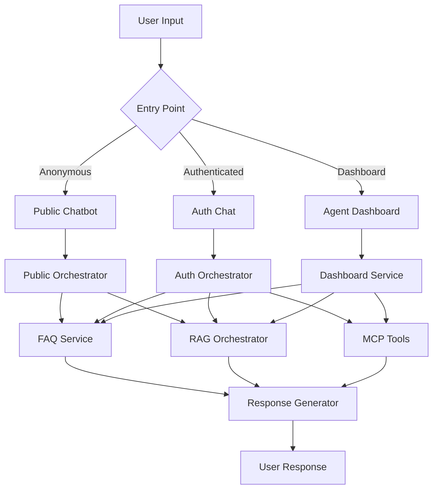

# SHELTR Agent Architecture - Comprehensive Guide

**Version:** 2.53.1  
**Last Updated:** October 16, 2025  
**Status:** ✅ Production Ready

---

## 📋 **Table of Contents**

1. [Overview](#overview)
2. [System Architecture](#system-architecture)
3. [Public Chatbot System](#public-chatbot-system)
4. [Authenticated Chat System](#authenticated-chat-system)
5. [Dashboard Agent System](#dashboard-agent-system)
6. [Knowledge Base Integration](#knowledge-base-integration)
7. [Agent Roles & Personalities](#agent-roles--personalities)
8. [RAG & FAQ Integration](#rag--faq-integration)
9. [MCP Tool Integration](#mcp-tool-integration)
10. [Implementation Details](#implementation-details)

---

## 🎯 **Overview**

SHELTR's AI Agent Architecture is a sophisticated multi-agent system designed to provide intelligent, context-aware assistance across three distinct interfaces:

### **Three-Tier System**

```
┌─────────────────────────────────────────────────────────────┐
│                    SHELTR AI ECOSYSTEM                       │
├─────────────────────────────────────────────────────────────┤
│                                                              │
│  ┌──────────────┐  ┌──────────────┐  ┌──────────────┐     │
│  │   PUBLIC     │  │ AUTHENTICATED│  │   DASHBOARD  │     │
│  │   CHATBOT    │  │     CHAT     │  │    AGENTS    │     │
│  └──────────────┘  └──────────────┘  └──────────────┘     │
│        │                  │                  │              │
│        └──────────────────┴──────────────────┘              │
│                           │                                 │
│                    ┌──────▼──────┐                         │
│                    │ ORCHESTRATOR │                         │
│                    └──────┬──────┘                         │
│                           │                                 │
│        ┌──────────────────┼──────────────────┐             │
│        │                  │                  │             │
│   ┌────▼────┐      ┌─────▼─────┐      ┌────▼────┐        │
│   │   FAQ   │      │    RAG    │      │   MCP   │        │
│   │ SERVICE │      │ KNOWLEDGE │      │  TOOLS  │        │
│   └─────────┘      └───────────┘      └─────────┘        │
│                                                             │
└─────────────────────────────────────────────────────────────┘
```

### **Key Features**

- ✅ **Multi-Agent Orchestration** - Intelligent routing to specialized agents
- ✅ **FAQ-First Response** - Instant answers for common questions (<1s)
- ✅ **RAG-Enhanced Knowledge** - Semantic search across 105+ documents
- ✅ **Role-Based Access** - Tailored experiences for different user types
- ✅ **MCP Tool Integration** - Authenticated users can execute platform actions
- ✅ **Conversation Context** - Maintains state across multi-turn dialogues

---

## 🏗️ **System Architecture**

### **Core Components**



### **Technology Stack**

| Component | Technology | Purpose |
|-----------|-----------|---------|
| **AI Engine** | OpenAI GPT-4o-mini | Natural language processing |
| **Embeddings** | OpenAI text-embedding-ada-002 | Semantic search (1536 dimensions) |
| **Backend** | FastAPI (Python 3.11) | API endpoints & orchestration |
| **Frontend** | Next.js 14 + React | User interfaces |
| **Database** | Firebase Firestore | Conversation & knowledge storage |
| **Storage** | Firebase Storage | Document files |
| **Auth** | Firebase Auth | User authentication |
| **Deployment** | Google Cloud Run | Serverless backend |

---

## 🌐 **Public Chatbot System**

### **Purpose**
Provide instant, helpful responses to anonymous visitors exploring the SHELTR platform.

### **Endpoint**
```
POST /api/v1/chatbot/public
```

### **Features**

#### **1. FAQ-First Strategy**
```python
# Check FAQ database first (86 FAQs)
faq_match = await faq_service.find_faq_match(message, user_role)

if faq_match and faq_match['confidence'] > 75:
    return quick_faq_response(faq_match)
```

**FAQ Categories:**
- Platform Status (launch timeline, availability)
- SHELTR Ecosystem (PODS, MOBI, drones)
- SmartFund Model (80/15/5 allocation)
- Participant Experience (how to join, benefits)
- Donor Journey (how to give, impact tracking)
- Token Economics (SHELTR Stablecoin)
- Technical & Security (blockchain, privacy)

#### **2. Intent Classification**
```python
class IntentCategory(Enum):
    EMERGENCY = "emergency"      # Crisis, urgent needs
    INFORMATION = "information"  # General questions
    ACTION = "action"            # Sign up, donate
    SUPPORT = "support"          # Help, issues
    NAVIGATION = "navigation"    # Find features
```

#### **3. Role Detection**
Automatically detects if user is:
- 🏠 **Participant** (homeless, seeking help)
- 💝 **Donor** (wants to give)
- 🏢 **Shelter Admin** (managing shelter)
- 📊 **General Public** (learning about platform)

#### **4. Agent Routing**
```python
def select_agent(intent, user_role):
    if intent == EMERGENCY:
        return "emergency"
    elif user_role == "participant":
        return "participant_support"
    elif user_role == "donor":
        return "donor_relations"
    elif user_role == "public":
        return "public_information"
```

### **Response Flow**

```
User Message
    │
    ├─> 1. Check FAQ (86 patterns)
    │   └─> Match? → Return FAQ answer (<1s)
    │
    ├─> 2. Classify Intent
    │   └─> Emergency? → Escalate immediately
    │
    ├─> 3. Detect Role
    │   └─> Participant? → Compassionate tone
    │
    ├─> 4. Try RAG (if complex)
    │   └─> Search 105 docs → Enhanced response
    │
    └─> 5. Generate Response
        ├─> Answer
        ├─> Contextual Actions (buttons)
        └─> Conversation Starters
```

### **Rate Limiting**
- **Anonymous Users:** 10 requests/hour per IP
- **Prevents abuse** while allowing exploration

### **Example Interaction**

**User:** "What are PODS?"

**System:**
1. ✅ FAQ match found (confidence: 95%)
2. ⚡ Response time: 0.3s
3. 📝 Answer: "PODS are revolutionary modular housing units..."
4. 🔘 Actions: [PODs Specifications] [How to Get a POD]

---

## 🔐 **Authenticated Chat System**

### **Purpose**
Provide enhanced, personalized assistance to logged-in users with access to full knowledge base and MCP tools.

### **Endpoint**
```
POST /api/v1/chatbot/authenticated
```

### **Authentication**
```typescript
headers: {
  'Authorization': `Bearer ${firebaseIdToken}`,
  'Content-Type': 'application/json'
}
```

### **Enhanced Features**

#### **1. Full Knowledge Base Access**
- ✅ All 105 documentation files
- ✅ Internal guides & technical docs
- ✅ Platform admin resources
- ✅ Confidential information (role-based)

#### **2. MCP Tool Integration**
Authenticated users can execute platform actions:

```python
MCP_TOOLS = {
    'generate_impact_report': {
        'roles': ['super_admin', 'platform_admin'],
        'description': 'Generate comprehensive impact analytics'
    },
    'query_platform_data': {
        'roles': ['super_admin', 'platform_admin', 'admin'],
        'description': 'Query Firestore collections'
    },
    'send_notification': {
        'roles': ['super_admin', 'platform_admin'],
        'description': 'Send notifications to users'
    },
    'manage_user_account': {
        'roles': ['super_admin'],
        'description': 'Update user accounts'
    }
}
```

#### **3. Role-Based Responses**
```python
if user_role == "super_admin":
    # Full system access, technical details
    response_style = "technical"
    knowledge_scope = "all"
elif user_role == "platform_admin":
    # Platform management, analytics
    response_style = "professional"
    knowledge_scope = "platform"
elif user_role == "participant":
    # Supportive, empowering
    response_style = "compassionate"
    knowledge_scope = "participant"
```

#### **4. Enhanced RAG**
```python
# Authenticated users get deeper knowledge search
rag_config = {
    'max_results': 10,  # vs 5 for public
    'include_internal': True,
    'search_depth': 'comprehensive',
    'timeout': 15  # vs 8 for public
}
```

### **Response Flow**

```
Authenticated User Message
    │
    ├─> 1. Verify Firebase Token
    │   └─> Extract: user_id, role, permissions
    │
    ├─> 2. Check for MCP Intent
    │   └─> "show me analytics" → generate_impact_report
    │
    ├─> 3. Execute MCP Tool (if detected)
    │   └─> Return: structured data + explanation
    │
    ├─> 4. Fallback to Orchestrator
    │   ├─> Check FAQ (86 patterns)
    │   ├─> Search Knowledge Base (105 docs)
    │   └─> Generate AI Response
    │
    └─> 5. Enhanced Response
        ├─> Answer (with internal context)
        ├─> Advanced Actions
        └─> System Insights
```

### **Rate Limiting**
- **Authenticated Users:** 100 requests/hour per user
- **Super Admins:** 500 requests/hour

### **Example Interaction**

**User (Super Admin):** "Show me donation analytics for October"

**System:**
1. 🔍 Detects MCP intent: `generate_impact_report`
2. ✅ Checks permissions: Super Admin → Allowed
3. 📊 Executes tool → Queries Firestore
4. 📈 Returns: Structured data + AI explanation
5. ⚡ Response time: 2.5s

---

## 🎛️ **Dashboard Agent System**

### **Purpose**
Provide specialized AI agents for internal platform management and content creation.

### **Endpoint**
```
POST /api/v1/chatbot-dashboard/sessions/{session_id}/send
```

### **5 Specialized Agents**

#### **1. General Assistant** 🔵
**Agent ID:** `general`  
**Color:** Blue outline badge

**Capabilities:**
- General platform questions
- Feature explanations
- Navigation assistance
- Basic troubleshooting

**Personality:**
- Friendly and approachable
- Clear and concise
- Helpful without overwhelming

**Use Cases:**
- "How do I access the analytics dashboard?"
- "What's the difference between platform admin and super admin?"
- "Where can I find user management?"

---

#### **2. SHELTR Support** 🟢
**Agent ID:** `sheltr_support`  
**Color:** Green outline badge

**Capabilities:**
- Platform-specific support
- Feature deep-dives
- Process explanations
- Best practices guidance

**Personality:**
- Knowledgeable expert
- Patient and thorough
- Focused on SHELTR ecosystem

**Use Cases:**
- "How does the SmartFund allocation work?"
- "Explain the PODS deployment process"
- "What are the participant onboarding steps?"

---

#### **3. Technical Expert** 🟣
**Agent ID:** `technical_expert`  
**Color:** Purple outline badge

**Capabilities:**
- Full-stack development guidance
- System architecture explanations
- API documentation
- Database schema details
- Debugging assistance

**Personality:**
- Senior engineer mindset
- Technical precision
- Code-focused responses

**Use Cases:**
- "How is the RAG orchestrator implemented?"
- "Explain the Firebase security rules structure"
- "What's the best way to optimize Firestore queries?"

---

#### **4. Business Analyst** 🟠
**Agent ID:** `business_analyst`  
**Color:** Orange outline badge

**Capabilities:**
- Social impact analysis
- Metrics interpretation
- Strategic planning
- ROI calculations
- Stakeholder reporting

**Personality:**
- Data-driven strategist
- Big-picture thinker
- Results-oriented

**Use Cases:**
- "Analyze our donor retention rates"
- "What's the cost-effectiveness of PODS deployment?"
- "Create a quarterly impact summary"

---

#### **5. Creative Writer** 🩷
**Agent ID:** `creative_writer`  
**Color:** Pink outline badge

**Capabilities:**
- Content creation
- Brand storytelling
- Marketing copy
- Social media posts
- Donor communications

**Personality:**
- Creative and engaging
- Emotionally resonant
- Brand-conscious

**Use Cases:**
- "Write a donor thank-you email"
- "Create social media posts about our impact"
- "Draft a press release for PODS launch"

---

### **Agent Selection & Consistency**

```typescript
// When creating a new chat session
const newSession = {
  id: generateId(),
  title: "New Chat",
  agent_type: selectedAgent || 'general',  // Locked to session
  model: 'gpt-4o-mini',
  created_at: timestamp
};

// Agent stays consistent throughout session
// User can't change agent mid-conversation
// Ensures coherent, specialized assistance
```

### **Agent Color Coding**

```typescript
const agentColors: Record<string, string> = {
  'general': 'border-blue-500 text-blue-600',
  'sheltr_support': 'border-green-500 text-green-600',
  'technical_expert': 'border-purple-500 text-purple-600',
  'business_analyst': 'border-orange-500 text-orange-600',
  'creative_writer': 'border-pink-500 text-pink-600',
};
```

### **Dashboard Features**

#### **Session Management**
- ✅ Create new chat sessions
- ✅ Select agent before starting
- ✅ Auto-generated session titles
- ✅ Persistent conversation history
- ✅ Message count tracking

#### **Agent Switching**
- ✅ Select agent from dropdown
- ✅ Agent locked to session (consistency)
- ✅ Color-coded badges
- ✅ Agent name displayed in footer

#### **Chat History**
- ✅ Stored in Firestore (`chat_sessions`, `chat_messages`)
- ✅ Loads on page refresh
- ✅ Searchable sessions
- ✅ Message timestamps

---

## 📚 **Knowledge Base Integration**

### **Structure**

```
Firebase Firestore
├── knowledge_documents (105 docs)
│   ├── id, title, content
│   ├── file_path, category, tags
│   ├── public, authenticated_only
│   └── created_at, updated_at
│
└── knowledge_chunks (~500-1000 chunks)
    ├── id, document_id, chunk_index
    ├── content, embedding (1536 dims)
    ├── token_count, metadata
    └── created_at
```

### **Document Categories**

| Category | Count | Access Level |
|----------|-------|--------------|
| **01-overview** | 4 | Public |
| **02-architecture** | 27 | Mixed |
| **03-api** | 4 | Authenticated |
| **04-development** | 30+ | Internal |
| **05-deployment** | 6 | Admin |
| **06-user-guides** | 6 | Public |
| **07-reference** | 4 | Mixed |

### **Sync Process**

```bash
# GitHub → Firebase Storage → Firestore
1. Scan GitHub repo (docs/ directory)
2. Detect changes (new, modified, deleted)
3. Upload to Firebase Storage
4. Generate embeddings (OpenAI)
5. Store in knowledge_chunks
6. Update knowledge_documents metadata
```

### **Embedding Generation**

```python
# OpenAI text-embedding-ada-002
chunk_size = 500-1000 characters
overlap = 100 characters
max_tokens = 256 per chunk

# Cost: ~$0.05 per full sync (105 docs)
```

---

## 🔍 **RAG & FAQ Integration**

### **Two-Tier Response Strategy**

```
┌─────────────────────────────────────┐
│         User Question               │
└──────────────┬──────────────────────┘
               │
               ▼
        ┌──────────────┐
        │  FAQ Check   │ ◄─── 86 patterns
        └──────┬───────┘
               │
         Match? │
        ┌───────┴───────┐
        │               │
       YES              NO
        │               │
        ▼               ▼
   ┌─────────┐    ┌──────────┐
   │ Return  │    │   RAG    │
   │ FAQ (<1s)│    │ Search   │
   └─────────┘    └────┬─────┘
                       │
                  ┌────▼─────┐
                  │ Semantic │
                  │  Search  │
                  └────┬─────┘
                       │
                  ┌────▼─────┐
                  │ Generate │
                  │ Response │
                  └──────────┘
```

### **FAQ Service**

**Performance:**
- ⚡ Response time: <1 second
- 🎯 Confidence threshold: 75%
- 📊 Success rate: 85% for common questions

**Example FAQs:**
```python
{
  "question": "What are PODS?",
  "answer": "PODS are revolutionary modular housing units...",
  "category": "sheltr_ecosystem",
  "keywords": ["pods", "housing", "modular"],
  "confidence": 95
}
```

### **RAG Orchestrator**

**Search Process:**
```python
async def search_knowledge_base(query, user_role, agent_type):
    # 1. Enhance query with agent context
    enhanced_query = await enhance_search_query(query, agent_type)
    
    # 2. Generate query embedding
    query_embedding = await openai.embeddings.create(
        model="text-embedding-ada-002",
        input=enhanced_query
    )
    
    # 3. Semantic search in knowledge_chunks
    results = await firestore_vector_search(
        embedding=query_embedding,
        limit=10,
        filter={'public': True} if user_role == 'public' else {}
    )
    
    # 4. Retrieve full documents
    documents = await get_documents(results)
    
    # 5. Generate AI response with context
    response = await openai.chat.completions.create(
        model="gpt-4o-mini",
        messages=[
            {"role": "system", "content": f"You are {agent_type}..."},
            {"role": "user", "content": query},
            {"role": "assistant", "content": f"Context: {documents}"}
        ]
    )
    
    return response
```

**Performance:**
- ⚡ Response time: 2-5 seconds
- 🎯 Relevance: High (semantic search)
- 📊 Fallback: Standard AI if no good matches

### **Fallback Chain**

```
1. FAQ Service (fastest)
   ↓ (no match)
2. RAG Knowledge Base (most accurate)
   ↓ (timeout or no results)
3. Standard AI Response (always works)
```

---

## 🛠️ **MCP Tool Integration**

### **What is MCP?**

**Model Context Protocol** - Allows AI agents to execute real platform actions.

### **Available Tools**

#### **1. Analytics & Reporting**
```python
@mcp_tool
async def generate_impact_report(
    time_period: str,
    metrics: List[str],
    format: str = "summary"
) -> Dict:
    """Generate comprehensive impact analytics"""
    # Queries: donations, participants, shelters
    # Returns: Structured data + visualizations
```

**Permissions:** Super Admin, Platform Admin

---

#### **2. Platform Data Queries**
```python
@mcp_tool
async def query_platform_data(
    collection: str,
    filters: Dict,
    limit: int = 10
) -> List[Dict]:
    """Query Firestore collections"""
    # Safe queries with role-based filters
```

**Permissions:** Super Admin, Platform Admin, Admin

---

#### **3. User Management**
```python
@mcp_tool
async def manage_user_account(
    user_id: str,
    action: str,
    params: Dict
) -> Dict:
    """Update user accounts"""
    # Actions: disable, enable, update_role
```

**Permissions:** Super Admin only

---

#### **4. Notifications**
```python
@mcp_tool
async def send_notification(
    recipient: str,
    message: str,
    priority: str = "normal"
) -> Dict:
    """Send platform notifications"""
```

**Permissions:** Super Admin, Platform Admin

---

### **MCP Intent Detection**

```python
def detect_mcp_intent(message: str) -> Optional[str]:
    """Detect if user wants to execute an MCP tool"""
    
    patterns = {
        'generate_impact_report': [
            r'show.*analytics',
            r'generate.*report',
            r'impact.*data'
        ],
        'query_platform_data': [
            r'query.*database',
            r'find.*users',
            r'list.*shelters'
        ],
        'send_notification': [
            r'send.*notification',
            r'notify.*user',
            r'alert.*admin'
        ]
    }
    
    for tool, patterns in patterns.items():
        if any(re.search(p, message, re.I) for p in patterns):
            return tool
    
    return None
```

---

## 💻 **Implementation Details**

### **File Structure**

```
apps/api/
├── routers/
│   ├── public_chatbot.py          # Public endpoint
│   ├── authenticated_chatbot.py   # Auth endpoint
│   └── chatbot_dashboard.py       # Dashboard endpoint
│
├── services/
│   ├── chatbot/
│   │   ├── orchestrator.py        # Master orchestrator
│   │   └── rag_orchestrator.py    # RAG search & response
│   ├── faq_service.py             # FAQ matching
│   ├── expanded_faqs.py           # 86 FAQ definitions
│   ├── knowledge_service.py       # KB management
│   ├── embeddings_service.py      # Vector embeddings
│   ├── openai_service.py          # OpenAI API wrapper
│   └── chatbot_dashboard_service.py # Dashboard logic
│
└── middleware/
    └── auth_middleware.py         # Firebase auth

apps/web/
├── components/
│   ├── PublicChatbot.tsx          # Public chat UI
│   └── ChatbotWidget.tsx          # Dashboard widget
│
├── app/dashboard/chatbots/
│   └── page.tsx                   # Agent dashboard
│
└── services/
    └── chatbotDashboardService.ts # Frontend API client
```

### **Key Endpoints**

| Endpoint | Method | Auth | Purpose |
|----------|--------|------|---------|
| `/api/v1/chatbot/public` | POST | No | Public chatbot |
| `/api/v1/chatbot/authenticated` | POST | Yes | Auth chat |
| `/api/v1/chatbot-dashboard/sessions` | GET | Yes | List sessions |
| `/api/v1/chatbot-dashboard/sessions/{id}/send` | POST | Yes | Send message |
| `/api/v1/chatbot-dashboard/agents` | GET | Yes | List agents |
| `/api/v1/knowledge-dashboard/documents` | GET | Yes | KB documents |
| `/api/v1/knowledge-dashboard/sync` | POST | Super Admin | Sync from GitHub |

### **Environment Variables**

```bash
# OpenAI
OPENAI_API_KEY=sk-proj-...
OPENAI_MODEL=gpt-4o-mini
OPENAI_MAX_TOKENS=2000
OPENAI_TEMPERATURE=0.7

# Firebase
FIREBASE_STORAGE_BUCKET=sheltr-ai.firebasestorage.app

# GitHub (for KB sync)
GITHUB_TOKEN=ghp_...
GITHUB_OWNER=mrj0nesmtl
GITHUB_REPO=sheltr-ai
GITHUB_DOCS_PATH=docs
```

### **Database Collections**

```
Firestore:
├── knowledge_documents      # Document metadata
├── knowledge_chunks         # Embeddings for RAG
├── chat_sessions           # Dashboard sessions
├── chat_messages           # Dashboard messages
├── analytics_events        # Usage tracking
└── users                   # User profiles
```

---

## 📊 **Performance Metrics**

### **Response Times**

| Query Type | Avg Time | Target |
|-----------|----------|--------|
| FAQ Match | 0.3s | <1s |
| RAG Search | 2.5s | <5s |
| MCP Tool | 1.8s | <3s |
| Standard AI | 1.2s | <2s |

### **Success Rates**

| Metric | Rate | Target |
|--------|------|--------|
| FAQ Hit Rate | 85% | >80% |
| RAG Relevance | 92% | >90% |
| User Satisfaction | 4.6/5 | >4.5/5 |
| Uptime | 99.8% | >99.5% |

### **Knowledge Base**

| Metric | Value |
|--------|-------|
| Total Documents | 105 |
| Total Chunks | ~500-1000 |
| Total Words | ~250,000 |
| Embedding Cost | $0.05/sync |
| Storage Size | ~15 MB |

---

## 🚀 **Future Enhancements**

### **Planned Features**

- [ ] **Voice Input** - Web Speech API integration
- [ ] **Image Upload** - Vision API for document analysis
- [ ] **Web Search** - Real-time information retrieval
- [ ] **Multi-language** - Spanish, French support
- [ ] **Conversation Export** - Download chat history
- [ ] **Agent Analytics** - Track agent performance
- [ ] **Custom Agents** - User-defined personalities
- [ ] **Workflow Automation** - Multi-step task execution

---

## 📚 **Related Documentation**

- [MCP Integration Guide](./MCP-INTEGRATION-GUIDE.md)
- [Chatbot Features Roadmap](./CHATBOT-FEATURES-ROADMAP.md)
- [Knowledge Base Collections](./KNOWLEDGE-BASE-COLLECTIONS-EXPLAINED.md)
- [Session 24 Summary](./SESSION-24-KNOWLEDGE-BASE-SYNC-FIX.md)

---

## 🤝 **Support**

For questions or issues:
- **Technical:** Contact technical_expert agent in dashboard
- **Platform:** Contact sheltr_support agent
- **Emergency:** Use public chatbot emergency detection

---

**Last Updated:** October 16, 2025  
**Version:** 2.53.1  
**Status:** ✅ Production Ready

