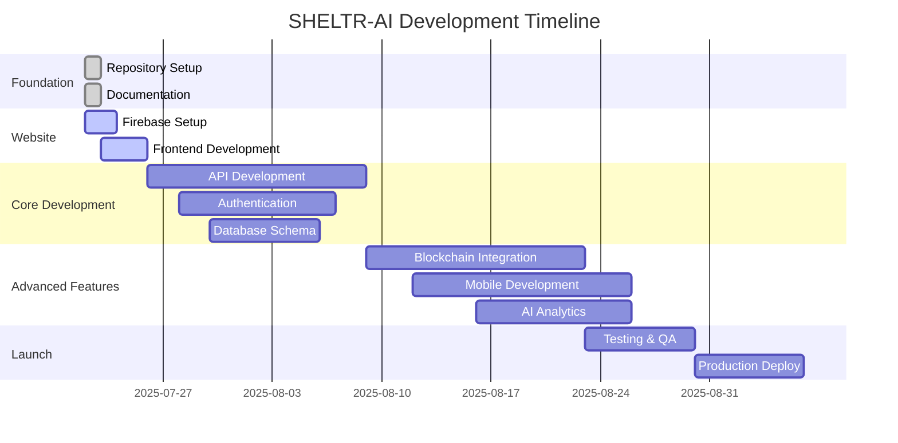
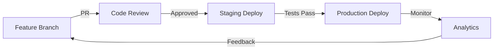

# 🗺️ SHELTR-AI Development Roadmap
## Complete Rebuild Strategy: Legacy to Enterprise Platform

> **Vision**: Transform SHELTR from a prototype to an enterprise-grade SaaS platform  
> **Timeline**: 14 weeks to production launch  
> **Architecture**: Firebase + FastAPI + Next.js 15 + Expo

---

## 📊 Roadmap Overview

### **Phase Overview**
| Phase | Duration | Focus | Deliverables |
|-------|----------|-------|--------------|
| **Foundation** | Week 1 | Repository & Architecture | ✅ Complete |
| **Website Launch** | Week 1-2 | Live Website & Firebase | 🟡 Session 02 |
| **Core Development** | Week 3-6 | API & Authentication | 🔵 Planned |
| **Advanced Features** | Week 7-10 | Blockchain & Mobile | 🔵 Planned |
| **Testing & Polish** | Week 11-12 | QA & Performance | 🔵 Planned |
| **Production Launch** | Week 13-14 | Deployment & Marketing | 🔵 Planned |

### **Success Metrics by Phase**


---

## 🏗️ **Phase 1: Foundation** ✅ **COMPLETE**

### **Week 1: July 22, 2025**
- ✅ **Session 01**: Repository establishment, architecture documentation
- ✅ **Session 02**: Website launch, Firebase integration *(this evening)*

#### **Completed Deliverables**
- [x] GitHub repository: `github.com/mrj0nesmtl/sheltr-ai`
- [x] Monorepo structure with apps/, docs/, packages/
- [x] Python 3.11 + FastAPI backend foundation
- [x] Comprehensive documentation framework
- [x] Legacy content migration strategy
- [x] Cursor IDE development environment
- [x] Gunnar Blaze memorial integration

#### **Session 02 Goals** *(This Evening)*
- [ ] Firebase project configuration
- [ ] Next.js 15 frontend application
- [ ] Core pages: Home, About, Features, Contact
- [ ] Firebase hosting deployment
- [ ] Live website at production URL

---

## 🌐 **Phase 2: Website & Infrastructure** 

### **Week 2: July 23-29, 2025**

#### **Session 03-05: Core Website Development**
- **Authentication System**: Firebase Auth + custom claims
- **Role-Based Navigation**: 4-role system implementation
- **Content Management**: Dynamic pages with MDX
- **Performance Optimization**: Loading, SEO, mobile

#### **Session 06-07: Backend Integration**
- **FastAPI Development**: Core endpoints, health checks
- **Database Schema**: Multi-tenant Firestore structure
- **API Documentation**: Auto-generated with FastAPI
- **Security Implementation**: RBAC, rate limiting

#### **Week 2 Deliverables**
- [ ] Complete website with all core pages
- [ ] User authentication system
- [ ] Basic API endpoints operational
- [ ] Mobile-responsive design
- [ ] SEO optimization complete
- [ ] Analytics integration

---

## ⚙️ **Phase 3: Core Application Development**

### **Week 3-4: Authentication & User Management**

#### **Core Features**
```typescript
interface CoreFeatures {
  authentication: {
    providers: ['email', 'google', 'github'],
    mfa: boolean,
    sessionManagement: 'advanced',
    roleBasedAccess: '4-tier-system'
  },
  userManagement: {
    roles: ['SuperAdmin', 'Admin', 'Participant', 'Donor'],
    permissions: 'granular',
    profileManagement: 'complete',
    onboarding: 'guided'
  }
}
```

#### **Development Tasks**
- [ ] **SuperAdmin Dashboard**: System monitoring, user management, analytics
- [ ] **Admin Dashboard**: Shelter management, participant oversight, resources
- [ ] **Participant Dashboard**: QR code, donation history, profile management
- [ ] **Donor Dashboard**: Giving history, impact tracking, preferences

### **Week 5-6: Core Platform Features**

#### **QR Code & Donation System**
```typescript
interface QRSystem {
  generation: {
    unique: boolean,
    encrypted: boolean,
    blockchain: 'verified',
    refreshable: boolean
  },
  donations: {
    instantProcessing: boolean,
    smartFundDistribution: '80/15/5',
    blockchainVerification: boolean,
    realTimeTracking: boolean
  }
}
```

#### **Development Tasks**
- [ ] **QR Code Generation**: Secure, unique, blockchain-linked
- [ ] **Donation Processing**: SmartFund™ distribution via smart contracts
- [ ] **Real-time Notifications**: Live updates across all platforms
- [ ] **Impact Tracking**: Donation flow visualization, impact metrics

---

## 🔗 **Phase 4: Advanced Features & Integration**

### **Week 7-8: Blockchain & Smart Contracts**

#### **Token System Architecture**
```typescript
interface TokenSystem {
  options: {
    usdc: 'price-stable donations',
    customSHLTR: 'platform governance',
    hybrid: 'best of both worlds'
  },
  smartContracts: {
    smartFund: 'automated 80/15/5 distribution',
    verification: 'transparent tracking',
    governance: 'DAO voting system'
  }
}
```

#### **Blockchain Features**
- [ ] **Smart Contract Development**: Solidity contracts for fund distribution
- [ ] **Public Blockchain Explorer**: Real-time transaction tracking
- [ ] **Token Integration**: Multi-option token system
- [ ] **DAO Governance**: Community voting on platform decisions

### **Week 9-10: Mobile Application Development**

#### **Expo React Native App**
```typescript
interface MobileApp {
  features: {
    qrScanner: 'native camera integration',
    offlineCapability: 'participant functionality',
    pushNotifications: 'real-time updates',
    biometricAuth: 'secure access'
  },
  platforms: ['iOS', 'Android'],
  deployment: ['App Store', 'Google Play']
}
```

#### **Mobile Development Tasks**
- [ ] **Core App Structure**: Navigation, authentication, role-based screens
- [ ] **QR Scanner**: Native camera integration with ML verification
- [ ] **Offline Functionality**: Participant features without internet
- [ ] **App Store Preparation**: Screenshots, descriptions, submission

---

## 🤖 **Phase 5: AI & Analytics Integration**

### **Week 11: AI-Powered Features**

#### **AI Analytics System**
```typescript
interface AISystem {
  analytics: {
    predictiveInsights: 'donation patterns',
    impactForecasting: 'housing fund growth',
    participantAnalytics: 'success predictions',
    donorBehavior: 'engagement optimization'
  },
  integration: {
    openai: 'GPT-4 for insights',
    langchain: 'conversation flows',
    customModels: 'platform-specific analytics'
  }
}
```

#### **AI Development Tasks**
- [ ] **Predictive Analytics**: Donation pattern analysis, impact forecasting
- [ ] **Intelligent Insights**: AI-generated reports for admins
- [ ] **Chatbot Integration**: Support and guidance for all user types
- [ ] **Performance Optimization**: AI-driven platform improvements

---

## 🧪 **Phase 6: Testing, Security & Performance**

### **Week 12: Quality Assurance**

#### **Testing Strategy**
```typescript
interface TestingStrategy {
  types: {
    unit: 'jest + pytest',
    integration: 'cypress + playwright',
    e2e: 'full user journeys',
    security: 'penetration testing',
    performance: 'load testing'
  },
  coverage: {
    target: '90%+',
    critical: '100%',
    documentation: 'comprehensive'
  }
}
```

#### **QA Tasks**
- [ ] **Automated Testing**: Unit, integration, and E2E test suites
- [ ] **Security Auditing**: Smart contract audits, penetration testing
- [ ] **Performance Testing**: Load testing, optimization
- [ ] **User Acceptance Testing**: Real-world scenario validation

---

## 🚀 **Phase 7: Production Launch**

### **Week 13-14: Deployment & Launch**

#### **Production Infrastructure**
```typescript
interface ProductionInfra {
  hosting: {
    frontend: 'Firebase Hosting + CDN',
    backend: 'Google Cloud Run',
    database: 'Firestore + backup strategies',
    monitoring: 'comprehensive observability'
  },
  security: {
    ssl: 'A+ rating',
    firewall: 'Cloud Armor',
    backup: 'automated daily',
    monitoring: '24/7 alerts'
  }
}
```

#### **Launch Tasks**
- [ ] **Production Deployment**: Automated CI/CD pipeline
- [ ] **Monitoring Setup**: Comprehensive observability and alerting
- [ ] **Documentation Finalization**: User guides, API docs, admin guides
- [ ] **Marketing Launch**: Website, social media, press kit

---

## 📋 **Session-by-Session Breakdown**

### **Session Planning Strategy**
Each development session is planned as **2-4 hour focused blocks** with specific deliverables:

#### **Immediate Sessions (Week 1-2)**
1. **Session 02** *(This Evening)*: Website Launch Day
2. **Session 03**: Authentication & User Management
3. **Session 04**: Role-Based Dashboards
4. **Session 05**: QR Code System Implementation
5. **Session 06**: Donation Processing & SmartFund™
6. **Session 07**: Real-time Features & Notifications

#### **Core Development Sessions (Week 3-6)**
8. **Session 08**: SuperAdmin Dashboard Deep Dive
9. **Session 09**: Shelter Admin Features
10. **Session 10**: Participant Experience
11. **Session 11**: Donor Journey & Analytics
12. **Session 12**: API Security & Performance
13. **Session 13**: Database Optimization
14. **Session 14**: Testing Framework Setup

#### **Advanced Features Sessions (Week 7-10)**
15. **Session 15**: Smart Contract Development
16. **Session 16**: Blockchain Integration
17. **Session 17**: Mobile App Foundation
18. **Session 18**: Native Features Implementation
19. **Session 19**: AI Analytics Integration
20. **Session 20**: Performance Optimization

#### **Launch Preparation Sessions (Week 11-14)**
21. **Session 21**: Security Hardening
22. **Session 22**: Performance Testing
23. **Session 23**: User Acceptance Testing
24. **Session 24**: Production Deployment
25. **Session 25**: Launch Day & Monitoring

---

## 🎯 **Key Performance Indicators (KPIs)**

### **Technical KPIs**
| Metric | Target | Measurement |
|--------|---------|-------------|
| **Page Load Speed** | < 3 seconds | Lighthouse |
| **API Response Time** | < 500ms | Monitoring |
| **Mobile Performance** | 90+ score | PageSpeed |
| **Uptime** | 99.9% | Monitoring |
| **Security Score** | A+ rating | Security scans |

### **Development KPIs**
| Metric | Target | Measurement |
|--------|---------|-------------|
| **Code Coverage** | 90%+ | Testing tools |
| **Documentation** | 100% coverage | Manual review |
| **Bug Rate** | < 1 per release | Issue tracking |
| **Performance Budget** | < 100KB JS | Bundle analysis |
| **Accessibility** | WCAG 2.1 AA | Automated testing |

### **Business KPIs**
| Metric | Target | Measurement |
|--------|---------|-------------|
| **User Onboarding** | < 5 minutes | Analytics |
| **Donation Success Rate** | 95%+ | Transaction logs |
| **User Satisfaction** | 4.5+ stars | Feedback |
| **Platform Adoption** | 100 shelters | Registration |
| **Impact Tracking** | $1M+ donations | Blockchain |

---

## 🔄 **Continuous Integration & Deployment**

### **Development Workflow**


### **Quality Gates**
- **Code Review**: Required for all changes
- **Automated Testing**: 90%+ coverage required
- **Security Scans**: No high/critical vulnerabilities
- **Performance Budget**: Bundle size limits enforced
- **Documentation**: Updated for all features

---

## 📚 **Learning & Development Resources**

### **Technology Stack Learning Paths**
1. **Firebase Mastery**: Authentication, Firestore, Cloud Functions, Hosting
2. **Next.js 15**: App Router, Server Components, Performance optimization
3. **FastAPI Expertise**: Async programming, API design, testing
4. **Blockchain Development**: Solidity, smart contracts, Web3 integration
5. **Mobile Development**: Expo, React Native, native integrations

### **Documentation Standards**
- **Technical Docs**: API references, architecture decisions
- **User Guides**: Role-specific instructions, troubleshooting
- **Developer Docs**: Setup guides, contribution guidelines
- **Business Docs**: Impact reports, metrics dashboards

---

## 🌟 **Success Criteria & Milestones**

### **Phase Success Definitions**
- **Foundation**: Repository live, documentation complete, team ready
- **Website**: Live site, core pages, mobile responsive, SEO optimized
- **Core Development**: Authentication, dashboards, QR system, API complete
- **Advanced Features**: Blockchain, mobile app, AI analytics functional
- **Testing**: 90%+ coverage, security audit passed, performance optimized
- **Launch**: Production live, monitoring active, users onboarded

### **Final Success Metrics**
- **Technical Excellence**: A+ security, 99.9% uptime, < 3s load times
- **User Experience**: Intuitive navigation, accessibility compliant, mobile optimized
- **Business Impact**: Platform adoption, donation processing, measurable outcomes
- **Community Growth**: Developer contributions, user feedback, ecosystem expansion

---

## 🤝 **Team Collaboration & Communication**

### **Session Documentation**
- **Pre-Session**: Goals, requirements, blockers identified
- **During Session**: Progress tracking, decisions documented
- **Post-Session**: Deliverables committed, next session planned

### **Knowledge Management**
- **Technical Decisions**: Architecture Decision Records (ADRs)
- **Code Standards**: Enforced via linting, formatting, reviews
- **Documentation**: Always up-to-date, user-focused
- **Legacy Preservation**: Gunnar's memory honored in every release

---

**Roadmap Status**: 🚀 **ACTIVE DEVELOPMENT**  
**Current Phase**: Website Launch (Session 02)  
**Next Milestone**: Live website deployment  

*"Building SHELTR-AI with the values Gunnar taught us: loyalty, protection, and creating safe spaces for those who need them most."* 🏠❤️

---

**Last Updated**: July 22, 2025  
**Next Review**: After Session 02 completion  
**Repository**: [github.com/mrj0nesmtl/sheltr-ai](https://github.com/mrj0nesmtl/sheltr-ai) 