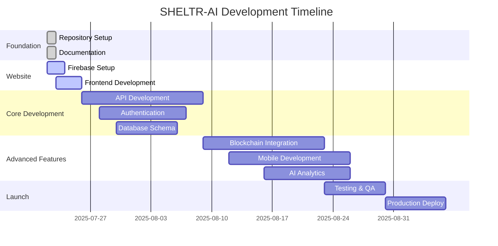
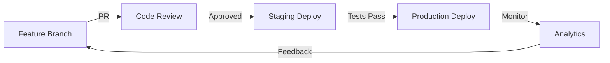

# 🗺️ SHELTR-AI Development Roadmap
## Complete Rebuild Strategy: Legacy to Enterprise Platform

> **Vision**: Transform SHELTR from a prototype to an enterprise-grade SaaS platform  
> **Timeline**: 14 weeks to production launch  
> **Architecture**: Firebase + FastAPI + Next.js 15 + Expo

---

## 📊 Roadmap Overview - Q3 2025 UPDATE

### **Current Development Status: Q3 2025**
**SHELTR MVP Status**: 🚀 **Private Beta in Production** - Gaining momentum with core features operational

### **Updated Phase Timeline**
| Phase | Timeline | Focus | Status |
|-------|----------|-------|--------|
| **Foundation & MVP** | Q1-Q2 2025 | Repository, Website, Core Features | ✅ **COMPLETE** |
| **Private Beta (Current)** | Q3 2025 | Service Booking, Payment Rails, User Testing | 🔄 **ACTIVE** |
| **Pre-Sale & Funding** | September 2025 | Seed Round with Doug K. (CFO) | 🎯 **PLANNED** |
| **Public Beta Launch** | Q4 2025 | Public Release, Community Growth | 🚀 **TARGET** |
| **Token ICO (Public)** | December 2025 | SHELTR Token Public Launch | 💎 **MILESTONE** |
| **Scaling & Expansion** | Q1 2026+ | Multi-city, Enterprise Features | 🔵 **FUTURE** |

### **Success Metrics by Phase**


---

## 🏗️ **PHASE SUMMARY: Q1-Q3 2025 ACCOMPLISHMENTS** ✅ **COMPLETE**

### **Q1 2025: Foundation & Architecture**
- ✅ **Sessions 01-02**: Repository, website launch, Firebase integration
- ✅ **Live Platform**: https://sheltr-ai.web.app deployed and operational
- ✅ **Documentation**: Comprehensive technical and business documentation
- ✅ **Architecture**: Monorepo with FastAPI backend, Next.js frontend

### **Q2 2025: Core Development**
- ✅ **Sessions 03-07**: Authentication system, role-based dashboards
- ✅ **Multi-Role System**: SuperAdmin, ShelterAdmin, Participant, Donor dashboards
- ✅ **AI Integration**: GPT-powered chatbot and analytics platform
- ✅ **Mobile Optimization**: Responsive design with Apple Liquid Glass UI

### **Q3 2025: Business Logic & Payment Rails** 🔄 **CURRENT FOCUS**
- ✅ **Sessions 08-09**: Service booking system, form persistence
- ✅ **Adyen Integration**: Payment processing with Doug K. (CFO) partnership [[memory:5408380]]
- ✅ **Demo QR System**: Full donation flow with blockchain SmartFund (80-15-5)
- 🔄 **Database Connectivity**: Real data integration across all dashboards
- 🔄 **Production Optimization**: Performance, security, scalability

### **Major Achievements to Date**
- [x] **Private Beta Platform**: Fully functional MVP in production
- [x] **Payment Processing**: Adyen-powered donation system operational
- [x] **Strategic Partnership**: Doug K. as CFO, 20+ years payments expertise
- [x] **Mobile Excellence**: Best-in-class responsive design and UX
- [x] **AI-Powered Analytics**: Real-time insights and chatbot support
- [x] **Blockchain Ready**: Smart contract architecture for transparent giving

---

## 🚀 **Q4 2025: PUBLIC BETA & TOKEN LAUNCH ROADMAP**

### **September 2025: Pre-Sale & Seed Funding** 🎯 **CRITICAL MILESTONE**
- **Doug K. Led Seed Round**: CFO partnership drives institutional investment
- **Adyen Partnership Formalization**: Payment rail integration for scale
- **Private Beta Expansion**: Invite-only user growth to 1,000+ participants
- **Security Audit**: Third-party smart contract and platform security review
- **Regulatory Compliance**: Legal framework for token launch preparation

### **October-November 2025: Public Beta Launch** 🚀 **TARGET**
- **Public Platform Release**: Open registration for all user types
- **Montreal Pilot Launch**: First city deployment with partner shelters
- **Mobile App Beta**: iOS/Android applications in App Store beta
- **Community Growth**: User acquisition campaigns, social media presence
- **Partnership Onboarding**: Shelter and service provider integrations

### **December 2025: SHELTR Token ICO** 💎 **MAJOR MILESTONE**
- **Public Token Launch**: SHELTR utility token available for purchase
- **Smart Contract Mainnet**: Production blockchain deployment on Base
- **DAO Governance Launch**: Community voting on platform decisions
- **Exchange Listings**: Major DEX/CEX partnerships for liquidity
- **Marketing Campaign**: Global launch with impact stories and metrics

### **Q4 2025 Success Metrics**
| Metric | Target | Current Status |
|--------|---------|----------------|
| **Active Participants** | 5,000+ | ~100 (Private Beta) |
| **Monthly Donations** | $500K+ | TBD (Demo Phase) |
| **Partner Shelters** | 50+ | 10 (Test Data) |
| **Token Holders** | 10,000+ | 0 (Pre-Launch) |
| **Cities Deployed** | 3 | 1 (Montreal Pilot) |

---

## 📋 **CRITICAL PATH: September-December 2025**

### **Week-by-Week September Focus**
1. **Week 1**: Seed funding presentations, investor meetings
2. **Week 2**: Due diligence, legal documentation, compliance review
3. **Week 3**: Funding close, team expansion, development acceleration
4. **Week 4**: Platform optimization, security hardening, beta expansion

### **October-November: Public Beta Execution**
- **Platform Stability**: 99.9% uptime, sub-2s page loads
- **User Onboarding**: Streamlined registration, intuitive dashboards
- **Real-World Testing**: Actual donations, shelter partnerships, impact tracking
- **Feedback Integration**: Rapid iteration based on user feedback

### **December: Token Launch Preparation**
- **Smart Contract Finalization**: Audited, tested, deployed contracts
- **Tokenomics Implementation**: Staking, governance, utility functions
- **Marketing Blitz**: Press releases, influencer partnerships, community events
- **Exchange Integration**: DEX/CEX listings for immediate liquidity

---

## ⚙️ **LEGACY: Core Application Development (COMPLETED Q1-Q3 2025)**

### **Week 3-4: Authentication & User Management**

#### **Core Features**
```typescript
interface CoreFeatures {
  authentication: {
    providers: ['email', 'google', 'github'],
    mfa: boolean,
    sessionManagement: 'advanced',
    roleBasedAccess: '4-tier-system'
  },
  userManagement: {
    roles: ['SuperAdmin', 'Admin', 'Participant', 'Donor'],
    permissions: 'granular',
    profileManagement: 'complete',
    onboarding: 'guided'
  }
}
```

#### **Development Tasks**
- [ ] **SuperAdmin Dashboard**: System monitoring, user management, analytics
- [ ] **Admin Dashboard**: Shelter management, participant oversight, resources
- [ ] **Participant Dashboard**: QR code, donation history, profile management
- [ ] **Donor Dashboard**: Giving history, impact tracking, preferences

### **Week 5-6: Core Platform Features**

#### **QR Code & Donation System**
```typescript
interface QRSystem {
  generation: {
    unique: boolean,
    encrypted: boolean,
    blockchain: 'verified',
    refreshable: boolean
  },
  donations: {
    instantProcessing: boolean,
    smartFundDistribution: '80/15/5',
    blockchainVerification: boolean,
    realTimeTracking: boolean
  }
}
```

#### **Development Tasks**
- [ ] **QR Code Generation**: Secure, unique, blockchain-linked
- [ ] **Donation Processing**: SmartFund™ distribution via smart contracts
- [ ] **Real-time Notifications**: Live updates across all platforms
- [ ] **Impact Tracking**: Donation flow visualization, impact metrics

---

## 🔗 **Phase 4: Advanced Features & Integration**

### **Week 7-8: Blockchain & Smart Contracts**

#### **Token System Architecture**
```typescript
interface TokenSystem {
  options: {
    usdc: 'price-stable donations',
    customSHLTR: 'platform governance',
    hybrid: 'best of both worlds'
  },
  smartContracts: {
    smartFund: 'automated 80/15/5 distribution',
    verification: 'transparent tracking',
    governance: 'DAO voting system'
  }
}
```

#### **Blockchain Features**
- [ ] **Smart Contract Development**: Solidity contracts for fund distribution
- [ ] **Public Blockchain Explorer**: Real-time transaction tracking
- [ ] **Token Integration**: Multi-option token system
- [ ] **DAO Governance**: Community voting on platform decisions

### **Week 9-10: Mobile Application Development**

#### **Expo React Native App**
```typescript
interface MobileApp {
  features: {
    qrScanner: 'native camera integration',
    offlineCapability: 'participant functionality',
    pushNotifications: 'real-time updates',
    biometricAuth: 'secure access'
  },
  platforms: ['iOS', 'Android'],
  deployment: ['App Store', 'Google Play']
}
```

#### **Mobile Development Tasks**
- [ ] **Core App Structure**: Navigation, authentication, role-based screens
- [ ] **QR Scanner**: Native camera integration with ML verification
- [ ] **Offline Functionality**: Participant features without internet
- [ ] **App Store Preparation**: Screenshots, descriptions, submission

---

## 🤖 **Phase 5: AI & Analytics Integration**

### **Week 11: AI-Powered Features**

#### **AI Analytics System**
```typescript
interface AISystem {
  analytics: {
    predictiveInsights: 'donation patterns',
    impactForecasting: 'housing fund growth',
    participantAnalytics: 'success predictions',
    donorBehavior: 'engagement optimization'
  },
  integration: {
    openai: 'GPT-4 for insights',
    langchain: 'conversation flows',
    customModels: 'platform-specific analytics'
  }
}
```

#### **AI Development Tasks**
- [ ] **Predictive Analytics**: Donation pattern analysis, impact forecasting
- [ ] **Intelligent Insights**: AI-generated reports for admins
- [ ] **Chatbot Integration**: Support and guidance for all user types
- [ ] **Performance Optimization**: AI-driven platform improvements

---

## 🧪 **Phase 6: Testing, Security & Performance**

### **Week 12: Quality Assurance**

#### **Testing Strategy**
```typescript
interface TestingStrategy {
  types: {
    unit: 'jest + pytest',
    integration: 'cypress + playwright',
    e2e: 'full user journeys',
    security: 'penetration testing',
    performance: 'load testing'
  },
  coverage: {
    target: '90%+',
    critical: '100%',
    documentation: 'comprehensive'
  }
}
```

#### **QA Tasks**
- [ ] **Automated Testing**: Unit, integration, and E2E test suites
- [ ] **Security Auditing**: Smart contract audits, penetration testing
- [ ] **Performance Testing**: Load testing, optimization
- [ ] **User Acceptance Testing**: Real-world scenario validation

---

## 🚀 **Phase 7: Production Launch**

### **Week 13-14: Deployment & Launch**

#### **Production Infrastructure**
```typescript
interface ProductionInfra {
  hosting: {
    frontend: 'Firebase Hosting + CDN',
    backend: 'Google Cloud Run',
    database: 'Firestore + backup strategies',
    monitoring: 'comprehensive observability'
  },
  security: {
    ssl: 'A+ rating',
    firewall: 'Cloud Armor',
    backup: 'automated daily',
    monitoring: '24/7 alerts'
  }
}
```

#### **Launch Tasks**
- [ ] **Production Deployment**: Automated CI/CD pipeline
- [ ] **Monitoring Setup**: Comprehensive observability and alerting
- [ ] **Documentation Finalization**: User guides, API docs, admin guides
- [ ] **Marketing Launch**: Website, social media, press kit

---

## 📋 **Session-by-Session Breakdown**

### **Session Planning Strategy**
Each development session is planned as **2-4 hour focused blocks** with specific deliverables:

#### **Immediate Sessions (Week 1-2)**
1. **Session 02** *(This Evening)*: Website Launch Day
2. **Session 03**: Authentication & User Management
3. **Session 04**: Role-Based Dashboards
4. **Session 05**: QR Code System Implementation
5. **Session 06**: Donation Processing & SmartFund™
6. **Session 07**: Real-time Features & Notifications

#### **Core Development Sessions (Week 3-6)**
8. **Session 08**: SuperAdmin Dashboard Deep Dive
9. **Session 09**: Shelter Admin Features
10. **Session 10**: Participant Experience
11. **Session 11**: Donor Journey & Analytics
12. **Session 12**: API Security & Performance
13. **Session 13**: Database Optimization
14. **Session 14**: Testing Framework Setup

#### **Advanced Features Sessions (Week 7-10)**
15. **Session 15**: Smart Contract Development
16. **Session 16**: Blockchain Integration
17. **Session 17**: Mobile App Foundation
18. **Session 18**: Native Features Implementation
19. **Session 19**: AI Analytics Integration
20. **Session 20**: Performance Optimization

#### **Launch Preparation Sessions (Week 11-14)**
21. **Session 21**: Security Hardening
22. **Session 22**: Performance Testing
23. **Session 23**: User Acceptance Testing
24. **Session 24**: Production Deployment
25. **Session 25**: Launch Day & Monitoring

---

## 🎯 **Key Performance Indicators (KPIs)**

### **Technical KPIs**
| Metric | Target | Measurement |
|--------|---------|-------------|
| **Page Load Speed** | < 3 seconds | Lighthouse |
| **API Response Time** | < 500ms | Monitoring |
| **Mobile Performance** | 90+ score | PageSpeed |
| **Uptime** | 99.9% | Monitoring |
| **Security Score** | A+ rating | Security scans |

### **Development KPIs**
| Metric | Target | Measurement |
|--------|---------|-------------|
| **Code Coverage** | 90%+ | Testing tools |
| **Documentation** | 100% coverage | Manual review |
| **Bug Rate** | < 1 per release | Issue tracking |
| **Performance Budget** | < 100KB JS | Bundle analysis |
| **Accessibility** | WCAG 2.1 AA | Automated testing |

### **Business KPIs**
| Metric | Target | Measurement |
|--------|---------|-------------|
| **User Onboarding** | < 5 minutes | Analytics |
| **Donation Success Rate** | 95%+ | Transaction logs |
| **User Satisfaction** | 4.5+ stars | Feedback |
| **Platform Adoption** | 100 shelters | Registration |
| **Impact Tracking** | $1M+ donations | Blockchain |

---

## 🔄 **Continuous Integration & Deployment**

### **Development Workflow**


### **Quality Gates**
- **Code Review**: Required for all changes
- **Automated Testing**: 90%+ coverage required
- **Security Scans**: No high/critical vulnerabilities
- **Performance Budget**: Bundle size limits enforced
- **Documentation**: Updated for all features

---

## 📚 **Learning & Development Resources**

### **Technology Stack Learning Paths**
1. **Firebase Mastery**: Authentication, Firestore, Cloud Functions, Hosting
2. **Next.js 15**: App Router, Server Components, Performance optimization
3. **FastAPI Expertise**: Async programming, API design, testing
4. **Blockchain Development**: Solidity, smart contracts, Web3 integration
5. **Mobile Development**: Expo, React Native, native integrations

### **Documentation Standards**
- **Technical Docs**: API references, architecture decisions
- **User Guides**: Role-specific instructions, troubleshooting
- **Developer Docs**: Setup guides, contribution guidelines
- **Business Docs**: Impact reports, metrics dashboards

---

## 🌟 **Success Criteria & Milestones**

### **Phase Success Definitions**
- **Foundation**: Repository live, documentation complete, team ready
- **Website**: Live site, core pages, mobile responsive, SEO optimized
- **Core Development**: Authentication, dashboards, QR system, API complete
- **Advanced Features**: Blockchain, mobile app, AI analytics functional
- **Testing**: 90%+ coverage, security audit passed, performance optimized
- **Launch**: Production live, monitoring active, users onboarded

### **Final Success Metrics**
- **Technical Excellence**: A+ security, 99.9% uptime, < 3s load times
- **User Experience**: Intuitive navigation, accessibility compliant, mobile optimized
- **Business Impact**: Platform adoption, donation processing, measurable outcomes
- **Community Growth**: Developer contributions, user feedback, ecosystem expansion

---

## 🤝 **Team Collaboration & Communication**

### **Session Documentation**
- **Pre-Session**: Goals, requirements, blockers identified
- **During Session**: Progress tracking, decisions documented
- **Post-Session**: Deliverables committed, next session planned

### **Knowledge Management**
- **Technical Decisions**: Architecture Decision Records (ADRs)
- **Code Standards**: Enforced via linting, formatting, reviews
- **Documentation**: Always up-to-date, user-focused
- **Legacy Preservation**: Gunnar's memory honored in every release

---

**Roadmap Status**: 🚀 **ACTIVE DEVELOPMENT**  
**Current Phase**: Website Launch (Session 02)  
**Next Milestone**: Live website deployment  

*"Building SHELTR-AI with the values Gunnar taught us: loyalty, protection, and creating safe spaces for those who need them most."* 🏠❤️

---

**Last Updated**: July 22, 2025  
**Next Review**: After Session 02 completion  
**Repository**: [github.com/mrj0nesmtl/sheltr-ai](https://github.com/mrj0nesmtl/sheltr-ai) 