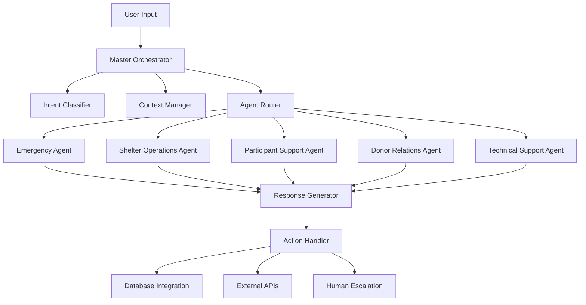

# SESSION 07: AI Chatbot Delegation System Implementation

## 🤖 **Overview**

The SHELTR-AI Chatbot Delegation System is an intelligent agent orchestrator that routes user inquiries to specialized AI agents based on user role, intent, and context. This system provides 24/7 support while reducing human support workload.

---

## 🏗️ **System Architecture**

### **Core Components**



### **Technology Stack**

#### **Backend Services:**
- **NLP Engine:** OpenAI GPT-4 or Claude Sonnet 3.5
- **Intent Classification:** Custom ML pipeline
- **Context Storage:** Redis for conversation state
- **Database:** Firebase Firestore for persistent data
- **Real-time Communication:** Socket.io for WebSocket connections

#### **Frontend Integration:**
- **Chat Interface:** React component with real-time messaging
- **Voice Support:** Web Speech API for voice commands
- **Mobile Support:** PWA with push notifications

---

## 🧠 **Intent Classification System**

### **Intent Categories**

```typescript
enum IntentCategory {
  EMERGENCY = 'emergency',           // Crisis situations, urgent needs
  INFORMATION = 'information',       // General questions, platform help
  ACTION = 'action',                 // Booking services, making donations
  SUPPORT = 'support',               // Technical issues, account problems
  NAVIGATION = 'navigation'          // Help finding features, tutorials
}

interface Intent {
  category: IntentCategory;
  subcategory: string;
  confidence: number;
  entities: Record<string, any>;
  context: ConversationContext;
  requiresEscalation: boolean;
  urgencyLevel: 'low' | 'medium' | 'high' | 'critical';
}
```

### **Intent Classification Examples**

#### **Emergency Intents:**
```typescript
const emergencyPatterns = [
  "I need help right now",
  "This is an emergency",
  "I'm in danger",
  "I need shelter tonight",
  "I haven't eaten in days",
  "I'm having thoughts of self-harm"
];

// Classification Result:
{
  category: 'emergency',
  subcategory: 'crisis_intervention',
  confidence: 0.95,
  urgencyLevel: 'critical',
  requiresEscalation: true
}
```

#### **Service Booking Intents:**
```typescript
const servicePatterns = [
  "I want to book a meal",
  "Can I reserve a bed?",
  "Schedule counseling session",
  "Sign up for job training"
];

// Classification Result:
{
  category: 'action',
  subcategory: 'service_booking',
  confidence: 0.88,
  entities: { service_type: 'meal', date: 'today' },
  urgencyLevel: 'medium'
}
```

---

## 🎭 **Specialized Agent Implementations**

### **1. Emergency Response Agent**

```typescript
export class EmergencyResponseAgent implements ChatAgent {
  async processMessage(
    message: string,
    intent: Intent,
    context: UserContext
  ): Promise<ChatResponse> {
    
    // Immediate crisis assessment
    const crisisLevel = await this.assessCrisisLevel(message, context);
    
    if (crisisLevel === 'immediate_danger') {
      return this.handleImmediateCrisis(context);
    }
    
    if (crisisLevel === 'urgent_need') {
      return this.handleUrgentNeed(intent, context);
    }
    
    return this.provideEmergencyResources(context);
  }

  private async handleImmediateCrisis(context: UserContext): Promise<ChatResponse> {
    // Automatically escalate to emergency services
    await this.alertEmergencyServices(context);
    
    return {
      message: "🚨 I've detected this may be a crisis situation. Emergency services have been notified. Please call 911 immediately if you're in immediate danger.",
      actions: [
        {
          type: 'emergency_call',
          label: 'Call 911 Now',
          data: { phone: '911' }
        },
        {
          type: 'crisis_chat',
          label: 'Crisis Text Line',
          data: { phone: '741741', message: 'HOME' }
        }
      ],
      urgency: 'critical',
      escalationTriggered: true
    };
  }

  private async handleUrgentNeed(intent: Intent, context: UserContext): Promise<ChatResponse> {
    const location = context.location || 'Montreal';
    const nearbyResources = await this.findNearbyEmergencyResources(location);
    
    return {
      message: "I understand you need immediate assistance. Here are the closest emergency resources:",
      actions: nearbyResources.map(resource => ({
        type: 'contact_resource',
        label: `${resource.name} - ${resource.distance}`,
        data: { 
          phone: resource.phone,
          address: resource.address,
          services: resource.services
        }
      })),
      followUp: "Would you like me to help you contact any of these resources directly?"
    };
  }
}
```

### **2. Participant Support Agent**

```typescript
export class ParticipantSupportAgent implements ChatAgent {
  async processMessage(
    message: string,
    intent: Intent,
    context: UserContext
  ): Promise<ChatResponse> {
    
    switch (intent.subcategory) {
      case 'service_booking':
        return await this.handleServiceBooking(intent, context);
      
      case 'profile_management':
        return await this.handleProfileQuestions(intent, context);
      
      case 'progress_tracking':
        return await this.handleProgressInquiry(intent, context);
      
      case 'support_services':
        return await this.handleSupportRequest(intent, context);
      
      default:
        return this.getParticipantGuidance(message, context);
    }
  }

  private async handleServiceBooking(intent: Intent, context: UserContext): Promise<ChatResponse> {
    const shelter = await this.getUserShelter(context.userId);
    const availableServices = await ServiceRepository.getAvailableServices(shelter.id);
    
    // Extract service type from intent entities
    const requestedService = intent.entities.service_type;
    
    if (requestedService) {
      const service = availableServices.find(s => 
        s.name.toLowerCase().includes(requestedService.toLowerCase())
      );
      
      if (service) {
        const availableSlots = await this.getAvailableSlots(service.id);
        
        return {
          message: `I found ${service.name} at ${shelter.name}. Here are the available times:`,
          actions: availableSlots.map(slot => ({
            type: 'book_service',
            label: `${slot.date} at ${slot.time}`,
            data: {
              serviceId: service.id,
              slotId: slot.id,
              datetime: slot.datetime
            }
          })),
          requiresAction: true
        };
      }
    }
    
    return {
      message: "I can help you book a service. Here's what's available at your shelter:",
      actions: availableServices.map(service => ({
        type: 'view_service',
        label: service.name,
        data: { serviceId: service.id }
      }))
    };
  }

  private async handleProgressInquiry(intent: Intent, context: UserContext): Promise<ChatResponse> {
    const goals = await this.getUserGoals(context.userId);
    const progress = await this.calculateProgress(context.userId);
    
    return {
      message: `Here's your current progress:\n\n${progress.summary}`,
      actions: [
        {
          type: 'view_detailed_progress',
          label: 'View Detailed Progress',
          data: { userId: context.userId }
        },
        {
          type: 'update_goals',
          label: 'Update Goals',
          data: { userId: context.userId }
        }
      ],
      followUp: "Would you like to set new goals or update existing ones?"
    };
  }
}
```

### **3. Donor Relations Agent**

```typescript
export class DonorRelationsAgent implements ChatAgent {
  async processMessage(
    message: string,
    intent: Intent,
    context: UserContext
  ): Promise<ChatResponse> {
    
    switch (intent.subcategory) {
      case 'donation_inquiry':
        return await this.handleDonationInquiry(intent, context);
      
      case 'impact_tracking':
        return await this.handleImpactInquiry(intent, context);
      
      case 'tax_documentation':
        return await this.handleTaxQuestions(intent, context);
      
      case 'recurring_donations':
        return await this.handleRecurringDonations(intent, context);
      
      default:
        return this.getDonorGuidance(message, context);
    }
  }

  private async handleDonationInquiry(intent: Intent, context: UserContext): Promise<ChatResponse> {
    const donorHistory = await this.getDonorHistory(context.userId);
    const suggestedAmount = this.calculateSuggestedAmount(donorHistory);
    
    return {
      message: "I'd be happy to help you make a donation. Based on your history, here are some options:",
      actions: [
        {
          type: 'quick_donate',
          label: `Quick Donate $${suggestedAmount}`,
          data: { amount: suggestedAmount, type: 'quick' }
        },
        {
          type: 'custom_donate',
          label: 'Choose Amount',
          data: { type: 'custom' }
        },
        {
          type: 'setup_recurring',
          label: 'Setup Monthly Giving',
          data: { type: 'recurring' }
        }
      ],
      followUp: "Would you like to see the impact of your previous donations?"
    };
  }

  private async handleImpactInquiry(intent: Intent, context: UserContext): Promise<ChatResponse> {
    const impact = await this.getDonorImpact(context.userId);
    
    return {
      message: `Your donations have made a real difference! Here's your impact:\n\n` +
               `💝 Total Donated: $${impact.totalDonated.toLocaleString()}\n` +
               `👥 People Helped: ${impact.peopleHelped}\n` +
               `🍽️ Meals Provided: ${impact.mealsProvided}\n` +
               `🏠 Nights of Shelter: ${impact.nightsShelter}`,
      actions: [
        {
          type: 'view_detailed_impact',
          label: 'View Detailed Impact Report',
          data: { userId: context.userId }
        },
        {
          type: 'share_impact',
          label: 'Share My Impact',
          data: { userId: context.userId }
        }
      ]
    };
  }
}
```

### **4. Shelter Operations Agent**

```typescript
export class ShelterOperationsAgent implements ChatAgent {
  async processMessage(
    message: string,
    intent: Intent,
    context: UserContext
  ): Promise<ChatResponse> {
    
    // Verify user has shelter admin role
    if (context.userRole !== 'admin' && context.userRole !== 'super_admin') {
      return this.getUnauthorizedResponse();
    }
    
    switch (intent.subcategory) {
      case 'occupancy_management':
        return await this.handleOccupancyInquiry(intent, context);
      
      case 'participant_management':
        return await this.handleParticipantQuestions(intent, context);
      
      case 'resource_management':
        return await this.handleResourceInquiries(intent, context);
      
      case 'reporting':
        return await this.handleReportingRequests(intent, context);
      
      default:
        return this.getShelterGuidance(message, context);
    }
  }

  private async handleOccupancyInquiry(intent: Intent, context: UserContext): Promise<ChatResponse> {
    const shelter = await this.getUserShelter(context.userId);
    const occupancy = await this.getCurrentOccupancy(shelter.id);
    
    return {
      message: `Current occupancy at ${shelter.name}:\n\n` +
               `🛏️ Beds: ${occupancy.occupied}/${occupancy.total} (${occupancy.percentage}%)\n` +
               `📊 Trend: ${occupancy.trend}\n` +
               `⏰ Last updated: ${occupancy.lastUpdated}`,
      actions: [
        {
          type: 'manage_beds',
          label: 'Manage Bed Assignments',
          data: { shelterId: shelter.id }
        },
        {
          type: 'view_waitlist',
          label: 'View Waiting List',
          data: { shelterId: shelter.id }
        }
      ]
    };
  }
}
```

---

## 🔄 **Conversation Flow Management**

### **Context Management**

```typescript
interface ConversationContext {
  conversationId: string;
  userId: string;
  userRole: UserRole;
  sessionStartTime: Date;
  messageHistory: Message[];
  currentIntent: Intent | null;
  activeAgent: string | null;
  userPreferences: UserPreferences;
  escalationLevel: number;
  metadata: Record<string, any>;
}

class ConversationManager {
  private redis: RedisClient;
  
  async getContext(userId: string): Promise<ConversationContext> {
    const cached = await this.redis.get(`conversation:${userId}`);
    if (cached) {
      return JSON.parse(cached);
    }
    
    return this.createNewContext(userId);
  }
  
  async updateContext(
    userId: string, 
    message: string, 
    response: ChatResponse
  ): Promise<void> {
    const context = await this.getContext(userId);
    
    context.messageHistory.push({
      timestamp: new Date(),
      userMessage: message,
      botResponse: response,
      agent: context.activeAgent
    });
    
    // Keep only last 20 messages for performance
    if (context.messageHistory.length > 20) {
      context.messageHistory = context.messageHistory.slice(-20);
    }
    
    await this.redis.setex(
      `conversation:${userId}`, 
      3600, // 1 hour TTL
      JSON.stringify(context)
    );
  }
}
```

### **Agent Router Logic**

```typescript
class AgentRouter {
  private agents: Map<string, ChatAgent>;
  
  constructor() {
    this.agents = new Map([
      ['emergency', new EmergencyResponseAgent()],
      ['participant_support', new ParticipantSupportAgent()],
      ['donor_relations', new DonorRelationsAgent()],
      ['shelter_operations', new ShelterOperationsAgent()],
      ['technical_support', new TechnicalSupportAgent()]
    ]);
  }
  
  selectAgent(intent: Intent, userRole: UserRole): ChatAgent {
    // Emergency situations always go to emergency agent
    if (intent.category === 'emergency' || intent.urgencyLevel === 'critical') {
      return this.agents.get('emergency')!;
    }
    
    // Route based on user role and intent
    const agentKey = this.determineAgentKey(intent, userRole);
    return this.agents.get(agentKey) || this.agents.get('technical_support')!;
  }
  
  private determineAgentKey(intent: Intent, userRole: UserRole): string {
    if (userRole === 'participant') {
      return 'participant_support';
    }
    
    if (userRole === 'donor') {
      return 'donor_relations';
    }
    
    if (userRole === 'admin' || userRole === 'super_admin') {
      return 'shelter_operations';
    }
    
    return 'technical_support';
  }
}
```

---

## 🔌 **Integration Points**

### **Frontend Chat Interface**

```typescript
// apps/web/src/components/chat/ChatInterface.tsx
export const ChatInterface: React.FC = () => {
  const [messages, setMessages] = useState<ChatMessage[]>([]);
  const [isTyping, setIsTyping] = useState(false);
  const { user } = useAuth();
  const socket = useSocket();
  
  const sendMessage = async (message: string) => {
    setIsTyping(true);
    
    // Add user message to UI
    setMessages(prev => [...prev, {
      id: Date.now().toString(),
      text: message,
      sender: 'user',
      timestamp: new Date()
    }]);
    
    // Send to chatbot service
    const response = await ChatService.sendMessage(message, user.id);
    
    setIsTyping(false);
    
    // Add bot response to UI
    setMessages(prev => [...prev, {
      id: Date.now().toString(),
      text: response.message,
      sender: 'bot',
      timestamp: new Date(),
      actions: response.actions
    }]);
  };
  
  return (
    <ChatContainer>
      <MessageList messages={messages} />
      {isTyping && <TypingIndicator />}
      <MessageInput onSend={sendMessage} />
    </ChatContainer>
  );
};
```

### **WebSocket Real-time Communication**

```typescript
// apps/api/services/websocket.ts
export class ChatWebSocketHandler {
  private io: SocketIOServer;
  private orchestrator: ChatbotOrchestrator;
  
  constructor(server: any) {
    this.io = new SocketIOServer(server);
    this.orchestrator = new ChatbotOrchestrator();
    this.setupEventHandlers();
  }
  
  private setupEventHandlers() {
    this.io.on('connection', (socket) => {
      socket.on('join-chat', (userId: string) => {
        socket.join(`user:${userId}`);
      });
      
      socket.on('send-message', async (data) => {
        const { message, userId } = data;
        
        try {
          const response = await this.orchestrator.processMessage(
            message,
            userId,
            data.userRole
          );
          
          socket.emit('bot-response', response);
          
          // If escalation is triggered, notify human support
          if (response.escalationTriggered) {
            this.notifyHumanSupport(userId, message, response);
          }
          
        } catch (error) {
          socket.emit('error', {
            message: 'Sorry, I encountered an error. Please try again.'
          });
        }
      });
    });
  }
}
```

---

## 📊 **Analytics & Monitoring**

### **Conversation Analytics**

```typescript
interface ChatAnalytics {
  totalConversations: number;
  averageConversationLength: number;
  intentClassificationAccuracy: number;
  userSatisfactionScore: number;
  escalationRate: number;
  resolutionRate: number;
  mostCommonIntents: Array<{
    intent: string;
    count: number;
    percentage: number;
  }>;
  agentPerformance: Array<{
    agent: string;
    successRate: number;
    averageResponseTime: number;
  }>;
}

class ChatAnalyticsService {
  async trackConversation(
    userId: string,
    messages: Message[],
    outcome: ConversationOutcome
  ): Promise<void> {
    await admin.firestore().collection('chat_analytics').add({
      userId,
      startTime: messages[0].timestamp,
      endTime: messages[messages.length - 1].timestamp,
      messageCount: messages.length,
      intents: this.extractIntents(messages),
      agents: this.extractAgentUsage(messages),
      outcome,
      userSatisfaction: outcome.satisfactionScore,
      escalated: outcome.escalated,
      resolved: outcome.resolved,
      createdAt: admin.firestore.FieldValue.serverTimestamp()
    });
  }
  
  async generateDailyReport(): Promise<ChatAnalytics> {
    // Aggregate daily chat analytics
    const today = new Date().toISOString().split('T')[0];
    const conversations = await this.getConversationsForDate(today);
    
    return {
      totalConversations: conversations.length,
      averageConversationLength: this.calculateAverageLength(conversations),
      intentClassificationAccuracy: this.calculateAccuracy(conversations),
      userSatisfactionScore: this.calculateSatisfaction(conversations),
      escalationRate: this.calculateEscalationRate(conversations),
      resolutionRate: this.calculateResolutionRate(conversations),
      mostCommonIntents: this.getMostCommonIntents(conversations),
      agentPerformance: this.getAgentPerformance(conversations)
    };
  }
}
```

---

## 🚀 **Deployment Strategy**

### **Phase 1: Core Implementation**
1. Set up intent classification system
2. Implement master orchestrator
3. Create basic agent framework
4. Build emergency response agent (highest priority)

### **Phase 2: Agent Development**
1. Implement participant support agent
2. Create donor relations agent
3. Build shelter operations agent
4. Add technical support agent

### **Phase 3: Advanced Features**
1. Multi-turn conversation handling
2. Voice command support
3. Proactive notifications
4. Advanced analytics dashboard

### **Phase 4: Optimization**
1. Machine learning model refinement
2. Performance optimization
3. A/B testing for response quality
4. User feedback integration

---

## ✅ **Testing Strategy**

### **Unit Testing**
```typescript
// Test intent classification accuracy
describe('IntentClassifier', () => {
  it('should classify emergency messages correctly', async () => {
    const classifier = new IntentClassifier();
    const result = await classifier.classify("I need help right now", 'participant');
    
    expect(result.category).toBe('emergency');
    expect(result.confidence).toBeGreaterThan(0.9);
    expect(result.urgencyLevel).toBe('critical');
  });
});

// Test agent routing
describe('AgentRouter', () => {
  it('should route to emergency agent for crisis situations', () => {
    const router = new AgentRouter();
    const intent = { category: 'emergency', urgencyLevel: 'critical' };
    const agent = router.selectAgent(intent, 'participant');
    
    expect(agent).toBeInstanceOf(EmergencyResponseAgent);
  });
});
```

### **Integration Testing**
- End-to-end conversation flows
- Database integration validation
- External API connectivity
- Real-time communication testing

### **Performance Testing**
- Concurrent conversation handling
- Response time benchmarks
- Memory usage optimization
- Scalability testing

---

**The AI Chatbot Delegation System represents a significant advancement in automated user support, providing intelligent, context-aware assistance while maintaining the ability to escalate to human support when needed.** 