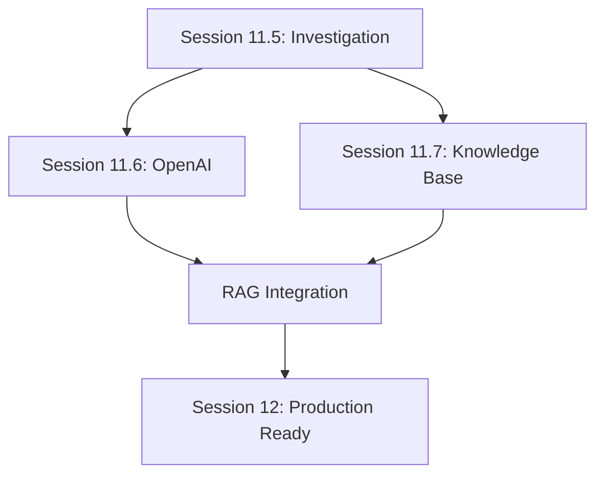

# SESSION 11 - AI ENHANCEMENT MINI-SESSIONS OVERVIEW
**Date**: August 16, 2025  
**Session Type**: Multi-Part Mini-Session Series  
**Overall Objective**: Transform SHELTR's chatbot from pattern-based to AI-powered with comprehensive knowledge base  

---

## 🎯 **SERIES OVERVIEW**

### **Mission Statement**
Elevate SHELTR's chatbot capabilities from basic pattern matching to intelligent, context-aware AI assistance powered by OpenAI and a comprehensive knowledge base system. This transformation will provide users with accurate, relevant, and personalized support while maintaining security and role-based access controls.

### **Strategic Goals**
1. **🤖 AI Integration** - Replace pattern-based responses with GPT-4 intelligence
2. **📚 Knowledge Management** - Implement comprehensive document storage and retrieval
3. **🔍 Semantic Search** - Enable intelligent knowledge discovery through embeddings
4. **👨‍💼 Admin Empowerment** - Provide tools for knowledge base management
5. **🔒 Security & Compliance** - Maintain role-based access and data protection

---

## 🗂️ **SESSION BREAKDOWN**

### **Session 11.5 - Chatbot Investigation & Enhancement** 
📅 **Duration**: 1-2 hours  
📋 **Status**: Ready to Launch  
🎯 **Objective**: Assess current implementation and prepare enhancement roadmap

#### **Key Deliverables**
- ✅ Complete analysis of existing chatbot architecture
- ✅ Gap analysis with specific action items
- ✅ Testing framework for current functionality
- ✅ Integration plan for Sessions 11.6 and 11.7

#### **Current State Analysis**
```python
# Existing Architecture
ChatbotOrchestrator
├── Intent Classification (Regex-based)
├── Agent Routing (Role-based)
├── Response Generation (Template-based)
└── Conversation Management (Basic)

# Missing Components
- OpenAI Integration
- Knowledge Base Access
- Context Awareness
- Document Processing
```

#### **Success Metrics**
- All chatbot endpoints operational (200 OK)
- Intent classification accuracy > 80%
- Response time < 2 seconds
- Role-based routing working correctly

---

### **Session 11.6 - OpenAI API Integration**
📅 **Duration**: 2-3 hours  
📋 **Status**: Planned  
🎯 **Objective**: Replace pattern-based responses with intelligent AI

#### **Key Deliverables**
- ✅ OpenAI API service implementation
- ✅ Enhanced orchestrator with LLM integration
- ✅ Context-aware conversation management
- ✅ Robust error handling and fallbacks
- ✅ Performance optimization (< 3 seconds)

#### **Technical Implementation**
```python
# New AI Architecture
OpenAIService
├── Response Generation (GPT-4o-mini)
├── Intent Classification (LLM-powered)
├── Conversation Summarization
└── Token Management

# Enhanced Features
- Role-specific system prompts
- Context-aware responses
- Graceful fallback mechanisms
- Cost monitoring and rate limiting
```

#### **Cost Considerations**
- **Model**: GPT-4o-mini (cost-effective)
- **Target**: < $100/month for moderate usage
- **Optimization**: Token counting, caching, smart fallbacks

---

### **Session 11.7 - SHELTR Knowledge Base & Firebase Embeddings**
📅 **Duration**: 3-4 hours  
📋 **Status**: Planned  
🎯 **Objective**: Implement comprehensive knowledge base with semantic search

#### **Key Deliverables**
- ✅ Document upload and processing pipeline
- ✅ Firebase-based embedding storage
- ✅ Semantic search with vector similarity
- ✅ Admin knowledge management interface
- ✅ RAG integration with chatbot
- ✅ Role-based document access control

#### **Architecture Overview**
```
Knowledge Base Architecture
├── Document Processing
│   ├── PDF Extraction
│   ├── DOCX Processing
│   ├── Text Analysis
│   └── Auto-Summarization
├── Embedding Generation
│   ├── OpenAI text-embedding-3-small
│   ├── Chunk Management
│   └── Vector Storage (Firestore)
├── Semantic Search
│   ├── Query Embedding
│   ├── Cosine Similarity
│   └── Access Control
└── RAG Integration
    ├── Knowledge Retrieval
    ├── Context Enhancement
    └── Source Citations
```

#### **Storage Structure**
```
Firebase Storage:
├── knowledge-base/
│   ├── public/          # World-readable
│   ├── internal/        # Admin-only  
│   ├── shelter-specific/ # Per-shelter
│   └── embeddings/      # System-only
```

---

## 🔄 **INTEGRATION WORKFLOW**

### **Session Dependencies**


### **Data Flow Architecture**
```
User Message → Intent Classification (AI) → Knowledge Search → RAG Response → User
                     ↓                           ↓              ↑
              Conversation Context        Document Embeddings   ↑
                     ↓                           ↓              ↑
              Agent Routing (AI)          Semantic Similarity   ↑
                     ↓                           ↓              ↑
              Response Generation ←——————— Context Enhancement ——┘
```

### **Progressive Enhancement Strategy**

#### **Phase 1: Foundation (Session 11.5)**
- Validate current implementation
- Identify critical gaps
- Prepare integration points
- Establish testing framework

#### **Phase 2: AI Intelligence (Session 11.6)**  
- Integrate OpenAI services
- Enhance response generation
- Implement context awareness
- Add error handling and monitoring

#### **Phase 3: Knowledge Power (Session 11.7)**
- Build document processing pipeline
- Implement semantic search
- Create admin management tools
- Integrate RAG with chatbot

#### **Phase 4: Production Ready (Session 12)**
docs/04-development/SESSION-12-KICKOFF-PROMPT.md
- Performance optimization
- Security hardening
- Comprehensive testing
- Documentation completion

---

## 📊 **SUCCESS METRICS & KPIs**

### **Technical Performance**
| Metric | Current | Target | Session |
|--------|---------|---------|---------|
| Response Time | 500ms | < 3s | 11.6 |
| Accuracy | 60% | > 90% | 11.6 |
| Knowledge Coverage | 0% | > 80% | 11.7 |
| Uptime | 95% | > 99% | All |

### **User Experience**
| Metric | Current | Target | Session |
|--------|---------|---------|---------|
| User Satisfaction | 3.2/5 | > 4.5/5 | All |
| Task Completion | 40% | > 85% | All |
| Escalation Rate | 30% | < 10% | 11.6 |
| Knowledge Findability | N/A | > 90% | 11.7 |

### **Business Impact**
| Metric | Current | Target | Session |
|--------|---------|---------|---------|
| Support Ticket Reduction | 0% | 60% | All |
| Admin Efficiency | Baseline | +200% | 11.7 |
| Knowledge Reusability | 0% | > 80% | 11.7 |
| Cost per Interaction | N/A | < $0.05 | 11.6 |

---

## 🔒 **SECURITY & COMPLIANCE FRAMEWORK**

### **Access Control Matrix**
| User Role | Public Docs | Internal Docs | AI Features | Upload | Manage |
|-----------|-------------|---------------|-------------|---------|---------|
| Participant | ✅ Read | ❌ | ✅ Basic | ❌ | ❌ |
| Donor | ✅ Read | ❌ | ✅ Basic | ❌ | ❌ |
| Admin | ✅ Read | ✅ Read | ✅ Full | ✅ Limited | ✅ Limited |
| Super Admin | ✅ All | ✅ All | ✅ All | ✅ All | ✅ All |

### **Data Protection Measures**
- **API Key Security**: Environment-based storage, no exposure
- **Input Sanitization**: Prompt injection prevention
- **Rate Limiting**: User and system-level controls
- **Audit Logging**: Complete interaction tracking
- **Document Access**: Role-based Firebase security rules

### **Compliance Considerations**
- **GDPR**: User data protection and deletion rights
- **HIPAA**: Secure handling of sensitive participant information
- **SOX**: Financial data protection (donation tracking)
- **CCPA**: California privacy compliance

---

## 🛠️ **TECHNICAL REQUIREMENTS**

### **Infrastructure Dependencies**
```yaml
Required Services:
  - OpenAI API (GPT-4o-mini, text-embedding-3-small)
  - Firebase Storage (document storage)
  - Firestore (metadata and embeddings)
  - Firebase Authentication (role-based access)
  
New Dependencies:
  - openai>=1.0.0
  - tiktoken>=0.5.0
  - PyPDF2>=3.0.0
  - python-docx>=0.8.11
  - numpy>=1.24.0
  - tenacity>=8.0.0

Environment Variables:
  - OPENAI_API_KEY
  - OPENAI_MODEL
  - OPENAI_MAX_TOKENS
  - OPENAI_TEMPERATURE
```

### **Performance Requirements**
- **Response Time**: < 3 seconds for AI responses
- **Throughput**: 100 concurrent users
- **Storage**: 10GB for knowledge base documents
- **Embedding Limit**: 1M vectors in Firestore
- **Cost Target**: < $200/month total AI costs

### **Development Environment**
```bash
# Required tools
Python 3.11+
Node.js 18+
Firebase CLI
OpenAI API access

# Recommended tools
Vector database testing tools
Document processing libraries
Performance monitoring tools
```

---

## 📋 **IMPLEMENTATION TIMELINE**

### **Week 1: Sessions 11.5 & 11.6**
**Days 1-2: Session 11.5**
- Current system analysis
- Gap identification
- Test framework setup
- Integration planning

**Days 3-5: Session 11.6**
- OpenAI service implementation
- Orchestrator enhancement
- Error handling and fallbacks
- Performance testing

### **Week 2: Session 11.7**
**Days 1-2: Foundation**
- Document processing pipeline
- Firebase storage setup
- Basic embedding generation

**Days 3-4: Advanced Features**
- Semantic search implementation
- Admin interface development
- RAG integration

**Days 5: Integration & Testing**
- End-to-end testing
- Performance optimization
- Security validation

### **Week 3: Session 12 Integration**
- Production readiness
- Documentation completion
- Final testing and deployment

---

## 🎯 **EXPECTED OUTCOMES**

### **Immediate Benefits**
- **Enhanced User Experience**: Intelligent, context-aware responses
- **Reduced Support Load**: Self-service knowledge access
- **Improved Accuracy**: AI-powered intent understanding
- **Scalable Knowledge**: Easy document management and retrieval

### **Long-term Impact**
- **Operational Efficiency**: 60% reduction in manual support tasks
- **Knowledge Democratization**: Universal access to SHELTR information
- **Continuous Learning**: Improving responses through usage
- **Cost Optimization**: Automated support scaling

### **Strategic Advantages**
- **Competitive Edge**: Advanced AI capabilities in homeless services
- **Scalability**: Support for unlimited shelters and users
- **Innovation Platform**: Foundation for future AI enhancements
- **Data Insights**: Understanding user needs through interaction analytics

---

## 🚀 **NEXT STEPS**

### **Immediate Actions**
1. **✅ Documentation Review** - Validate session plans with stakeholders
2. **🔑 OpenAI Setup** - Secure API access and billing account
3. **🏗️ Environment Prep** - Configure development environments
4. **👥 Team Alignment** - Ensure all developers understand the roadmap

### **Pre-Session 11.5 Checklist**
- [ ] Current chatbot functionality fully tested
- [ ] OpenAI account and API key secured
- [ ] Firebase storage and Firestore permissions configured
- [ ] Development environment with all dependencies ready
- [ ] Testing framework and success criteria defined

### **Success Criteria for Series Completion**
- ✅ Intelligent AI-powered chatbot operational
- ✅ Comprehensive knowledge base with semantic search
- ✅ Admin tools for knowledge management
- ✅ Role-based security implementation
- ✅ Performance targets met
- ✅ Ready for Session 12 production deployment

---

**🎉 The AI Enhancement Series will transform SHELTR from a basic platform to an intelligent, knowledge-powered ecosystem that truly serves our mission of solving homelessness through technology.**
