# 🚀 SHELTR User Journeys: Complete User Experience Flows
*Version: 1.0.0 - August 2025*
*Status: Stakeholder Review* 📋

## Executive Summary

This document outlines the complete user journey flows for SHELTR's three primary stakeholder groups: **Shelters & NGOs**, **Participants**, and **Donors**. Each journey covers the full lifecycle from initial onboarding through ongoing platform usage, including wallet management, donations, redemptions, and analytics.

## 🏢 **JOURNEY 1: SHELTER & NGO USER JOURNEY**

### **Phase 1: Organization Onboarding**

#### **1.1 Initial Registration**
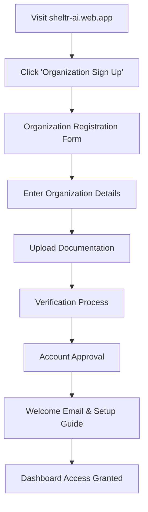

**Key Steps:**
- **Organization Details**: Name, address, contact information, tax ID
- **Documentation**: 501(c)(3) status, operating licenses, insurance certificates
- **Verification**: Background check, reference verification, site visit (if needed)
- **Approval**: 2-5 business days for standard organizations

#### **1.2 Platform Setup**
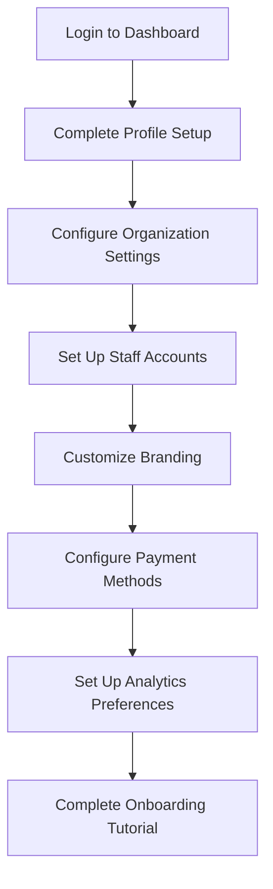

**Setup Components:**
- **Profile**: Mission statement, service areas, capacity limits
- **Staff Management**: Role-based access, training materials
- **Branding**: Logo, colors, custom messaging
- **Payment**: Bank account setup, withdrawal preferences
- **Analytics**: Custom reports, notification preferences

### **Phase 2: Participant Management**

#### **2.1 Participant Onboarding**
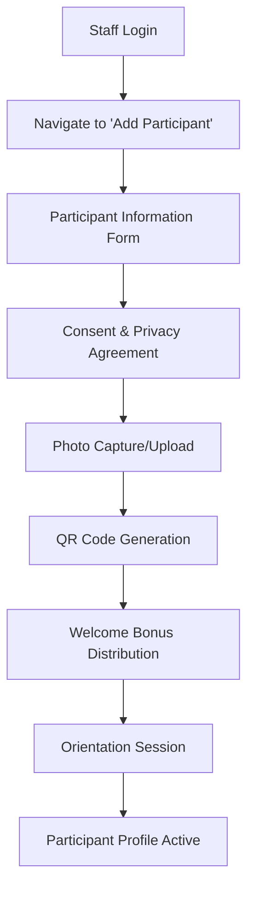

**Onboarding Process:**
- **Information Collection**: Name, DOB, contact info, emergency contacts
- **Consent Forms**: Data usage, photo release, program participation
- **QR Code**: Unique identifier for donations and transactions
- **Welcome Bonus**: 100 SHELTR-S tokens ($100 value) automatically distributed
- **Orientation**: Platform training, wallet setup, usage guidelines

#### **2.2 Ongoing Participant Support**
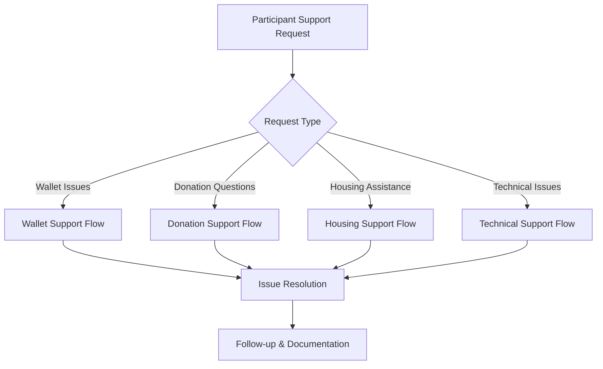

### **Phase 3: Financial Management**

#### **3.1 Donation Processing**
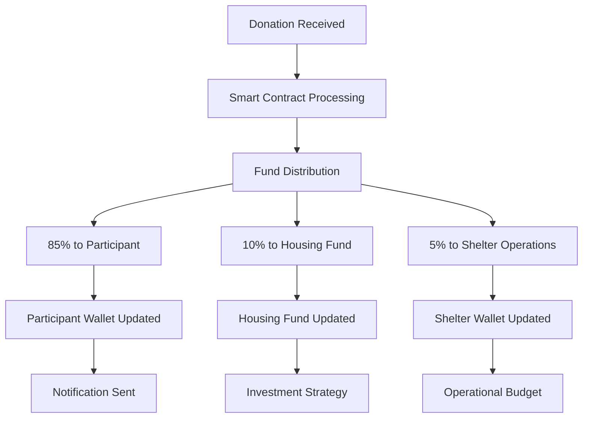

#### **3.2 Revenue Management**
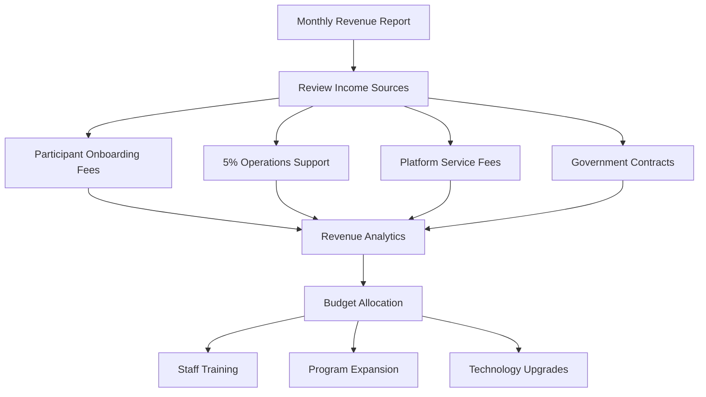

### **Phase 4: Analytics & Reporting**

#### **4.1 Real-Time Dashboard**
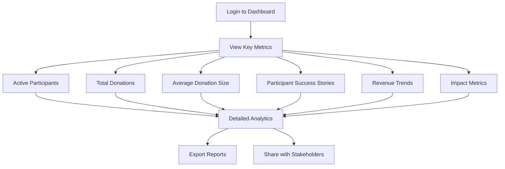

**Dashboard Metrics:**
- **Participant Metrics**: Active users, engagement rates, success stories
- **Financial Metrics**: Total donations, average amounts, revenue trends
- **Impact Metrics**: Housing placements, employment outcomes, stability rates
- **Operational Metrics**: Staff efficiency, program costs, ROI analysis

---

## 👤 **JOURNEY 2: PARTICIPANT USER JOURNEY**

### **Phase 1: Initial Onboarding**

#### **1.1 Registration Process**
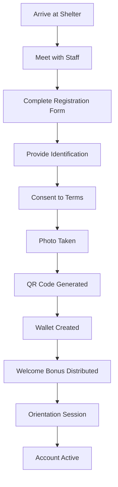

**Registration Details:**
- **Personal Information**: Name, date of birth, contact information
- **Identification**: Government ID, social security number (optional)
- **Consent Forms**: Data usage, photo release, program participation
- **QR Code**: Unique identifier for receiving donations
- **Welcome Bonus**: 100 SHELTR-S tokens ($100) automatically added to wallet

#### **1.2 Wallet Setup & Training**
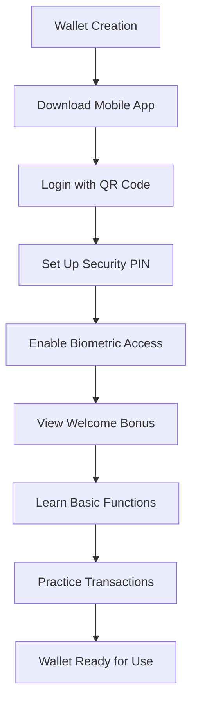

**Wallet Features:**
- **Security**: PIN protection, biometric authentication
- **Balance**: Real-time SHELTR-S token balance
- **Transactions**: Complete history of donations and spending
- **QR Code**: Easy sharing for donations
- **Notifications**: Real-time updates on new donations

### **Phase 2: Receiving Donations**

#### **2.1 Donation Flow**
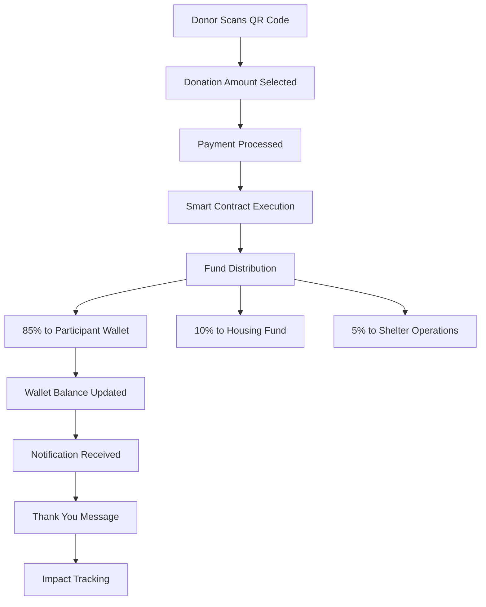

#### **2.2 Donation Management**
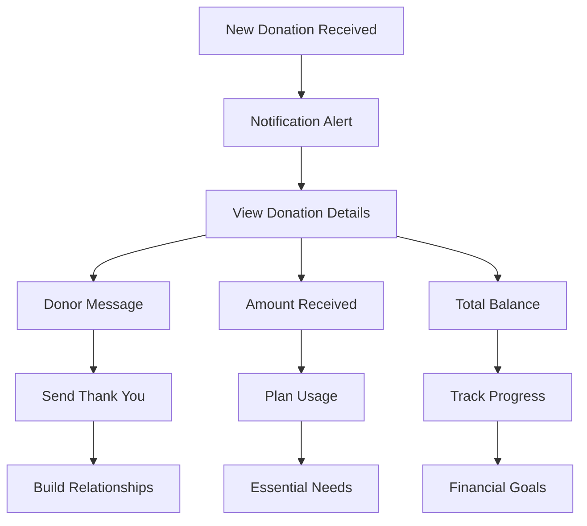

### **Phase 3: Spending & Redemptions**

#### **3.1 Essential Needs Spending**
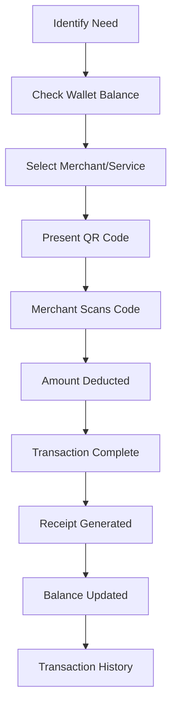

**Spending Categories:**
- **Food & Nutrition**: Groceries, restaurants, meal programs
- **Housing**: Rent assistance, utilities, deposits
- **Transportation**: Public transit, rideshare, vehicle maintenance
- **Healthcare**: Medical expenses, prescriptions, dental care
- **Education**: Classes, books, training programs
- **Employment**: Work clothes, tools, certification fees

#### **3.2 Housing Fund Access**
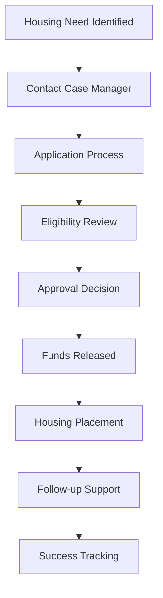

### **Phase 4: Goal Setting & Progress**

#### **4.1 Financial Planning**
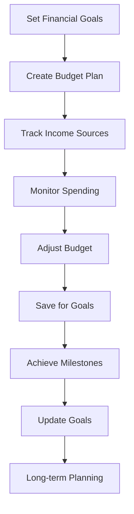

#### **4.2 Progress Tracking**
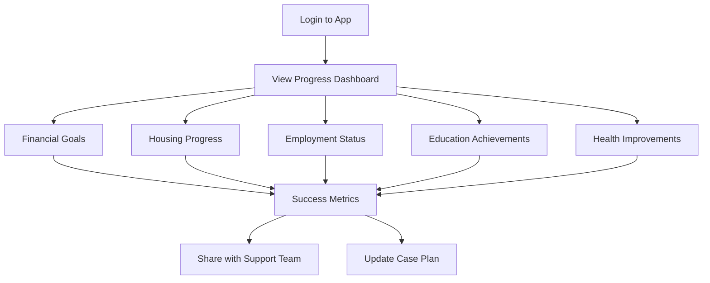

---

## ❤️ **JOURNEY 3: DONOR USER JOURNEY**

### **Phase 1: Discovery & Registration**

#### **1.1 Platform Discovery**
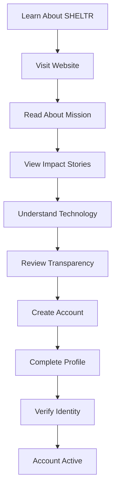

**Discovery Channels:**
- **Social Media**: Facebook, Instagram, Twitter campaigns
- **Word of Mouth**: Friend recommendations, community events
- **Search Engines**: SEO-optimized content, targeted ads
- **Partnerships**: Corporate sponsorships, community organizations
- **Traditional Media**: News coverage, radio interviews

#### **1.2 Account Setup**
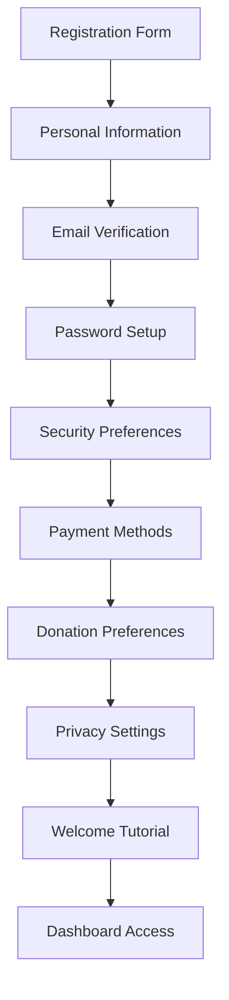

**Setup Components:**
- **Profile**: Name, email, phone, address
- **Security**: Two-factor authentication, password requirements
- **Payment**: Credit card, bank account, crypto wallet
- **Preferences**: Donation frequency, amount ranges, causes
- **Privacy**: Data sharing preferences, communication opt-ins

### **Phase 2: Finding & Connecting with Participants**

#### **2.1 Participant Discovery**
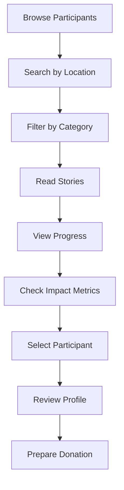

**Discovery Features:**
- **Location-based**: Find participants in your area
- **Category filters**: Veterans, families, youth, seniors
- **Story sharing**: Personal narratives, goals, progress
- **Impact tracking**: Success metrics, housing progress
- **Verification**: Authenticated profiles, verified shelters

#### **2.2 Connection Building**
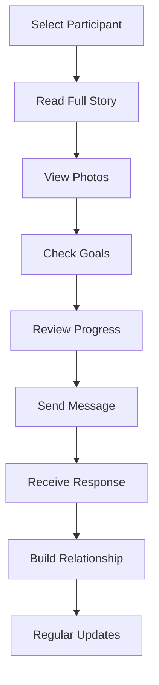

### **Phase 3: Making Donations**

#### **3.1 Donation Process**
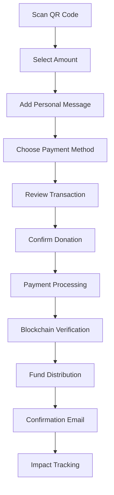

**Donation Options:**
- **One-time**: Immediate donations of any amount
- **Recurring**: Monthly, quarterly, or annual commitments
- **Campaign**: Special fundraising events or causes
- **Matching**: Corporate matching programs
- **Crypto**: Bitcoin, Ethereum, or other cryptocurrencies

#### **3.2 Payment Methods**
```mermaid
flowchart TD
    A[Payment Selection] --> B{Payment Type}
    B -->|Credit Card| C[Secure Processing]
    B -->|Bank Transfer| D[ACH Processing]
    B -->|Crypto| E[Blockchain Transaction]
    B -->|Mobile Pay| F[Apple Pay/Google Pay]
    C --> G[Transaction Complete]
    D --> G
    E --> G
    F --> G
    G --> H[Receipt Generated]
    H --> I[Tax Documentation]
```

### **Phase 4: Impact Tracking & Engagement**

#### **4.1 Real-Time Impact**
```mermaid
flowchart TD
    A[Donation Made] --> B[Immediate Confirmation]
    B --> C[Fund Distribution Tracking]
    C --> D[85% to Participant]
    C --> E[10% to Housing Fund]
    C --> F[5% to Shelter Operations]
    D --> G[Participant Notification]
    E --> H[Housing Fund Growth]
    F --> I[Shelter Support]
    G --> J[Thank You Message]
    H --> K[Long-term Impact]
    I --> L[Operational Support]
```

#### **4.2 Ongoing Engagement**
```mermaid
flowchart TD
    A[Regular Updates] --> B[Progress Reports]
    B --> C[Success Stories]
    C --> D[Impact Metrics]
    D --> E[Financial Transparency]
    E --> F[Community Events]
    F --> G[Volunteer Opportunities]
    G --> H[Advocacy Campaigns]
    H --> I[Continued Support]
```

**Engagement Features:**
- **Progress Updates**: Regular reports on participant progress
- **Success Stories**: Real stories of transformation and achievement
- **Impact Metrics**: Quantified results and outcomes
- **Financial Transparency**: Complete visibility into fund usage
- **Community Events**: Opportunities to meet participants and staff
- **Volunteer Programs**: Hands-on involvement opportunities

### **Phase 5: Advanced Features**

#### **5.1 Donor Dashboard**
```mermaid
flowchart TD
    A[Login to Dashboard] --> B[View Donation History]
    B --> C[Track Impact Metrics]
    C --> D[Manage Recurring Donations]
    D --> E[Update Payment Methods]
    E --> F[Download Tax Receipts]
    F --> G[Share Success Stories]
    G --> H[Invite Friends]
    H --> I[Participate in Campaigns]
```

**Dashboard Features:**
- **Donation History**: Complete record of all contributions
- **Impact Tracking**: Real-time updates on how donations help
- **Recurring Management**: Easy modification of ongoing commitments
- **Tax Documentation**: Automated receipt generation
- **Social Sharing**: Tools to spread awareness and invite others
- **Campaign Participation**: Special fundraising events and challenges

#### **5.2 Community Building**
```mermaid
flowchart TD
    A[Community Features] --> B[Donor Forums]
    B --> C[Success Story Sharing]
    C --> D[Volunteer Coordination]
    D --> E[Advocacy Campaigns]
    E --> F[Educational Content]
    F --> G[Networking Events]
    G --> H[Impact Reporting]
```

---

## 🔄 **CROSS-JOURNEY INTERACTIONS**

### **Donor-Participant Connection**
```mermaid
flowchart TD
    A[Donor Discovers Participant] --> B[Reads Story & Goals]
    B --> C[Makes First Donation]
    C --> D[Participant Receives Funds]
    D --> E[Participant Sends Thank You]
    E --> F[Donor Receives Update]
    F --> G[Progress Tracking]
    G --> H[Continued Support]
    H --> I[Relationship Building]
    I --> J[Long-term Impact]
```

### **Shelter-Participant Support**
```mermaid
flowchart TD
    A[Shelter Onboards Participant] --> B[Provides Training]
    B --> C[Monitors Progress]
    C --> D[Offers Support Services]
    D --> E[Tracks Success Metrics]
    E --> F[Adjusts Support Plan]
    F --> G[Achieves Goals]
    G --> H[Graduation/Transition]
    H --> I[Ongoing Follow-up]
```

### **Platform Analytics Integration**
```mermaid
flowchart TD
    A[All User Actions] --> B[Data Collection]
    B --> C[Analytics Processing]
    C --> D[Impact Measurement]
    D --> E[Success Metrics]
    E --> F[Transparency Reports]
    F --> G[Continuous Improvement]
    G --> H[Platform Evolution]
```

---

## 📊 **SUCCESS METRICS & KPIs**

### **Shelter Metrics**
- **Participant Onboarding**: Time to complete, success rate
- **Financial Performance**: Revenue growth, operational efficiency
- **Impact Outcomes**: Housing success, employment rates, stability
- **Staff Satisfaction**: Platform adoption, training completion

### **Participant Metrics**
- **Engagement**: App usage, transaction frequency
- **Financial Progress**: Savings growth, goal achievement
- **Housing Success**: Placement rates, stability duration
- **Life Improvements**: Employment, education, health outcomes

### **Donor Metrics**
- **Engagement**: Platform usage, donation frequency
- **Retention**: Repeat donation rates, long-term commitment
- **Impact**: Total contributions, participant connections
- **Satisfaction**: Platform experience, transparency ratings

---

## 🚀 **IMPLEMENTATION ROADMAP**

### **Phase 1: Core Journeys (Q4 2025)**
- Basic onboarding flows for all user types
- Essential wallet and donation functionality
- Core analytics and reporting

### **Phase 2: Enhanced Features (Q1 2026)**
- Advanced analytics and insights
- Community building features
- Mobile app optimization

### **Phase 3: Advanced Integration (Q2 2026)**
- AI-powered recommendations
- Advanced reporting and insights
- Third-party integrations

### **Phase 4: Scale & Optimize (Q3-Q4 2026)**
- Performance optimization
- Advanced features and capabilities
- International expansion preparation

---

*This document serves as the foundation for front-end user journey implementation and will be updated as user feedback and platform evolution inform design decisions.*

---

**Document Version**: 1.0.0  
**Last Updated**: August 2025  
**Next Review**: September 2025  
**Status**: Ready for Front-End Implementation
