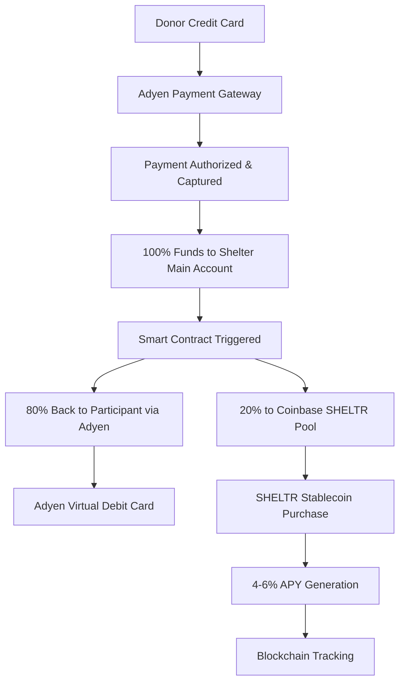
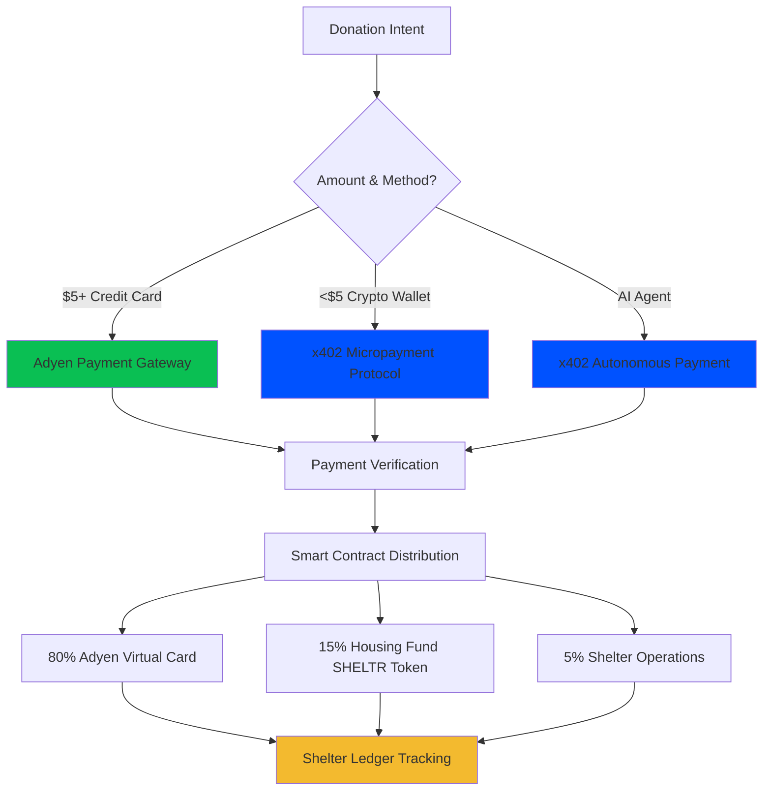
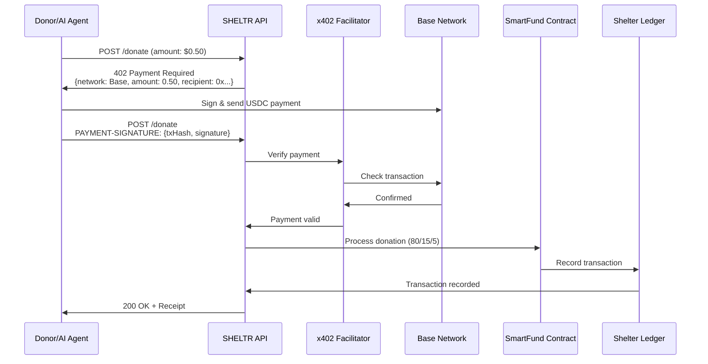

# Unified Payment Architecture v3.0
*Single-Token Stable Fund System*

**Document Version**: 3.0.0  
**Last Updated**: December 16, 2025  
**Status**: Strategic Architecture Review  
**Lead Architect**: JY-CTO

---

## 🎯 **Executive Summary**

Following extensive analysis by our partner and payments expert DK, SHELTR is pivoting from a dual-token architecture to a **Single Stable Token Investment Fund** model. This revolutionary approach eliminates market volatility risks, reduces complexity, and provides guaranteed returns while maintaining complete blockchain transparency.

**Key Innovation**: Direct credit card donations → Adyen payment rails → Smart contract distribution → 80% participant debit cards + 20% Base SHELTR Stablecoin pool generating 4-6% APY.

---

## 🚨 **Strategic Pivot: Why Single Token?**

### **DK Expert Analysis**

> *"The dual-token architecture introduces unnecessary complexity and market volatility risk for vulnerable populations. A traditional funding approach with a single utility token pegged to USDT provides stability, guaranteed returns, and eliminates ICO stigma while maintaining our mission integrity."*

### **Problems Solved**
- ❌ **Market Volatility Risk**: Eliminated through USDT pegging
- ❌ **ICO Stigma**: Avoided through traditional funding + utility token
- ❌ **Complex Architecture**: Simplified to single stable token
- ❌ **Participant Risk**: Zero crypto exposure for 80% allocation
- ❌ **Regulatory Uncertainty**: Clear utility token classification

---

## 💳 **New Payment Flow Architecture**

### **Phase 1: Donation Processing (Adyen)**



### **Phase 2: Fund Distribution**

| **Allocation** | **Amount** | **Method** | **Timeline** | **Risk Level** |
|----------------|------------|------------|--------------|----------------|
| **Participant Direct** | 80% | Adyen Virtual Debit Card | Immediate | Zero |
| **Housing Investment Fund** | 15% | SHELTR Stablecoin Pool | Immediate | Minimal |
| **Shelter Operations** | 5% | Direct Transfer | Immediate | Zero |

---

## 🏗️ **Technical Architecture**

### **1. Adyen Integration Layer**

#### **Payment Processing**
```typescript
interface AdyenPaymentFlow {
  // Donation capture
  creditCardDonation: {
    processor: 'Adyen Payment Gateway',
    methods: ['Visa', 'Mastercard', 'American Express', 'Digital Wallets'],
    fees: '2.9% + $0.30 per transaction',
    settlement: 'T+1 to shelter main account'
  },
  
  // Participant payout
  participantPayout: {
    method: 'Adyen Issuing API',
    product: 'Virtual Debit Card',
    speed: 'Real-time (< 30 seconds)',
    usage: 'Global ATM + POS acceptance'
  }
}
```

#### **Adyen Issuing Integration**
```python
# Participant virtual card creation
async def create_participant_card(participant_id: str, initial_balance: float):
    """
    Create virtual debit card for participant using Adyen Issuing
    """
    adyen_request = {
        "accountHolderCode": f"SHELTR-{participant_id}",
        "cardholderName": participant.display_name,
        "initialBalance": {
            "currency": "USD",
            "value": int(initial_balance * 100)  # Convert to cents
        },
        "cardType": "virtual",
        "restrictions": {
            "merchantCategories": ["grocery", "pharmacy", "gas_stations", "restaurants"],
            "dailyLimit": {"currency": "USD", "value": 50000}  # $500 daily limit
        }
    }
    
    response = adyen.issuing.create_card(adyen_request)
    return response
```

### **2. Coinbase Base Integration**

#### **SHELTR Stablecoin Contract**
```solidity
// SHELTR Utility Token - USDT Pegged
contract SHELTRStablecoin is ERC20 {
    IERC20 public usdt;
    uint256 public constant PEG_RATE = 1e18; // 1:1 with USDT
    
    // Coinbase staking integration
    address public coinbaseStakingPool;
    uint256 public targetAPY = 500; // 5.00% APY
    
    function depositHousingFund(uint256 usdtAmount) external onlyAuthorized {
        // Convert USDT to SHELTR tokens
        usdt.transferFrom(msg.sender, address(this), usdtAmount);
        
        // Mint SHELTR tokens to housing fund
        _mint(housingFundAddress, usdtAmount);
        
        // Stake in Coinbase for guaranteed returns
        stakeToCoinbase(usdtAmount);
        
        emit HousingFundDeposit(usdtAmount, block.timestamp);
    }
    
    function stakeToCoinbase(uint256 amount) internal {
        // Integrate with Coinbase staking API
        // Guaranteed 4-6% APY on staked USDT
    }
}
```

### **3. Smart Contract Distribution Logic**

```solidity
contract SHELTRPaymentDistributor {
    IAdyenPayout public adyenPayout;
    ISHELTRStablecoin public sheltrToken;
    
    struct DonationSplit {
        uint256 participantAmount;    // 80%
        uint256 housingFundAmount;    // 15%
        uint256 shelterOpsAmount;     // 5%
    }
    
    function processDonation(
        address participant,
        uint256 totalAmount,
        bytes32 adyenTransactionId
    ) external onlyAuthorized {
        
        DonationSplit memory split = calculateSplit(totalAmount);
        
        // 1. Send 80% back to participant via Adyen virtual card
        adyenPayout.loadParticipantCard(
            participant, 
            split.participantAmount,
            adyenTransactionId
        );
        
        // 2. Convert 15% to SHELTR stablecoin and stake
        sheltrToken.depositHousingFund(split.housingFundAmount);
        
        // 3. Transfer 5% to shelter operations
        transferToShelter(participant, split.shelterOpsAmount);
        
        // 4. Record everything on blockchain
        emit DonationProcessed(
            participant,
            totalAmount,
            split,
            block.timestamp
        );
    }
    
    function calculateSplit(uint256 amount) internal pure returns (DonationSplit memory) {
        return DonationSplit({
            participantAmount: (amount * 80) / 100,
            housingFundAmount: (amount * 15) / 100,
            shelterOpsAmount: (amount * 5) / 100
        });
    }
}
```

---

## 🌐 **x402 Micropayment Layer (Phase 2027+)**

### Strategic Overview

The **x402 payment protocol** provides a complementary payment rail for micropayments, AI agent transactions, and machine-to-machine operations alongside our primary Adyen infrastructure. This is **NOT** a replacement for Adyen but rather an enhancement that enables use cases where traditional payment rails are impractical due to fee structures.

### Dual Payment Rail Architecture



### Payment Rail Comparison

| **Payment Method** | **Use Case** | **Processor** | **Min Amount** | **Fees** | **Settlement** |
|--------------------|--------------|---------------|----------------|----------|----------------|
| **Credit Card** | Traditional donations | Adyen | $5.00 | 2.9% + $0.30 | T+1 |
| **x402 Micropayments** | Crypto/AI donations | Coinbase x402 | $0.10 | ~$0.01 (Base) | Instant |
| **Virtual Card Load** | Participant payouts | Adyen Issuing | N/A | $0.10/txn | Real-time |
| **Institutional Staking** | Housing fund growth | Coinbase Prime | N/A | 0.25% mgmt | Daily |

### x402 Use Cases

#### 1. **Micropayment Donations ($0.10 - $5.00)**

**Problem**: Traditional payment rails make small donations impractical
```
$0.50 donation via Adyen:
├── Donation: $0.50
├── Adyen Fee: $0.30 (2.9% + $0.30)
├── Net to Platform: $0.20
└── Efficiency: 40% (impractical)

$0.50 donation via x402:
├── Donation: $0.50
├── Base Network Fee: $0.01
├── Net to Platform: $0.49
└── Efficiency: 98% (practical)
```

**Solution**: x402 enables meaningful sub-$5 donations with minimal fees

#### 2. **AI Agent Autonomous Giving**

**Capability**: AI agents donate automatically without human intervention
```typescript
// Example: ChatGPT plugin donates $0.25 per helpful interaction
interface AIAgentDonation {
  trigger: 'helpful_interaction' | 'task_completion' | 'daily_quota',
  amount: 0.25, // $0.25 per trigger
  participant: 'participant_blockchain_address',
  autonomous: true, // No human approval needed
  paymentMethod: 'x402' // Programmatic payment
}
```

**Benefit**: New donor segment (autonomous systems, AI assistants, bots)

#### 3. **Partner API Monetization**

**Model**: External services pay per API request
```typescript
// Example: Research organization accessing shelter data
const apiPricing = {
  participantData: 0.01,      // $0.01 per participant record
  donationHistory: 0.05,       // $0.05 per donation query
  aggregateMetrics: 0.10,      // $0.10 per aggregate report
  realTimeUpdates: 0.02        // $0.02 per webhook notification
};

// x402 enables automatic per-request billing
// No complex invoicing, subscriptions, or billing systems
```

**Revenue**: New income stream for platform sustainability

#### 4. **Machine-to-Machine SmartFund Operations**

**Capability**: Automated fund management between systems
```typescript
// Example: Automated housing fund rebalancing
interface M2MOperation {
  source: 'external_fund_manager',
  operation: 'rebalance_housing_fund',
  amount: 1000.00,
  paymentMethod: 'x402',
  autonomous: true,
  smartContract: 'SHELTRPaymentDistributor'
}
```

### Technical Integration

#### x402 Payment Flow



#### Smart Contract Integration

```solidity
// Enhanced SHELTRPaymentDistributor with x402 support
contract SHELTRPaymentDistributor {
    // Existing Adyen integration
    IAdyenPayout public immutable adyenPayout;
    
    // NEW: x402 integration
    IX402Facilitator public immutable x402Facilitator;
    mapping(bytes32 => bool) public processedX402Payments;
    
    event X402DonationProcessed(
        bytes32 indexed x402TxHash,
        address indexed participant,
        uint256 amount,
        string paymentType
    );
    
    /**
     * @dev Process x402 micropayment donation
     * @param x402TxHash Transaction hash from x402 payment
     * @param participant Recipient participant
     * @param amount Donation amount in USDC
     * @param signature Payment signature from facilitator
     */
    function processX402Donation(
        bytes32 x402TxHash,
        address participant,
        uint256 amount,
        bytes calldata signature
    ) external nonReentrant whenNotPaused {
        require(!processedX402Payments[x402TxHash], "Payment already processed");
        require(amount >= 0.10 ether && amount <= 5.00 ether, "Amount out of range");
        
        // Verify payment through x402 facilitator
        require(
            x402Facilitator.verifyPayment(x402TxHash, amount, signature),
            "Invalid x402 payment"
        );
        
        // Mark as processed
        processedX402Payments[x402TxHash] = true;
        
        // Apply standard SmartFund distribution
        DonationSplit memory split = _calculateSplit(amount);
        
        // 1. Load 80% to Adyen virtual card
        adyenPayout.loadParticipantCard(
            participant,
            split.participantAmount,
            x402TxHash
        );
        
        // 2. Deposit 15% to housing fund
        sheltrToken.depositHousingFund(participant, split.housingFundAmount);
        
        // 3. Handle shelter operations (5%)
        _handleShelterOperations(participant, split.shelterOpsAmount);
        
        emit X402DonationProcessed(x402TxHash, participant, amount, "micropayment");
    }
}
```

#### Backend API Integration

```python
# apps/api/routers/x402_donations.py
from fastapi import APIRouter, HTTPException, Response
from pydantic import BaseModel
from decimal import Decimal

router = APIRouter(prefix="/api/v2/donations/x402", tags=["x402-micropayments"])

class X402DonationRequest(BaseModel):
    participant_id: str
    amount: Decimal  # $0.10 - $5.00

@router.post("/create")
async def create_x402_donation(
    request: X402DonationRequest,
    response: Response
):
    """
    Create x402 micropayment donation request
    Returns HTTP 402 Payment Required with payment instructions
    """
    # Validate amount range
    if request.amount < Decimal('0.10') or request.amount > Decimal('5.00'):
        raise HTTPException(
            status_code=400,
            detail="x402 payments must be between $0.10 and $5.00. Use Adyen for larger amounts."
        )
    
    # Get participant blockchain address
    participant = await get_participant(request.participant_id)
    
    # Create x402 payment request
    payment_request = {
        "network": "eip155:8453",  # Base network
        "amount": str(request.amount),
        "currency": "USDC",
        "recipient": os.getenv('SHELTR_DISTRIBUTOR_ADDRESS'),
        "facilitator": "https://facilitator.coinbase.com",
        "metadata": {
            "participant_id": request.participant_id,
            "participant_address": participant.blockchain_address,
            "payment_type": "micropayment_donation",
            "sheltr_smartfund": "true"
        }
    }
    
    # Return 402 Payment Required
    response.status_code = 402
    response.headers["PAYMENT-REQUIRED"] = json.dumps(payment_request)
    
    return {
        "status": 402,
        "message": "Payment required",
        "payment_instructions": payment_request
    }

@router.post("/verify")
async def verify_x402_payment(
    x402_tx_hash: str,
    participant_id: str,
    amount: Decimal,
    signature: str
):
    """
    Verify x402 payment and process donation
    """
    # Verify through Coinbase facilitator
    verification = await x402_service.verify_payment(
        tx_hash=x402_tx_hash,
        expected_amount=amount,
        signature=signature
    )
    
    if not verification.valid:
        raise HTTPException(status_code=400, detail="Invalid payment")
    
    # Process through smart contract
    tx_hash = await blockchain_service.process_x402_donation(
        x402_tx_hash=x402_tx_hash,
        participant_id=participant_id,
        amount=amount,
        signature=signature
    )
    
    return {
        "success": True,
        "verified": True,
        "x402_tx_hash": x402_tx_hash,
        "blockchain_tx_hash": tx_hash,
        "distribution": {
            "participant_card": float(amount * Decimal('0.80')),
            "housing_fund": float(amount * Decimal('0.15')),
            "operations": float(amount * Decimal('0.05'))
        }
    }
```

### Economic Impact Analysis

#### Cost Savings Comparison

```typescript
// Scenario: 1,000 daily micropayments averaging $0.50
interface EconomicComparison {
  traditional_adyen: {
    dailyDonations: 1000,
    averageAmount: 0.50,
    totalVolume: 500.00,
    adyenFees: 300.00,      // $0.30 per transaction
    netRevenue: 200.00,      // 40% efficiency
    practical: false         // Impractical due to high fees
  },
  
  x402_protocol: {
    dailyDonations: 1000,
    averageAmount: 0.50,
    totalVolume: 500.00,
    baseFees: 10.00,         // ~$0.01 per transaction
    netRevenue: 490.00,      // 98% efficiency
    practical: true          // Enables meaningful micropayments
  },
  
  annualImpact: {
    additionalRevenue: 105850,  // $290/day * 365 days
    newDonorSegment: 'crypto_native_ai_agents',
    platformSustainability: 'significantly_improved'
  }
}
```

#### Revenue Projections

**Conservative Estimates (Year 1 of x402 Integration)**

| **Revenue Stream** | **Daily** | **Monthly** | **Annual** |
|-------------------|-----------|-------------|------------|
| Micropayment Donations | $490 | $14,700 | $176,400 |
| AI Agent Giving | $250 | $7,500 | $90,000 |
| Partner API Access | $500 | $15,000 | $180,000 |
| **Total x402 Revenue** | **$1,240** | **$37,200** | **$446,400** |

**Growth Projections (Year 3)**

| **Revenue Stream** | **Annual** | **Growth Factor** |
|-------------------|------------|-------------------|
| Micropayment Donations | $529,200 | 3x |
| AI Agent Giving | $270,000 | 3x |
| Partner API Access | $540,000 | 3x |
| **Total x402 Revenue** | **$1,339,200** | **3x** |

### Integration with Shelter Ledger

All x402 payments are **fully tracked** on the Shelter Ledger alongside traditional Adyen donations:

```typescript
interface ShelterLedgerEntry {
  donationId: string;
  paymentMethod: 'adyen' | 'x402_micropayment' | 'x402_ai_agent' | 'x402_api';
  amount: number;
  participant: string;
  donor: string | 'autonomous_agent';
  timestamp: number;
  blockchainTx: string;
  x402TxHash?: string;
  verified: boolean;
  distribution: {
    participantCard: number;    // 80%
    housingFund: number;         // 15%
    operations: number;          // 5%
  };
}
```

### Security & Compliance

#### x402-Specific Security Measures

1. **Payment Verification**
   - Coinbase CDP facilitator verification
   - Cryptographic signature validation
   - Double-spend prevention via transaction hash tracking

2. **Amount Limits**
   - Minimum: $0.10 (prevent dust attacks)
   - Maximum: $5.00 (route larger amounts to Adyen)
   - Rate limiting per participant/donor

3. **Smart Contract Security**
   - ReentrancyGuard on all payment functions
   - Pausable for emergency situations
   - Multi-sig admin controls

4. **Regulatory Compliance**
   - Same KYC/AML as Adyen (for participants)
   - Blockchain transparency via Shelter Ledger
   - GDPR/CCPA compliant data handling

### Implementation Roadmap

#### Phase 1: Research & Prototyping (Q2 2027)
- [ ] x402 SDK integration testing
- [ ] Micropayment flow prototyping
- [ ] Cost-benefit analysis refinement
- [ ] Security audit preparation
- [ ] Stakeholder approval

#### Phase 2: Smart Contract Development (Q3 2027)
- [ ] X402PaymentProcessor contract development
- [ ] Integration with existing SHELTRPaymentDistributor
- [ ] Shelter Ledger x402 tracking enhancements
- [ ] Smart contract security audits
- [ ] Testnet deployment and testing

#### Phase 3: Backend Integration (Q3 2027)
- [ ] x402 payment service implementation
- [ ] API endpoint development
- [ ] Coinbase facilitator integration
- [ ] Webhook handling for payment verification
- [ ] Monitoring and alerting setup

#### Phase 4: Frontend Integration (Q4 2027)
- [ ] x402 donation UI components
- [ ] Wallet connection (Coinbase Wallet, WalletConnect)
- [ ] Payment flow user experience
- [ ] Mobile optimization
- [ ] User education materials

#### Phase 5: Production Launch (Q4 2027)
- [ ] Mainnet smart contract deployment
- [ ] Production API deployment
- [ ] Monitoring dashboard
- [ ] User documentation
- [ ] Marketing campaign for micropayments

#### Phase 6: Ecosystem Expansion (2028)
- [ ] AI agent integration framework
- [ ] Partner API monetization platform
- [ ] M2M SmartFund automation
- [ ] International expansion
- [ ] Advanced analytics

### Success Metrics

#### Technical KPIs
- **Payment Success Rate**: >99.5% for x402 transactions
- **Transaction Speed**: <30 seconds average confirmation
- **Gas Optimization**: <$0.02 per transaction on Base
- **System Uptime**: 99.9% availability
- **API Response Time**: <200ms average

#### Business KPIs
- **Micropayment Volume**: $500K+ in Year 1
- **New Donor Acquisition**: 10,000+ crypto-native donors
- **AI Agent Integrations**: 50+ autonomous giving systems
- **Partner API Revenue**: $180K+ annually
- **Cost Savings**: 51-99% vs traditional rails

#### Impact KPIs
- **Additional Participants Served**: 2,500+ via micropayments
- **Housing Fund Growth**: +$75K from x402 allocations
- **Platform Sustainability**: +$446K annual revenue
- **Donor Satisfaction**: >4.5/5 rating for x402 experience

### Competitive Advantages

**vs Traditional Payment Rails**
- ✅ 51-99% cost savings on small transactions
- ✅ Instant settlement vs T+1 delays
- ✅ Programmable payments for automation
- ✅ Global reach without currency conversion

**vs Other Crypto Solutions**
- ✅ Fee-free via Coinbase facilitator
- ✅ Enterprise-grade infrastructure
- ✅ Regulatory compliance built-in
- ✅ Seamless integration with Adyen

**vs Competitors**
- ✅ First homeless services platform with x402
- ✅ Dual payment rail strategy (Adyen + x402)
- ✅ AI agent giving ecosystem
- ✅ Complete transparency via Shelter Ledger

---

## 🎯 **Coinbase Integration Strategy**

### **Corporate Account Setup**
```typescript
interface CoinbaseIntegration {
  account: {
    type: 'Coinbase Prime' | 'Coinbase Institutional',
    features: ['Custody', 'Staking', 'Trading', 'Reporting'],
    compliance: 'SOC 2 Type II, FDIC insured'
  },
  
  stakingStrategy: {
    asset: 'USDT',
    targetAPY: '4-6%',
    strategy: 'Conservative fixed income',
    liquidity: 'Daily redemption available',
    risk: 'Minimal - institutional grade'
  },
  
  sheltrToken: {
    network: 'Base (Coinbase L2)',
    standard: 'ERC-20',
    backing: '1:1 USDT reserve',
    utility: 'Housing fund tracking + governance'
  }
}
```

### **Staking & Yield Generation**
```python
class CoinbaseStakingService:
    def __init__(self):
        self.client = CoinbasePrimeClient()
        self.target_apy = 0.05  # 5% target
        
    async def stake_housing_fund(self, usdt_amount: Decimal):
        """
        Stake USDT in Coinbase institutional staking
        """
        staking_request = {
            "asset": "USDT",
            "amount": str(usdt_amount),
            "strategy": "conservative_yield",
            "auto_compound": True,
            "liquidity_preference": "daily"
        }
        
        response = await self.client.create_stake(staking_request)
        
        # Mint equivalent SHELTR tokens for tracking
        await self.mint_sheltr_tokens(usdt_amount, response.stake_id)
        
        return response
        
    async def get_yield_performance(self):
        """
        Track actual vs target APY performance
        """
        stakes = await self.client.get_active_stakes()
        total_yield = sum(stake.accrued_interest for stake in stakes)
        
        return {
            "total_staked": sum(stake.principal for stake in stakes),
            "total_yield": total_yield,
            "current_apy": self.calculate_apy(stakes),
            "target_apy": self.target_apy
        }
```

---

## 💰 **Financial Model & Projections**

### **Revenue & Cost Structure**

| **Component** | **Cost/Revenue** | **Notes** |
|---------------|------------------|-----------|
| **Adyen Processing** | 2.9% + $0.30/txn | Industry standard |
| **Adyen Issuing** | $2-5/card + $0.10/txn | Virtual card costs |
| **Coinbase Staking** | 0.25% management fee | Institutional rates |
| **Base Network** | ~$0.01/transaction | L2 efficiency |
| **SHELTR Operations** | 5% of donations | Sustainable funding |

### **Participant Economics**
```
Example: $100 Donation
├── Adyen Fee: $3.20 (3.2%)
├── Net to Distribute: $96.80
├── Participant Receives: $77.44 (80% of net)
├── Housing Fund: $14.52 (15% of net) → 5% APY = $0.73/year
├── Shelter Ops: $4.84 (5% of net)
└── Total Impact: 100% transparent + guaranteed growth
```

### **Housing Fund Growth Model**
```python
def calculate_housing_fund_growth(years: int, monthly_donations: float):
    """
    Calculate housing fund growth with compound interest
    """
    annual_deposits = monthly_donations * 12 * 0.15  # 15% allocation
    apy = 0.05  # 5% conservative estimate
    
    total_value = 0
    for year in range(years):
        total_value = (total_value + annual_deposits) * (1 + apy)
    
    return total_value

# Example: $10K monthly donations over 5 years
# Year 1: $18K housing fund
# Year 5: $118K housing fund (compound growth)
```

---

## 🔐 **Security & Compliance**

### **Regulatory Compliance**
- **Money Transmitter Licenses**: Adyen handles all MSB requirements
- **KYC/AML**: Integrated through Adyen's compliance infrastructure
- **FDIC Insurance**: Coinbase institutional custody protection
- **SOX Compliance**: Financial reporting and audit trails
- **Utility Token Classification**: Clear non-security status

### **Smart Contract Security**
```solidity
// Multi-signature treasury management
contract SHELTRTreasury {
    mapping(address => bool) public authorizedSigners;
    uint256 public constant REQUIRED_SIGNATURES = 3;
    
    modifier onlyMultiSig() {
        require(validateSignatures(msg.data), "Insufficient signatures");
        _;
    }
    
    function emergencyPause() external onlyMultiSig {
        // Pause all operations in case of security threat
        _pause();
    }
}
```

### **Participant Protection**
- **Zero Crypto Exposure**: 80% allocation never touches blockchain
- **Guaranteed Stability**: Housing fund backed by USDT + institutional staking
- **Instant Liquidity**: Adyen virtual cards work globally
- **Privacy Protection**: Blockchain addresses pseudonymous
- **Fraud Protection**: Adyen's advanced fraud detection

---

## 🚀 **Implementation Roadmap**

### **Phase 1: Foundation (Q2 2026)**
- [ ] Adyen merchant account setup and integration
- [ ] Coinbase Prime institutional account
- [ ] SHELTR stablecoin deployment on Base
- [ ] Smart contract audit and deployment
- [ ] Initial funding round (traditional equity/debt)

### **Phase 2: Integration (Q3 2026)**
- [ ] Adyen Issuing API integration
- [ ] Coinbase staking automation
- [ ] Participant onboarding system
- [ ] Shelter partner integrations
- [ ] Beta testing with select shelters

### **Phase 3: Scale (2027)**
- [ ] Multi-shelter deployment
- [ ] Advanced analytics dashboard
- [ ] Mobile app with card management
- [ ] International expansion planning
- [ ] Regulatory compliance expansion

### **Phase 4: Optimization (2028)**
- [ ] AI-powered yield optimization
- [ ] Advanced fraud detection
- [ ] Cross-border payment support
- [ ] Enterprise shelter partnerships
- [ ] Impact measurement automation

---

## 📊 **Success Metrics & KPIs**

### **Financial Performance**
- **Housing Fund APY**: Target 4-6% annually
- **Participant Card Usage**: >80% monthly activity
- **Transaction Success Rate**: >99.5%
- **Cost per Transaction**: <$0.50 all-in
- **Housing Fund Growth**: $1M+ by end of Year 2

### **Operational Excellence**
- **Card Issuance Time**: <30 seconds
- **Donation Processing**: <2 minutes end-to-end
- **System Uptime**: 99.9%
- **Participant Satisfaction**: >4.5/5.0
- **Shelter Partner Retention**: >95%

### **Social Impact**
- **Participants Served**: 10,000+ in Year 2
- **Housing Placements**: 2,500+ successful transitions
- **Donation Volume**: $5M+ processed annually
- **Shelter Partners**: 100+ active integrations
- **Geographic Coverage**: 50+ cities

---

## 💡 **Competitive Advantages**

### **vs Traditional Charity**
- ✅ **100% Transparency**: Every dollar tracked on blockchain
- ✅ **Guaranteed Growth**: 4-6% APY vs 0% traditional
- ✅ **Instant Impact**: Real-time fund distribution
- ✅ **Zero Overhead**: Participants receive full allocation

### **vs Crypto Solutions**
- ✅ **Zero Volatility**: No market risk for participants
- ✅ **Mainstream Adoption**: Credit cards + debit cards
- ✅ **Regulatory Clarity**: No ICO or security token issues
- ✅ **Institutional Backing**: Coinbase + Adyen partnership

### **vs Fintech Apps**
- ✅ **Social Mission**: Purpose-built for homelessness
- ✅ **Guaranteed Returns**: Institutional staking vs variable
- ✅ **Complete Ecosystem**: Donation + distribution + growth
- ✅ **Blockchain Verification**: Immutable impact tracking

---

## 🤝 **Partnership Strategy**

### **Adyen Partnership Benefits**
- **Global Reach**: 70+ countries, 150+ currencies
- **Enterprise Grade**: Handles Uber, Spotify, McDonald's
- **Compliance Built-in**: All regulatory requirements covered
- **Innovation Access**: Latest payment technologies
- **Dedicated Support**: Enterprise relationship management

### **Coinbase Partnership Benefits**
- **Institutional Custody**: $130B+ assets under custody
- **Regulatory Leadership**: Clear compliance framework
- **Base Network**: Optimized L2 for our use case
- **Staking Infrastructure**: Proven yield generation
- **Brand Trust**: Mainstream crypto adoption leader

### **Shelter Network Integration**
```typescript
interface ShelterPartnership {
  onboarding: {
    apiIntegration: 'RESTful API + webhooks',
    participantSync: 'Real-time data synchronization',
    reporting: 'Custom dashboard + analytics',
    training: 'Staff onboarding + support'
  },
  
  revenue: {
    operationalSupport: '5% of donations to shelter',
    technologyFee: '$0 (covered by platform)',
    cardIssuance: '$0 (covered by platform)',
    additionalServices: 'Custom pricing'
  }
}
```

---

## 🔮 **Future Innovations**

### **Advanced Features (2027+)**
- **AI-Powered Yield Optimization**: Dynamic staking strategies
- **Biometric Card Security**: Enhanced participant protection
- **Cross-Border Remittances**: International family support
- **Impact NFTs**: Verifiable outcome certificates
- **Corporate CSR Integration**: Enterprise giving platforms

### **Emerging Technologies**
- **Central Bank Digital Currencies (CBDCs)**: Integration readiness
- **Quantum-Resistant Security**: Future-proof cryptography
- **IoT Payment Integration**: Smart city infrastructure
- **AR/VR Interfaces**: Next-generation user experience

---

## 📚 **Technical Documentation References**

### **Adyen Documentation**
- [Adyen Online Payments](https://docs.adyen.com/online-payments/)
- [Adyen Issuing API](https://docs.adyen.com/issuing/)
- [Adyen Payouts](https://docs.adyen.com/payouts/)

### **Base/Coinbase Documentation**
- [Base Crypto Payments](https://docs.base.org/cookbook/accept-crypto-payments)
- [Base App Coins](https://docs.base.org/cookbook/base-app-coins)
- [Base Products](https://docs.base.org/get-started/products)
- [Launch Token Guide](https://docs.base.org/get-started/launch-token)
- [Smart Contract Deployment](https://docs.base.org/get-started/deploy-smart-contracts)

### **Integration Guides**
- [SHELTR API Documentation](../api/README.md)
- [Smart Contract Specifications](../technical/smart-contracts.md)
- [Security Implementation](../security/implementation.md)
- [Compliance Framework](../legal/compliance.md)

---

## 🎯 **Conclusion**

The SHELTR Unified Payment Architecture v2.0 represents a paradigm shift in charitable technology. By combining Adyen's enterprise payment infrastructure with Coinbase's institutional-grade staking and Base blockchain's efficiency, we've created a system that:

- **Eliminates Risk** for vulnerable populations
- **Guarantees Growth** through institutional staking
- **Ensures Transparency** via blockchain tracking
- **Scales Globally** with enterprise partnerships
- **Maintains Simplicity** through proven technologies

This architecture addresses our expert concerns while maintaining our core mission: **maximum impact, zero risk, complete transparency**.

The result is a revolutionary platform that brings traditional finance stability to blockchain innovation, creating sustainable change for those who need it most.

---

*"By simplifying our architecture and partnering with industry leaders, we've created something more powerful than a cryptocurrency project - we've built a sustainable solution to homelessness."*

---

**Document Status**: Strategic Review Complete  
**Next Step**: Technical Implementation Planning  
**Approval Required**: Board Review & Partnership Negotiations  

---

*Built with ❤️ for those who need it most*
