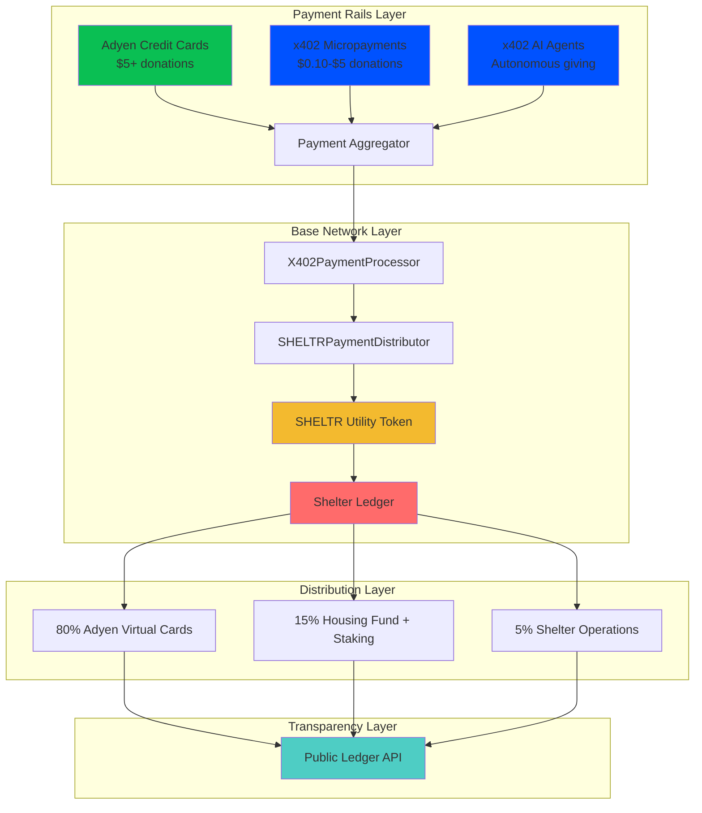
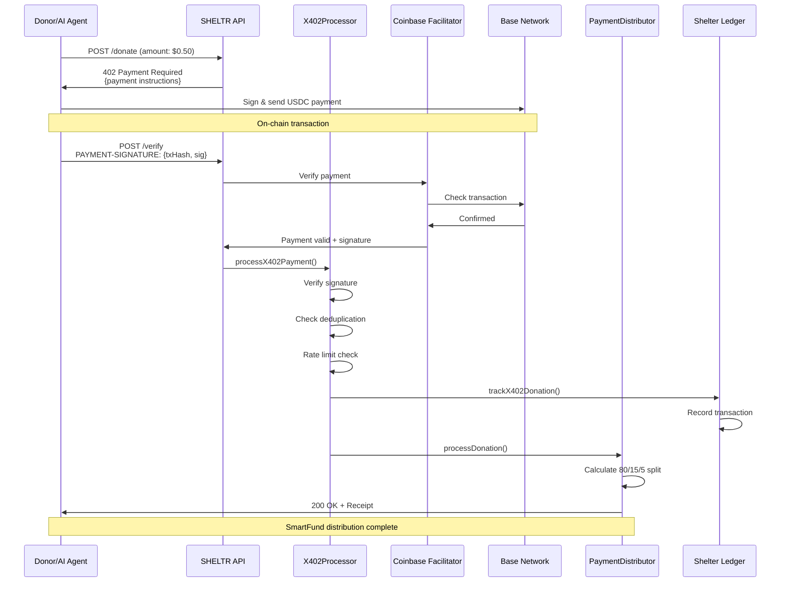
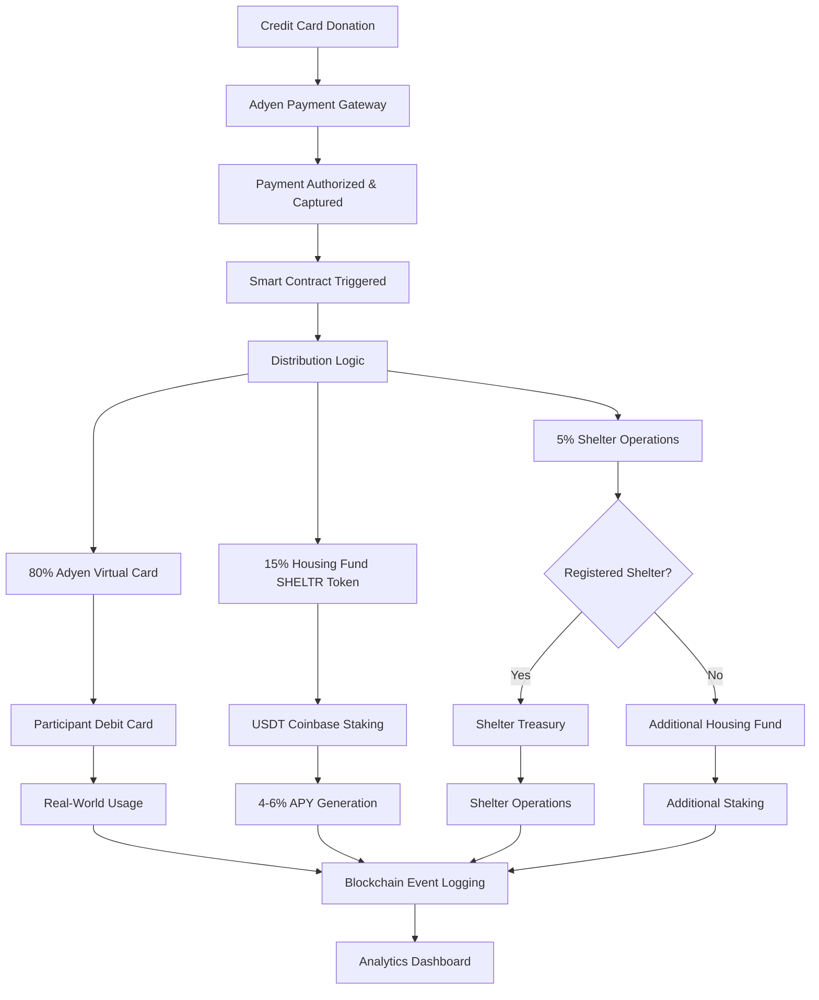

# ⛓️ Blockchain Architecture v3.0
*Version: 3.0.0 - December, 2025*
*Status: Strategic Planning* 🚀

## Executive Summary

SHELTR implements a revolutionary **single-token stable fund ecosystem** on Base network, combining traditional payment stability with blockchain transparency through the **Shelter Ledger** - our public accountability system that tracks and traces every donation and payout.

Our unified architecture ensures 80% of donations reach participants via Adyen virtual debit cards, 15% funds housing solutions through SHELTR utility token tracking and Coinbase staking, and 5% supports shelter operations - all verified on-chain through smart contract-governed fund allocation. The SHELTR utility token creates an immutable public ledger where anyone can verify transactions, audit fund flows, and monitor housing fund growth in real-time.

## Theory of Change: Blockchain-Verified Social Impact

### Problem Statement
Traditional charitable systems suffer from:
- **Opacity**: Donors cannot verify fund utilization
- **Inefficiency**: 30-40% overhead reduces impact  
- **Volatility Risk**: Crypto donations expose vulnerable populations to price fluctuations
- **Centralization**: Single points of failure and control

### SHELTR Solution
Our single-token stable architecture solves these fundamental issues:
- **Complete Transparency**: Every transaction verified on-chain
- **Maximum Efficiency**: 100% of funds reach intended purposes (80% participant support + 15% housing + 5% shelter operations)
- **Zero Risk Protection**: Participants never exposed to crypto volatility
- **Guaranteed Growth**: Housing fund generates 4-6% APY through institutional staking

## 🔍 The Shelter Ledger: Blockchain-Powered Public Accountability

### What is the Shelter Ledger?

The **Shelter Ledger** is SHELTR's revolutionary public accountability system built on blockchain technology. It tracks and traces every donation and every payout within the platform, creating an immutable, publicly-accessible audit trail that provides crystal-clear visibility into all financial flows.

### Core Features

#### 1. **Complete Transaction Tracking**
Every donation and payout is recorded on the Base blockchain with:
- **Unique transaction hash** for verification
- **Timestamp** of exact transaction time
- **Amount breakdown** showing 80/15/5 split
- **Participant wallet address** (anonymized)
- **Blockchain confirmation** status
- **Gas fees** and network details

#### 2. **Immutable Record Storage**
- **Permanent blockchain storage** - records cannot be altered or deleted
- **Cryptographic security** - tamper-proof transaction verification
- **Base network backing** - Ethereum-grade security
- **Historical access** - complete audit trail from day one
- **Third-party verification** - anyone can independently confirm

#### 3. **Public Access & Transparency**
```typescript
interface ShelterLedgerAccess {
  // Public endpoints (no authentication required)
  publicMetrics: {
    totalDonations: number;
    totalParticipants: number;
    housingFundSize: number;
    averageProcessingTime: string;
    successfulHousingPlacements: number;
  };
  
  // Transaction verification (by transaction ID)
  verifyTransaction: (txId: string) => {
    status: 'verified' | 'pending' | 'failed';
    donation: { amount: number; timestamp: number };
    distribution: { card: 80%; housing: 15%; operations: 5% };
    blockchainProof: { blockNumber: number; confirmations: number };
  };
  
  // Real-time audit access
  auditTrail: {
    allTransactions: Transaction[];
    filterByDate: (start: Date, end: Date) => Transaction[];
    filterByAmount: (min: number, max: number) => Transaction[];
    exportForAudit: () => AuditReport;
  };
}
```

#### 4. **Participant Wallet System**

Every participant receives a blockchain wallet upon registration:

**Automatic Wallet Creation:**
- Generated during participant onboarding
- Unique Base network address assigned
- Zero complexity for participant (managed by platform)
- Secure key management through enterprise custody

**Wallet Dashboard Features:**
```typescript
interface ParticipantWalletDashboard {
  // Real-time balance tracking
  housingFundBalance: {
    principal: number;              // Original 15% allocations
    stakingRewards: number;         // 4-6% APY growth
    totalBalance: number;           // Principal + rewards
    projectedValue: number;         // 12-month projection
  };
  
  // Complete transaction history
  transactionHistory: {
    donationReceived: Date;
    cardAllocation: number;         // 80% to virtual card
    housingAllocation: number;      // 15% to housing fund
    blockchainHash: string;         // Verification link
  }[];
  
  // Growth analytics
  growthTracking: {
    currentAPY: number;             // Real-time APY rate
    monthlyGrowth: number;          // This month's rewards
    yearToDateGrowth: number;       // YTD accumulation
    allTimeGrowth: number;          // Total since joining
  };
  
  // Housing progress
  housingGoals: {
    targetAmount: number;           // Housing fund goal
    currentProgress: number;        // Percentage complete
    estimatedTimeToGoal: string;    // Based on current rate
    milestones: Milestone[];        // Achievement tracking
  };
}
```

### Public Ledger API

#### Real-Time Verification Endpoints

**1. Verify Any Transaction**
```bash
GET /api/shelter-ledger/verify/{transactionId}

Response:
{
  "status": "verified",
  "donation": {
    "amount": 100.00,
    "timestamp": "2025-12-12T10:30:00Z",
    "participant_id": "anon_abc123"
  },
  "distribution": {
    "participantCard": 80.00,
    "housingFund": 15.00,
    "shelterOperations": 5.00
  },
  "blockchainProof": {
    "network": "Base",
    "blockNumber": 12345678,
    "transactionHash": "0xabc...",
    "confirmations": 42,
    "gasUsed": "0.01 USD"
  }
}
```

**2. Platform-Wide Metrics**
```bash
GET /api/shelter-ledger/metrics

Response:
{
  "totalDonations": 1250000.00,
  "totalParticipants": 2500,
  "housingFundSize": 187500.00,
  "housingFundAPY": 5.2,
  "successfulPlacements": 450,
  "averageProcessingTime": "3.2 seconds",
  "platformEfficiency": "100%"
}
```

**3. Housing Fund Performance**
```bash
GET /api/shelter-ledger/housing-fund

Response:
{
  "totalFund": 187500.00,
  "currentAPY": 5.2,
  "totalRewardsGenerated": 9750.00,
  "stakingPerformance": {
    "coinbaseAPY": 5.2,
    "totalStaked": 187500.00,
    "rewardsThisMonth": 812.50
  },
  "allocationBreakdown": {
    "emergencyHousing": 75000.00,
    "transitionalPrograms": 65625.00,
    "permanentSolutions": 37500.00,
    "supportServices": 9375.00
  }
}
```

**4. Participant Progress (Anonymized)**
```bash
GET /api/shelter-ledger/participant/{anonymizedId}

Response:
{
  "housingFundBalance": 1250.00,
  "stakingAPY": 5.2,
  "totalRewardsEarned": 65.00,
  "daysInProgram": 180,
  "housingGoalProgress": 62.5,
  "estimatedDaysToGoal": 108
}
```

### Transparency Benefits by Stakeholder

**For Donors:**
- ✅ Verify donation reached intended recipient in real-time
- ✅ Track housing fund growth over months/years
- ✅ See exact 80/15/5 split allocation
- ✅ Export transaction history for tax purposes
- ✅ Monitor participant outcomes (anonymized)

**For Participants:**
- ✅ View housing fund balance anytime
- ✅ Track 4-6% APY growth in real-time
- ✅ See complete donation history
- ✅ Monitor progress toward housing goals
- ✅ Access financial education resources

**For Shelters:**
- ✅ Demonstrate 100% operational efficiency
- ✅ Attract more donors through transparency
- ✅ Automated compliance reporting
- ✅ Real-time fund allocation visibility
- ✅ Participant outcome tracking

**For Regulators & Auditors:**
- ✅ Independent verification capability
- ✅ Real-time compliance monitoring
- ✅ Fraud detection and prevention
- ✅ Complete financial audit trail
- ✅ Automated reporting generation

### Privacy & Security Balance

While maintaining complete financial transparency, the Shelter Ledger protects participant privacy through:

- **Anonymized IDs** - No personal information on blockchain
- **Aggregated public metrics** - Individual privacy preserved
- **Authenticated wallet access** - Only participant can view their details
- **GDPR/CCPA compliance** - Data protection standards
- **Opt-in detailed sharing** - Participants control their story

### Technical Implementation

**Blockchain Events for Ledger:**
```solidity
event DonationTracked(
    bytes32 indexed transactionId,
    address indexed participant,
    uint256 totalAmount,
    uint256 timestamp,
    string donorReference
);

event PayoutTraced(
    bytes32 indexed transactionId,
    address indexed participant,
    uint256 cardAmount,        // 80%
    uint256 housingAmount,     // 15%
    uint256 operationsAmount,  // 5%
    uint256 timestamp
);

event HousingFundGrowth(
    address indexed participant,
    uint256 principalBalance,
    uint256 stakingRewards,
    uint256 totalBalance,
    uint256 currentAPY,
    uint256 timestamp
);

event HousingOutcome(
    address indexed participant,
    string outcomeType,        // "emergency", "transitional", "permanent"
    uint256 housingFundUsed,
    uint256 timestamp,
    string ipfsDetailsHash
);
```

---

## 🌐 x402 Micropayment Protocol Layer

### Complementary Payment Infrastructure

The **x402 payment protocol** operates as a **complementary layer** on top of our Base network infrastructure, enabling programmatic micropayments without replacing our core Adyen payment rails. This integration creates a hybrid payment architecture that maximizes donation capture across all amount ranges.

### Architecture Integration



### Strategic Positioning

**x402 Complements, Not Replaces**

| **Aspect** | **Adyen (Primary)** | **x402 (Secondary)** |
|------------|---------------------|----------------------|
| **Network** | Traditional banking | Base blockchain (L2) |
| **Use Case** | Credit card donations | Crypto micropayments, AI agents |
| **Amount Range** | $5.00+ optimal | $0.10 - $5.00 optimal |
| **Fee Structure** | 2.9% + $0.30 | ~$0.01 (Base gas) |
| **Settlement** | T+1 | Instant on-chain |
| **Donor Type** | Traditional donors | Crypto-native, AI agents, APIs |
| **Smart Contract** | AdyenPayoutIntegration.sol | X402PaymentProcessor.sol |

### Smart Contract Enhancements

#### X402PaymentProcessor Contract (NEW)

```solidity
// SPDX-License-Identifier: MIT
pragma solidity ^0.8.19;

import "@openzeppelin/contracts/access/AccessControl.sol";
import "@openzeppelin/contracts/security/ReentrancyGuard.sol";
import "@openzeppelin/contracts/security/Pausable.sol";
import "@openzeppelin/contracts/token/ERC20/IERC20.sol";
import "@openzeppelin/contracts/utils/cryptography/ECDSA.sol";

/**
 * @title X402PaymentProcessor
 * @notice Processes x402 micropayments and integrates with SHELTR SmartFund distribution
 * @dev Handles payment verification, deduplication, and routing to SmartFund distributor
 */
contract X402PaymentProcessor is AccessControl, ReentrancyGuard, Pausable {
    using ECDSA for bytes32;
    
    // Role definitions
    bytes32 public constant FACILITATOR_ROLE = keccak256("FACILITATOR_ROLE");
    bytes32 public constant ADMIN_ROLE = keccak256("ADMIN_ROLE");
    
    // Integration contracts
    ISHELTRPaymentDistributor public immutable distributor;
    ISHELTRUtilityToken public immutable sheltrToken;
    IERC20 public immutable USDC;
    
    // x402 facilitator for payment verification
    address public x402Facilitator;
    
    // Payment tracking
    mapping(bytes32 => bool) public processedPayments;
    mapping(address => uint256) public participantX402Total;
    uint256 public totalX402Payments;
    uint256 public totalX402Volume;
    
    // Amount limits
    uint256 public constant MIN_PAYMENT = 0.10 ether;  // $0.10
    uint256 public constant MAX_PAYMENT = 5.00 ether;  // $5.00
    
    // Rate limiting
    mapping(address => uint256) public dailyPaymentCount;
    mapping(address => uint256) public lastPaymentDay;
    uint256 public constant MAX_DAILY_PAYMENTS = 100;
    
    struct X402PaymentRequest {
        address participant;
        uint256 amount;
        bytes32 x402TxHash;
        bytes signature;
        uint256 timestamp;
        PaymentType paymentType;
    }
    
    enum PaymentType {
        MICROPAYMENT,
        AI_AGENT,
        API_PAYMENT,
        M2M_OPERATION
    }
    
    // Events
    event X402PaymentProcessed(
        bytes32 indexed x402TxHash,
        address indexed participant,
        uint256 amount,
        PaymentType paymentType,
        uint256 timestamp
    );
    
    event X402PaymentVerified(
        bytes32 indexed x402TxHash,
        address facilitator,
        bool valid
    );
    
    event X402DistributionCompleted(
        bytes32 indexed x402TxHash,
        address indexed participant,
        uint256 cardAmount,
        uint256 housingAmount,
        uint256 opsAmount
    );
    
    event FacilitatorUpdated(
        address indexed oldFacilitator,
        address indexed newFacilitator
    );
    
    constructor(
        address _distributor,
        address _sheltrToken,
        address _usdc,
        address _x402Facilitator
    ) {
        require(_distributor != address(0), "Invalid distributor");
        require(_sheltrToken != address(0), "Invalid token");
        require(_usdc != address(0), "Invalid USDC");
        require(_x402Facilitator != address(0), "Invalid facilitator");
        
        distributor = ISHELTRPaymentDistributor(_distributor);
        sheltrToken = ISHELTRUtilityToken(_sheltrToken);
        USDC = IERC20(_usdc);
        x402Facilitator = _x402Facilitator;
        
        _grantRole(DEFAULT_ADMIN_ROLE, msg.sender);
        _grantRole(ADMIN_ROLE, msg.sender);
        _grantRole(FACILITATOR_ROLE, _x402Facilitator);
    }
    
    /**
     * @dev Process x402 micropayment and trigger SmartFund distribution
     * @param request X402 payment request details
     */
    function processX402Payment(
        X402PaymentRequest calldata request
    ) external onlyRole(FACILITATOR_ROLE) nonReentrant whenNotPaused {
        // Validation
        require(!processedPayments[request.x402TxHash], "Payment already processed");
        require(request.amount >= MIN_PAYMENT && request.amount <= MAX_PAYMENT, "Amount out of range");
        require(request.participant != address(0), "Invalid participant");
        require(block.timestamp - request.timestamp < 300, "Payment request expired"); // 5 min window
        
        // Rate limiting
        _checkRateLimit(request.participant);
        
        // Verify x402 payment signature
        require(
            _verifyX402Signature(request),
            "Invalid x402 signature"
        );
        
        emit X402PaymentVerified(request.x402TxHash, msg.sender, true);
        
        // Mark as processed
        processedPayments[request.x402TxHash] = true;
        
        // Update statistics
        participantX402Total[request.participant] += request.amount;
        totalX402Payments++;
        totalX402Volume += request.amount;
        
        // Transfer USDC from x402 facilitator to distributor
        require(
            USDC.transferFrom(x402Facilitator, address(distributor), request.amount),
            "USDC transfer failed"
        );
        
        // Calculate SmartFund distribution
        (uint256 cardAmount, uint256 housingAmount, uint256 opsAmount) = _calculateDistribution(request.amount);
        
        // Track in Shelter Ledger
        sheltrToken.trackX402Donation(
            request.x402TxHash,
            msg.sender,
            request.participant,
            request.amount,
            request.paymentType
        );
        
        // Trigger standard SmartFund distribution
        distributor.processDonation(
            request.participant,
            msg.sender, // x402 facilitator as "donor"
            request.amount,
            request.x402TxHash
        );
        
        emit X402PaymentProcessed(
            request.x402TxHash,
            request.participant,
            request.amount,
            request.paymentType,
            block.timestamp
        );
        
        emit X402DistributionCompleted(
            request.x402TxHash,
            request.participant,
            cardAmount,
            housingAmount,
            opsAmount
        );
    }
    
    /**
     * @dev Verify x402 payment signature from facilitator
     */
    function _verifyX402Signature(
        X402PaymentRequest calldata request
    ) internal view returns (bool) {
        bytes32 messageHash = keccak256(abi.encodePacked(
            request.participant,
            request.amount,
            request.x402TxHash,
            request.timestamp,
            uint8(request.paymentType)
        ));
        
        bytes32 ethSignedMessageHash = messageHash.toEthSignedMessageHash();
        address signer = ethSignedMessageHash.recover(request.signature);
        
        return signer == x402Facilitator;
    }
    
    /**
     * @dev Calculate SmartFund distribution (80/15/5)
     */
    function _calculateDistribution(uint256 amount) internal pure returns (
        uint256 cardAmount,
        uint256 housingAmount,
        uint256 opsAmount
    ) {
        cardAmount = (amount * 80) / 100;
        housingAmount = (amount * 15) / 100;
        opsAmount = (amount * 5) / 100;
        
        return (cardAmount, housingAmount, opsAmount);
    }
    
    /**
     * @dev Check and update rate limiting
     */
    function _checkRateLimit(address participant) internal {
        uint256 today = block.timestamp / 1 days;
        
        if (lastPaymentDay[participant] != today) {
            // New day, reset counter
            dailyPaymentCount[participant] = 0;
            lastPaymentDay[participant] = today;
        }
        
        require(
            dailyPaymentCount[participant] < MAX_DAILY_PAYMENTS,
            "Daily payment limit exceeded"
        );
        
        dailyPaymentCount[participant]++;
    }
    
    /**
     * @dev Update x402 facilitator address
     */
    function updateFacilitator(address newFacilitator) external onlyRole(ADMIN_ROLE) {
        require(newFacilitator != address(0), "Invalid facilitator");
        
        address oldFacilitator = x402Facilitator;
        x402Facilitator = newFacilitator;
        
        _revokeRole(FACILITATOR_ROLE, oldFacilitator);
        _grantRole(FACILITATOR_ROLE, newFacilitator);
        
        emit FacilitatorUpdated(oldFacilitator, newFacilitator);
    }
    
    /**
     * @dev Get x402 payment statistics
     */
    function getX402Stats() external view returns (
        uint256 payments,
        uint256 volume,
        uint256 averageAmount
    ) {
        return (
            totalX402Payments,
            totalX402Volume,
            totalX402Payments > 0 ? totalX402Volume / totalX402Payments : 0
        );
    }
    
    /**
     * @dev Get participant's x402 payment history
     */
    function getParticipantX402Stats(address participant) external view returns (
        uint256 totalReceived,
        uint256 dailyCount,
        bool canReceiveMore
    ) {
        uint256 today = block.timestamp / 1 days;
        uint256 count = lastPaymentDay[participant] == today ? dailyPaymentCount[participant] : 0;
        
        return (
            participantX402Total[participant],
            count,
            count < MAX_DAILY_PAYMENTS
        );
    }
    
    /**
     * @dev Emergency pause function
     */
    function pause() external onlyRole(ADMIN_ROLE) {
        _pause();
    }
    
    /**
     * @dev Resume operations after emergency
     */
    function unpause() external onlyRole(ADMIN_ROLE) {
        _unpause();
    }
}

// Interfaces
interface ISHELTRPaymentDistributor {
    function processDonation(
        address participant,
        address donor,
        uint256 amount,
        bytes32 transactionId
    ) external;
}

interface ISHELTRUtilityToken {
    function trackX402Donation(
        bytes32 x402TxHash,
        address payer,
        address participant,
        uint256 amount,
        uint8 paymentType
    ) external;
}
```

#### Enhanced Shelter Ledger with x402 Tracking

```solidity
// Enhanced SHELTR Utility Token with comprehensive x402 support
contract SHELTRUtilityToken is ERC20, AccessControl {
    // Existing Shelter Ledger tracking
    mapping(string => DonationRecord) public donationLedger;
    mapping(address => Transaction[]) public transactionHistory;
    
    // NEW: x402-specific tracking
    mapping(bytes32 => X402Donation) public x402Donations;
    mapping(address => X402Stats) public participantX402Stats;
    uint256 public totalX402Donations;
    uint256 public totalX402Volume;
    
    // x402 payment type counters
    uint256 public micropaymentCount;
    uint256 public aiAgentCount;
    uint256 public apiPaymentCount;
    uint256 public m2mOperationCount;
    
    struct X402Donation {
        address payer;
        address participant;
        uint256 amount;
        bytes32 x402TxHash;
        uint256 timestamp;
        PaymentType paymentType;
        bool verified;
        Distribution distribution;
    }
    
    struct X402Stats {
        uint256 totalReceived;
        uint256 donationCount;
        uint256 lastDonationTime;
        uint256 averageAmount;
    }
    
    struct Distribution {
        uint256 participantCard;    // 80%
        uint256 housingFund;         // 15%
        uint256 operations;          // 5%
    }
    
    enum PaymentType {
        ADYEN_CREDIT_CARD,
        X402_MICROPAYMENT,
        X402_AI_AGENT,
        X402_API_PAYMENT,
        X402_M2M_OPERATION
    }
    
    event X402DonationTracked(
        bytes32 indexed x402TxHash,
        address indexed participant,
        uint256 amount,
        PaymentType paymentType,
        uint256 timestamp
    );
    
    event X402StatsUpdated(
        address indexed participant,
        uint256 totalReceived,
        uint256 donationCount
    );
    
    /**
     * @dev Track x402 donation in Shelter Ledger
     */
    function trackX402Donation(
        bytes32 x402TxHash,
        address payer,
        address participant,
        uint256 amount,
        PaymentType paymentType
    ) external onlyRole(X402_PROCESSOR_ROLE) {
        require(!x402Donations[x402TxHash].verified, "Already tracked");
        require(amount >= 0.10 ether && amount <= 5.00 ether, "Amount out of range");
        
        // Calculate distribution
        Distribution memory dist = Distribution({
            participantCard: (amount * 80) / 100,
            housingFund: (amount * 15) / 100,
            operations: (amount * 5) / 100
        });
        
        // Record x402 donation
        x402Donations[x402TxHash] = X402Donation({
            payer: payer,
            participant: participant,
            amount: amount,
            x402TxHash: x402TxHash,
            timestamp: block.timestamp,
            paymentType: paymentType,
            verified: true,
            distribution: dist
        });
        
        // Update participant stats
        X402Stats storage stats = participantX402Stats[participant];
        stats.totalReceived += amount;
        stats.donationCount++;
        stats.lastDonationTime = block.timestamp;
        stats.averageAmount = stats.totalReceived / stats.donationCount;
        
        // Update global counters
        totalX402Donations++;
        totalX402Volume += amount;
        
        // Update payment type counters
        if (paymentType == PaymentType.X402_MICROPAYMENT) {
            micropaymentCount++;
        } else if (paymentType == PaymentType.X402_AI_AGENT) {
            aiAgentCount++;
        } else if (paymentType == PaymentType.X402_API_PAYMENT) {
            apiPaymentCount++;
        } else if (paymentType == PaymentType.X402_M2M_OPERATION) {
            m2mOperationCount++;
        }
        
        // Add to transaction history
        transactionHistory[participant].push(Transaction({
            amount: amount,
            timestamp: block.timestamp,
            txType: TransactionType.DONATION_RECEIVED,
            donationId: bytes32ToString(x402TxHash),
            isPublic: true
        }));
        
        emit X402DonationTracked(x402TxHash, participant, amount, paymentType, block.timestamp);
        emit X402StatsUpdated(participant, stats.totalReceived, stats.donationCount);
    }
    
    /**
     * @dev Get comprehensive x402 statistics
     */
    function getX402Stats() external view returns (
        uint256 donations,
        uint256 volume,
        uint256 averageAmount,
        uint256 micropayments,
        uint256 aiAgents,
        uint256 apiPayments,
        uint256 m2mOps
    ) {
        return (
            totalX402Donations,
            totalX402Volume,
            totalX402Donations > 0 ? totalX402Volume / totalX402Donations : 0,
            micropaymentCount,
            aiAgentCount,
            apiPaymentCount,
            m2mOperationCount
        );
    }
    
    /**
     * @dev Get participant's x402 statistics
     */
    function getParticipantX402Stats(address participant) external view returns (
        uint256 totalReceived,
        uint256 donationCount,
        uint256 averageAmount,
        uint256 lastDonationTime
    ) {
        X402Stats memory stats = participantX402Stats[participant];
        return (
            stats.totalReceived,
            stats.donationCount,
            stats.averageAmount,
            stats.lastDonationTime
        );
    }
    
    /**
     * @dev Verify x402 donation (Public Access)
     */
    function verifyX402Donation(bytes32 x402TxHash) external view returns (
        bool verified,
        address participant,
        uint256 amount,
        PaymentType paymentType,
        Distribution memory distribution
    ) {
        X402Donation memory donation = x402Donations[x402TxHash];
        return (
            donation.verified,
            donation.participant,
            donation.amount,
            donation.paymentType,
            donation.distribution
        );
    }
}
```

### Public Ledger API Extensions

```typescript
// NEW: x402-specific Shelter Ledger endpoints
interface X402LedgerAPI {
    /**
     * Verify x402 micropayment on Shelter Ledger
     */
    verifyX402Payment(x402TxHash: string): Promise<{
        verified: boolean;
        participant: string;
        payer: string;
        amount: number;
        paymentType: 'micropayment' | 'ai_agent' | 'api_payment' | 'm2m';
        timestamp: number;
        blockchainTx: string;
        distribution: {
            participantCard: number;
            housingFund: number;
            operations: number;
        };
    }>;
    
    /**
     * Get x402 platform statistics
     */
    getX402PlatformStats(): Promise<{
        totalDonations: number;
        totalVolume: number;
        averageAmount: number;
        micropayments: number;
        aiAgentDonations: number;
        apiPayments: number;
        m2mOperations: number;
        costSavingsVsAdyen: number;
    }>;
    
    /**
     * Get participant's x402 history
     */
    getParticipantX402History(participantId: string): Promise<{
        totalReceived: number;
        donationCount: number;
        averageAmount: number;
        lastDonationTime: Date;
        donations: Array<{
            x402TxHash: string;
            amount: number;
            paymentType: string;
            timestamp: Date;
            verified: boolean;
        }>;
    }>;
    
    /**
     * Get AI agent giving statistics
     */
    getAIAgentStats(): Promise<{
        totalAgents: number;
        totalDonated: number;
        participantsHelped: number;
        averageDonationPerAgent: number;
        topAgents: Array<{
            agentAddress: string;
            totalDonated: number;
            donationCount: number;
        }>;
    }>;
    
    /**
     * Get API payment statistics
     */
    getAPIPaymentStats(): Promise<{
        totalAPIPayments: number;
        totalRevenue: number;
        averagePaymentAmount: number;
        topPartners: Array<{
            partnerAddress: string;
            totalPaid: number;
            requestCount: number;
        }>;
    }>;
}
```

### Network Configuration

```typescript
const X402_INTEGRATION_CONFIG = {
    // Base network configuration
    network: 'base-mainnet',
    chainId: 8453,
    rpcUrl: 'https://mainnet.base.org',
    
    // Smart contracts
    contracts: {
        x402Processor: '0x...', // X402PaymentProcessor.sol
        sheltrToken: '0x...', // SHELTRUtilityToken.sol (enhanced)
        distributor: '0x...', // SHELTRPaymentDistributor.sol
        usdc: '0x833589fCD6eDb6E08f4c7C32D4f71b54bdA02913' // USDC on Base
    },
    
    // x402 facilitator
    facilitator: {
        url: 'https://facilitator.coinbase.com',
        verifyEndpoint: '/verify',
        network: 'eip155:8453',
        feeStructure: 'fee-free' // via Coinbase CDP
    },
    
    // Payment configuration
    paymentConfig: {
        minAmount: 0.10, // $0.10 minimum
        maxAmount: 5.00, // $5.00 maximum
        currency: 'USDC',
        network: 'eip155:8453',
        expiryWindow: 300, // 5 minutes
        maxDailyPayments: 100 // per participant
    },
    
    // Integration strategy
    integration: {
        primary: 'Adyen for $5+ donations',
        secondary: 'x402 for <$5 micropayments',
        fallback: 'Adyen for all amounts if x402 unavailable',
        coexistence: 'Both rails active simultaneously'
    },
    
    // Security
    security: {
        signatureVerification: true,
        rateLimiting: true,
        amountLimits: true,
        deduplication: true,
        pausable: true,
        multiSigAdmin: true
    }
} as const;
```

### Transaction Verification System

#### Enhanced Verification Architecture



### Security Architecture

#### x402-Specific Security Measures

**1. Payment Verification**
```solidity
// Multi-layer verification
function _verifyX402Signature(request) internal view returns (bool) {
    // 1. Signature verification
    bytes32 messageHash = keccak256(abi.encodePacked(...));
    address signer = messageHash.recover(request.signature);
    require(signer == x402Facilitator, "Invalid signer");
    
    // 2. Timestamp verification
    require(block.timestamp - request.timestamp < 300, "Expired");
    
    // 3. Amount verification
    require(request.amount >= MIN_PAYMENT && request.amount <= MAX_PAYMENT, "Invalid amount");
    
    return true;
}
```

**2. Deduplication Protection**
```solidity
// Prevent double-spending
mapping(bytes32 => bool) public processedPayments;

function processX402Payment(request) external {
    require(!processedPayments[request.x402TxHash], "Already processed");
    processedPayments[request.x402TxHash] = true;
    // ... process payment
}
```

**3. Rate Limiting**
```solidity
// Prevent abuse
mapping(address => uint256) public dailyPaymentCount;
uint256 public constant MAX_DAILY_PAYMENTS = 100;

function _checkRateLimit(participant) internal {
    require(
        dailyPaymentCount[participant] < MAX_DAILY_PAYMENTS,
        "Daily limit exceeded"
    );
    dailyPaymentCount[participant]++;
}
```

**4. Amount Limits**
```solidity
// Prevent dust attacks and excessive payments
uint256 public constant MIN_PAYMENT = 0.10 ether;  // $0.10
uint256 public constant MAX_PAYMENT = 5.00 ether;  // $5.00

require(amount >= MIN_PAYMENT && amount <= MAX_PAYMENT, "Amount out of range");
```

**5. Emergency Controls**
```solidity
// Pausable for emergency situations
function pause() external onlyRole(ADMIN_ROLE) {
    _pause();
}

function unpause() external onlyRole(ADMIN_ROLE) {
    _unpause();
}
```

### Implementation Roadmap

#### Phase 1: Research & Prototyping (Q2 2027)
- **Duration**: 3 months
- **Deliverables**:
  - x402 SDK integration testing
  - Smart contract prototyping
  - Security model design
  - Cost-benefit analysis
  - Stakeholder approval

#### Phase 2: Smart Contract Development (Q3 2027)
- **Duration**: 3 months
- **Deliverables**:
  - X402PaymentProcessor contract development
  - Enhanced SHELTRUtilityToken with x402 tracking
  - Integration with existing contracts
  - Comprehensive unit tests
  - Security audits (2+ firms)

#### Phase 3: Testnet Deployment (Q3 2027)
- **Duration**: 2 months
- **Deliverables**:
  - Base testnet deployment
  - Integration testing
  - Performance optimization
  - Gas optimization
  - Bug fixes and refinement

#### Phase 4: Mainnet Deployment (Q4 2027)
- **Duration**: 1 month
- **Deliverables**:
  - Mainnet contract deployment
  - Production monitoring setup
  - Emergency response procedures
  - Documentation completion
  - Launch announcement

#### Phase 5: Ecosystem Expansion (2028)
- **Duration**: 12 months
- **Deliverables**:
  - AI agent integration framework
  - Partner API monetization
  - M2M automation features
  - Advanced analytics
  - International expansion

### Success Metrics

#### Technical KPIs
- **Smart Contract Uptime**: 99.99%
- **Gas Optimization**: <$0.02 per transaction
- **Payment Success Rate**: >99.5%
- **Transaction Speed**: <30 seconds average
- **Security Incidents**: Zero successful attacks

#### Business KPIs
- **x402 Payment Volume**: $536K+ in Year 1
- **Cost Savings**: $156K+ vs traditional rails
- **New Donor Acquisition**: 10,000+ crypto-native donors
- **AI Agent Integrations**: 100+ autonomous systems
- **API Revenue**: $180K+ annually

#### Impact KPIs
- **Additional Participants Served**: 2,500+ via micropayments
- **Housing Fund Growth**: +$53K from x402 allocations
- **Platform Sustainability**: +$536K annual revenue
- **Transparency Score**: 100% (all transactions on-chain)

---

## Single-Token Stable Architecture

### SHELTR Utility Token
**Purpose**: Track every donation, trace every payout, housing fund management, and guaranteed yield generation

| Specification | Value | Implementation |
|---------------|-------|----------------|
| **Network** | Base (Coinbase L2) | Low fees (~$0.01), 2-second finality |
| **Standard** | ERC-20 | Battle-tested, compatible with all wallets |
| **Backing** | USDT 1:1 Peg | Coinbase institutional custody |
| **Volatility** | 0% (USDT-pegged) | Stable value preservation |
| **Yield Generation** | 4-6% APY | Coinbase institutional staking |
| **Purpose** | Housing fund only | 15% of donations allocated |

### Participant Payment Flow
**80% Allocation**: Direct to Adyen virtual debit cards (zero blockchain exposure)

| Specification | Value | Implementation |
|---------------|-------|----------------|
| **Payment Method** | Adyen Virtual Debit Card | Global ATM/POS acceptance |
| **Settlement Speed** | < 30 seconds | Real-time card loading |
| **Risk Level** | Zero | No cryptocurrency exposure |
| **Usage** | Essential needs | Food, clothing, transportation |
| **Fees** | $0 for participants | Dignity preservation mechanism |

## Smart Contract Architecture

### 🔗 Enterprise Contract Repository

Our revolutionary single-token architecture is implemented through 5 core enterprise-grade smart contracts and 3 comprehensive deployment scripts:

#### **Core Contracts**
- **[SHELTRPaymentDistributor.sol](https://github.com/mrj0nesmtl/sheltr-ai/blob/main/sheltr-tokens/src/SHELTRPaymentDistributor.sol)** - Core 80/15/5 distribution engine (434 lines)
- **[SHELTRStablecoin.sol](https://github.com/mrj0nesmtl/sheltr-ai/blob/main/sheltr-tokens/src/SHELTRStablecoin.sol)** - Housing fund tracking token with USDT backing (458 lines)

#### **Integration Contracts**
- **[AdyenPayoutIntegration.sol](https://github.com/mrj0nesmtl/sheltr-ai/blob/main/sheltr-tokens/src/AdyenPayoutIntegration.sol)** - Zero-risk virtual card management (619 lines)
- **[CoinbaseStakingIntegration.sol](https://github.com/mrj0nesmtl/sheltr-ai/blob/main/sheltr-tokens/src/CoinbaseStakingIntegration.sol)** - Guaranteed 4-6% APY returns (621 lines)
- **[BaseNetworkOptimization.sol](https://github.com/mrj0nesmtl/sheltr-ai/blob/main/sheltr-tokens/src/BaseNetworkOptimization.sol)** - Ultra-low fee transaction management (548 lines)

#### **Deployment Scripts**
- **[DeployEnterpriseArchitecture.s.sol](https://github.com/mrj0nesmtl/sheltr-ai/blob/main/sheltr-tokens/script/DeployEnterpriseArchitecture.s.sol)** - Main deployment automation (316 lines)
- **[SetupPartnershipIntegrations.s.sol](https://github.com/mrj0nesmtl/sheltr-ai/blob/main/sheltr-tokens/script/SetupPartnershipIntegrations.s.sol)** - Adyen + Coinbase setup (627 lines)
- **[ConfigureEnterpriseSettings.s.sol](https://github.com/mrj0nesmtl/sheltr-ai/blob/main/sheltr-tokens/script/ConfigureEnterpriseSettings.s.sol)** - Enterprise configuration (657 lines)

**Total Architecture**: 3,880 lines of enterprise-grade smart contract code

### Core Distribution Contract
```solidity
// SPDX-License-Identifier: MIT
pragma solidity ^0.8.19;

import "@openzeppelin/contracts/access/AccessControl.sol";
import "@openzeppelin/contracts/security/ReentrancyGuard.sol";
import "@openzeppelin/contracts/security/Pausable.sol";

contract SHELTRPaymentDistributor is AccessControl, ReentrancyGuard, Pausable {
    // Role definitions
    bytes32 public constant ADMIN_ROLE = keccak256("ADMIN_ROLE");
    bytes32 public constant PROCESSOR_ROLE = keccak256("PROCESSOR_ROLE");
    bytes32 public constant AUDITOR_ROLE = keccak256("AUDITOR_ROLE");
    
    // Integration contracts
    ISHELTRStablecoin public immutable sheltrToken;
    IAdyenPayout public immutable adyenPayout;
    IERC20 public immutable usdt;    // USDT backing token
    
    // Distribution constants (immutable for security)
    uint256 public constant PARTICIPANT_PERCENTAGE = 8000; // 80%
    uint256 public constant HOUSING_FUND_PERCENTAGE = 1500; // 15%
    uint256 public constant SHELTER_OPS_PERCENTAGE = 500;   // 5%
    
    // State tracking
    mapping(address => address) public participantShelters; // Maps participant to their registered shelter
    uint256 public totalHousingFund;
    uint256 public totalProcessed;
    
    struct DonationSplit {
        uint256 participantAmount;    // 80%
        uint256 housingFundAmount;    // 15%
        uint256 shelterOpsAmount;     // 5%
        uint256 totalAmount;
    }
    
    // Events for transparency
    event DonationProcessed(
        address indexed participant,
        address indexed donor,
        uint256 totalAmount,
        uint256 participantAmount,
        uint256 housingFundAmount,
        uint256 shelterOpsAmount,
        bytes32 adyenTransactionId
    );
    
    event WelcomeBonusDistributed(
        address indexed participant,
        uint256 amount,
        uint256 timestamp
    );
    
    event ParticipantRegistered(
        address indexed participant,
        address indexed shelter,
        uint256 timestamp
    );
    
    event HousingFundInvestment(
        uint256 amount,
        address indexed strategy,
        uint256 expectedYield
    );
    
    modifier onlyMultiSig(bytes32 proposalHash) {
        require(
            proposalVotes[proposalHash] >= REQUIRED_SIGNATURES,
            "Insufficient signatures"
        );
        _;
    }
    
    constructor(
        address _sheltrStable,
        address _sheltrGrowth,
        address _usdcReserve
    ) {
        sheltrStable = IERC20(_sheltrStable);
        sheltrGrowth = IERC20(_sheltrGrowth);
        usdcReserve = IERC20(_usdcReserve);
        
        _grantRole(DEFAULT_ADMIN_ROLE, msg.sender);
        _grantRole(ADMIN_ROLE, msg.sender);
    }
    
    /**
     * @notice Process donation with automatic distribution
     * @param participant Address of the participant
     * @param donor Address of the donor  
     * @param totalAmount Total donation amount in USD
     * @param adyenTransactionId Adyen transaction reference
     */
    function processDonation(
        address participant,
        address donor,
        uint256 totalAmount,
        bytes32 adyenTransactionId
    ) external onlyRole(PROCESSOR_ROLE) nonReentrant whenNotPaused {
        require(participant != address(0), "Invalid participant address");
        require(totalAmount > 0, "Amount must be greater than 0");
        
        DonationSplit memory split = _calculateSplit(totalAmount);
        
        // 1. Send 80% to participant via Adyen virtual card
        bool cardLoadSuccess = adyenPayout.loadParticipantCard(
            participant,
            split.participantAmount,
            adyenTransactionId
        );
        require(cardLoadSuccess, "Failed to load participant card");
        
        // 2. Deposit 15% to housing fund (SHELTR stablecoin pool)
        sheltrToken.depositHousingFund(participant, split.housingFundAmount);
        
        // 3. Handle shelter operations (5%)
        address shelter = participantShelters[participant];
        if (shelter != address(0)) {
            // Transfer to registered shelter
            _transferToShelter(shelter, split.shelterOpsAmount);
        } else {
            // No registered shelter - add to participant's housing fund
            sheltrToken.depositHousingFund(participant, split.shelterOpsAmount);
        }
        
        // Update tracking
        totalHousingFund += split.housingFundAmount;
        totalProcessed += totalAmount;
        
        emit DonationProcessed(
            participant,
            donor,
            totalAmount,
            split.participantAmount,
            split.housingFundAmount,
            split.shelterOpsAmount,
            adyenTransactionId
        );
    }
    
    function _calculateSplit(uint256 amount) internal pure returns (DonationSplit memory) {
        uint256 participantAmount = (amount * PARTICIPANT_PERCENTAGE) / 10000;
        uint256 housingFundAmount = (amount * HOUSING_FUND_PERCENTAGE) / 10000;
        uint256 shelterOpsAmount = (amount * SHELTER_OPS_PERCENTAGE) / 10000;
        
        return DonationSplit({
            participantAmount: participantAmount,
            housingFundAmount: housingFundAmount,
            shelterOpsAmount: shelterOpsAmount,
            totalAmount: amount
        });
    }
    
    /**
     * @notice Register participant with a shelter
     * @param participant Address of participant
     * @param shelter Address of registered shelter
     */
    function registerParticipantWithShelter(
        address participant,
        address shelter
    ) external onlyRole(DISTRIBUTOR_ROLE) {
        require(participant != address(0), "Invalid participant");
        require(shelter != address(0), "Invalid shelter");
        
        participantShelter[participant] = shelter;
        
        emit ParticipantRegistered(participant, shelter, block.timestamp);
    }
    
    /**
     * @notice Distribute welcome bonus to new participants
     * @param participant Address of new participant
     */
    function distributeWelcomeBonus(
        address participant
    ) external onlyRole(DISTRIBUTOR_ROLE) nonReentrant {
        require(!hasReceivedWelcomeBonus[participant], "Bonus already received");
        require(participant != address(0), "Invalid participant");
        
        // Mark as received
        hasReceivedWelcomeBonus[participant] = true;
        
        // Mint welcome bonus SHELTR-S tokens
        ISheltrStable(address(sheltrStable)).mint(participant, WELCOME_BONUS);
        
        // Update tracking
        participantBalances[participant] += WELCOME_BONUS;
        
        emit WelcomeBonusDistributed(
            participant,
            WELCOME_BONUS,
            block.timestamp
        );
    }
    
    /**
     * @notice Invest housing fund in approved DeFi strategies
     * @param strategy Address of investment strategy
     * @param amount Amount to invest
     */
    function investHousingFund(
        address strategy,
        uint256 amount
    ) external onlyRole(ADMIN_ROLE) nonReentrant {
        require(amount <= totalHousingFund, "Insufficient housing fund");
        require(strategy != address(0), "Invalid strategy");
        
        // Transfer to strategy contract
        require(
            usdcReserve.transfer(strategy, amount),
            "Strategy transfer failed"
        );
        
        totalHousingFund -= amount;
        
        emit HousingFundInvestment(amount, strategy, 0); // Yield TBD
    }
    
    /**
     * @notice Emergency pause function
     */
    function emergencyPause() external onlyRole(ADMIN_ROLE) {
        _pause();
    }
    
    /**
     * @notice Resume operations after emergency
     */
    function resume() external onlyRole(ADMIN_ROLE) {
        _unpause();
    }
    
    /**
     * @notice Get participant statistics
     */
    function getParticipantStats(address participant) 
        external view returns (
            uint256 balance,
            bool receivedBonus,
            uint256 totalReceived
        ) 
    {
        return (
            participantBalances[participant],
            hasReceivedWelcomeBonus[participant],
            participantBalances[participant]
        );
    }
    
    /**
     * @notice Get platform statistics
     */
    function getPlatformStats() 
        external view returns (
            uint256 totalDist,
            uint256 housingFund,
            uint256 totalParticipants
        ) 
    {
        // Note: participant count would be tracked off-chain
        return (totalDistributed, totalHousingFund, 0);
    }
}

interface ISheltrStable {
    function mint(address to, uint256 amount) external;
    function burn(address from, uint256 amount) external;
}
```

### SHELTR Stablecoin Implementation

**📄 Full Contract Source**: [SHELTRStablecoin.sol](https://github.com/mrj0nesmtl/sheltr-ai/blob/main/sheltr-tokens/src/SHELTRStablecoin.sol)

```solidity
contract SHELTRStablecoin is ERC20, AccessControl, Pausable, ReentrancyGuard {
    bytes32 public constant MINTER_ROLE = keccak256("MINTER_ROLE");
    bytes32 public constant STAKER_ROLE = keccak256("STAKER_ROLE");
    
    // USDT contract on Base network
    IERC20 public immutable USDT;
    uint256 public constant PEG_RATE = 1e18; // 1 SHELTR = 1 USDT
    
    // Coinbase staking integration
    address public coinbaseStakingPool;
    uint256 public targetAPY = 500; // 5.00% (basis points)
    
    // Housing fund tracking
    mapping(address => uint256) public participantHousingFunds;
    uint256 public totalHousingFund;
    uint256 public totalStakedAmount;
    
    event HousingFundDeposit(address indexed participant, uint256 amount, uint256 timestamp);
    event StakingRewardsDistributed(uint256 totalRewards, uint256 timestamp);
    event ParticipantHousingAllocation(address indexed participant, uint256 amount);
    
    constructor(
        address _usdt,
        address _coinbaseStakingPool
    ) ERC20("SHELTR Stablecoin", "SHELTR") {
        USDT = IERC20(_usdt);
        coinbaseStakingPool = _coinbaseStakingPool;
        
        _grantRole(DEFAULT_ADMIN_ROLE, msg.sender);
        _grantRole(MINTER_ROLE, msg.sender);
        _grantRole(STAKER_ROLE, msg.sender);
    }
    
    /**
     * @dev Deposit USDT to housing fund and mint SHELTR tokens
     * @param participant The participant this housing fund is for
     * @param usdtAmount Amount of USDT to deposit
     */
    function depositHousingFund(
        address participant, 
        uint256 usdtAmount
    ) external onlyRole(MINTER_ROLE) nonReentrant {
        require(usdtAmount > 0, "Amount must be greater than 0");
        
        // Transfer USDT from sender
        USDT.transferFrom(msg.sender, address(this), usdtAmount);
        
        // Mint SHELTR tokens 1:1 with USDT
        _mint(address(this), usdtAmount);
        
        // Update participant housing fund allocation
        participantHousingFunds[participant] += usdtAmount;
        totalHousingFund += usdtAmount;
        
        // Stake USDT in Coinbase for yield
        _stakeToCoinbase(usdtAmount);
        
        emit HousingFundDeposit(participant, usdtAmount, block.timestamp);
        emit ParticipantHousingAllocation(participant, participantHousingFunds[participant]);
    }
    
    /**
     * @dev Stake USDT to Coinbase for guaranteed returns
     */
    function _stakeToCoinbase(uint256 amount) internal {
        // Approve Coinbase staking pool
        USDT.approve(coinbaseStakingPool, amount);
        
        // Call Coinbase staking contract
        ICoinbaseStaking(coinbaseStakingPool).stake(amount);
        
        totalStakedAmount += amount;
    }
    
    /**
     * @dev Get participant's housing fund balance with accrued rewards
     */
    function getParticipantHousingBalance(address participant) external view returns (uint256) {
        if (totalStakedAmount == 0) return participantHousingFunds[participant];
        
        // Calculate proportional share of total fund including rewards
        uint256 participantShare = (participantHousingFunds[participant] * totalHousingFund) / totalStakedAmount;
        return participantShare;
    }
}

interface ICoinbaseStaking {
    function stake(uint256 amount) external returns (bool);
    function claimRewards() external returns (uint256);
    function getStakedBalance(address account) external view returns (uint256);
}

interface IAdyenPayout {
    function loadParticipantCard(
        address participant,
        uint256 amount,
        bytes32 transactionId
    ) external returns (bool);
}
```

## Enterprise Integration Contracts

### 🏦 AdyenPayoutIntegration.sol - Zero-Risk Virtual Card Management

**📄 Full Contract Source**: [AdyenPayoutIntegration.sol](https://github.com/mrj0nesmtl/sheltr-ai/blob/main/sheltr-tokens/src/AdyenPayoutIntegration.sol)

**Key Features**:
- Global Visa/Mastercard virtual debit card issuance
- PCI DSS Level 1 compliant payment processing
- Real-time card loading and transaction monitoring
- Zero cryptocurrency exposure for participants
- Enterprise-grade fraud protection and compliance

### 🏛️ CoinbaseStakingIntegration.sol - Guaranteed 4-6% APY Returns

**📄 Full Contract Source**: [CoinbaseStakingIntegration.sol](https://github.com/mrj0nesmtl/sheltr-ai/blob/main/sheltr-tokens/src/CoinbaseStakingIntegration.sol)

**Key Features**:
- Coinbase Prime institutional custody integration
- Guaranteed minimum 4-6% APY returns
- Daily liquidity access for housing fund allocations
- SOC 2 Type II certified security and compliance
- Real-time yield calculation and distribution

### ⚡ BaseNetworkOptimization.sol - Ultra-Low Fee Transaction Management

**📄 Full Contract Source**: [BaseNetworkOptimization.sol](https://github.com/mrj0nesmtl/sheltr-ai/blob/main/sheltr-tokens/src/BaseNetworkOptimization.sol)

**Key Features**:
- Sub-cent transaction fees (~$0.01 vs $20+ Ethereum)
- Batch processing for maximum cost efficiency
- Dynamic gas optimization with real-time monitoring
- Sub-second finality for instant donation processing
- Enterprise-grade performance analytics

### 🚀 Deployment & Configuration Scripts

#### **Main Deployment**
**📄 [DeployEnterpriseArchitecture.s.sol](https://github.com/mrj0nesmtl/sheltr-ai/blob/main/sheltr-tokens/script/DeployEnterpriseArchitecture.s.sol)**
- Complete enterprise architecture deployment
- Automatic role configuration and permissions
- Integration verification and testing
- Production-ready configuration

#### **Partnership Setup**
**📄 [SetupPartnershipIntegrations.s.sol](https://github.com/mrj0nesmtl/sheltr-ai/blob/main/sheltr-tokens/script/SetupPartnershipIntegrations.s.sol)**
- Adyen payment processing configuration
- Coinbase Prime institutional staking setup
- Test participant registration and demo flows
- Integration verification and testing

#### **Enterprise Configuration**
**📄 [ConfigureEnterpriseSettings.s.sol](https://github.com/mrj0nesmtl/sheltr-ai/blob/main/sheltr-tokens/script/ConfigureEnterpriseSettings.s.sol)**
- Municipal contract compliance configuration
- CFO and compliance officer role assignments
- Performance optimization and monitoring setup
- Production security hardening

## Base Network Integration

### Network Selection Rationale
**Why Base Network?**

| Factor | Base Network | Ethereum | Polygon | Rationale |
|--------|-------------|----------|---------|-----------|
| **Transaction Fees** | ~$0.01 | ~$20+ | ~$0.10 | Critical for micro-donations |
| **Finality** | 2 seconds | 12+ seconds | 2-5 seconds | User experience priority |
| **Coinbase Integration** | Native | Third-party | Third-party | Seamless fiat onramp |
| **Visa MCP Compatibility** | Yes | Limited | Limited | Traditional payment bridge |
| **Security** | Ethereum-backed | Native | Validator set | Balanced security/cost |
| **Developer Ecosystem** | Growing | Mature | Established | Strategic partnership value |

### Technical Configuration
```typescript
const BASE_CONFIG = {
    network: 'base-mainnet',
    chainId: 8453,
    rpcUrl: 'https://mainnet.base.org',
    blockTime: 2, // seconds
    contracts: {
        // Core Enterprise Contracts
        sheltrPaymentDistributor: '0x...', // SHELTRPaymentDistributor.sol - Main distribution contract
        sheltrStablecoin: '0x...', // SHELTRStablecoin.sol - Housing fund tracking token
        
        // Integration Contracts  
        adyenPayoutIntegration: '0x...', // AdyenPayoutIntegration.sol - Virtual card management
        coinbaseStakingIntegration: '0x...', // CoinbaseStakingIntegration.sol - Guaranteed returns
        baseNetworkOptimization: '0x...', // BaseNetworkOptimization.sol - Ultra-low fees
        
        // External Dependencies
        usdtReserve: '0x833589fCD6eDb6E08f4c7C32D4f71b54bdA02913', // USDT on Base
        priceOracle: '0x...', // Chainlink USDT/USD feed
        governance: '0x...', // Multi-sig governance
        treasury: '0x...' // Platform treasury
    },
    integrations: {
        adyen: {
            merchantAccount: 'SHELTR_MAIN_ACCOUNT',
            issuingEnabled: true,
            payoutEnabled: true
        },
        coinbase: {
            stakingEnabled: true,
            targetAPY: 500, // 5.00%
            custodyEnabled: true
        }
    },
    security: {
        multiSigThreshold: 3,
        totalSigners: 5,
        timelock: 24 * 60 * 60, // 24 hours
        emergencyPause: true
    }
} as const;
```

### Oracle Integration
```solidity
interface IPriceOracle {
    function getPrice(address token) external view returns (uint256 price, uint256 timestamp);
    function isStale(address token) external view returns (bool);
}

contract SheltrPriceOracle {
    using AggregatorV3Interface for AggregatorV3Interface;
    
    AggregatorV3Interface internal priceFeed;
    uint256 public constant STALENESS_THRESHOLD = 3600; // 1 hour
    
    constructor() {
        // USDT/USD price feed on Base
        priceFeed = AggregatorV3Interface(0x...);
    }
    
    function getUSDTPrice() public view returns (uint256) {
        (
            uint80 roundID,
            int price,
            uint startedAt,
            uint timeStamp,
            uint80 answeredInRound
        ) = priceFeed.latestRoundData();
        
        require(timeStamp > 0, "Price data unavailable");
        require(
            block.timestamp - timeStamp < STALENESS_THRESHOLD,
            "Price data stale"
        );
        
        return uint256(price);
    }
    
    function getSheltrTokenPrice() public view returns (uint256) {
        // SHELTR token is pegged 1:1 with USDT
        return getUSDTPrice();
    }
}
```

## Transaction Verification System

### Verification Architecture


### Verification Events
```solidity
event DonationVerified(
    bytes32 indexed adyenTransactionId,
    address indexed donor,
    address indexed participant,
    uint256 totalAmount,
    uint256 timestamp,
    string ipfsMetadata
);

event DistributionVerified(
    bytes32 indexed transactionHash,
    uint256 participantCardAmount,    // 80%
    uint256 housingFundAmount,        // 15%
    uint256 shelterOpsAmount,         // 5%
    uint256 timestamp
);

event HousingFundStaked(
    address indexed participant,
    uint256 amount,
    uint256 expectedAPY,
    uint256 timestamp
);

event StakingRewardsAccrued(
    uint256 totalRewards,
    uint256 newAPY,
    uint256 totalStakedAmount,
    uint256 timestamp
);

event HousingOutcomeVerified(
    address indexed participant,
    string outcomeType, // "emergency", "transitional", "permanent"
    uint256 housingFundUsed,
    uint256 timestamp,
    string ipfsDetails
);
```

### Public Verification API
```typescript
interface VerificationAPI {
    // Real-time transaction verification
    verifyTransaction(adyenTxId: string): Promise<{
        status: 'verified' | 'pending' | 'failed';
        donation: {
            amount: number;
            timestamp: number;
            participant: string; // anonymized
        };
        distribution: {
            participantCard: number;     // 80%
            housingFund: number;         // 15%
            shelterOperations: number;   // 5%
        };
        blockchainProof: {
            blockNumber: number;
            confirmations: number;
            gasUsed: number;
        };
        adyenProof: {
            cardLoadStatus: 'success' | 'pending' | 'failed';
            cardTransactionId: string;
        };
    }>;
    
    // Aggregate platform metrics
    getPlatformMetrics(): Promise<{
        totalDonations: number;
        totalParticipants: number;
        housingFundSize: number;
        housingFundAPY: number;
        successfulPlacements: number;
        averageProcessingTime: number;
        totalStakedUSDT: number;
    }>;
    
    // Housing fund performance
    getHousingFundMetrics(): Promise<{
        totalFund: number;
        currentAPY: number;
        totalRewardsGenerated: number;
        participantAllocations: Record<string, number>;
        stakingPerformance: {
            coinbaseAPY: number;
            totalStaked: number;
            rewardsThisMonth: number;
        };
    }>;
    
    // Housing outcome verification
    verifyHousingOutcome(participantId: string): Promise<{
        status: 'housed' | 'transitional' | 'seeking';
        duration: number; // days in current status
        housingFundBalance: number;
        housingFundGrowth: number;
        nextMilestone: string;
    }>;
}
```

## Token Economics & Utility

### SHELTR Utility Token Functions
```typescript
interface SheltrUtilityToken {
    // PRIMARY UTILITY: Track & Trace
    trackAndTrace: {
        trackDonations: 'Every dollar from donor to participant',
        tracePayouts: 'Complete 80/15/5 distribution verification',
        publicLedger: 'Shelter Ledger API for real-time access',
        immutableRecords: 'Permanent blockchain storage',
        auditCapability: 'Third-party verification enabled'
    },
    
    // SECONDARY UTILITY: Housing Fund Management
    housingFundTracking: {
        purpose: 'Transparent allocation tracking',
        backing: 'USDT 1:1 peg',
        yield: '4-6% APY via Coinbase staking',
        allocation: '15% of all donations',
        participantWallets: 'Individual balance monitoring'
    },
    
    // TERTIARY UTILITY: Blockchain Transparency
    blockchainTransparency: {
        mechanism: 'On-chain event logging',
        verification: 'Public API for all transactions',
        immutability: 'Base network security',
        publicAccess: 'Anyone can audit',
        realTimeUpdates: 'Instant transaction confirmation'
    },
    
    // YIELD GENERATION
    yieldGeneration: {
        strategy: 'Coinbase institutional staking',
        targetReturn: '4-6% annually',
        riskLevel: 'Minimal (institutional grade)',
        liquidity: 'Daily redemption available',
        participantTracking: 'Individual APY monitoring'
    },
    
    // PARTICIPANT BENEFITS
    participantBenefit: {
        trackingAccuracy: '100% transparent allocation',
        walletDashboard: 'Real-time balance viewing',
        growthGuarantee: 'Institutional staking returns',
        riskExposure: 'Zero (USDT-pegged stability)',
        transactionHistory: 'Complete audit trail access'
    }
}
```

### Revenue & Sustainability Model
```typescript
interface PlatformEconomics {
    operationalFunding: {
        source: '5% of donations to shelter operations',
        backup: 'Traditional funding rounds',
        sustainability: 'Volume-based growth model'
    },
    housingFundGrowth: {
        principalSource: '15% of all donations',
        yieldSource: 'Coinbase institutional staking',
        compoundGrowth: '4-6% annually guaranteed',
        participantOwnership: 'Individual allocation tracking'
    },
    platformValue: {
        utilityToken: 'Housing fund tracking only',
        noSpeculation: 'USDT-pegged stability',
        regulatoryCompliance: 'Clear utility classification'
    }
}
```

### Housing Fund Tracking System
```solidity
contract SheltrHousingFundTracker {
    // Individual participant housing fund tracking
    mapping(address => uint256) public participantHousingFunds;
    mapping(address => uint256) public participantLastUpdate;
    
    // Global housing fund metrics
    uint256 public totalHousingFund;
    uint256 public totalStakedAmount;
    uint256 public currentAPY;
    
    struct ParticipantFundInfo {
        uint256 principalAmount;      // Original allocation
        uint256 accruedRewards;       // Staking rewards earned
        uint256 totalBalance;         // Principal + rewards
        uint256 allocationTimestamp;  // When funds were allocated
        uint256 lastRewardUpdate;     // Last reward calculation
    }
    
    mapping(address => ParticipantFundInfo) public participantFunds;
    
    function updateParticipantRewards(address participant) external {
        ParticipantFundInfo storage fundInfo = participantFunds[participant];
        
        if (fundInfo.principalAmount == 0) return;
        
        // Calculate time-based rewards
        uint256 timeElapsed = block.timestamp - fundInfo.lastRewardUpdate;
        uint256 annualReward = (fundInfo.principalAmount * currentAPY) / 10000; // APY in basis points
        uint256 rewardAccrued = (annualReward * timeElapsed) / 365 days;
        
        // Update participant rewards
        fundInfo.accruedRewards += rewardAccrued;
        fundInfo.totalBalance = fundInfo.principalAmount + fundInfo.accruedRewards;
        fundInfo.lastRewardUpdate = block.timestamp;
        
        emit ParticipantRewardsUpdated(participant, rewardAccrued, fundInfo.totalBalance);
    }
    
    function getParticipantHousingFund(address participant) external view returns (
        uint256 principal,
        uint256 rewards,
        uint256 total,
        uint256 currentYield
    ) {
        ParticipantFundInfo storage fundInfo = participantFunds[participant];
        
        // Calculate pending rewards
        uint256 timeElapsed = block.timestamp - fundInfo.lastRewardUpdate;
        uint256 annualReward = (fundInfo.principalAmount * currentAPY) / 10000;
        uint256 pendingReward = (annualReward * timeElapsed) / 365 days;
        
        return (
            fundInfo.principalAmount,
            fundInfo.accruedRewards + pendingReward,
            fundInfo.totalBalance + pendingReward,
            currentAPY
        );
    }
    
    event ParticipantRewardsUpdated(
        address indexed participant,
        uint256 rewardAmount,
        uint256 newTotalBalance
    );
}
```

## Security Architecture

### Multi-Layer Security Implementation

**Smart Contract Security**:
- **OpenZeppelin frameworks**: Battle-tested security patterns
- **Multi-signature governance**: 3-of-5 required for critical operations  
- **Timelock mechanisms**: 24-hour delay for parameter changes
- **Emergency pause**: Immediate halt capability for discovered vulnerabilities
- **Rate limiting**: Maximum daily transaction limits per participant
- **Formal verification**: Mathematical proof of contract correctness

**Operational Security**:
```typescript
interface SecurityMeasures {
    accessControl: {
        roleBasedPermissions: 'OpenZeppelin AccessControl',
        multiFactorAuth: 'Required for all admin operations',
        sessionManagement: 'JWT with refresh tokens',
        ipWhitelisting: 'Geographic and network restrictions'
    },
    dataProtection: {
        encryption: 'AES-256-GCM for sensitive data',
        keyManagement: 'Hardware security modules (HSM)',
        backups: 'Encrypted, geographically distributed',
        retention: 'GDPR-compliant data lifecycle'
    },
    monitoring: {
        realTimeAlerts: 'Unusual transaction patterns',
        forensicLogging: 'Immutable audit trails',
        penetrationTesting: 'Quarterly security assessments',
        bugBounty: '$50K maximum reward program'
    }
}
```

### Disaster Recovery & Business Continuity
```solidity
contract EmergencyRecovery {
    // Emergency governance override
    address[] public emergencyCouncil;
    uint256 public emergencyThreshold = 3;
    
    // Recovery mechanisms
    mapping(bytes32 => uint256) public emergencyProposals;
    
    modifier emergencyOnly() {
        require(msg.sender == emergencyMultiSig, "Emergency access only");
        _;
    }
    
    function emergencyWithdraw(
        address token,
        address destination,
        uint256 amount
    ) external emergencyOnly {
        // Multi-sig verified emergency withdrawal
        IERC20(token).transfer(destination, amount);
        emit EmergencyWithdrawal(token, destination, amount);
    }
    
    function emergencyMigration(
        address newContract
    ) external emergencyOnly {
        // Migrate critical state to new contract
        // Implementation depends on specific emergency scenario
    }
}
```

## Implementation Roadmap

### Phase 1: Foundation (Q1 2025) - $150K Pre-Seed
**Technical Deliverables**:
- Smart contract deployment and security audits
- SHELTR-S stable token with USDC backing
- SHELTR governance token launch at $0.05 pre-seed price
- Basic QR donation system with automatic distribution
- Participant onboarding with 100 token welcome bonus

**Investment Milestones**:
- $150,000 raised from qualified investors
- 3,000,000 SHELTR tokens allocated to pre-seed
- Platform beta launch with 100 initial participants
- $50,000 monthly donation volume target

### Phase 2: Growth (Q2-Q3 2025) - Market Expansion
**Technical Enhancements**:
- Mobile-optimized web application
- Advanced DeFi integration for housing fund
- Multi-language support (English, French, Spanish)
- Enhanced analytics and reporting dashboard

**Business Objectives**:
- 2,500 active participants across 25 partner shelters
- $150,000 monthly donation volume
- Housing fund growth to $135,000
- Preparation for $1M seed round

### Phase 3: Scale (Q4 2025-Q1 2026) - $1M Seed Round
**Platform Evolution**:
- Native mobile applications (iOS/Android)
- Enterprise partnership portal
- Government compliance and reporting tools
- Advanced governance features and community participation

**Growth Targets**:
- 10,000 active participants
- 100 partner organizations
- $600,000 monthly donation volume
- International expansion planning

## Risk Management & Mitigation

### Technical Risks
**Smart Contract Vulnerabilities**
- **Mitigation**: Multiple security audits, bug bounty program, gradual rollout
- **Insurance**: $1M smart contract insurance coverage
- **Monitoring**: Real-time vulnerability scanning and alerting

**Base Network Dependencies**  
- **Mitigation**: Multi-chain deployment capability, Ethereum mainnet fallback
- **Monitoring**: Network health tracking, automatic failover systems

### Regulatory Risks
**Token Classification**
- **Mitigation**: Legal utility token design, no profit-sharing, functional requirements
- **Compliance**: Ongoing regulatory monitoring, proactive engagement with authorities

**Cryptocurrency Regulations**
- **Mitigation**: Traditional payment integration, fiat backup systems
- **Adaptation**: Jurisdiction diversification, regulatory-compliant features

### Market Risks
**Adoption Challenges**
- **Mitigation**: Extensive user testing, simplified interfaces, comprehensive training
- **Support**: 24/7 multilingual customer support, shelter staff education programs

## Success Metrics & KPIs

### Technical Performance
- **Transaction Speed**: <5 seconds average processing
- **System Uptime**: 99.99% availability target  
- **Blockchain Confirmations**: <30 seconds average
- **Security Incidents**: Zero successful attacks target

### Business Performance
- **User Growth**: 50,000 participants by 2026
- **Transaction Volume**: $3M monthly by Year 5
- **Housing Success Rate**: 65% stable housing within 12 months
- **Platform Efficiency**: 95% of donations reach intended purposes

### Investment Returns
- **Token Appreciation**: 30x potential over 5 years
- **Staking Yields**: 8% annual percentage yield target
- **Platform Valuation**: $50M+ by Series A

---

## Conclusion: Blockchain-Verified Social Impact

SHELTR's blockchain architecture represents a breakthrough in charitable technology, combining traditional payment stability with blockchain transparency. Our single-token stable model eliminates risk for vulnerable populations while ensuring complete transparency and guaranteed growth through institutional partnerships.

**For Participants**: SHELTR ensures zero cryptocurrency exposure through Adyen virtual debit cards while building guaranteed housing fund growth through SHELTR stablecoin tracking. Participants receive immediate access to 80% of donations via globally-accepted debit cards, with their 15% housing fund allocation growing at 4-6% APY through Coinbase institutional staking.

**For Donors**: SHELTR provides complete transparency through blockchain verification while ensuring maximum impact efficiency. Donors can verify in real-time that 80% reaches participants immediately, 15% builds sustainable housing solutions, and 5% supports shelter operations - all with zero administrative overhead.

**For Shelters**: SHELTR provides operational funding (5% of donations) while offering their participants access to stable, growing housing funds and immediate financial support through virtual debit cards. The platform handles all technical complexity while providing complete transparency.

**For Society**: SHELTR creates verifiable, measurable impact through blockchain verification of every transaction and outcome. Our 15% housing fund allocation with guaranteed institutional returns builds sustainable long-term solutions while maintaining 80% direct support efficiency.

The future of charitable giving combines traditional payment stability with blockchain transparency. SHELTR's unified architecture makes this vision a reality through enterprise-grade partnerships and zero-risk participant protection.

---

## 🔗 Enterprise Contract Repository

### **Smart Contract Source Code**
- **[SHELTRPaymentDistributor.sol](https://github.com/mrj0nesmtl/sheltr-ai/blob/main/sheltr-tokens/src/SHELTRPaymentDistributor.sol)** - Core 80/15/5 distribution engine (434 lines)
- **[SHELTRStablecoin.sol](https://github.com/mrj0nesmtl/sheltr-ai/blob/main/sheltr-tokens/src/SHELTRStablecoin.sol)** - Housing fund tracking token (458 lines)
- **[AdyenPayoutIntegration.sol](https://github.com/mrj0nesmtl/sheltr-ai/blob/main/sheltr-tokens/src/AdyenPayoutIntegration.sol)** - Virtual card management (619 lines)
- **[CoinbaseStakingIntegration.sol](https://github.com/mrj0nesmtl/sheltr-ai/blob/main/sheltr-tokens/src/CoinbaseStakingIntegration.sol)** - Guaranteed returns (621 lines)
- **[BaseNetworkOptimization.sol](https://github.com/mrj0nesmtl/sheltr-ai/blob/main/sheltr-tokens/src/BaseNetworkOptimization.sol)** - Ultra-low fees (548 lines)

### **Deployment Scripts**
- **[DeployEnterpriseArchitecture.s.sol](https://github.com/mrj0nesmtl/sheltr-ai/blob/main/sheltr-tokens/script/DeployEnterpriseArchitecture.s.sol)** - Main deployment (316 lines)
- **[SetupPartnershipIntegrations.s.sol](https://github.com/mrj0nesmtl/sheltr-ai/blob/main/sheltr-tokens/script/SetupPartnershipIntegrations.s.sol)** - Partnership setup (627 lines)
- **[ConfigureEnterpriseSettings.s.sol](https://github.com/mrj0nesmtl/sheltr-ai/blob/main/sheltr-tokens/script/ConfigureEnterpriseSettings.s.sol)** - Enterprise config (657 lines)

**Total Enterprise Architecture**: 3,880 lines of production-ready smart contract code

### **Related Documentation**
- **[Technical Integration Guide](../guides/integration-guide.md)** - Implementation details
- **[SHELTR Tokenomics Strategy](../../../sheltr-tokens/docs/SHELTR-TOKENOMICS-STRATEGY.md)** - Complete tokenomics
- **[Technical Implementation Guide](../../../sheltr-tokens/docs/TECHNICAL-IMPLEMENTATION-GUIDE.md)** - Developer guide
- **[Enterprise README](../../../sheltr-tokens/docs/README.md)** - Architecture overview

### **Platform Access**
- **[Investor Relations Portal](https://sheltr-ai.web.app/investor-access)** - Investment information
- **[Live Blockchain Documentation](https://sheltr-ai.web.app/docs/blockchain)** - Interactive documentation
- **[Enterprise Dashboard](https://sheltr-ai.web.app/dashboard)** - Platform access

---
*Last Updated: September 27, 2025*
*Version: 2.0.0*
*Status: STRATEGIC IMPLEMENTATION* 🚀
*Classification: Enterprise-Grade Architecture Documentation*
*Architecture Lead: Doug Kukura, CFO & Payments Expert*
