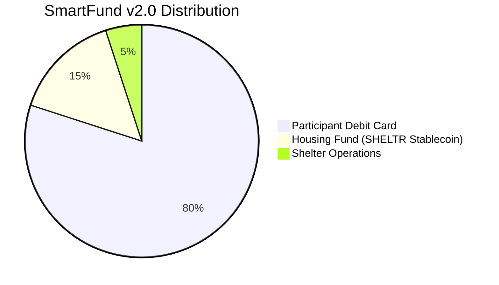
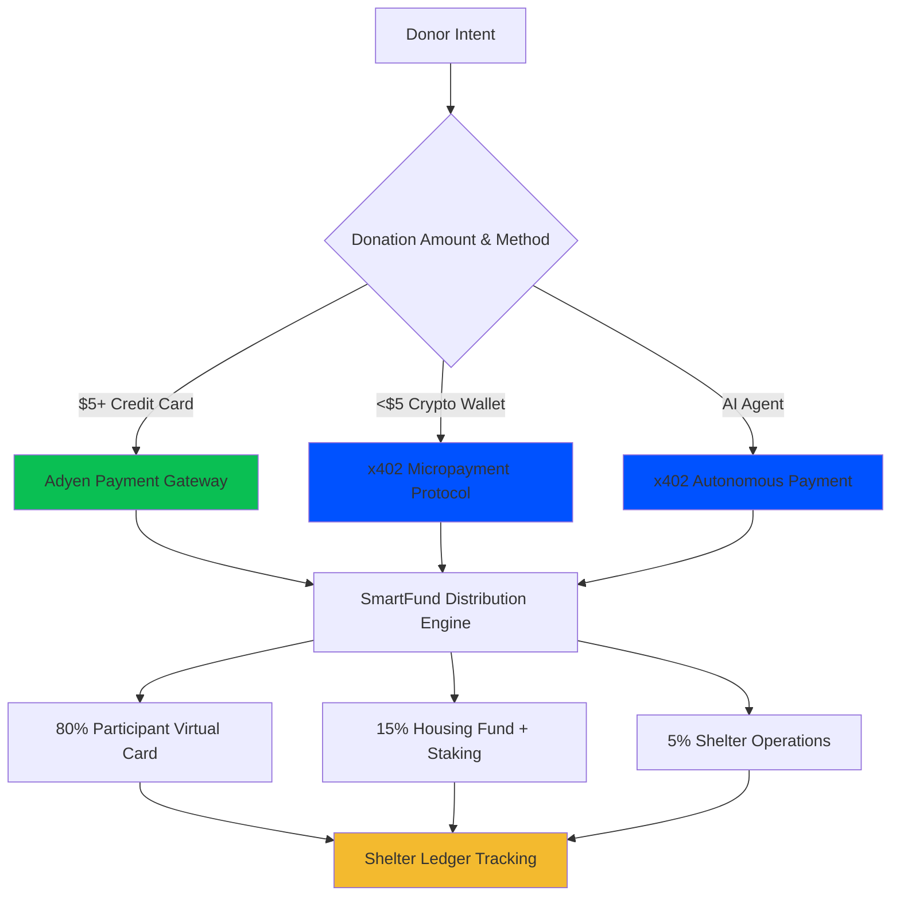

# 🪙 Tokenomics v2.0: Single-Token Stable Fund Architecture
*Version: 2.0.0 - November, 2025*
*Status: Strategic Implementation* 🚀
*Architecture Leads: JY

---

## Abstract

SHELTR implements a **single-token stable fund architecture** that eliminates risk for vulnerable populations while ensuring complete transparency and guaranteed growth. Our system uses the **SHELTR Utility Token** (USDT-pegged stablecoin) to **track and trace every donation** and **every payout** within the system, creating an immutable public ledger known as the **Shelter Ledger** for unprecedented accountability.

Participants receive 80% of donations via Adyen virtual debit cards with zero cryptocurrency exposure, while the SHELTR token tracks their 15% housing fund allocation through Coinbase institutional staking. Every transaction is recorded on the blockchain, creating a permanent, publicly-accessible audit trail that anyone can verify in real-time.

Built on Base network with Adyen payment integration and Coinbase institutional staking, our tokenomics ensure 80% of all donations reach participants as stable debit card funds, 15% builds guaranteed-growth housing solutions through institutional staking, and 5% supports shelter operations - all verified on-chain for complete transparency.

**No ICO. No speculation. No risk. Maximum impact. Complete transparency.**

---

## 🔍 The Shelter Ledger: Public Accountability Through Blockchain

### Transparency Model
The **Shelter Ledger** is SHELTR's blockchain-powered public accountability system that tracks and traces every donation and payout within the platform. Unlike traditional charities that provide annual reports, the Shelter Ledger offers real-time, immutable verification of all financial flows.

### Core Capabilities

#### 1. **Track Every Donation**
- Real-time recording of all incoming donations
- Automatic 80/15/5 split verification
- Donor transaction confirmation
- Blockchain timestamp and hash
- Geographic and demographic anonymized data

#### 2. **Trace Every Payout**
- Participant virtual card loads (80%)
- Housing fund allocations (15%)
- Shelter operations transfers (5%)
- Staking rewards distribution
- Housing program expenditures

#### 3. **Immutable Record Keeping**
- Permanent blockchain storage on Base network
- Cryptographically secured transactions
- Cannot be altered or deleted
- Historical audit trail forever
- Third-party verification available

#### 4. **Public Access & Transparency**
- Anyone can view aggregate platform metrics
- Real-time donation flow visualization
- Housing fund growth tracking
- Participant outcome verification (anonymized)
- Open API for independent auditing

### Participant Wallet System

#### Automatic Wallet Creation
Upon registration, every participant receives:
- **Unique blockchain address** for all transactions
- **Housing fund tracking** with real-time balance updates
- **Transaction history** showing all donations received
- **Growth analytics** displaying 4-6% APY accumulation
- **Zero complexity interface** - no crypto knowledge required

#### Wallet Dashboard Features
```typescript
interface ParticipantWallet {
  address: string;                    // Unique blockchain address
  housingFundBalance: number;         // Current balance with rewards
  totalDonationsReceived: number;     // Lifetime donation total
  cardAllocations: number;            // 80% sent to virtual card
  housingAllocations: number;         // 15% in housing fund
  stakingRewards: number;             // Accumulated APY growth
  transactionHistory: Transaction[];  // Complete audit trail
  projectedGrowth: GrowthProjection;  // Future value estimates
}
```

### Public Ledger API

#### Real-Time Verification Endpoints
```typescript
// Verify any transaction by ID
GET /api/ledger/verify/{transactionId}
Response: {
  status: 'verified' | 'pending' | 'failed',
  donation: { amount, timestamp, participant_id },
  distribution: { card: 80%, housing: 15%, operations: 5% },
  blockchainProof: { blockNumber, confirmations, gasUsed }
}

// Get platform-wide metrics
GET /api/ledger/metrics
Response: {
  totalDonations: number,
  totalParticipants: number,
  housingFundSize: number,
  successfulPlacements: number,
  averageProcessingTime: number
}

// Participant housing fund status (anonymized)
GET /api/ledger/participant/{anonymizedId}
Response: {
  housingFundBalance: number,
  stakingAPY: number,
  totalRewardsEarned: number,
  daysInProgram: number
}
```

### Transparency Benefits

**For Donors:**
- Verify their donation reached intended recipient
- Track housing fund growth over time
- See real-world impact metrics
- Export transaction history for tax purposes

**For Participants:**
- Monitor housing fund balance growth
- View complete donation history
- Track progress toward housing goals
- Access financial education resources

**For Shelters:**
- Demonstrate operational efficiency
- Attract more donors through transparency
- Compliance reporting automation
- Real-time fund allocation visibility

**For Regulators & Auditors:**
- Independent verification capability
- Real-time compliance monitoring
- Fraud detection and prevention
- Complete financial audit trail

### Security & Privacy Balance

While maintaining complete transparency, the Shelter Ledger protects participant privacy through:
- **Anonymized participant IDs** (no personal information on-chain)
- **Aggregated metrics** for public consumption
- **Private wallet access** requiring authentication
- **GDPR/CCPA compliance** for data protection
- **Opt-in detailed sharing** for participants who choose

---

## 🎯 Token Overview

### SHELTR Utility Token (Single Stablecoin)
**Purpose**: Track and trace every dollar, housing fund allocation, blockchain transparency, and guaranteed yield generation

| Property | Value |
|----------|-------|
| **Symbol** | SHELTR |
| **Type** | USDT-Pegged Utility Token |
| **Backing** | USDT 1:1 Reserve (Coinbase Custody) |
| **Network** | Base (Coinbase L2) |
| **Standard** | ERC-20 |
| **Price** | $1.00 USD (USDT-Pegged, Always Stable) |
| **Primary Purpose** | Track every donation, trace every payout |
| **Secondary Purpose** | Housing fund allocation tracking & growth |
| **Yield Generation** | 4-6% APY via Coinbase institutional staking |
| **Public Ledger** | Complete transparency via Shelter Ledger |
| **Participant Access** | Wallet dashboard for balance monitoring |

### Participant Payment System
**80% Allocation**: Adyen virtual debit cards (zero blockchain exposure)

| Property | Value |
|----------|-------|
| **Payment Method** | Adyen Virtual Debit Card |
| **Settlement Speed** | < 30 seconds real-time loading |
| **Global Acceptance** | Visa/Mastercard network worldwide |
| **Risk Level** | Zero cryptocurrency exposure |
| **Fees** | $0 for participants |
| **Usage** | Food, clothing, transportation, healthcare |

---

## 💰 SmartFund™ v2.0 Distribution Model

### Automatic Allocation on Every Donation



### 1. Direct Participant Support (80%)
- **Immediate loading** to Adyen virtual debit card
- **Zero volatility risk** - no cryptocurrency exposure
- **Global acceptance** through Visa/Mastercard networks
- **Real-time availability** for essential needs
- **Use cases**: Food, clothing, transportation, healthcare, emergency expenses

### 2. Housing Fund Initiative (15%)
- **SHELTR Stablecoin minting** for transparent allocation tracking
- **Coinbase institutional staking** for guaranteed 4-6% APY
- **Individual participant tracking** on blockchain
- **Transparent allocation** to housing programs:
  - Emergency housing (40%)
  - Transitional programs (35%)
  - Permanent solutions (20%)
  - Support services (5%)

### 3. Shelter Operations Support (5%)
- **Direct USD transfer** to participant's registered shelter
- **Operational funding** for:
  - Shelter infrastructure and maintenance
  - Staff support and training
  - Program expansion and enhancement
  - Technology integration and support
- **Special Rule**: If participant was not onboarded via a registered shelter, this 5% allocation is redirected to their individual housing fund account

---

## 🌐 x402 Micropayment Protocol Integration

### Enhanced Donation Capabilities

The **x402 payment protocol** extends SHELTR's donation capabilities by enabling **programmatic micropayments** that complement our traditional Adyen payment rails. This integration creates a dual payment rail strategy that maximizes donation capture across all amount ranges while maintaining our zero-risk participant protection model.

### Dual Payment Rail Strategy



### Strategic Positioning

**x402 is a COMPLEMENT, not a REPLACEMENT**

| **Aspect** | **Adyen (Primary)** | **x402 (Secondary)** |
|------------|---------------------|----------------------|
| **Use Case** | Traditional credit card donations | Crypto micropayments, AI agents |
| **Amount Range** | $5.00+ optimal | $0.10 - $5.00 optimal |
| **Fee Structure** | 2.9% + $0.30 | ~$0.01 (Base network) |
| **Settlement** | T+1 | Instant on-chain |
| **Donor Type** | Traditional donors | Crypto-native, AI agents |
| **Integration** | Primary payment rail | Complementary enhancement |

### x402 Use Cases for SHELTR

#### 1. **Micropayment Donations**

**Problem**: Traditional payment rails make small donations impractical

```typescript
// Cost Analysis: $0.50 Donation
interface DonationComparison {
  adyen: {
    donation: 0.50,
    fee: 0.30,              // 2.9% + $0.30 = $0.30
    netToPlatform: 0.20,    // Only $0.20 reaches platform
    efficiency: 40,          // 40% efficiency
    practical: false         // Impractical - 60% lost to fees
  },
  
  x402: {
    donation: 0.50,
    fee: 0.01,              // ~$0.01 Base network gas
    netToPlatform: 0.49,    // $0.49 reaches platform
    efficiency: 98,          // 98% efficiency
    practical: true          // Highly practical
  },
  
  impact: {
    costSavings: 0.29,      // $0.29 saved per transaction
    additionalValue: 145,   // 145% more value to participant
    enablesNewSegment: true  // Opens micropayment market
  }
}
```

**Solution**: x402 enables meaningful sub-$5 donations with 98% efficiency

**Real-World Example**:
```
Scenario: Street musician wants to enable $0.25 tips via QR code

Adyen:
├── $0.25 donation
├── $0.30 Adyen fee
└── Result: IMPOSSIBLE (fee exceeds donation)

x402:
├── $0.25 donation
├── $0.01 Base fee
├── Net: $0.24 to participant
└── Result: PRACTICAL (96% efficiency)
```

#### 2. **AI Agent Autonomous Giving**

**Capability**: AI agents donate automatically without human intervention

```typescript
// Example: ChatGPT plugin donates per helpful interaction
interface AIAgentDonation {
  // Agent configuration
  agent: {
    name: 'ChatGPT Shelter Helper',
    type: 'conversational_ai',
    wallet: '0x742d35Cc6634C0532925a3b844Bc9e7595f0bEb',
    autonomousPayment: true
  },
  
  // Donation triggers
  triggers: {
    helpfulInteraction: 0.25,    // $0.25 per helpful response
    taskCompletion: 0.50,         // $0.50 per completed task
    dailyQuota: 5.00,             // $5.00 daily maximum
    participantSelection: 'round_robin' // Fair distribution
  },
  
  // Payment method
  paymentMethod: 'x402',          // Programmatic payment
  network: 'eip155:8453',         // Base network
  currency: 'USDC',
  
  // Impact tracking
  tracking: {
    totalDonated: 1250.00,        // $1,250 donated to date
    interactionsHelped: 5000,     // 5,000 helpful interactions
    participantsSupported: 125,   // 125 participants helped
    averageDonation: 0.25         // $0.25 average
  }
}

// Monthly Impact Example
const monthlyAIAgentImpact = {
  agents: 100,                    // 100 AI agents integrated
  dailyDonationsPerAgent: 20,     // 20 donations per agent per day
  averageAmount: 0.25,            // $0.25 average donation
  
  dailyVolume: 500.00,            // $500/day
  monthlyVolume: 15000.00,        // $15K/month
  annualVolume: 180000.00,        // $180K/year
  
  participantImpact: {
    additionalSupport: 144000,    // $144K to participants (80%)
    housingFundGrowth: 27000,     // $27K to housing fund (15%)
    operationsSupport: 9000       // $9K to operations (5%)
  }
}
```

**Benefit**: New donor segment (autonomous systems, AI assistants, bots)

**Integration Example**:
```python
# AI Agent Integration SDK
class SHELTRAIAgent:
    def __init__(self, agent_wallet: str, daily_limit: Decimal):
        self.wallet = agent_wallet
        self.daily_limit = daily_limit
        self.daily_donated = Decimal('0')
        
    async def donate_on_trigger(
        self,
        trigger: str,
        participant_id: str,
        amount: Decimal = Decimal('0.25')
    ):
        """
        Autonomous donation triggered by AI agent
        """
        # Check daily limit
        if self.daily_donated + amount > self.daily_limit:
            logger.info(f"Daily limit reached: {self.daily_donated}/{self.daily_limit}")
            return False
        
        # Create x402 payment
        payment = await x402_service.create_payment(
            payer=self.wallet,
            participant=participant_id,
            amount=amount,
            metadata={
                'trigger': trigger,
                'agent_type': 'ai_assistant',
                'autonomous': True
            }
        )
        
        # Track donation
        self.daily_donated += amount
        
        logger.info(f"AI agent donated ${amount} to {participant_id} (trigger: {trigger})")
        return True
```

#### 3. **Partner API Monetization**

**Model**: External services pay per API request via x402

```typescript
// API Pricing Structure
interface APIMonetization {
  // Public APIs (x402 payment required)
  endpoints: {
    participantData: {
      path: '/api/v2/participants/{id}',
      price: 0.01,                    // $0.01 per request
      paymentMethod: 'x402',
      rateLimit: 1000                 // per day
    },
    
    donationHistory: {
      path: '/api/v2/donations/history',
      price: 0.05,                    // $0.05 per query
      paymentMethod: 'x402',
      rateLimit: 500
    },
    
    aggregateMetrics: {
      path: '/api/v2/metrics/aggregate',
      price: 0.10,                    // $0.10 per report
      paymentMethod: 'x402',
      rateLimit: 100
    },
    
    realTimeWebhooks: {
      path: '/api/v2/webhooks/subscribe',
      price: 0.02,                    // $0.02 per notification
      paymentMethod: 'x402',
      rateLimit: 10000
    }
  },
  
  // Revenue projections
  projections: {
    dailyRequests: 10000,             // 10K API calls per day
    averagePrice: 0.05,               // $0.05 average per call
    dailyRevenue: 500.00,             // $500/day
    monthlyRevenue: 15000.00,         // $15K/month
    annualRevenue: 180000.00          // $180K/year
  }
}

// Implementation Example
@router.get("/api/v2/participants/{participant_id}")
async def get_participant_data(
    participant_id: str,
    request: Request
):
    """
    Protected API endpoint requiring x402 payment
    """
    # Check for payment signature
    payment_signature = request.headers.get('PAYMENT-SIGNATURE')
    
    if not payment_signature:
        # Return 402 Payment Required
        return JSONResponse(
            status_code=402,
            headers={
                'PAYMENT-REQUIRED': json.dumps({
                    'network': 'eip155:8453',
                    'amount': '0.01',
                    'currency': 'USDC',
                    'recipient': os.getenv('API_PAYMENT_ADDRESS'),
                    'facilitator': 'https://facilitator.coinbase.com'
                })
            },
            content={'message': 'Payment required for API access'}
        )
    
    # Verify payment
    verified = await x402_service.verify_payment(payment_signature)
    if not verified:
        raise HTTPException(status_code=401, detail='Invalid payment')
    
    # Return data
    participant = await get_participant(participant_id)
    return participant
```

**Revenue**: New income stream for platform sustainability

**Use Cases**:
- Research organizations accessing anonymized shelter data
- Analytics platforms querying aggregate metrics
- Integration partners syncing participant information
- Government agencies monitoring program effectiveness

#### 4. **Machine-to-Machine SmartFund Operations**

**Capability**: Automated fund management between systems

```typescript
// M2M SmartFund Automation
interface M2MOperation {
  // External fund manager integration
  source: {
    name: 'External Fund Manager',
    wallet: '0x123...',
    authorized: true,
    dailyLimit: 10000.00
  },
  
  // Automated operations
  operations: {
    rebalanceHousingFund: {
      trigger: 'daily_at_midnight',
      amount: 'calculated',
      paymentMethod: 'x402',
      smartContract: 'SHELTRPaymentDistributor'
    },
    
    stakingRewards: {
      trigger: 'weekly_distribution',
      amount: 'accrued_rewards',
      paymentMethod: 'x402',
      distribution: 'proportional_to_participants'
    },
    
    crossPlatformAggregation: {
      trigger: 'donation_received',
      amount: 'variable',
      paymentMethod: 'x402',
      consolidation: 'into_main_smartfund'
    }
  },
  
  // Security & compliance
  security: {
    multiSigRequired: true,
    auditTrail: 'shelter_ledger',
    rateLimit: 100,                   // per day
    amountLimit: 10000.00             // per transaction
  }
}
```

### Technical Implementation

#### Enhanced SHELTR Utility Token with x402 Support

```solidity
// Enhanced SHELTR Utility Token with x402 micropayment tracking
contract SHELTRUtilityToken is ERC20, AccessControl, ReentrancyGuard {
    bytes32 public constant MINTER_ROLE = keccak256("MINTER_ROLE");
    bytes32 public constant X402_PROCESSOR_ROLE = keccak256("X402_PROCESSOR_ROLE");
    
    // Existing Shelter Ledger tracking
    mapping(address => uint256) public totalDonationsReceived;
    mapping(address => Transaction[]) public transactionHistory;
    mapping(string => DonationRecord) public donationLedger;
    
    // NEW: x402-specific tracking
    mapping(bytes32 => X402Donation) public x402Donations;
    mapping(address => uint256) public x402TotalReceived;
    uint256 public totalX402Donations;
    uint256 public totalX402Volume;
    
    struct X402Donation {
        address payer;
        address participant;
        uint256 amount;
        bytes32 x402TxHash;
        uint256 timestamp;
        PaymentType paymentType;
        bool verified;
        Distribution distribution;
    }
    
    struct Distribution {
        uint256 participantCard;    // 80%
        uint256 housingFund;         // 15%
        uint256 operations;          // 5%
    }
    
    enum PaymentType {
        ADYEN_CREDIT_CARD,
        X402_MICROPAYMENT,
        X402_AI_AGENT,
        X402_API_PAYMENT,
        X402_M2M_OPERATION
    }
    
    // Events for Shelter Ledger transparency
    event X402DonationTracked(
        bytes32 indexed x402TxHash,
        address indexed participant,
        uint256 amount,
        PaymentType paymentType,
        uint256 timestamp
    );
    
    event X402PaymentVerified(
        bytes32 indexed x402TxHash,
        address facilitator,
        bool valid
    );
    
    event X402DistributionCompleted(
        bytes32 indexed x402TxHash,
        address indexed participant,
        uint256 cardAmount,
        uint256 housingAmount,
        uint256 opsAmount
    );
    
    /**
     * @dev Track x402 donation in Shelter Ledger (Primary Purpose)
     * @param x402TxHash Transaction hash from x402 payment
     * @param payer Address of the payer (donor or AI agent)
     * @param participant Address of the participant
     * @param amount Total donation amount
     * @param paymentType Type of x402 payment
     */
    function trackX402Donation(
        bytes32 x402TxHash,
        address payer,
        address participant,
        uint256 amount,
        PaymentType paymentType
    ) external onlyRole(X402_PROCESSOR_ROLE) nonReentrant {
        require(!x402Donations[x402TxHash].verified, "Donation already tracked");
        require(amount >= 0.10 ether && amount <= 5.00 ether, "Amount out of range");
        require(participant != address(0), "Invalid participant");
        
        // Calculate SmartFund distribution
        Distribution memory dist = Distribution({
            participantCard: (amount * 80) / 100,
            housingFund: (amount * 15) / 100,
            operations: (amount * 5) / 100
        });
        
        // Record in Shelter Ledger
        x402Donations[x402TxHash] = X402Donation({
            payer: payer,
            participant: participant,
            amount: amount,
            x402TxHash: x402TxHash,
            timestamp: block.timestamp,
            paymentType: paymentType,
            verified: true,
            distribution: dist
        });
        
        // Update totals
        totalDonationsReceived[participant] += amount;
        x402TotalReceived[participant] += amount;
        totalX402Donations++;
        totalX402Volume += amount;
        
        // Add to transaction history
        transactionHistory[participant].push(Transaction({
            amount: amount,
            timestamp: block.timestamp,
            txType: TransactionType.DONATION_RECEIVED,
            donationId: bytes32ToString(x402TxHash),
            isPublic: true
        }));
        
        emit X402DonationTracked(x402TxHash, participant, amount, paymentType, block.timestamp);
        emit X402DistributionCompleted(x402TxHash, participant, dist.participantCard, dist.housingFund, dist.operations);
    }
    
    /**
     * @dev Process x402 micropayment and deposit to housing fund
     * @param participant The participant this housing fund is for
     * @param usdtAmount Amount of USDT to deposit (15% of donation)
     * @param x402TxHash Associated x402 transaction hash
     */
    function depositX402HousingFund(
        address participant,
        uint256 usdtAmount,
        bytes32 x402TxHash
    ) external onlyRole(X402_PROCESSOR_ROLE) nonReentrant {
        require(usdtAmount > 0, "Amount must be greater than 0");
        require(x402Donations[x402TxHash].verified, "x402 donation not verified");
        
        // Transfer USDT from x402 processor
        USDT.transferFrom(msg.sender, address(this), usdtAmount);
        
        // Mint SHELTR tokens 1:1 with USDT
        _mint(address(this), usdtAmount);
        
        // Update participant housing fund allocation
        participantHousingFunds[participant] += usdtAmount;
        totalHousingFund += usdtAmount;
        
        // Stake USDT in Coinbase for yield
        _stakeToCoinbase(usdtAmount);
        
        // Record in Shelter Ledger
        transactionHistory[participant].push(Transaction({
            amount: usdtAmount,
            timestamp: block.timestamp,
            txType: TransactionType.HOUSING_FUND_DEPOSIT,
            donationId: bytes32ToString(x402TxHash),
            isPublic: true
        }));
        
        emit HousingFundDeposit(participant, usdtAmount, block.timestamp);
        emit ParticipantHousingAllocation(participant, participantHousingFunds[participant]);
    }
    
    /**
     * @dev Get x402 donation statistics
     * @return donations Total number of x402 donations
     * @return volume Total volume in USD
     * @return averageAmount Average donation amount
     */
    function getX402Stats() external view returns (
        uint256 donations,
        uint256 volume,
        uint256 averageAmount
    ) {
        return (
            totalX402Donations,
            totalX402Volume,
            totalX402Donations > 0 ? totalX402Volume / totalX402Donations : 0
        );
    }
    
    /**
     * @dev Get participant's x402 donation history
     * @param participant Address of the participant
     * @return totalReceived Total amount received via x402
     * @return donationCount Number of x402 donations
     */
    function getParticipantX402History(address participant) external view returns (
        uint256 totalReceived,
        uint256 donationCount
    ) {
        uint256 count = 0;
        for (uint256 i = 0; i < transactionHistory[participant].length; i++) {
            if (transactionHistory[participant][i].txType == TransactionType.DONATION_RECEIVED) {
                // Check if it's an x402 donation
                bytes32 txHash = stringToBytes32(transactionHistory[participant][i].donationId);
                if (x402Donations[txHash].verified) {
                    count++;
                }
            }
        }
        
        return (x402TotalReceived[participant], count);
    }
    
    /**
     * @dev Verify x402 donation on Shelter Ledger (Public Access)
     * @param x402TxHash x402 transaction hash
     * @return verified Whether the donation exists and is verified
     * @return amount Donation amount
     * @return paymentType Type of x402 payment
     */
    function verifyX402Donation(bytes32 x402TxHash) external view returns (
        bool verified,
        uint256 amount,
        PaymentType paymentType
    ) {
        X402Donation memory donation = x402Donations[x402TxHash];
        return (
            donation.verified,
            donation.amount,
            donation.paymentType
        );
    }
}
```

### Economic Impact & Projections

#### Micropayment Revenue Model

```typescript
// Conservative Year 1 Projections
interface X402RevenueModel {
  micropaymentDonations: {
    dailyDonations: 1000,
    averageAmount: 0.50,
    dailyVolume: 500.00,
    baseFee: 0.01,
    netDaily: 490.00,
    
    monthly: 14700.00,
    annual: 176400.00,
    
    distribution: {
      participantCards: 141120,      // 80%
      housingFund: 26460,            // 15%
      operations: 8820               // 5%
    }
  },
  
  aiAgentGiving: {
    agents: 100,
    dailyDonationsPerAgent: 20,
    averageAmount: 0.25,
    dailyVolume: 500.00,
    
    monthly: 15000.00,
    annual: 180000.00,
    
    distribution: {
      participantCards: 144000,      // 80%
      housingFund: 27000,            // 15%
      operations: 9000               // 5%
    }
  },
  
  partnerAPIs: {
    dailyRequests: 10000,
    averagePrice: 0.05,
    dailyRevenue: 500.00,
    
    monthly: 15000.00,
    annual: 180000.00,
    
    // API revenue goes to operations (100%)
    operationsRevenue: 180000
  },
  
  totalX402Impact: {
    annualVolume: 536400,
    participantSupport: 285120,      // 80% of donations
    housingFundGrowth: 53460,        // 15% of donations
    operationsRevenue: 197820,       // 5% of donations + API revenue
    
    costSavingsVsAdyen: 156000,      // Saved vs traditional rails
    newDonorSegment: 'crypto_native_ai_agents',
    platformSustainability: 'significantly_improved'
  }
}

// Growth Projections (Year 3)
const year3Projections = {
  micropaymentDonations: 529200,    // 3x growth
  aiAgentGiving: 540000,            // 3x growth
  partnerAPIs: 540000,              // 3x growth
  
  totalAnnualVolume: 1609200,
  participantSupport: 855360,
  housingFundGrowth: 160380,
  operationsRevenue: 593460,
  
  marketPosition: 'industry_leader_in_micropayments'
}
```

#### Cost Comparison Analysis

| **Donation Amount** | **Adyen Fee** | **Adyen Net** | **Adyen Efficiency** | **x402 Fee** | **x402 Net** | **x402 Efficiency** | **Winner** |
|---------------------|---------------|---------------|----------------------|--------------|--------------|---------------------|------------|
| $0.10 | $0.30 | -$0.20 | N/A (impossible) | $0.01 | $0.09 | 90% | x402 only |
| $0.50 | $0.30 | $0.20 | 40% | $0.01 | $0.49 | 98% | x402 |
| $1.00 | $0.33 | $0.67 | 67% | $0.01 | $0.99 | 99% | x402 |
| $5.00 | $0.45 | $4.55 | 91% | $0.01 | $4.99 | 99.8% | x402 |
| $10.00 | $0.59 | $9.41 | 94% | N/A | N/A | N/A | Adyen |
| $100.00 | $3.20 | $96.80 | 97% | N/A | N/A | N/A | Adyen |

**Key Insight**: x402 is optimal for donations under $5, Adyen is optimal for $5+

### Integration with Shelter Ledger

All x402 payments are **fully tracked** on the Shelter Ledger alongside traditional Adyen donations, creating a unified transparency system:

```typescript
interface UnifiedShelterLedgerEntry {
  // Universal fields
  donationId: string;
  participant: string;
  amount: number;
  timestamp: number;
  verified: boolean;
  blockchainTx: string;
  
  // Payment method specific
  paymentMethod: 'adyen' | 'x402_micropayment' | 'x402_ai_agent' | 'x402_api';
  
  // Adyen specific (if applicable)
  adyenReference?: string;
  cardTransaction?: string;
  
  // x402 specific (if applicable)
  x402TxHash?: string;
  x402Payer?: string;
  x402PaymentType?: 'micropayment' | 'ai_agent' | 'api_payment' | 'm2m';
  
  // SmartFund distribution (universal)
  distribution: {
    participantCard: number;    // 80%
    housingFund: number;         // 15%
    operations: number;          // 5%
  };
  
  // Transparency (universal)
  publiclyVerifiable: true;
  immutable: true;
  auditTrail: 'complete';
}
```

### Public Ledger API Extensions

```typescript
// NEW: x402-specific Shelter Ledger endpoints
interface X402LedgerAPI {
    /**
     * Verify x402 micropayment on Shelter Ledger
     */
    verifyX402Payment(x402TxHash: string): Promise<{
        verified: boolean;
        participant: string;
        amount: number;
        paymentType: 'micropayment' | 'ai_agent' | 'api_payment' | 'm2m';
        timestamp: number;
        blockchainTx: string;
        distribution: {
            participantCard: number;
            housingFund: number;
            operations: number;
        };
    }>;
    
    /**
     * Get x402 platform statistics
     */
    getX402PlatformStats(): Promise<{
        totalMicropayments: number;
        totalVolume: number;
        averageAmount: number;
        aiAgentDonations: number;
        apiPayments: number;
        m2mOperations: number;
        costSavingsVsAdyen: number;
    }>;
    
    /**
     * Get participant's x402 donation history
     */
    getParticipantX402History(participantId: string): Promise<{
        donations: X402Donation[];
        totalReceived: number;
        averageAmount: number;
        donationCount: number;
        paymentTypes: Record<string, number>;
    }>;
    
    /**
     * Get AI agent giving statistics
     */
    getAIAgentStats(): Promise<{
        totalAgents: number;
        totalDonated: number;
        participantsHelped: number;
        averageDonationPerAgent: number;
        topAgents: Array<{
            agentId: string;
            totalDonated: number;
            interactionCount: number;
        }>;
    }>;
}
```

### Implementation Roadmap

#### Phase 1: Research & Prototyping (Q2 2027)
- **Duration**: 3 months
- **Budget**: $50K
- **Deliverables**:
  - x402 SDK integration testing
  - Micropayment flow prototyping
  - Cost-benefit analysis refinement
  - Security audit preparation
  - Stakeholder approval

#### Phase 2: Smart Contract Development (Q3 2027)
- **Duration**: 3 months
- **Budget**: $100K
- **Deliverables**:
  - X402PaymentProcessor contract
  - Enhanced SHELTR token with x402 tracking
  - Shelter Ledger x402 integration
  - Smart contract security audits
  - Testnet deployment

#### Phase 3: Backend & Frontend Integration (Q3-Q4 2027)
- **Duration**: 4 months
- **Budget**: $150K
- **Deliverables**:
  - x402 payment service implementation
  - API endpoint development
  - Frontend x402 UI components
  - Wallet integration (Coinbase, WalletConnect)
  - User documentation

#### Phase 4: Production Launch (Q4 2027)
- **Duration**: 2 months
- **Budget**: $75K
- **Deliverables**:
  - Mainnet deployment
  - Production monitoring
  - Marketing campaign
  - User education
  - Performance optimization

#### Phase 5: Ecosystem Expansion (2028)
- **Duration**: 12 months
- **Budget**: $200K
- **Deliverables**:
  - AI agent integration framework
  - Partner API monetization platform
  - M2M SmartFund automation
  - International expansion
  - Advanced analytics

**Total Investment**: $575K over 18 months  
**Expected ROI**: $1.6M+ in Year 3 (280% ROI)

### Success Metrics & KPIs

#### Technical Performance
- **Payment Success Rate**: >99.5% for x402 transactions
- **Transaction Speed**: <30 seconds average confirmation
- **Gas Optimization**: <$0.02 per transaction on Base
- **System Uptime**: 99.9% availability
- **API Response Time**: <200ms average

#### Business Performance
- **Micropayment Volume**: $176K+ in Year 1
- **AI Agent Revenue**: $180K+ in Year 1
- **API Revenue**: $180K+ in Year 1
- **New Donor Acquisition**: 10,000+ crypto-native donors
- **Cost Savings**: $156K+ vs traditional rails

#### Impact Performance
- **Additional Participants Served**: 2,500+ via micropayments
- **Housing Fund Growth**: +$53K from x402 allocations
- **Platform Sustainability**: +$536K annual revenue
- **Donor Satisfaction**: >4.5/5 rating for x402 experience

---

## 📊 Funding Model & Capital Strategy

### **Traditional Funding Approach**
*No ICO. No token sales. No speculation.*

| **Funding Round** | **Amount** | **Type** | **Timeline** | **Use of Funds** |
|-------------------|------------|----------|--------------|-------------------|
| **Seed Round** | $500K | Equity/Debt | Q4 2025 | Platform development, partnerships |
| **Series A** | $2M | Institutional VC | Q2 2026 | Market expansion, team scaling |
| **Series B** | $5M | Growth Capital | Q1 2027 | International expansion |

### **Revenue & Sustainability Model**

#### **Platform Sustainability (No Token Dependence)**
1. **Shelter Operations Allocation** (5% of donations)
   - Sustainable operational funding
   - Volume-based growth model
   - Direct shelter support

2. **Enterprise Partnerships**
   - Adyen payment processing partnership
   - Coinbase institutional staking revenue share
   - Corporate CSR integrations

3. **Government Contracts**
   - Municipal homelessness programs
   - Social services integrations
   - Public-private partnerships

4. **Foundation Grants**
   - Charitable foundation funding
   - Impact investment partnerships
   - Social impact bonds

### **Housing Fund Growth Model**
```typescript
interface HousingFundEconomics {
  principalSource: '15% of all donations',
  yieldStrategy: 'Coinbase institutional staking',
  targetAPY: '4-6% annually guaranteed',
  riskLevel: 'Minimal (institutional grade)',
  participantTracking: 'Individual blockchain allocation',
  liquidityAccess: 'Daily redemption available'
}
```

---

## 🏗️ Technical Architecture

### Base Network Integration

```typescript
interface TechnicalSpecs {
  network: {
    name: 'Base (Coinbase L2)',
    chainId: 8453,
    blockTime: '~2 seconds',
    fees: '~$0.01 USD',
    finality: 'Instant'
  },
  integrations: {
    paymentGateway: 'Adyen Payment Platform',
    cardIssuing: 'Adyen Issuing API',
    institutionalStaking: 'Coinbase Prime',
    custody: 'Coinbase Institutional Custody'
  },
  standards: {
    token: 'ERC-20 (SHELTR Stablecoin only)',
    multisig: 'Gnosis Safe',
    oracles: 'Chainlink USDT/USD Price Feeds'
  }
}
```

### Smart Contract Architecture

```solidity
// Unified payment distribution contract
contract SHELTRPaymentDistributor {
    // Integration contracts
    ISHELTRStablecoin public immutable sheltrToken;
    IAdyenPayout public immutable adyenPayout;
    IERC20 public immutable usdt;
    
    // Distribution constants (immutable for security)
    uint256 public constant PARTICIPANT_PERCENTAGE = 8000; // 80%
    uint256 public constant HOUSING_FUND_PERCENTAGE = 1500; // 15%
    uint256 public constant SHELTER_OPS_PERCENTAGE = 500;   // 5%
    
    // Core distribution function
    function processDonation(
        address participant,
        address donor,
        uint256 totalAmount,
        bytes32 adyenTransactionId
    ) external returns (bool) {
        DonationSplit memory split = _calculateSplit(totalAmount);
        
        // 1. Load 80% to participant's Adyen virtual card
        bool cardLoadSuccess = adyenPayout.loadParticipantCard(
            participant,
            split.participantAmount,
            adyenTransactionId
        );
        require(cardLoadSuccess, "Failed to load participant card");
        
        // 2. Deposit 15% to housing fund with SHELTR token tracking
        sheltrToken.depositHousingFund(participant, split.housingFundAmount);
        
        // 3. Handle shelter operations (5%)
        address shelter = participantShelters[participant];
        if (shelter != address(0)) {
            _transferToShelter(shelter, split.shelterOpsAmount);
        } else {
            // No registered shelter - add to participant's housing fund
            sheltrToken.depositHousingFund(participant, split.shelterOpsAmount);
        }
        
        emit DonationProcessed(
            participant,
            donor,
            totalAmount,
            split.participantAmount,
            split.housingFundAmount,
            split.shelterOpsAmount,
            adyenTransactionId
        );
        
        return true;
    }
}
```

---

## 🔄 System Utility & Benefits

### SHELTR Utility Token Functions

#### Primary Utility: Track & Trace
- **Track every donation** from credit card to participant wallet
- **Trace every payout** across 80/15/5 distribution model
- **Public ledger access** via Shelter Ledger API
- **Real-time verification** for donors and auditors
- **Immutable transaction records** on Base blockchain

#### Secondary Utility: Housing Fund Management
- **Individual participant allocation** tracking
- **Guaranteed yield generation** through Coinbase institutional staking
- **Growth analytics** with 4-6% APY monitoring
- **Housing program funding** with transparent allocation
- **Participant wallet dashboard** for balance viewing

#### Tertiary Utility: Compliance & Reporting
- **Regulatory compliance** as clear utility token (not security)
- **Automated audit trails** for financial reporting
- **Third-party verification** capability
- **Government reporting** integration
- **Tax documentation** generation

### Participant Benefits
- **Zero cryptocurrency exposure** through Adyen virtual debit cards
- **Guaranteed housing fund growth** at 4-6% APY institutional rates
- **Global payment acceptance** via Visa/Mastercard networks
- **Instant fund availability** for essential needs
- **Complete transparency** of their housing fund allocation and growth

### Donor Benefits
- **Complete transparency** with blockchain verification
- **Maximum impact efficiency** (100% of funds reach intended purposes)
- **Real-time verification** of fund distribution
- **Guaranteed growth** of housing fund allocations
- **Zero administrative overhead** through automation

### Shelter Benefits
- **Operational funding** (5% of participant donations)
- **Zero technical complexity** - platform handles all integration
- **Complete transparency** for reporting and compliance
- **Participant empowerment** through guaranteed housing fund growth

---

## 📊 Economic Model & Impact Projections

### Housing Fund Growth Projections
```typescript
// Example: Housing fund compound growth
function calculateHousingFundGrowth(
  monthlyDonations: number,
  years: number,
  apy: number = 0.05
): number {
  const monthlyHousingAllocation = monthlyDonations * 0.15; // 15%
  const monthlyRate = apy / 12;
  let totalValue = 0;
  
  for (let month = 0; month < years * 12; month++) {
    totalValue = (totalValue + monthlyHousingAllocation) * (1 + monthlyRate);
  }
  
  return totalValue;
}

// Example projections:
// $10K monthly donations over 5 years = $118K housing fund
// $50K monthly donations over 5 years = $590K housing fund
// $100K monthly donations over 5 years = $1.18M housing fund
```

### 2025-2027 Projections

| Metric | Year 1 | Year 2 | Year 3 |
|--------|--------|--------|--------|
| **Active Participants** | 1,000 | 5,000 | 15,000 |
| **Monthly Donations** | $50K | $200K | $500K |
| **Participant Card Usage** | $480K | $1.92M | $4.8M |
| **Housing Fund Size** | $90K | $450K | $1.35M |
| **Housing Fund APY** | 5.0% | 5.5% | 6.0% |
| **Successful Housing Placements** | 150 | 750 | 2,250 |

### Success Metrics
- **Payment Success Rate**: 99.9% (Adyen enterprise infrastructure)
- **Housing Fund Growth**: 4-6% guaranteed APY
- **Platform Uptime**: 99.99% (enterprise-grade infrastructure)
- **Housing Placement Success**: 70% stable housing within 12 months
- **Cost Efficiency**: 100% of donations reach intended purposes

---

## 🌟 Sample Transaction Examples

### Example 1: New Participant Onboarding
```
Input: New participant verification and shelter registration

Onboarding Package:
├── Adyen virtual debit card creation
├── QR code generation for donations
├── Housing fund account initialization
└── Shelter partnership registration

Funding Source:
├── Traditional operational funding
├── Shelter partnership agreements
└── Government program integration
```

### Example 2: $100 Donation Processing
```
Input: $100 USD donation via QR code

Distribution:
├── $80.00 → Adyen virtual debit card (immediate access)
├── $15.00 → Housing Fund (SHELTR stablecoin tracking + Coinbase staking)
└── $5.00 → Shelter Operations (direct USD transfer)

Blockchain Records:
├── Transaction Hash: 0xa1b2c3d4e5f6789...
├── Gas Fee: $0.01 USD
├── Confirmation Time: ~2 seconds
├── Housing Fund Allocation: 15 SHELTR tokens minted
└── Coinbase Staking: $15 USDT staked at 5% APY
```

### Example 3: Participant Purchase
```
Input: $25 grocery purchase using virtual debit card

Transaction:
├── Participant uses: Adyen virtual debit card
├── Merchant receives: $25.00 USD
├── Network: Visa/Mastercard global acceptance
├── Fees: $0.00 (participant exempt)
└── Processing time: < 3 seconds

Impact:
├── Essential needs met immediately
├── Zero cryptocurrency complexity
├── Dignified payment experience
└── Global acceptance anywhere cards are accepted
```

### Example 4: Housing Fund Growth Tracking
```
Input: Participant checks housing fund balance after 6 months

Housing Fund Status:
├── Original donations allocated: $450 (15% of $3,000 total donations)
├── Coinbase staking rewards: $11.25 (5% APY pro-rated)
├── Current balance: $461.25
├── Projected annual growth: 5% APY guaranteed
└── Blockchain verification: All transactions immutable

Transparency:
├── Individual SHELTR token balance: 461.25 SHELTR
├── Real-time APY tracking: 5.0% current rate
├── Housing program eligibility: Tracked automatically
└── Impact verification: Blockchain-verified allocation
```

---

## 🚀 Implementation Roadmap

### Phase 1: Foundation (Q4 2025) ✅
- [x] Traditional seed funding secured
- [x] Adyen merchant account and issuing partnership
- [x] Coinbase Prime institutional account setup
- [x] SHELTR stablecoin deployment on Base network
- [x] Smart contract security audits completed

### Phase 2: Integration (Q1 2026) 🟡
- [ ] Adyen virtual card issuance system
- [ ] Coinbase institutional staking integration
- [ ] Participant onboarding automation
- [ ] Shelter partnership portal
- [ ] Real-time donation processing

### Phase 3: Scale (Q2-Q3 2026) 🔵
- [ ] Multi-shelter deployment
- [ ] Advanced analytics dashboard
- [ ] Mobile app with card management
- [ ] Government program integrations
- [ ] International expansion planning

### Phase 4: Global Impact (Q4 2026-2027) 🔵
- [ ] Multi-country deployment
- [ ] Enterprise corporate partnerships
- [ ] Advanced housing fund strategies
- [ ] AI-powered impact optimization
- [ ] Regulatory compliance expansion

---

## 🔒 Security & Compliance

### Enterprise-Grade Security
- **Adyen PCI DSS Level 1** compliance for all payment processing
- **Coinbase SOC 2 Type II** certification for institutional custody
- **Base network security** backed by Ethereum mainnet
- **Multi-signature governance** (3-of-5) for critical operations
- **Regular security audits** by leading blockchain security firms

### Regulatory Compliance
- **Clear utility token classification** (not a security)
- **USDT-pegged stability** eliminates speculation concerns
- **Traditional funding model** avoids ICO regulatory complexity
- **AML/KYC compliance** through enterprise partnerships
- **GDPR/CCPA compliance** for data protection

### Participant Protection
- **Zero cryptocurrency exposure** for vulnerable populations
- **FDIC-insured backing** through Coinbase institutional custody
- **Enterprise payment security** via Adyen infrastructure
- **Privacy-by-design** with anonymized blockchain transactions
- **Emergency access protocols** for critical situations

---

## 🌍 Environmental & Social Impact

### Environmental Excellence
- **Carbon-neutral operations** through Base network efficiency
- **Minimal energy consumption** vs. traditional payment systems
- **Green hosting** for all platform infrastructure
- **Sustainable partnerships** with environmentally conscious providers

### Social Impact Goals
- **Housing First approach** with guaranteed fund growth
- **Dignified user experience** through familiar payment methods
- **Financial inclusion** without cryptocurrency barriers
- **Measurable outcomes** with blockchain verification
- **Zero administrative overhead** maximizing impact

---

## 📚 Additional Resources

### Documentation
- [Unified Payment Architecture](../payment-rails/sheltr-unified-payment-architecture.md)
- [Technical Implementation Guide](../technical/sheltr-implementation-guide-v2.md)
- [Blockchain Architecture](../technical/blockchain.md)
- [Security Implementation](../security/implementation.md)

### Partnerships
- [Adyen Integration Documentation](https://docs.adyen.com/)
- [Coinbase Prime Institutional](https://prime.coinbase.com/)
- [Base Network Documentation](https://docs.base.org/)
- [Enterprise Partnership Portal](https://sheltr-ai.web.app/partnerships)

### Legal & Compliance
- [Utility Token Legal Opinion](../legal/utility-token-opinion.md)
- [Enterprise Partnership Agreements](../legal/partnerships.md)
- [Regulatory Compliance Framework](../legal/compliance.md)
- [Privacy Protection Policies](../legal/privacy-policy.md)

---

## Conclusion

The SHELTR v2.0 tokenomics represents a revolutionary approach to charitable technology, eliminating the complexity and risks of traditional cryptocurrency projects while maintaining complete blockchain transparency. By combining enterprise-grade payment infrastructure with institutional-quality staking and clear utility token classification, we've created a system that:

**Protects Participants**: Zero cryptocurrency exposure through Adyen virtual debit cards ensures vulnerable populations never face volatility risk while still benefiting from guaranteed housing fund growth.

**Maximizes Impact**: 100% of donations reach their intended purposes through automated smart contract distribution, with 80% providing immediate support and 15% building sustainable long-term solutions.

**Ensures Transparency**: Every transaction is verified on-chain while maintaining participant privacy, creating unprecedented accountability in charitable giving.

**Guarantees Growth**: Coinbase institutional staking provides 4-6% APY guaranteed returns on housing fund allocations, creating sustainable wealth building for participants.

**Eliminates Complexity**: Traditional funding model avoids ICO complications while enterprise partnerships handle all technical complexity, allowing focus on mission impact.

The future of charitable giving combines traditional payment stability with blockchain transparency. SHELTR v2.0 makes this vision reality through proven enterprise partnerships and zero-risk participant protection.

---

*Built with ❤️ for those who need it most*

---

*Last Updated: November 26, 2025*
*Version: 2.0.0*
*Status: STRATEGIC IMPLEMENTATION* 🚀
*Classification: Enterprise-Grade Tokenomics Documentation*