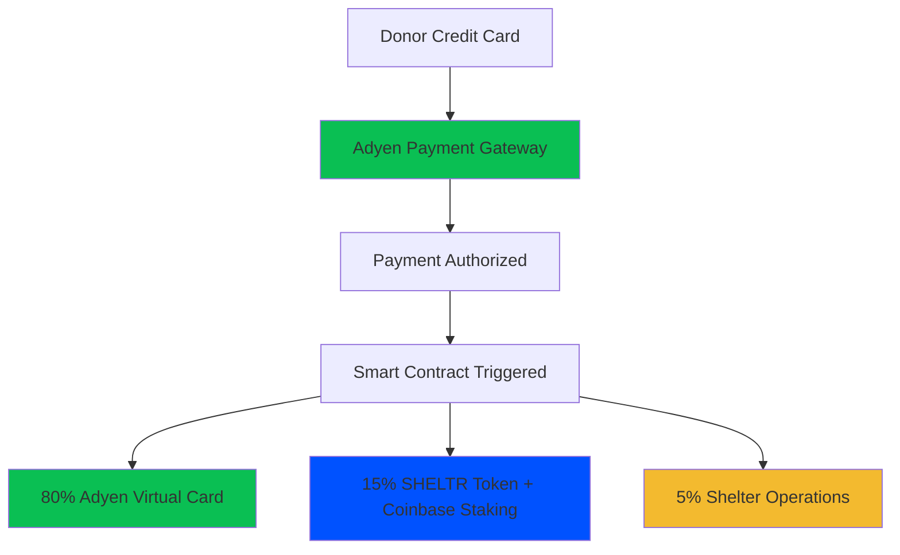
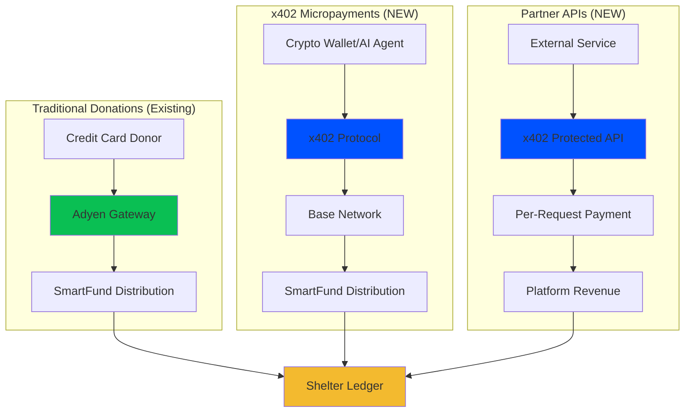
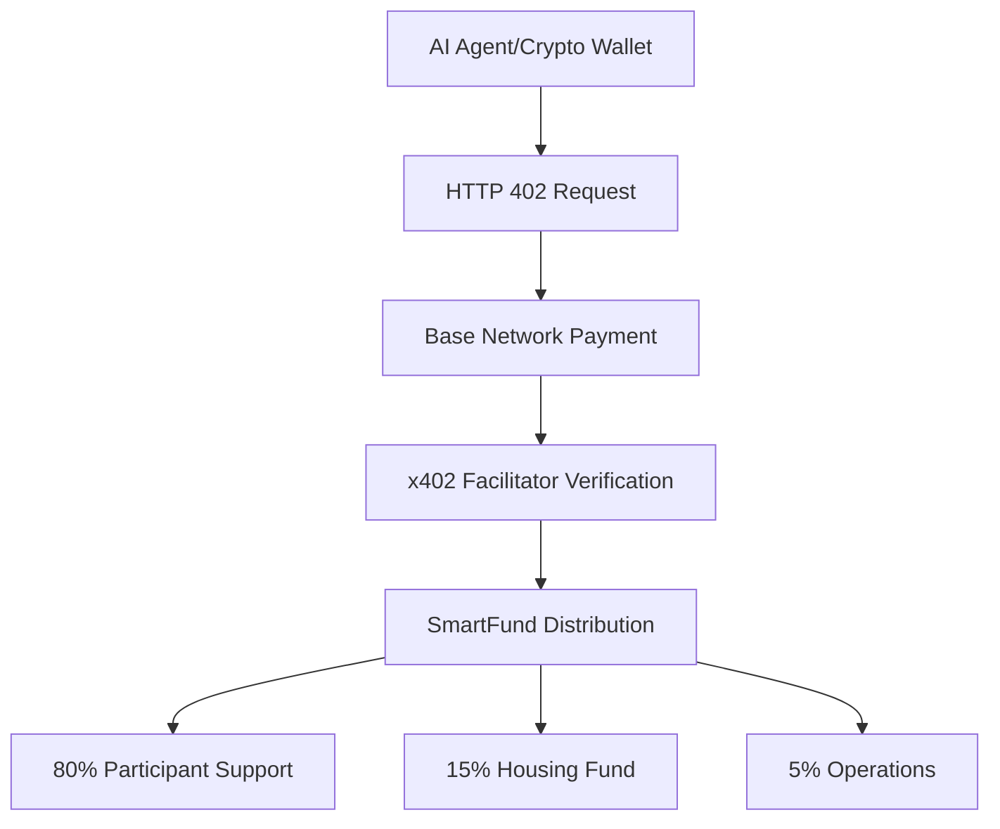
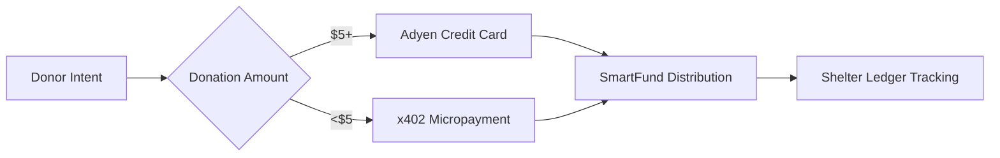
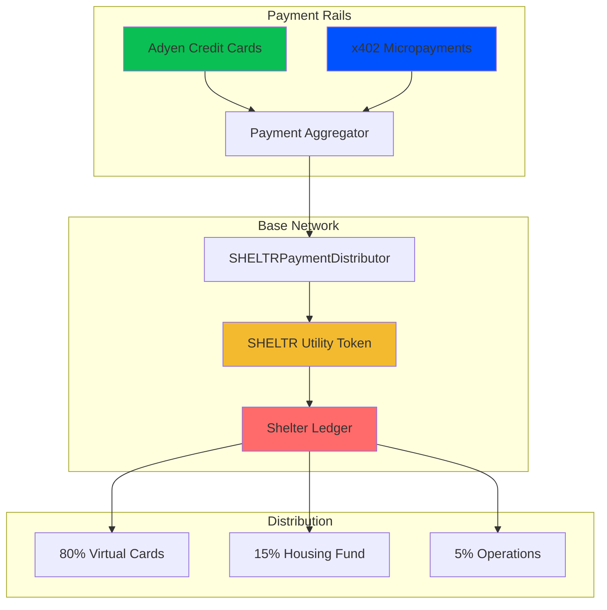
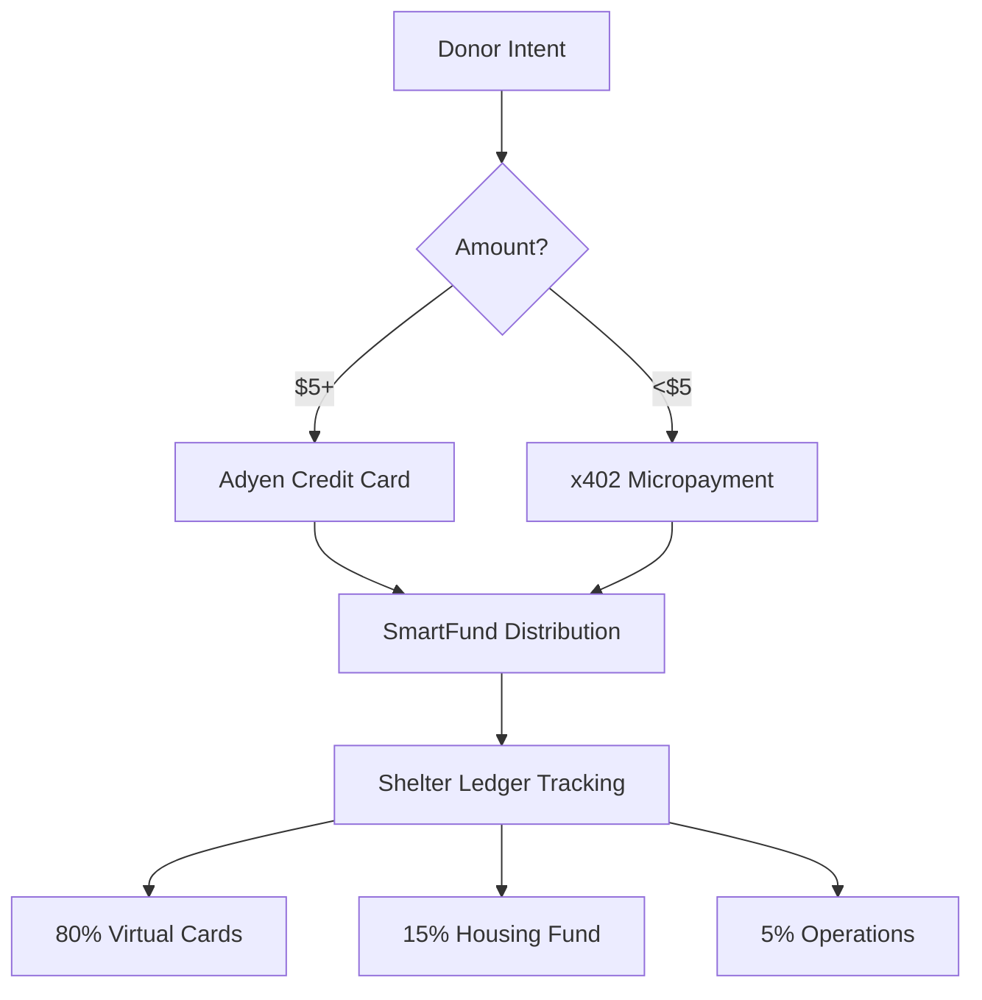
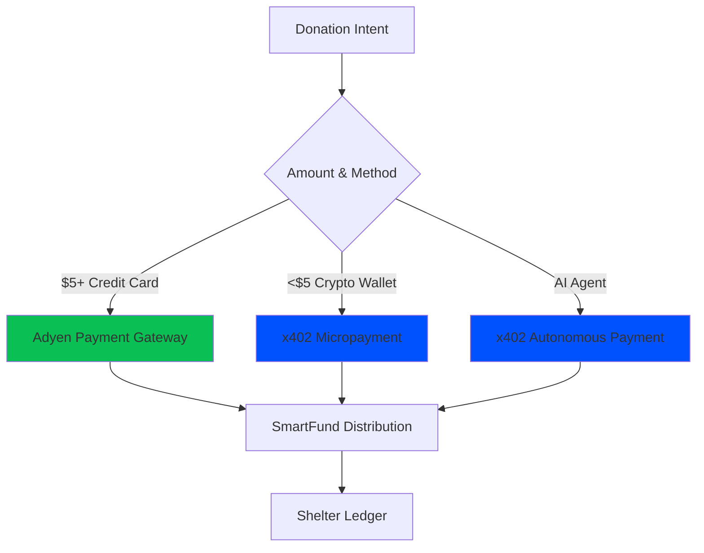

# x402 Integration Strategy for SHELTR
**Strategic Analysis & Implementation Roadmap**

**Document Version**: 1.0.0  
**Last Updated**: December 16, 2025  
**Status**: Strategic Planning  
**Architecture Lead**: JY-CTO

---

## 🎯 Executive Summary

After comprehensive review of SHELTR's payment architecture, this document outlines the strategic integration of Coinbase's x402 payment protocol into our existing **Adyen + Base + Coinbase** infrastructure. The x402 protocol complements rather than replaces our current architecture, enabling new capabilities for micropayments, AI agent interactions, and machine-to-machine transactions.

### Key Finding: **Complementary Integration**

x402 is **NOT** a replacement for our core payment rails but rather an **enhancement layer** that enables:
- ✅ Micropayments (<$1) alongside traditional donations
- ✅ AI agent autonomous payments for API access
- ✅ Partner API monetization without complex billing
- ✅ Machine-to-machine SmartFund operations

---

## 📊 Architecture Review: Current State

### Current Payment Flow (Adyen-Centric)



**Key Components:**
1. **Adyen**: Primary payment rails for credit card donations
2. **Base Network**: Blockchain layer for SHELTR utility token
3. **Coinbase Prime**: Institutional staking for 4-6% APY
4. **SHELTR Utility Token**: Dual-purpose (Shelter Ledger + SmartFund)

### Current Architecture Strengths
- ✅ Enterprise-grade payment processing (Adyen)
- ✅ Zero crypto exposure for participants (virtual cards)
- ✅ Guaranteed returns (Coinbase institutional staking)
- ✅ Complete transparency (Shelter Ledger on Base)
- ✅ Traditional funding model (no ICO)

### Current Architecture Limitations
- ❌ Minimum transaction amounts ($5-10 practical minimum)
- ❌ High fees for micropayments (2.9% + $0.30)
- ❌ No programmatic M2M payment capability
- ❌ No AI agent autonomous payment support
- ❌ Limited API monetization options

---

## 🔄 x402 Integration Points

### Integration Strategy: **Hybrid Payment Architecture**



---

## 📝 Document Update Plan

### Phase 1: Core Architecture Documents

#### 1.1 **unified-payment-architecture.md** Updates

**Location**: `docs/architecture/payment-rails/unified-payment-architecture.md`

**Changes Required:**

**Section to Add: "x402 Micropayment Layer"** (after line 198)

```markdown
## 🌐 **x402 Micropayment Integration (Phase 2027+)**

### Overview
The x402 payment protocol provides a complementary payment rail for micropayments, AI agent transactions, and machine-to-machine operations alongside our primary Adyen infrastructure.

### x402 Payment Flow


### Use Cases
1. **Micropayments**: Sub-$1 donations with minimal fees
2. **AI Agent Donations**: Autonomous bot-driven giving
3. **Partner API Monetization**: Per-request billing for data access
4. **M2M SmartFund Operations**: Automated fund management

### Technical Integration
```typescript
interface X402PaymentFlow {
  // Complementary to Adyen, not replacement
  primaryRail: 'Adyen for traditional donations ($5+)',
  x402Rail: 'Coinbase x402 for micropayments (<$5)',
  
  x402Config: {
    network: 'Base (eip155:8453)',
    facilitator: 'Coinbase CDP x402 Facilitator',
    currency: 'USDC',
    feeStructure: 'Fee-free via Coinbase facilitator',
    settlement: 'Instant on-chain confirmation'
  },
  
  integrationPoints: {
    donationAPI: 'Accept x402 payments alongside Adyen',
    partnerAPIs: 'Monetize data access via x402',
    smartFundAutomation: 'M2M operations for fund management'
  }
}
```

### Revenue Impact
- **Micropayment Capture**: Enable $0.10 - $5.00 donations (currently impractical)
- **API Revenue**: Monetize partner integrations at $0.01 - $0.10 per request
- **Cost Savings**: 51-99% reduction vs traditional payment rails for small transactions

### Implementation Timeline
- **Q2 2027**: x402 research and prototyping
- **Q3 2027**: SmartFund x402 integration
- **Q4 2027**: Partner API monetization launch
```

**Section to Update: "Technical Architecture"** (line 62)

Add x402 as third payment rail:

```markdown
### **Phase 1: Donation Processing**

| **Payment Method** | **Use Case** | **Processor** | **Min Amount** | **Fees** |
|--------------------|--------------|---------------|----------------|----------|
| **Credit Card** | Traditional donations | Adyen | $5.00 | 2.9% + $0.30 |
| **x402 Micropayments** | Crypto/AI donations | Coinbase x402 | $0.10 | Fee-free (Base) |
| **Virtual Card Load** | Participant payouts | Adyen Issuing | N/A | $0.10/txn |
```

---

#### 1.2 **tokenomics.md** Updates

**Location**: `docs/architecture/technical/tokenomics.md`

**Changes Required:**

**Section to Add: "x402 Protocol Integration"** (after line 191)

```markdown
## 🌐 x402 Micropayment Protocol

### Enhanced Donation Capabilities

The x402 payment protocol extends SHELTR's donation capabilities by enabling **programmatic micropayments** that complement our traditional Adyen payment rails.

### Dual Payment Rail Strategy



### x402 Use Cases for SHELTR

#### 1. **Micropayment Donations**
- **Problem**: $0.50 donation via Adyen = $0.30 fee (60% loss)
- **Solution**: $0.50 via x402 = ~$0.01 fee (2% loss)
- **Impact**: Enable meaningful sub-$1 donations

#### 2. **AI Agent Giving**
- **Capability**: AI agents autonomously donate to participants
- **Example**: ChatGPT plugin donates $0.25 per helpful interaction
- **Benefit**: New donor segment (autonomous systems)

#### 3. **Partner API Monetization**
- **Model**: External services pay $0.01-0.10 per API call
- **Revenue**: New income stream for platform sustainability
- **Integration**: Seamless x402 payment verification

### Technical Implementation

```solidity
// Enhanced SHELTR Utility Token with x402 support
contract SHELTRUtilityToken {
    // Existing Shelter Ledger functionality
    mapping(string => DonationRecord) public donationLedger;
    
    // NEW: x402 micropayment tracking
    mapping(bytes32 => X402Payment) public x402Payments;
    
    struct X402Payment {
        address payer;
        address participant;
        uint256 amount;
        bytes32 x402TxHash;
        uint256 timestamp;
        bool verified;
    }
    
    event X402DonationReceived(
        bytes32 indexed x402TxHash,
        address indexed participant,
        uint256 amount,
        string paymentType
    );
    
    /**
     * @dev Process x402 micropayment donation
     * @param x402TxHash Transaction hash from x402 payment
     * @param participant Recipient participant
     * @param amount Donation amount in USDC
     */
    function processX402Donation(
        bytes32 x402TxHash,
        address participant,
        uint256 amount
    ) external onlyRole(MINTER_ROLE) {
        require(amount > 0, "Invalid amount");
        require(!x402Payments[x402TxHash].verified, "Already processed");
        
        // Record x402 payment
        x402Payments[x402TxHash] = X402Payment({
            payer: msg.sender,
            participant: participant,
            amount: amount,
            x402TxHash: x402TxHash,
            timestamp: block.timestamp,
            verified: true
        });
        
        // Apply standard SmartFund distribution
        uint256 cardAmount = (amount * 80) / 100;
        uint256 housingAmount = (amount * 15) / 100;
        uint256 opsAmount = (amount * 5) / 100;
        
        // Process through existing SmartFund logic
        _processSmartFundDistribution(
            participant,
            cardAmount,
            housingAmount,
            opsAmount
        );
        
        emit X402DonationReceived(x402TxHash, participant, amount, "micropayment");
    }
}
```

### Economic Impact

#### Micropayment Revenue Model
```typescript
// Example: 1,000 daily micropayments
const dailyMicropayments = 1000;
const averageMicropayment = 0.50; // $0.50 average
const x402Fee = 0.01; // ~$0.01 Base network fee

// Traditional (Adyen) - IMPRACTICAL
const adyenRevenue = dailyMicropayments * (averageMicropayment - 0.30);
// = 1000 * $0.20 = $200/day (60% fee loss)

// x402 Protocol - PRACTICAL
const x402Revenue = dailyMicropayments * (averageMicropayment - x402Fee);
// = 1000 * $0.49 = $490/day (2% fee loss)

// Additional Revenue: $290/day = $105,850/year
```

### Integration with Shelter Ledger

x402 payments are **fully tracked** on the Shelter Ledger alongside traditional donations:

```typescript
interface ShelterLedgerEntry {
  donationId: string;
  paymentMethod: 'adyen' | 'x402' | 'direct';
  amount: number;
  participant: string;
  timestamp: number;
  blockchainTx: string;
  verified: boolean;
}
```

### Implementation Roadmap

**Phase 1 (Q2 2027): Research & Prototyping**
- x402 SDK integration testing
- Micropayment flow prototyping
- Cost-benefit analysis

**Phase 2 (Q3 2027): SmartFund Integration**
- x402 donation endpoint deployment
- Shelter Ledger x402 tracking
- Participant wallet x402 support

**Phase 3 (Q4 2027): Partner API Monetization**
- x402-protected API endpoints
- Per-request billing implementation
- Revenue dashboard integration

**Phase 4 (2028): AI Agent Ecosystem**
- AI agent donation plugins
- Autonomous giving frameworks
- M2M SmartFund automation
```

---

#### 1.3 **blockchain.md** Updates

**Location**: `docs/architecture/technical/blockchain.md`

**Changes Required:**

**Section to Add: "x402 Protocol Layer"** (after line 291)

```markdown
## 🌐 x402 Micropayment Protocol Integration

### Complementary Payment Layer

The x402 payment protocol operates as a **complementary layer** on top of our Base network infrastructure, enabling programmatic micropayments without replacing our core Adyen payment rails.

### Architecture Integration



### Smart Contract Enhancements

#### X402PaymentProcessor Contract

```solidity
// NEW: x402 payment processor for micropayments
contract X402PaymentProcessor is AccessControl, ReentrancyGuard {
    bytes32 public constant FACILITATOR_ROLE = keccak256("FACILITATOR_ROLE");
    
    ISHELTRPaymentDistributor public immutable distributor;
    IERC20 public immutable USDC;
    
    // x402 facilitator for payment verification
    address public x402Facilitator;
    
    // Track processed x402 payments
    mapping(bytes32 => bool) public processedPayments;
    
    struct X402PaymentRequest {
        address participant;
        uint256 amount;
        bytes32 x402TxHash;
        bytes signature;
        uint256 timestamp;
    }
    
    event X402PaymentProcessed(
        bytes32 indexed x402TxHash,
        address indexed participant,
        uint256 amount,
        uint256 timestamp
    );
    
    event X402PaymentVerified(
        bytes32 indexed x402TxHash,
        address facilitator,
        bool valid
    );
    
    constructor(
        address _distributor,
        address _usdc,
        address _x402Facilitator
    ) {
        distributor = ISHELTRPaymentDistributor(_distributor);
        USDC = IERC20(_usdc);
        x402Facilitator = _x402Facilitator;
        
        _grantRole(DEFAULT_ADMIN_ROLE, msg.sender);
        _grantRole(FACILITATOR_ROLE, _x402Facilitator);
    }
    
    /**
     * @dev Process x402 micropayment and trigger SmartFund distribution
     * @param request X402 payment request details
     */
    function processX402Payment(
        X402PaymentRequest calldata request
    ) external onlyRole(FACILITATOR_ROLE) nonReentrant {
        require(!processedPayments[request.x402TxHash], "Payment already processed");
        require(request.amount > 0, "Invalid amount");
        require(request.participant != address(0), "Invalid participant");
        
        // Verify x402 payment signature
        require(
            _verifyX402Signature(request),
            "Invalid x402 signature"
        );
        
        // Mark as processed
        processedPayments[request.x402TxHash] = true;
        
        // Transfer USDC from x402 facilitator to distributor
        USDC.transferFrom(x402Facilitator, address(distributor), request.amount);
        
        // Trigger standard SmartFund distribution
        distributor.processDonation(
            request.participant,
            msg.sender, // x402 facilitator as "donor"
            request.amount,
            request.x402TxHash
        );
        
        emit X402PaymentProcessed(
            request.x402TxHash,
            request.participant,
            request.amount,
            block.timestamp
        );
    }
    
    /**
     * @dev Verify x402 payment signature from facilitator
     */
    function _verifyX402Signature(
        X402PaymentRequest calldata request
    ) internal view returns (bool) {
        bytes32 messageHash = keccak256(abi.encodePacked(
            request.participant,
            request.amount,
            request.x402TxHash,
            request.timestamp
        ));
        
        bytes32 ethSignedMessageHash = keccak256(abi.encodePacked(
            "\x19Ethereum Signed Message:\n32",
            messageHash
        ));
        
        address signer = ECDSA.recover(ethSignedMessageHash, request.signature);
        return signer == x402Facilitator;
    }
    
    /**
     * @dev Update x402 facilitator address
     */
    function updateFacilitator(address newFacilitator) external onlyRole(DEFAULT_ADMIN_ROLE) {
        require(newFacilitator != address(0), "Invalid facilitator");
        x402Facilitator = newFacilitator;
        _grantRole(FACILITATOR_ROLE, newFacilitator);
    }
}
```

#### Enhanced Shelter Ledger with x402 Tracking

```solidity
// Enhanced SHELTR Utility Token with x402 support
contract SHELTRUtilityToken is ERC20, AccessControl {
    // Existing Shelter Ledger tracking
    mapping(string => DonationRecord) public donationLedger;
    
    // NEW: x402-specific tracking
    mapping(bytes32 => X402Donation) public x402Donations;
    uint256 public totalX402Donations;
    uint256 public totalX402Volume;
    
    struct X402Donation {
        address payer;
        address participant;
        uint256 amount;
        bytes32 x402TxHash;
        uint256 timestamp;
        PaymentType paymentType;
        bool verified;
    }
    
    enum PaymentType {
        ADYEN_CREDIT_CARD,
        X402_MICROPAYMENT,
        X402_AI_AGENT,
        X402_API_PAYMENT
    }
    
    event X402DonationTracked(
        bytes32 indexed x402TxHash,
        address indexed participant,
        uint256 amount,
        PaymentType paymentType
    );
    
    /**
     * @dev Track x402 donation in Shelter Ledger
     */
    function trackX402Donation(
        bytes32 x402TxHash,
        address payer,
        address participant,
        uint256 amount,
        PaymentType paymentType
    ) external onlyRole(MINTER_ROLE) {
        require(!x402Donations[x402TxHash].verified, "Already tracked");
        
        x402Donations[x402TxHash] = X402Donation({
            payer: payer,
            participant: participant,
            amount: amount,
            x402TxHash: x402TxHash,
            timestamp: block.timestamp,
            paymentType: paymentType,
            verified: true
        });
        
        totalX402Donations++;
        totalX402Volume += amount;
        
        emit X402DonationTracked(x402TxHash, participant, amount, paymentType);
    }
    
    /**
     * @dev Get x402 donation statistics
     */
    function getX402Stats() external view returns (
        uint256 donations,
        uint256 volume,
        uint256 averageAmount
    ) {
        return (
            totalX402Donations,
            totalX402Volume,
            totalX402Donations > 0 ? totalX402Volume / totalX402Donations : 0
        );
    }
}
```

### Public Ledger API Extensions

```typescript
// NEW: x402-specific Shelter Ledger endpoints
interface X402LedgerAPI {
    // Verify x402 micropayment
    verifyX402Payment(x402TxHash: string): Promise<{
        verified: boolean;
        participant: string;
        amount: number;
        paymentType: 'micropayment' | 'ai_agent' | 'api_payment';
        timestamp: number;
        blockchainTx: string;
    }>;
    
    // Get x402 platform statistics
    getX402PlatformStats(): Promise<{
        totalMicropayments: number;
        totalVolume: number;
        averageAmount: number;
        aiAgentDonations: number;
        apiPayments: number;
    }>;
    
    // Get participant's x402 donations
    getParticipantX402History(participantId: string): Promise<{
        donations: X402Donation[];
        totalReceived: number;
        averageAmount: number;
    }>;
}
```

### Network Configuration

```typescript
const X402_CONFIG = {
    network: 'base-mainnet',
    chainId: 8453,
    facilitator: 'https://facilitator.coinbase.com',
    
    contracts: {
        x402Processor: '0x...', // X402PaymentProcessor.sol
        sheltrToken: '0x...', // SHELTRUtilityToken.sol
        distributor: '0x...', // SHELTRPaymentDistributor.sol
    },
    
    paymentConfig: {
        minAmount: 0.10, // $0.10 minimum
        maxAmount: 5.00, // $5.00 maximum (above this use Adyen)
        currency: 'USDC',
        network: 'eip155:8453', // Base
        feeStructure: 'fee-free' // via Coinbase facilitator
    },
    
    integration: {
        primary: 'Adyen for $5+ donations',
        secondary: 'x402 for <$5 micropayments',
        fallback: 'Adyen for all amounts if x402 unavailable'
    }
} as const;
```

### Security Considerations

#### x402-Specific Security

1. **Facilitator Verification**
   - Only Coinbase CDP facilitator authorized
   - Multi-sig control for facilitator updates
   - Signature verification on all payments

2. **Payment Deduplication**
   - Track processed x402 transaction hashes
   - Prevent double-spending attacks
   - Immutable payment records

3. **Amount Limits**
   - Minimum: $0.10 (prevent dust attacks)
   - Maximum: $5.00 (route larger to Adyen)
   - Rate limiting per participant

4. **Audit Trail**
   - All x402 payments logged to Shelter Ledger
   - Public verification via Ledger API
   - Blockchain immutability

### Implementation Timeline

**Q2 2027: Research & Prototyping**
- x402 SDK integration testing
- Smart contract development
- Security audit preparation

**Q3 2027: SmartFund Integration**
- Deploy X402PaymentProcessor contract
- Integrate with existing distributor
- Shelter Ledger x402 tracking

**Q4 2027: Production Launch**
- Micropayment donation endpoint
- AI agent integration framework
- Partner API monetization

**2028: Ecosystem Expansion**
- AI agent autonomous giving
- M2M SmartFund automation
- International x402 support
```

---

#### 1.4 **base_stable_coin.md** Updates

**Location**: `docs/architecture/technical/base_stable_coin.md`

**Changes Required:**

**Section to Add: "x402 Micropayment Integration"** (after line 468)

```markdown
## 🌐 x402 Micropayment Service Integration

### Backend x402 Service

```python
# apps/api/services/x402_payment_service.py
from web3 import Web3
from decimal import Decimal
from typing import Dict, Any, Optional
import httpx

class X402PaymentService:
    """
    Service for processing x402 micropayments through Coinbase facilitator
    """
    
    def __init__(self):
        self.facilitator_url = "https://facilitator.coinbase.com"
        self.w3 = Web3(Web3.HTTPProvider(os.getenv('BASE_RPC_URL')))
        self.x402_processor = self._load_contract('X402PaymentProcessor')
        
    async def create_x402_payment_request(
        self,
        participant_id: str,
        amount: Decimal
    ) -> Dict[str, Any]:
        """
        Create x402 payment request for micropayment donation
        
        Args:
            participant_id: SHELTR participant ID
            amount: Donation amount in USD (min $0.10, max $5.00)
            
        Returns:
            x402 payment request with 402 response headers
        """
        # Validate amount range
        if amount < Decimal('0.10'):
            raise ValueError("Minimum x402 payment is $0.10")
        if amount > Decimal('5.00'):
            raise ValueError("Amounts over $5.00 should use Adyen")
        
        # Get participant blockchain address
        participant = await self._get_participant(participant_id)
        participant_address = participant.blockchain_address
        
        # Convert amount to USDC (6 decimals)
        amount_usdc = int(amount * 10**6)
        
        # Create x402 payment request
        payment_request = {
            "network": "eip155:8453",  # Base network
            "amount": str(amount),
            "currency": "USDC",
            "recipient": os.getenv('X402_PROCESSOR_ADDRESS'),
            "facilitator": self.facilitator_url,
            "metadata": {
                "participant_id": participant_id,
                "participant_address": participant_address,
                "payment_type": "micropayment_donation",
                "sheltr_smartfund": "true"
            }
        }
        
        return {
            "status": 402,
            "payment_required": payment_request,
            "message": "Payment required for donation"
        }
    
    async def verify_x402_payment(
        self,
        x402_tx_hash: str,
        participant_id: str,
        amount: Decimal
    ) -> Dict[str, Any]:
        """
        Verify x402 payment through Coinbase facilitator
        
        Args:
            x402_tx_hash: Transaction hash from x402 payment
            participant_id: SHELTR participant ID
            amount: Expected payment amount
            
        Returns:
            Verification result with payment details
        """
        try:
            # Call Coinbase facilitator to verify payment
            async with httpx.AsyncClient() as client:
                response = await client.post(
                    f"{self.facilitator_url}/verify",
                    json={
                        "txHash": x402_tx_hash,
                        "network": "eip155:8453",
                        "expectedAmount": str(amount),
                        "expectedRecipient": os.getenv('X402_PROCESSOR_ADDRESS')
                    },
                    headers={
                        "X-API-KEY": os.getenv('COINBASE_CDP_API_KEY')
                    }
                )
                
                verification = response.json()
                
                if not verification.get('valid'):
                    raise Exception("Payment verification failed")
                
                # Process payment through smart contract
                tx_hash = await self._process_x402_payment(
                    x402_tx_hash=x402_tx_hash,
                    participant_id=participant_id,
                    amount=amount,
                    verification=verification
                )
                
                return {
                    "verified": True,
                    "x402_tx_hash": x402_tx_hash,
                    "blockchain_tx_hash": tx_hash,
                    "participant_id": participant_id,
                    "amount": float(amount),
                    "timestamp": verification.get('timestamp')
                }
                
        except Exception as e:
            logger.error(f"x402 payment verification failed: {str(e)}")
            raise
    
    async def _process_x402_payment(
        self,
        x402_tx_hash: str,
        participant_id: str,
        amount: Decimal,
        verification: Dict[str, Any]
    ) -> str:
        """
        Process verified x402 payment through smart contract
        """
        participant = await self._get_participant(participant_id)
        
        # Build smart contract transaction
        amount_wei = int(amount * 10**18)
        
        tx = self.x402_processor.functions.processX402Payment({
            'participant': participant.blockchain_address,
            'amount': amount_wei,
            'x402TxHash': bytes.fromhex(x402_tx_hash[2:]),
            'signature': bytes.fromhex(verification['signature'][2:]),
            'timestamp': verification['timestamp']
        }).build_transaction({
            'chainId': 8453,
            'gas': 300000,
            'gasPrice': self.w3.eth.gas_price,
            'nonce': self.w3.eth.get_transaction_count(self.account.address)
        })
        
        # Sign and send transaction
        signed_tx = self.w3.eth.account.sign_transaction(tx, self.private_key)
        tx_hash = self.w3.eth.send_raw_transaction(signed_tx.rawTransaction)
        
        # Wait for confirmation
        receipt = self.w3.eth.wait_for_transaction_receipt(tx_hash, timeout=300)
        
        if receipt.status == 1:
            logger.info(f"x402 payment processed: {tx_hash.hex()}")
            return tx_hash.hex()
        else:
            raise Exception("Smart contract transaction failed")
```

### Frontend x402 Integration

```typescript
// apps/web/src/services/x402DonationService.ts
import { useX402 } from '@coinbase/x402-react';

export class X402DonationService {
    private apiBaseUrl: string;
    
    constructor() {
        this.apiBaseUrl = process.env.NEXT_PUBLIC_API_BASE_URL || '';
    }
    
    /**
     * Create x402 micropayment donation
     */
    async createMicropayment(
        participantId: string,
        amount: number
    ): Promise<{
        paymentRequired: any;
        donationId: string;
    }> {
        // Request 402 payment from backend
        const response = await fetch(
            `${this.apiBaseUrl}/api/v2/donations/x402/create`,
            {
                method: 'POST',
                headers: { 'Content-Type': 'application/json' },
                body: JSON.stringify({
                    participant_id: participantId,
                    amount: amount
                })
            }
        );
        
        if (response.status !== 402) {
            throw new Error('Expected 402 Payment Required response');
        }
        
        const data = await response.json();
        
        return {
            paymentRequired: data.payment_required,
            donationId: data.donation_id
        };
    }
    
    /**
     * Process x402 payment using Coinbase SDK
     */
    async processPayment(
        paymentRequired: any,
        walletAddress: string
    ): Promise<string> {
        // Use Coinbase x402 SDK to process payment
        const { fetchWithPayment } = useX402();
        
        const response = await fetchWithPayment(
            `${this.apiBaseUrl}/api/v2/donations/x402/verify`,
            {
                method: 'POST',
                headers: { 'Content-Type': 'application/json' },
                body: JSON.stringify({
                    payment_required: paymentRequired,
                    wallet_address: walletAddress
                })
            }
        );
        
        const result = await response.json();
        
        if (!result.verified) {
            throw new Error('Payment verification failed');
        }
        
        return result.x402_tx_hash;
    }
}
```

### API Router for x402 Donations

```python
# apps/api/routers/x402_donations.py
from fastapi import APIRouter, HTTPException, Depends
from pydantic import BaseModel
from decimal import Decimal

router = APIRouter(prefix="/api/v2/donations/x402", tags=["x402-donations"])

class X402DonationRequest(BaseModel):
    participant_id: str
    amount: Decimal

class X402VerificationRequest(BaseModel):
    x402_tx_hash: str
    participant_id: str
    amount: Decimal

@router.post("/create")
async def create_x402_donation(
    request: X402DonationRequest,
    x402_service: X402PaymentService = Depends(get_x402_service)
):
    """
    Create x402 micropayment donation request
    Returns 402 Payment Required with payment instructions
    """
    try:
        # Validate amount range
        if request.amount < Decimal('0.10') or request.amount > Decimal('5.00'):
            raise HTTPException(
                status_code=400,
                detail="x402 payments must be between $0.10 and $5.00"
            )
        
        # Create x402 payment request
        payment_request = await x402_service.create_x402_payment_request(
            participant_id=request.participant_id,
            amount=request.amount
        )
        
        # Return 402 Payment Required
        return JSONResponse(
            status_code=402,
            content=payment_request
        )
        
    except Exception as e:
        logger.error(f"x402 donation creation failed: {str(e)}")
        raise HTTPException(status_code=500, detail=str(e))

@router.post("/verify")
async def verify_x402_donation(
    request: X402VerificationRequest,
    x402_service: X402PaymentService = Depends(get_x402_service)
):
    """
    Verify x402 payment and process donation
    """
    try:
        # Verify payment through Coinbase facilitator
        verification = await x402_service.verify_x402_payment(
            x402_tx_hash=request.x402_tx_hash,
            participant_id=request.participant_id,
            amount=request.amount
        )
        
        # Record in Firestore
        await store_x402_donation(verification)
        
        return {
            "success": True,
            "verified": True,
            "data": verification
        }
        
    except Exception as e:
        logger.error(f"x402 verification failed: {str(e)}")
        raise HTTPException(status_code=500, detail=str(e))

@router.get("/stats")
async def get_x402_stats(
    blockchain_service: BlockchainService = Depends(get_blockchain_service)
):
    """
    Get x402 micropayment statistics
    """
    try:
        stats = await blockchain_service.get_x402_stats()
        
        return {
            "total_micropayments": stats['donations'],
            "total_volume": stats['volume'],
            "average_amount": stats['averageAmount'],
            "cost_savings_vs_adyen": stats['savings']
        }
        
    except Exception as e:
        logger.error(f"Failed to get x402 stats: {str(e)}")
        raise HTTPException(status_code=500, detail=str(e))
```
```

---

#### 1.5 **whitepaper_final.md** Updates

**Location**: `docs/architecture/technical/whitepaper_final.md`

**Changes Required:**

**Section to Add: "x402 Micropayment Protocol"** (after line 329)

```markdown
### 2.6 x402 Micropayment Protocol Integration

**Future Enhancement (2027+)**: Complementary payment rail for micropayments and AI agent transactions

#### Strategic Rationale

While Adyen provides enterprise-grade payment processing for traditional donations ($5+), the x402 protocol enables a **new category of giving** previously impractical:

1. **Micropayments**: $0.10 - $5.00 donations with minimal fees
2. **AI Agent Giving**: Autonomous bots donating on behalf of users
3. **Partner API Monetization**: Per-request billing for data access
4. **M2M Operations**: Machine-to-machine SmartFund automation

#### Economic Impact

```typescript
// Cost comparison: $0.50 donation
interface PaymentRailComparison {
    adyen: {
        donation: 0.50,
        fee: 0.30,        // 2.9% + $0.30
        netToParticipant: 0.20,  // 40% efficiency
        practical: false   // Impractical due to high fee percentage
    },
    x402: {
        donation: 0.50,
        fee: 0.01,        // ~$0.01 Base network
        netToParticipant: 0.49,  // 98% efficiency
        practical: true    // Enables meaningful micropayments
    }
}
```

#### Technical Integration

x402 operates as a **complementary layer** on our existing Base network infrastructure:



#### Use Cases

**1. Micropayment Donations**
- Enable $0.25 - $5.00 donations with <2% fees
- Capture giving that's currently impractical
- Expand donor base to crypto-native users

**2. AI Agent Autonomous Giving**
- ChatGPT plugins donate $0.10 per helpful interaction
- AI assistants contribute micro-amounts automatically
- New donor segment: autonomous systems

**3. Partner API Monetization**
- External services pay $0.01-0.10 per API call
- Shelter data access for research/analytics
- New revenue stream for platform sustainability

**4. M2M SmartFund Operations**
- Automated fund rebalancing
- Programmatic housing fund management
- Cross-platform donation aggregation

#### Implementation Timeline

| Phase | Timeline | Deliverables |
|-------|----------|--------------|
| **Research** | Q2 2027 | x402 SDK integration, prototyping |
| **Integration** | Q3 2027 | SmartFund x402 support, Shelter Ledger tracking |
| **Launch** | Q4 2027 | Micropayment donations, Partner APIs |
| **Expansion** | 2028 | AI agent ecosystem, M2M automation |

#### Revenue Projections

```typescript
// Conservative estimates: 1,000 daily micropayments
const annualX402Revenue = {
    micropayments: {
        daily: 1000,
        averageAmount: 0.50,
        annualVolume: 182500,  // $182.5K/year
        platformFee: 0,         // Fee-free via Coinbase facilitator
        additionalRevenue: 182500  // Previously uncaptured
    },
    apiMonetization: {
        dailyRequests: 10000,
        pricePerRequest: 0.05,
        annualRevenue: 182500   // $182.5K/year
    },
    totalNewRevenue: 365000     // $365K/year additional
}
```

#### Security & Compliance

- **Coinbase CDP Facilitator**: Institutional-grade payment verification
- **Base Network**: Ethereum-grade security
- **Shelter Ledger**: Complete transparency and immutability
- **Regulatory Clarity**: Utility token classification maintained
```

---

#### 1.6 **adyen-integration.md** Updates

**Location**: `docs/architecture/payment-rails/adyen-integration.md`

**Changes Required:**

**Section to Add: "x402 Complementary Integration"** (after line 459)

```markdown
---

## 🌐 **x402 Micropayment Complement (Future)**

### Strategic Positioning

x402 is **NOT** a replacement for Adyen but rather a **complementary payment rail** that enables use cases where Adyen is impractical due to fee structures.

### Payment Rail Strategy



### Use Case Segmentation

| **Use Case** | **Payment Rail** | **Rationale** |
|--------------|------------------|---------------|
| Traditional donations ($5+) | **Adyen** | Enterprise reliability, global acceptance |
| Micropayments ($0.10-$5) | **x402** | Cost-effective for small amounts |
| AI agent donations | **x402** | Programmatic, autonomous payments |
| Partner API access | **x402** | Per-request billing without complexity |
| Participant payouts | **Adyen Issuing** | Virtual debit cards, zero crypto exposure |

### Integration Timeline

**Phase 1 (Current)**: Adyen demo system operational  
**Phase 2 (TBD)**: Real Adyen integration with live payments  
**Phase 3 (2027)**: x402 micropayment layer added  
**Phase 4 (2028)**: AI agent ecosystem integration

### Technical Coexistence

Both payment rails feed into the same SmartFund distribution logic:

```python
# Unified donation processing
async def process_donation(
    participant_id: str,
    amount: Decimal,
    payment_method: Literal['adyen', 'x402']
):
    """
    Process donation regardless of payment rail
    Both trigger same SmartFund distribution
    """
    if payment_method == 'adyen':
        # Existing Adyen flow
        result = await adyen_service.process_payment(participant_id, amount)
    elif payment_method == 'x402':
        # Future x402 flow
        result = await x402_service.process_payment(participant_id, amount)
    
    # Same SmartFund distribution for both
    await smartfund_distributor.distribute(
        participant_id=participant_id,
        total_amount=amount,
        payment_reference=result.transaction_id
    )
```

### Cost Comparison

| **Scenario** | **Adyen** | **x402** | **Winner** |
|--------------|-----------|----------|------------|
| $100 donation | $3.20 fee (3.2%) | N/A (use Adyen) | Adyen |
| $5 donation | $0.45 fee (9%) | $0.01 fee (0.2%) | x402 |
| $0.50 donation | $0.30 fee (60%) | $0.01 fee (2%) | x402 |
| AI agent $0.10 | Impractical | $0.01 fee (10%) | x402 only |

### Strategic Benefits

**For SHELTR:**
- ✅ Capture micropayment market segment
- ✅ Enable AI agent giving ecosystem
- ✅ Monetize partner APIs
- ✅ Maintain Adyen for core business

**For Donors:**
- ✅ More payment options
- ✅ Crypto-native giving
- ✅ AI assistant integration
- ✅ Micropayment capability

**For Participants:**
- ✅ More donation sources
- ✅ Same SmartFund benefits
- ✅ Zero crypto exposure maintained
- ✅ Increased funding opportunities

---

*x402 integration planned for 2027+ as a complementary enhancement to our core Adyen payment infrastructure.*
```

---

## 📋 Summary of Changes

### Documents to Update

1. ✅ **unified-payment-architecture.md**
   - Add x402 micropayment layer section
   - Update payment rail comparison table
   - Add x402 technical integration details

2. ✅ **tokenomics.md**
   - Add x402 protocol integration section
   - Update smart contract with x402 support
   - Add economic impact analysis

3. ✅ **blockchain.md**
   - Add X402PaymentProcessor contract
   - Enhance Shelter Ledger with x402 tracking
   - Update network configuration

4. ✅ **base_stable_coin.md**
   - Add x402 payment service implementation
   - Add frontend x402 integration
   - Add API router for x402 donations

5. ✅ **whitepaper_final.md**
   - Add x402 micropayment protocol section
   - Update economic projections
   - Add implementation timeline

6. ✅ **adyen-integration.md**
   - Add x402 complementary integration section
   - Clarify strategic positioning
   - Add cost comparison analysis

---

## 🎯 Key Takeaways

### Strategic Positioning

**x402 is a COMPLEMENT, not a REPLACEMENT**

- **Adyen**: Primary payment rail for traditional donations ($5+)
- **x402**: Secondary rail for micropayments, AI agents, API monetization
- **Both**: Feed into same SmartFund distribution and Shelter Ledger

### Implementation Priority

**Timeline: 2027-2028**

This is a **future enhancement**, not an immediate requirement. Current focus remains on:
1. Adyen production integration
2. Base network smart contracts
3. Coinbase institutional staking
4. Shelter Ledger public launch

### Revenue Impact

**Conservative Annual Projections:**
- Micropayments: +$182K/year (previously uncaptured)
- API Monetization: +$182K/year (new revenue stream)
- **Total: +$365K/year additional revenue**

### Technical Complexity

**Low Integration Effort:**
- Builds on existing Base network infrastructure
- Uses Coinbase CDP facilitator (no custom infrastructure)
- Minimal smart contract additions
- Complementary to existing architecture

---

## 📅 Next Steps

### Immediate (Today)
1. ✅ Review this strategy document
2. ✅ Approve document update plan
3. ✅ Begin updating technical documentation

### Short-term (This Week)
1. Update all 6 architecture documents
2. Create website page update plan
3. Review with technical team

### Medium-term (Q1 2026)
1. x402 SDK research and prototyping
2. Smart contract design and testing
3. Cost-benefit analysis refinement

### Long-term (2027-2028)
1. x402 production integration
2. AI agent ecosystem development
3. Partner API monetization launch

---

*This strategy positions x402 as a powerful future enhancement that complements our core Adyen + Base + Coinbase architecture, enabling new revenue streams and use cases while maintaining our zero-risk participant protection model.*

