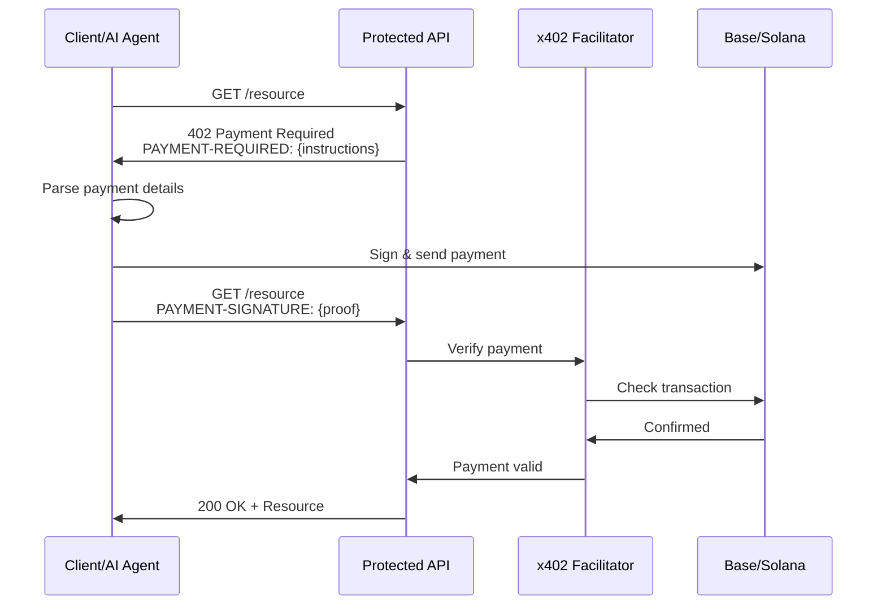
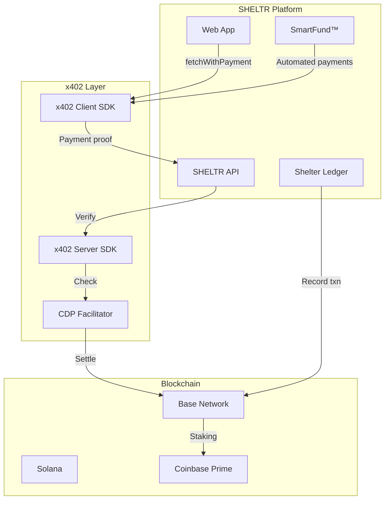

# Coinbase x402 Payment Protocol Integration

**Status**: Research & Planning  
**Priority**: Future Enhancement  
**Version**: 1.0.0  
**Last Updated**: December 16, 2025

---

## Overview

The **x402 payment protocol** is an open standard developed by Coinbase that enables instant, automatic stablecoin payments directly over HTTP using the HTTP 402 "Payment Required" status code. This document explores potential integration opportunities with SHELTR's SmartFund™ and Shelter Ledger systems.

### What is x402?

x402 revives the historically unused HTTP 402 status code to create a **programmatic payment rail** for:
- **Machine-to-machine (M2M) payments**: Autonomous transactions between services
- **Micropayments**: Per-request or usage-based billing with minimal friction
- **AI agent payments**: Autonomous bots paying for API access without human intervention
- **On-chain settlement**: Direct blockchain payments (EVM chains like Base, Solana)

### Key Resources

- **Documentation**: https://docs.cdp.coinbase.com/x402/welcome
- **GitHub**: https://github.com/coinbase/x402
- **CDP Platform**: https://www.coinbase.com/developer-platform/products/x402
- **Cloudflare Blog**: https://blog.cloudflare.com/x402/

---

## How x402 Works

### The Payment Flow



### Request/Response Cycle

1. **Initial Request**
   ```http
   GET /api/data HTTP/1.1
   Host: service.example.com
   ```

2. **402 Payment Required Response**
   ```http
   HTTP/1.1 402 Payment Required
   PAYMENT-REQUIRED: {
     "network": "eip155:8453",
     "amount": "0.01",
     "currency": "USDC",
     "recipient": "0x742d35Cc6634C0532925a3b844Bc9e7595f0bEb",
     "facilitator": "https://facilitator.coinbase.com"
   }
   ```

3. **Retry with Payment**
   ```http
   GET /api/data HTTP/1.1
   Host: service.example.com
   PAYMENT-SIGNATURE: {
     "txHash": "0xabc123...",
     "signature": "0xdef456...",
     "timestamp": 1702857600
   }
   ```

4. **Success Response**
   ```http
   HTTP/1.1 200 OK
   Content-Type: application/json
   
   { "data": "..." }
   ```

---

## Potential SHELTR Use Cases

### 1. **Donor Micropayments & QR-Scan-to-POD**

**Problem**: Traditional payment rails (Adyen, credit cards) have minimum transaction amounts and fees that make sub-$1 donations impractical.

**x402 Solution**:
- Enable **micro-donations** (e.g., $0.10, $0.25) with negligible fees
- QR codes trigger x402 payment flows instead of traditional checkout
- Instant on-chain settlement via Shelter Ledger
- Perfect for "round up" or "spare change" donation campaigns

**Example Flow**:
```typescript
// Donor scans QR code, app makes x402 payment
const donation = await fetchWithPayment('/api/donate', {
  amount: 0.25,  // $0.25 micro-donation
  network: 'eip155:8453',  // Base network
  currency: 'USDC'
});
```

### 2. **AI Agent-to-Service Payments**

**Problem**: SHELTR AI chatbot may need to access external APIs (weather data, shelter availability, translation services) that require payment.

**x402 Solution**:
- AI agents autonomously pay for API access without human intervention
- No API keys, accounts, or manual payment setup
- Pay-per-request model aligns costs with usage
- Integrated with Coinbase CDP Embedded Wallets

**Example Flow**:
```typescript
// SHELTR AI agent needs shelter availability data
const shelterData = await aiAgent.fetchWithPayment(
  'https://shelter-api.example.com/availability',
  {
    payment: {
      amount: 0.01,  // $0.01 per request
      wallet: aiAgentWallet
    }
  }
);
```

### 3. **SmartFund™ Investment Automation**

**Problem**: SmartFund™ needs to interact with DeFi protocols (Coinbase Prime staking, liquidity pools) which could benefit from programmatic payment.

**x402 Solution**:
- Automate staking/unstaking operations with on-chain payments
- Machine-to-machine payments for rebalancing operations
- Direct settlement without intermediary fees
- Transparent on-chain audit trail via Shelter Ledger

**Example Flow**:
```typescript
// Automated SmartFund rebalancing
const stakingResult = await smartFund.rebalance({
  action: 'stake',
  amount: 150000,  // 15% of housing fund
  protocol: 'coinbase-prime',
  payment: {
    network: 'eip155:8453',
    facilitator: 'https://facilitator.coinbase.com'
  }
});
```

### 4. **Shelter Ledger Transaction Fees**

**Problem**: Blockchain transaction fees (gas) can be unpredictable and expensive.

**x402 Solution**:
- Fee-free USDC payments on Base via CDP facilitator
- Predictable costs for Shelter Ledger track & trace operations
- Microtransaction tracking without prohibitive gas fees
- Settlement batching for efficiency

### 5. **Partner API Monetization**

**Problem**: SHELTR may want to offer APIs to partner organizations (other shelters, government agencies) with usage-based billing.

**x402 Solution**:
- Expose SHELTR APIs with x402 protection
- Partners pay per request (e.g., $0.001 per participant lookup)
- No accounts, subscriptions, or invoicing needed
- Instant settlement to SHELTR operations fund (5% allocation)

**Example Implementation**:
```typescript
// Protected SHELTR API endpoint
app.get('/api/participants/:id', async (req, res) => {
  // x402 middleware checks for payment
  if (!req.payment || !req.payment.verified) {
    return res.status(402).json({
      payment: {
        amount: '0.001',
        currency: 'USDC',
        network: 'eip155:8453',
        recipient: SHELTR_OPERATIONS_WALLET
      }
    });
  }
  
  // Payment verified, return data
  const participant = await getParticipant(req.params.id);
  res.json(participant);
});
```

---

## Technical Integration Architecture

### System Components



### Integration Points

#### 1. **Client-Side Integration**

```typescript
// apps/web/src/lib/x402-client.ts
import { createX402Client } from '@coinbase/x402-client';
import { useSmartWallet } from '@coinbase/onchainkit/wallet';

export function useX402() {
  const { wallet } = useSmartWallet();
  
  const client = createX402Client({
    wallet,
    network: 'eip155:8453',  // Base
    facilitator: 'https://facilitator.coinbase.com'
  });
  
  return {
    fetchWithPayment: async (url: string, options?: RequestInit) => {
      return client.fetch(url, options);
    }
  };
}
```

#### 2. **Server-Side Integration**

```typescript
// apps/api/services/x402_service.py
from x402 import X402Server, PaymentVerifier

class X402Service:
    def __init__(self):
        self.verifier = PaymentVerifier(
            facilitator_url="https://facilitator.coinbase.com",
            network="eip155:8453",
            recipient_wallet=SHELTR_OPERATIONS_WALLET
        )
    
    async def require_payment(
        self,
        amount: float,
        currency: str = "USDC"
    ) -> PaymentRequirement:
        return PaymentRequirement(
            amount=amount,
            currency=currency,
            network="eip155:8453",
            recipient=SHELTR_OPERATIONS_WALLET,
            facilitator="https://facilitator.coinbase.com"
        )
    
    async def verify_payment(
        self,
        payment_signature: str
    ) -> bool:
        return await self.verifier.verify(payment_signature)
```

#### 3. **SmartFund™ Integration**

```typescript
// Integration with SmartFund distribution model
export class SmartFundX402 {
  async processDistribution(donation: Donation) {
    // 80% to participant (Adyen virtual card)
    await this.transferToParticipant(donation.amount * 0.80);
    
    // 15% to housing fund (with x402 staking automation)
    const housingFund = donation.amount * 0.15;
    await this.x402Client.fetchWithPayment(
      'https://staking-api.coinbase.com/stake',
      {
        method: 'POST',
        body: JSON.stringify({
          amount: housingFund,
          asset: 'USDC',
          protocol: 'prime-staking'
        })
      }
    );
    
    // 5% to operations (tracked via Shelter Ledger)
    await this.shelterLedger.recordTransaction({
      type: 'operations_allocation',
      amount: donation.amount * 0.05,
      txHash: await this.x402Settlement()
    });
  }
}
```

#### 4. **Shelter Ledger Integration**

```solidity
// Smart contract enhancement for x402 compatibility
contract SHELTRUtilityToken {
    event X402PaymentProcessed(
        address indexed payer,
        address indexed recipient,
        uint256 amount,
        bytes32 txHash,
        string serviceType
    );
    
    function recordX402Payment(
        address _recipient,
        uint256 _amount,
        bytes32 _txHash,
        string memory _serviceType
    ) external {
        // Record in Shelter Ledger
        emit X402PaymentProcessed(
            msg.sender,
            _recipient,
            _amount,
            _txHash,
            _serviceType
        );
        
        // Update public ledger
        publicLedger[_txHash] = Transaction({
            timestamp: block.timestamp,
            amount: _amount,
            txType: "x402_payment",
            verified: true
        });
    }
}
```

---

## Benefits for SHELTR

### 1. **Financial Efficiency**

| Traditional Rails | x402 Protocol |
|------------------|---------------|
| 2.9% + $0.30 fee (Stripe) | Fee-free on Base (CDP) |
| $0.25 minimum practical | $0.001+ micropayments |
| 2-7 day settlement | Instant on-chain |
| Complex reconciliation | Automatic blockchain audit |

### 2. **Enhanced Automation**

- **AI-First**: SHELTR AI agents can autonomously pay for services
- **No Manual Setup**: No API keys, accounts, or billing portals
- **Programmatic**: Everything via HTTP requests
- **Scalable**: Pay-per-use aligns costs with actual usage

### 3. **Blockchain Integration**

- **Native Compatibility**: x402 works natively with Base (Coinbase L2)
- **Shelter Ledger Synergy**: Automatic transaction tracking
- **SmartFund Automation**: Direct DeFi protocol integration
- **Public Transparency**: All payments on-chain and auditable

### 4. **Zero Trust Payments**

- **No Intermediaries**: Direct peer-to-peer settlement
- **Cryptographic Proof**: Signatures verify payment authenticity
- **Immutable Records**: Blockchain provides permanent audit trail
- **Regulatory Compliance**: On-chain KYC/AML via attestations (future)

---

## Implementation Roadmap

### Phase 1: Research & Prototyping (Q1 2026)

- [ ] Set up CDP x402 development environment
- [ ] Create proof-of-concept: QR donation with x402
- [ ] Test facilitator integration on Base testnet
- [ ] Evaluate SDK compatibility with existing stack

**Deliverables**:
- Working x402 demo donation flow
- Technical feasibility report
- Cost/benefit analysis

### Phase 2: SmartFund™ Integration (Q2 2026)

- [ ] Integrate x402 with SmartFund distribution logic
- [ ] Add automated staking via x402 payments
- [ ] Connect to Coinbase Prime via x402 protocol
- [ ] Implement settlement tracking in Shelter Ledger

**Deliverables**:
- x402-enabled SmartFund module
- Automated staking workflows
- Enhanced Shelter Ledger with x402 tracking

### Phase 3: AI Agent Payments (Q3 2026)

- [ ] Enable SHELTR AI to make autonomous x402 payments
- [ ] Integrate with external APIs (weather, translation, etc.)
- [ ] Implement budget controls and usage limits
- [ ] Add monitoring and alerting for AI spending

**Deliverables**:
- AI agent wallet infrastructure
- x402 payment automation
- Usage analytics dashboard

### Phase 4: Partner API Monetization (Q4 2026)

- [ ] Expose SHELTR APIs with x402 protection
- [ ] Create partner onboarding flow
- [ ] Implement revenue tracking and distribution
- [ ] Add Bazaar service discovery integration

**Deliverables**:
- Public x402-protected SHELTR APIs
- Partner documentation
- Revenue dashboard

---

## Technical Requirements

### Infrastructure

#### Required Services

1. **Coinbase Developer Platform (CDP)**
   - Account and API credentials
   - x402 facilitator access
   - Embedded wallet infrastructure

2. **Base Network**
   - Base mainnet RPC endpoint
   - USDC token contract
   - Gas fee optimization

3. **Smart Contracts**
   - Upgrade `SHELTRUtilityToken` for x402 compatibility
   - Add x402 payment recording functions
   - Implement facilitator verification

#### Development Stack

```json
{
  "dependencies": {
    "@coinbase/x402-client": "^1.0.0",
    "@coinbase/x402-server": "^1.0.0",
    "@coinbase/onchainkit": "^0.30.0",
    "viem": "^2.0.0",
    "ethers": "^6.0.0"
  }
}
```

### Security Considerations

#### Payment Verification

```typescript
// Secure payment verification flow
export async function verifyX402Payment(
  req: Request,
  expectedAmount: number
): Promise<boolean> {
  const paymentSignature = req.headers.get('PAYMENT-SIGNATURE');
  
  if (!paymentSignature) {
    return false;
  }
  
  // Verify via CDP facilitator
  const verification = await facilitator.verify({
    signature: paymentSignature,
    expectedAmount,
    recipient: SHELTR_WALLET,
    network: 'eip155:8453'
  });
  
  // Double-check on-chain
  if (verification.valid) {
    const txReceipt = await baseProvider.getTransactionReceipt(
      verification.txHash
    );
    
    return (
      txReceipt.status === 1 &&
      txReceipt.to === SHELTR_WALLET &&
      parseFloat(txReceipt.value) >= expectedAmount
    );
  }
  
  return false;
}
```

#### Rate Limiting

```typescript
// Prevent abuse of x402 endpoints
import { Ratelimit } from '@upstash/ratelimit';

const ratelimit = new Ratelimit({
  redis: Redis.fromEnv(),
  limiter: Ratelimit.slidingWindow(10, '1 m'),  // 10 requests per minute
  analytics: true
});

export async function x402Middleware(req: Request) {
  const identifier = req.headers.get('PAYMENT-SIGNATURE') || req.ip;
  const { success, limit, remaining } = await ratelimit.limit(identifier);
  
  if (!success) {
    return new Response('Rate limit exceeded', { status: 429 });
  }
  
  return null;  // Continue to payment verification
}
```

#### Wallet Security

- **Multi-Sig**: Use multi-signature wallets for SHELTR treasury
- **Cold Storage**: Keep majority of funds offline
- **Hot Wallet Limits**: Minimize x402 hot wallet exposure
- **Key Management**: Use CDP Key Management Service (KMS)

---

## Cost Analysis

### CDP x402 Facilitator Costs

| Item | Cost | Notes |
|------|------|-------|
| **Base Network Gas** | ~$0.001 per tx | L2 efficiency |
| **CDP Facilitator Fee** | $0.00 | Free for USDC on Base |
| **Transaction Verification** | Included | No separate charge |
| **Settlement Time** | ~2 seconds | Near-instant |

### Comparison to Current Infrastructure

| Scenario | Traditional | x402 | Savings |
|----------|------------|------|---------|
| $0.25 donation | $0.38 (fees eat 52%) | $0.249 (0.4% loss) | 51.6% |
| $1.00 donation | $1.32 (32% overhead) | $1.001 (0.1% loss) | 31.9% |
| $10 API request (1000x) | $100 + invoicing | $10.01 | 99.9% |
| AI agent external API (10,000x) | Manual/impossible | $100 + $0.10 | Enables use case |

### Break-Even Analysis

- **Setup Cost**: ~40 hours engineering ($8,000)
- **Monthly Overhead**: ~$100 (monitoring, RPC)
- **Break-Even**: ~320 micropayments/month to justify vs traditional

---

## Risks & Mitigation

### Technical Risks

| Risk | Impact | Likelihood | Mitigation |
|------|--------|-----------|------------|
| x402 protocol adoption stalls | High | Medium | Multi-rail strategy (keep Adyen) |
| Base network congestion | Medium | Low | Multi-chain support (Solana backup) |
| Facilitator downtime | High | Low | Fallback to direct on-chain verification |
| Smart contract vulnerabilities | Critical | Low | Audit + bug bounty program |

### Operational Risks

| Risk | Impact | Likelihood | Mitigation |
|------|--------|-----------|------------|
| Regulatory uncertainty | Medium | Medium | Work with compliance counsel |
| User education curve | Low | High | Gradual rollout + fallback to Adyen |
| USDC stablecoin risk | High | Very Low | Diversify to USDT, PYUSD |
| Key management | Critical | Low | CDP KMS + multi-sig |

### Business Risks

| Risk | Impact | Likelihood | Mitigation |
|------|--------|-----------|------------|
| Low donor adoption | Medium | Medium | Make x402 optional, not required |
| Partner resistance | Low | Medium | Hybrid billing options |
| Complexity cost | Medium | High | Phased rollout, start with AI agents |

---

## Success Metrics

### Key Performance Indicators (KPIs)

#### Phase 1: Prototyping
- [ ] Successful x402 transaction on testnet
- [ ] < 3 second payment completion time
- [ ] Zero payment failures in 100 test transactions

#### Phase 2: SmartFund Integration
- [ ] 50% reduction in staking operation costs
- [ ] 100% automated housing fund rebalancing
- [ ] Zero manual intervention in 1,000 transactions

#### Phase 3: AI Agent Payments
- [ ] 10+ external APIs integrated
- [ ] < $0.01 average cost per API call
- [ ] 99.9% payment success rate

#### Phase 4: Partner APIs
- [ ] 5+ partner organizations using x402 APIs
- [ ] $1,000+ monthly revenue from API access
- [ ] < 1% support tickets related to payments

---

## Next Steps

### Immediate Actions (Week 1-2)

1. **Create CDP Account**
   - Sign up at https://portal.cdp.coinbase.com
   - Request x402 facilitator access
   - Generate API credentials

2. **Environment Setup**
   - Install x402 SDKs
   - Configure Base testnet
   - Deploy test smart contracts

3. **Proof of Concept**
   - Build simple x402 donation endpoint
   - Test payment flow end-to-end
   - Measure performance and costs

### Short-Term Goals (Month 1-3)

- Complete technical feasibility study
- Present findings to SHELTR leadership
- Decide on Phase 1 implementation timeline
- Budget engineering resources

### Long-Term Vision (2026-2027)

- Full x402 integration across SHELTR platform
- AI agents autonomously managing operations
- Partner ecosystem generating sustainable revenue
- SHELTR as a reference implementation for Web3 nonprofit tech

---

## Additional Resources

### Documentation

- **x402 Protocol Spec**: https://github.com/coinbase/x402/blob/main/SPEC.md
- **CDP Developer Docs**: https://docs.cdp.coinbase.com
- **Base Network**: https://docs.base.org
- **OnchainKit**: https://onchainkit.xyz

### Code Examples

- **x402 Client SDK**: https://github.com/coinbase/x402/tree/main/packages/client
- **x402 Server SDK**: https://github.com/coinbase/x402/tree/main/packages/server
- **React Hooks**: https://github.com/coinbase/x402/tree/main/packages/react

### Community

- **CDP Discord**: https://discord.gg/cdp
- **Base Builders**: https://base.org/builders
- **x402 GitHub Discussions**: https://github.com/coinbase/x402/discussions

### Related SHELTR Documentation

- [Blockchain Architecture](./blockchain.md)
- [Tokenomics](./tokenomics.md)
- [Base Stablecoin Implementation](./base_stable_coin.md)
- [SmartFund™ Distribution Model](../platform/system-design.md#smartfund-distribution)
- [Shelter Ledger Public Accountability](../../overview/hacking_homelessness.md#shelter-ledger)

---

## Conclusion

The Coinbase x402 payment protocol represents a transformative opportunity for SHELTR to:

1. **Enable true micropayments** for donations and partner services
2. **Automate SmartFund™ operations** with programmatic DeFi integration
3. **Empower AI agents** to autonomously pay for external services
4. **Enhance Shelter Ledger** with native on-chain settlement
5. **Create new revenue streams** through monetized APIs

By building on open standards and leveraging Coinbase's infrastructure, SHELTR can pioneer **Web3-native nonprofit operations** while maintaining our commitment to **zero crypto exposure for participants** and **complete financial transparency** for donors.

The protocol aligns perfectly with SHELTR's mission: **solving homelessness through innovative technology**, not just managing it.

---

**Document Ownership**: SHELTR Development Team  
**Review Cycle**: Quarterly  
**Contact**: [development@sheltr.org](mailto:development@sheltr.org)

