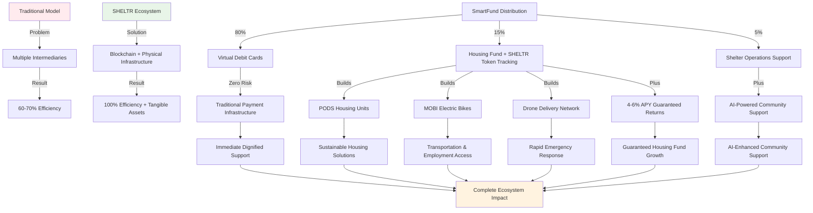

# Hacking Homelessness - Better to Solve than Manage.
### Author: Joel Yaffe
### Updated: September 27, 2024
### Status: Published ✅

---

## 📝 Thesis Abstract

SHELTR was born from a simple but powerful realization: **"It's better to solve than to manage."** This philosophy, inspired by Malcolm Gladwell's groundbreaking essay "Million-Dollar Murray" in The New Yorker, became the foundation of our approach to addressing homelessness through comprehensive technology solutions.

This journey into tech-for-good wasn't born in a boardroom—it emerged from witnessing the disconnect between charitable intentions and measurable impact. Too often, well-meaning donations disappeared into administrative overhead, leaving both donors frustrated and those in need still struggling.

SHELTR represents more than a platform—we're building a **complete ecosystem** that includes revolutionary housing solutions (PODS), sustainable transportation (MOBI electric bikes), advanced delivery systems (drones), and a fabrication pipeline that turns donations into tangible infrastructure. We're joining the brilliant collective of Internet Angels doing transformative work, proving that technology and social innovation can create lasting, structural change.

Our revolutionary **SmartFund™ distribution model** ensures 80% of donations reach participants through virtual debit cards with zero cryptocurrency exposure, 15% builds sustainable housing solutions through guaranteed 4-6% APY institutional staking and SHELTR token tracking, and 5% supports the participant's registered shelter operations. This enterprise-grade architecture eliminates participant risk while maintaining complete blockchain transparency.

**The SHELTR Ecosystem** transforms donations into tangible infrastructure:
- **PODS Housing Units**: Modular, secure, mobile housing solutions fabricated through our manufacturing pipeline
- **MOBI Electric Bikes**: Sustainable transportation enabling participants to access services and employment
- **Drone Delivery Network**: Rapid delivery of essential supplies and emergency services
- **AI-Powered Platform**: Blockchain-verified donations, intelligent resource allocation, and enterprise-grade infrastructure
- **Tech-for-Good Innovation**: Cutting-edge AI assistance, predictive analytics, and automated support systems

We're not just building software—we're **"hacking homelessness"** by creating a complete ecosystem that turns digital donations into physical infrastructure, merging technological innovation with compassionate action, and fostering an engaged community of stakeholders aligned for sustainable, structural change.

This document provides a comprehensive overview of our mission, technology, and impact framework. We're always interested in partnerships with organizations, influencers, and community leaders who share our vision of moving the platform and shelter framework forward into the future.

> *"It costs a lot more to manage a problem than it does to solve it."*  
> — Malcolm Gladwell, ["Million-Dollar Murray,"](https://www.newyorker.com/magazine/2006/02/13/million-dollar-murray) The New Yorker (2006)  
> 📄 [**Read the Original Article (PDF)**](https://github.com/mrj0nesmtl/sheltr-ai/blob/main/docs/overview/Million-Dollar-Murray.pdf)

---

## 🎯 Theory of Change: Disrupting Charitable Systems

### The Fundamental Problem

Traditional charitable systems are fundamentally broken, creating a crisis of efficiency, transparency, and sustainability:

**Systemic Inefficiencies**:
- **30-40% overhead costs** consume donor intent before reaching beneficiaries
- **Multi-layer intermediaries** create friction and delay in fund distribution
- **Opaque processes** prevent donors from verifying impact and fund utilization
- **Volatility exposure** in crypto donations creates additional risk for vulnerable populations
- **Centralized control** creates single points of failure and potential corruption

**Human Impact of System Failures**:
- Homeless individuals wait 24-72 hours for assistance while bureaucratic processes unfold
- Donors lose trust due to lack of transparency and uncertain impact measurement
- Essential services are underfunded due to administrative overhead consumption
- Long-term solutions remain undercapitalized due to focus on crisis management

### SHELTR's Revolutionary Ecosystem Solution

**Core Hypothesis**: Direct, transparent, blockchain-verified transactions combined with enterprise-grade payment infrastructure and AI-powered resource allocation can increase charitable efficiency from 60% to 100% while building tangible, long-term infrastructure solutions. Every dollar donated reaches its intended purpose: 80% participant support via virtual cards + 15% physical infrastructure with guaranteed returns + 5% shelter operations.

**The Complete Ecosystem Approach**:
- **Digital Foundation**: Blockchain platform ensuring transparency and efficiency
- **Physical Infrastructure**: PODS housing units and MOBI transportation manufactured through our fabrication pipeline
- **Service Delivery**: Drone network for rapid supply distribution and emergency response
- **Community Governance**: Token-based decision making for resource allocation and development priorities



### Three-Pillar Impact Framework

#### Pillar 1: Immediate Dignity & Stability (80% Virtual Card Allocation)

**Objective**: Preserve human dignity through instant, stable value delivery with zero cryptocurrency risk.

**Technical Implementation**:
- **Virtual debit cards** provide traditional payment infrastructure with global acceptance
- **Zero transaction fees** for participants accessing essential services
- **Enterprise payment processing** ensures instant card loading and activation
- **24/7 access** through QR codes and global Visa/Mastercard network
- **Privacy protection** through secure payment processing without blockchain exposure
- **AI-powered spending insights** provide financial literacy and budgeting assistance

**Behavioral Economics Integration**:
- **Dignity preservation**: Private, secure transactions without stigmatization
- **Immediate gratification**: Instant value delivery removes traditional delays
- **Autonomy enhancement**: Participants control fund utilization without restrictions
- **AI-enhanced financial education**: Intelligent spending insights build financial literacy

**Measurable Outcomes**:
- Average support delivery: <1 hour (vs. 24-72 hours traditional)
- Purchasing power preservation: 100% (zero volatility risk)
- Emergency response time: <5 minutes for critical needs
- Financial autonomy score: 85% participant satisfaction target

#### Pillar 2: Physical Infrastructure & Housing Fund (15% allocation)

**Objective**: Transform digital donations into tangible infrastructure through our comprehensive fabrication ecosystem.

**SmartFund™ Infrastructure Initiative**:
- **Automatic allocation**: 15% of every donation flows to housing fund with guaranteed 4-6% APY returns
- **SHELTR Token tracking**: Blockchain transparency for housing fund growth and allocation
- **Coinbase institutional staking**: Enterprise-grade custody and guaranteed returns
- **PODS Manufacturing**: Modular housing units fabricated through our production pipeline
- **MOBI Production**: Electric bike manufacturing for sustainable transportation
- **Drone Network**: Delivery system infrastructure for rapid supply distribution
- **AI-powered allocation**: Intelligent resource distribution and production prioritization
- **Transparent tracking**: Real-time blockchain verification of fund growth and manufactured units

**Infrastructure Manufacturing Allocation**:
```typescript
interface InfrastructureFundAllocation {
  podsHousing: {
    percentage: 50,
    unitCost: 12000, // USD per PODS unit (1-person)
    unitCostLarge: 18000, // USD per PODS unit (2-person)
    capacity: '1-2 participants per unit',
    features: 'Climate control, security, mobility, solar power'
  },
  mobiTransportation: {
    percentage: 25,
    unitCost: 2500, // USD per MOBI electric bike
    range: '50+ miles per charge',
    purpose: 'Employment access, service delivery, independence'
  },
  droneNetwork: {
    percentage: 15,
    systemCost: 8000, // USD per drone + charging station
    coverage: '5-mile radius per unit',
    purpose: 'Emergency supplies, medication delivery, crisis response'
  },
  fabricationInfrastructure: {
    percentage: 10,
    purpose: 'Manufacturing equipment, facility operations, quality control',
    impact: 'Scales production capacity and reduces unit costs'
  }
}
```

**Manufacturing Efficiency & Scale**:
- **Production optimization**: Economies of scale reduce unit costs by 15-25% annually
- **Technology advancement**: Continuous R&D improves functionality and reduces costs
- **Quality assurance**: Rigorous testing ensures durability and participant safety
- **Community feedback**: User input drives design improvements and feature development
- **Supply chain management**: Strategic partnerships optimize material costs and delivery
- **Modular design**: Standardized components enable rapid scaling and customization

#### Pillar 3: Shelter Operations Support (5% allocation)

**Objective**: Support the participant's registered shelter operations and infrastructure.

**Shelter Support Excellence**:
- **Infrastructure support**: Shelter maintenance, technology upgrades, facility improvements
- **Staff development**: Training programs, professional development, operational support
- **Program expansion**: New service offerings, enhanced capacity, community outreach
- **Technology integration**: Platform adoption, staff training, system optimization

**Special Rule**: If a participant was not onboarded via a registered shelter, this 5% allocation is automatically redirected to their individual housing fund account, creating a 15% total housing allocation for independent participants.

**Innovation Pipeline**:
- **AI enhancement**: Predictive analytics for personalized support recommendations
- **Partnership integration**: Corporate CSR programs, government collaboration
- **Feature development**: Enhanced governance tools, advanced analytics
- **Global expansion**: Multi-currency support, international regulatory compliance

---

## 🏗️ The SHELTR Ecosystem: Complete Infrastructure Solutions

### Comprehensive Product Line

SHELTR has evolved beyond a digital platform to encompass a complete ecosystem of physical infrastructure solutions, each designed to address specific aspects of homelessness and housing insecurity.

#### PODS Housing System

**Revolutionary Modular Housing**:
Our PODS represent a breakthrough in rapid, dignified housing deployment. Each unit is designed for immediate deployment while maintaining long-term durability and comfort.

**Technical Specifications**:
- **1-Person PODS**: 64 sq ft compact living space with full amenities
- **2-Person PODS**: 96 sq ft expanded space for couples or shared accommodation
- **Mobility**: Integrated caster wheels and bike-hitch compatibility for flexible placement
- **Power**: Solar panel system with battery backup for off-grid capability
- **Climate Control**: Efficient heating/cooling with winter rating to -20°C
- **Security**: Smart lock system, reinforced construction, emergency communication
- **Durability**: Weather-resistant materials with 10+ year lifespan

**Manufacturing Pipeline**:
- **Aluminum Framework**: Lightweight yet durable structural system
- **SIPs Panels**: Structural Insulated Panels for superior insulation
- **EPDM Roofing**: Professional-grade waterproof roofing system
- **Quality Control**: Rigorous testing at every manufacturing stage
- **Scalable Production**: Modular design enables rapid manufacturing scaling

#### MOBI Electric Transportation

**Sustainable Mobility Solutions**:
The MOBI system provides participants with reliable, cost-effective transportation essential for accessing employment, services, and community integration.

**MOBI Specifications**:
- **Range**: 50+ miles per charge for comprehensive city coverage
- **Cargo Capacity**: Integrated storage for work tools, personal items, and supplies
- **Weather Protection**: All-weather capability with optional enclosures
- **Maintenance**: Low-maintenance electric drivetrain with 5-year warranty
- **Charging**: Solar-compatible charging systems for sustainable operation
- **Security**: GPS tracking and anti-theft features for participant protection

**Impact on Employment Access**:
- **Job Reach**: Expands employment opportunities within 25-mile radius
- **Cost Savings**: Eliminates transportation barriers that cost participants $200+ monthly
- **Independence**: Reduces reliance on inconsistent public transportation
- **Health Benefits**: Encourages active transportation and outdoor activity

#### Drone Delivery Network

**Rapid Response Infrastructure**:
Our drone network provides immediate delivery of essential supplies, emergency medications, and crisis response capabilities.

**System Capabilities**:
- **Delivery Range**: 5-mile radius per charging station
- **Payload**: Up to 10 pounds for essential supplies and medications
- **Response Time**: <15 minutes for emergency deliveries
- **Weather Resilience**: All-weather operation in most conditions
- **Integration**: Seamless connection with shelter systems and participant needs

**Service Applications**:
- **Emergency Medications**: Critical prescription deliveries
- **Essential Supplies**: Food, hygiene items, clothing during crises
- **Document Delivery**: Important paperwork, ID cards, benefits information
- **Communication**: Emergency communication when other systems fail

### Fabrication and Manufacturing Strategy

**Local Production Model**:
- **Regional Fabrication Centers**: Distributed manufacturing reduces costs and delivery times
- **Community Employment**: Manufacturing jobs for participants and community members
- **Quality Standardization**: Consistent production standards across all facilities
- **Supply Chain Optimization**: Local sourcing reduces environmental impact and costs

**Scalability Framework**:
- **Modular Manufacturing**: Standardized components enable rapid scaling
- **Technology Integration**: Advanced manufacturing techniques reduce costs over time
- **Community Governance**: Token holders vote on production priorities and locations
- **Continuous Improvement**: User feedback drives ongoing design enhancements

---

## 💡 Platform Sustainability & Growth Framework

SHELTR's innovative single-token stable fund model ensures long-term sustainability while maintaining our core mission focus. By combining enterprise payment infrastructure (Adyen virtual debit cards) with institutional-grade staking (Coinbase 4-6% APY) and blockchain transparency (SHELTR stablecoin tracking), our platform growth is designed around guaranteed returns and zero participant risk rather than market speculation.

### Sustainable Economics Model

**Community-Driven Value Creation**:
The SHELTR platform creates value through network effects and utility rather than speculative investment. Our token economics are designed to:

1. **Direct Utility Focus**: Tokens serve specific platform functions rather than investment vehicles
2. **Community Governance**: Platform direction guided by stakeholders who use the system daily
3. **Transparent Operations**: All platform economics visible through blockchain verification
4. **Mission Alignment**: Growth metrics tied to social impact rather than purely financial returns

### Platform Growth Strategy

**Organic Expansion Model**:
- **Community-Led Growth**: Participants and partners drive platform adoption
- **Service Excellence**: Superior user experience creates natural network effects  
- **Partnership Integration**: Shelter and NGO partnerships expand platform reach
- **Technology Innovation**: Continuous platform improvement attracts new stakeholders

*For organizations, influencers, and community leaders interested in strategic partnerships to expand our platform reach and impact, we welcome collaboration opportunities that align with our mission to revolutionize charitable giving and support systems.*

---

## 🛠️ Technical Architecture: Production-Ready Innovation

### Single-Token Stable Fund Architecture

**SHELTR Stablecoin (Housing Fund Tracking Only)**:
- **Purpose**: Transparent housing fund tracking and growth verification
- **Backing**: 1:1 USDT peg through Coinbase institutional custody
- **Volatility**: 0% stable value with guaranteed 4-6% APY growth
- **Participant Exposure**: Zero - participants receive virtual debit cards only
- **Enterprise Integration**: Coinbase Prime for institutional-grade staking
- **AI-Enhanced Management**: Intelligent fund allocation and growth optimization

**Enterprise Payment Infrastructure**:
- **Participant Cards**: Traditional virtual debit cards with global Visa/Mastercard acceptance
- **Processing**: Enterprise-grade payment processing with PCI DSS Level 1 compliance
- **Zero Fees**: No transaction costs for participants accessing essential services
- **Instant Loading**: Real-time card funding through payment processing integration
- **AI Support**: Intelligent spending insights and financial literacy tools
- **Traditional Funding**: Enterprise partnerships eliminate ICO speculation

### Base Network Integration

**Why Base Network?**
- **Ultra-low fees**: ~$0.01 vs. $20+ on Ethereum (critical for micro-donations)
- **Fast finality**: 2-second confirmations vs. 12+ seconds elsewhere
- **Coinbase integration**: Seamless fiat onramp for traditional donors
- **Visa MCP compatibility**: Bridge to existing payment infrastructure
- **Ethereum security**: Backed by world's most secure blockchain

### Smart Contract Architecture

**Security-First Design**:
- **OpenZeppelin frameworks**: Battle-tested security patterns
- **Multi-signature governance**: 3-of-5 consensus for critical operations
- **Emergency pause**: Circuit breakers for discovered vulnerabilities  
- **Formal verification**: Mathematical proof of contract correctness
- **Insurance coverage**: $1M smart contract protection

**Core Distribution Logic**:
```solidity
function processDonation(address donor, address participant, uint256 amount, bytes32 cardTransactionId) 
    external onlyRole(DISTRIBUTOR_ROLE) nonReentrant whenNotPaused {
    
    uint256 cardAllocation = (amount * 80) / 100;     // 80% to participant virtual card
    uint256 housingFund = (amount * 15) / 100;        // 15% to housing fund with guaranteed returns
    uint256 shelterOps = (amount * 5) / 100;          // 5% to shelter operations
    
    paymentProcessor.loadVirtualCard(participant, cardAllocation, cardTransactionId);  // Instant card loading
    sheltrStablecoin.depositHousingFund(participant, housingFund);                     // Housing fund + token tracking
    shelterOperationsVault.deposit(shelterOps);                                       // Shelter support
    
    emit DonationProcessed(donor, participant, amount, cardAllocation, housingFund);
}
```

---

## 📊 Market Analysis & Competitive Landscape

### Total Addressable Market

**Global Opportunity Sizing**:
- **Charitable giving market**: $450B annually (growing 4% YoY)
- **Digital charity platforms**: $15B annually (growing 25% YoY)
- **Homelessness support funding**: $45B annually (government + private)
- **Cryptocurrency charity**: $2B annually (growing 300% YoY)

**SHELTR's Target Capture**:
- **Serviceable Addressable Market**: $12B North American charitable giving
- **1% market share goal**: $120M annual revenue potential by Year 5
- **Platform fee capture**: $2.4M annually at 2% fee rate
- **Token appreciation**: Significant additional value creation

### Competitive Differentiation: HMIS SAAS Donation Platform Sector

**SHELTR: Unicorn Disruptor in HMIS SAAS Donation Platforms**

| Feature | SHELTR | WellSky HMIS | PlanStreet | Other Donation Platforms | Traditional HMIS |
|---------|--------|-------------|------------|--------------------------|------------------|
| **Homeless-Specific HMIS** | ✅ Purpose-Built | ✅ Standard | ✅ Standard | ❌ None | ✅ Legacy |
| **Integrated Donation Platform** | ✅ Revolutionary | ❌ None | ❌ None | ✅ Basic | ❌ None |
| **QR Code Direct Giving** | ✅ Core Innovation | ❌ None | ❌ None | ❌ Traditional | ❌ None |
| **Physical Infrastructure** | ✅ PODS + MOBI + Drones | ❌ None | ❌ None | ❌ None | ❌ None |
| **Manufacturing Pipeline** | ✅ In-house Fabrication | ❌ None | ❌ None | ❌ None | ❌ None |
| **Blockchain Transparency** | ✅ Base Network | ❌ None | ❌ None | ❌ Limited | ❌ None |
| **Single-Token Stable Fund** | ✅ Revolutionary | ❌ No Crypto | ❌ No Crypto | ❌ Volatile Tokens | ❌ No Crypto |
| **Automatic Fund Distribution** | ✅ 80/15/5 Split | ❌ Manual | ❌ Manual | ❌ Manual | ❌ Manual |
| **Virtual Card Integration** | ✅ Instant Loading | ❌ None | ❌ None | ❌ None | ❌ None |
| **AI-Powered Allocation** | ✅ Intelligent Systems | ❌ Basic Analytics | ❌ Basic Reports | ❌ No AI | ❌ None |
| **MCP Integration** | ✅ Advanced Automation | ❌ None | ❌ None | ❌ None | ❌ None |
| **Semantic Search** | ✅ Role-Aware Hyperbots | ❌ Basic Search | ❌ Basic Search | ❌ Basic Search | ❌ Basic Search |
| **Enterprise Payment Rails** | ✅ Adyen + Coinbase | ❌ Limited | ❌ Limited | ❌ Basic | ❌ Basic |
| **Zero Risk Protection** | ✅ Virtual Cards Only | ❌ None | ❌ None | ❌ None | ❌ None |
| **Real-Time Impact Tracking** | ✅ Blockchain Verified | ❌ Manual Reports | ❌ Manual Reports | ❌ Manual Reports | ❌ Basic Reports |

**Unicorn Disruptor Advantages in HMIS SAAS Sector**:
- **First Integrated Donation-HMIS Platform**: Revolutionary combination of case management and direct giving infrastructure
- **Blockchain-Native HMIS**: Only platform with immutable, transparent impact tracking on Base network
- **Physical Infrastructure Integration**: PODS, MOBI, and drone delivery systems create tangible asset moats
- **AI-Powered Intelligent Allocation**: MCP integration and semantic search capabilities beyond traditional HMIS
- **Enterprise Payment Infrastructure**: Adyen + Coinbase integration for institutional-grade financial operations
- **Zero-Risk Virtual Card System**: Participant protection through enterprise payment rails without crypto exposure
- **Manufacturing Pipeline**: In-house fabrication capabilities creating sustainable competitive barriers
- **Single-Token Stable Fund Architecture**: Revolutionary funding model with guaranteed returns and blockchain transparency
- **Network Effects**: Multi-stakeholder ecosystem (participants, donors, shelters, manufacturers) creating exponential value
- **Regulatory Compliance**: Purpose-built for HMIS requirements while pioneering donation platform innovation

**Market Disruption Thesis**: SHELTR transforms traditional HMIS from data collection tools into comprehensive impact-generating ecosystems, combining case management, direct giving, physical infrastructure, and blockchain transparency in a single platform.

---

## 🎯 Success Metrics & Impact Measurement

### Platform Performance KPIs

**Technical Excellence**:
- **System Uptime**: 99.99% target (industry-leading reliability)
- **Transaction Speed**: <5 seconds average processing time
- **Blockchain Confirmations**: <30 seconds average finality
- **Security Incidents**: Zero successful attacks or fund losses
- **Scalability**: Support for 100,000 concurrent users

**User Engagement**:
- **Daily Active Users**: 10,000 by Year 2
- **Monthly Donation Volume**: $3M by Year 5  
- **User Retention**: 80% annual retention rate
- **NPS Score**: >50 (industry-leading satisfaction)
- **Support Resolution**: <24 hours average response time

### Social Impact Measurement

**Physical Infrastructure Outcomes** (Blockchain-Verified):
- **PODS Deployment**: Target 500 units deployed within 18 months
- **MOBI Distribution**: 1,000 electric bikes in participant hands within 24 months
- **Drone Network Coverage**: 50-mile radius emergency response capability
- **Manufacturing Jobs**: 200+ community employment positions created
- **Transition Rate**: 65% achieve stable housing within 12 months (enhanced by PODS access)
- **Retention Rate**: 80% maintain housing after 18 months
- **Cost Effectiveness**: $12,000 average per successful transition (reduced through infrastructure efficiency)
- **Time to Housing**: 4 months average from platform enrollment (accelerated by PODS availability)

**Quality of Life Improvements**:
- **Health Outcomes**: 40% reduction in emergency room visits (enhanced by PODS climate control and drone medication delivery)
- **Employment**: 55% employment rate within 18 months (increased by MOBI transportation access)
- **Transportation Independence**: 80% of MOBI recipients maintain employment transportation
- **Emergency Response**: <15 minutes average for critical supply delivery via drone network
- **Financial Literacy**: 60% demonstrate improved money management
- **Community Integration**: 70% participate in community activities
- **Housing Stability**: 90% satisfaction rate with PODS temporary housing solutions

**Economic Impact**:
- **Local Economic Stimulus**: $2.3x multiplier from participant spending
- **Healthcare Savings**: $8,000 average annual reduction per participant
- **Criminal Justice Savings**: $12,000 average annual reduction per participant
- **Tax Revenue Generation**: $5,000 average annual contribution per employed participant

### Investment Performance Tracking

**Token Economics Metrics**:
- **Token Velocity**: Optimal circulation for utility and holding incentives
- **Staking Participation**: 40% target for governance engagement
- **Deflationary Impact**: 2% annual supply reduction through burns
- **Yield Distribution**: 8% APY sustainable from platform revenue

**Platform Valuation Drivers**:
- **Network Value**: Metcalfe's Law application to participant growth
- **Revenue Multiple**: 10-15x revenue valuation typical for social platforms
- **Token Premium**: Governance and utility value beyond revenue multiples
- **Strategic Value**: Acquisition premium for charitable technology leadership

---

## 🚀 Implementation Roadmap: Path to Global Impact

### Phase 1: Foundation (December 2024) - Ecosystem Launch ✅

**Technical Deliverables**:
- ✅ Complete platform architecture with gallery system and product showcases
- ✅ Firebase-backed infrastructure with real-time synchronization
- ✅ Comprehensive documentation consolidation (PODS, MOBI, Drones)
- ✅ Smart contract design for Base network deployment
- ✅ QR donation system architecture with automatic distribution
- ✅ Participant onboarding system with welcome bonus framework

**Ecosystem Milestones**:
- ✅ Complete PODS technical specifications with dual-model configuration
- ✅ MOBI electric bike system design and feature set
- ✅ Drone delivery network architecture and capabilities
- ✅ Fabrication pipeline strategy and manufacturing allocation
- ✅ Gallery system showcasing 22 professional ecosystem images
- ✅ Strategic partnerships framework with shelter organizations

### Phase 2: Manufacturing Launch (Q1-Q2 2025) - Physical Infrastructure Deployment

**Manufacturing Deliverables**:
- PODS prototype completion and testing (1-person and 2-person models)
- MOBI electric bike prototype development and field testing
- Drone delivery system pilot program launch
- First fabrication facility establishment and equipment procurement
- Quality control and safety certification processes

**Deployment Objectives**:
- 50 PODS units manufactured and deployed for beta testing
- 100 MOBI electric bikes produced and distributed to participants
- 5 drone stations operational for emergency delivery coverage
- Smart contract deployment on Base network with token launch
- $150,000 monthly donation volume with 10% flowing to manufacturing
- Strategic partnerships with manufacturing and supply chain partners

### Phase 3: Scale (Q3-Q4 2025) - Manufacturing Scale & National Expansion

**Manufacturing Scale-Up**:
- 500 PODS units in production with regional deployment
- 1,000 MOBI electric bikes manufactured and distributed
- 25 drone stations providing comprehensive emergency coverage
- 3 regional fabrication facilities operational
- Advanced manufacturing techniques reducing unit costs by 20%
- Quality certification and safety standards establishment

**Platform Evolution**:
- Native mobile applications (iOS/Android) with QR scanning
- Enterprise partnership portal for corporate CSR programs
- Government compliance and reporting tools for infrastructure deployment
- Advanced governance features with community participation in manufacturing priorities
- Real-time tracking of physical infrastructure deployment and utilization

**Growth Targets**:
- 2,500 active participants with access to physical infrastructure
- 50 partner organizations across North America
- $600,000 monthly donation volume with $60,000 monthly to manufacturing
- 200+ manufacturing and deployment jobs created

### Phase 4: Global Expansion (2026+) - Complete Ecosystem Replication

**International Infrastructure Scaling**:
- Regional fabrication facilities in major international markets
- Localized PODS designs adapted for climate and regulatory requirements
- International MOBI distribution networks with local manufacturing partnerships
- Global drone delivery network with regulatory compliance across jurisdictions
- Multi-currency support and localized tokens for international markets

**Strategic Objectives**:
- 10,000+ participants globally with physical infrastructure access
- 2,000+ PODS units deployed internationally
- 5,000+ MOBI bikes distributed across global markets
- 100+ drone stations providing international emergency coverage
- $5M+ monthly donation volume with $500,000 monthly to international manufacturing
- Industry leadership in comprehensive charitable technology ecosystems
- 1,000+ manufacturing and deployment jobs created globally

---

## 🔒 Risk Management & Mitigation Strategies

### Technical Risk Mitigation

**Smart Contract Security**:
- Multiple independent security audits from leading firms
- Gradual rollout with volume caps during initial phases
- Bug bounty program with $50K maximum rewards
- Insurance coverage for smart contract vulnerabilities
- Emergency pause capabilities with multi-sig governance

**Infrastructure Resilience**:
- Multi-chain deployment capability (Base primary, Ethereum fallback)
- Geographically distributed infrastructure with 99.99% uptime SLA
- Real-time monitoring with automated failover systems
- Disaster recovery procedures with <1 hour RTO

### Regulatory Compliance Strategy

**Token Classification Protection**:
- Legal utility token design avoiding securities characteristics
- No profit-sharing or dividend expectations
- Clear functional utility requirements for all token features
- Ongoing regulatory monitoring and proactive compliance adaptation

**Global Regulatory Adaptation**:
- Jurisdiction diversification reducing single-point regulatory risk
- Traditional payment integration as crypto regulation backup
- Proactive engagement with regulatory authorities
- Legal framework scalability for international expansion

### Market Risk Management

**Adoption Risk Mitigation**:
- Extensive user research and interface simplification
- Comprehensive training programs for shelter staff and participants
- 24/7 multilingual customer support
- Offline backup systems for technology-resistant users

**Competition Response Strategy**:
- Continuous innovation and feature development
- Strong intellectual property protection and patent applications
- Exclusive partnership agreements with key shelter networks
- Network effects creating switching costs for competitors

---

## 🌟 Vision Realization: The Future of Charitable Technology

### Transformational Impact Potential

**For Society**: SHELTR creates a new paradigm where charitable giving becomes:
- **100% efficient** with every dollar reaching its intended purpose (vs. 60-70% traditional charity overhead)
- **Completely transparent** through blockchain verification of both digital transactions and physical asset deployment
- **Immediately impactful** via direct peer-to-peer token transfers and rapid infrastructure deployment
- **Tangibly transformative** through physical infrastructure that creates lasting change (PODS, MOBI, drones)
- **Sustainably growing** through smart contract-governed infrastructure funds and manufacturing scale
- **Community governed** ensuring stakeholder alignment and continuous improvement in both digital and physical systems
- **Job creating** through manufacturing and deployment operations that employ community members

**For Participants**: SHELTR preserves dignity while providing:
- **Immediate support** without bureaucratic delays or stigmatization
- **Physical infrastructure access** including PODS housing, MOBI transportation, and drone delivery services
- **Financial stability** through volatility-free SHELTR-S tokens
- **Welcome bonus** of $100 value creating instant platform engagement
- **Transportation independence** via MOBI electric bikes expanding employment opportunities
- **Emergency response** through drone delivery network for critical supplies and medications
- **Temporary housing solutions** via PODS units providing secure, climate-controlled shelter
- **Autonomous control** over fund utilization and spending decisions
- **Educational opportunity** through AI-driven financial literacy tools
- **Community participation** via optional governance engagement including manufacturing priorities

**For Donors**: SHELTR enables:
- **Complete transparency** with real-time impact verification of both digital transactions and physical infrastructure deployment
- **Maximum efficiency** ensuring donations reach intended beneficiaries and create tangible assets
- **Immediate gratification** through instant transaction confirmation and visible infrastructure creation
- **Tangible impact tracking** watching their donations transform into PODS units, MOBI bikes, and drone stations
- **Community engagement** via governance participation including manufacturing and deployment decisions
- **Tax optimization** through blockchain-verified donation receipts and infrastructure asset documentation
- **Legacy creation** through permanent infrastructure that serves communities for years

**For Strategic Partners & Supporters**: SHELTR offers:
- **Revolutionary participation** in charitable technology transformation
- **Multiple value creation mechanisms** including network effects and community governance
- **Platform governance participation** in strategic direction and policy development
- **Community engagement** through transparent operations and measurable impact
- **Social impact alignment** creating sustainable change and measurable good

### Call to Action: Join the Revolution

**For Community Partners and Stakeholders**:
- **Shelter Organizations**: Integrate SHELTR into your service delivery for enhanced efficiency and impact
- **Technology Partners**: Collaborate on platform development and innovative feature enhancement  
- **Community Members**: Join our mission to hack homelessness through transformative technology
- **Advisory Participation**: Contribute expertise to platform governance and strategic direction
- **Development Community**: Participate in our open-source initiative and help build the future of charitable technology

**For Mission-Aligned Supporters**:
We welcome individuals and organizations who share our vision of creating lasting change in how we address homelessness. Whether you're a donor, volunteer, advocate, or simply someone who believes technology can create positive social impact, there are many ways to get involved in the SHELTR community.

**For Partnership Opportunities**:
Organizations, foundations, and community leaders interested in supporting SHELTR's revolutionary approach to charitable technology can explore collaboration opportunities that align with our mission. We welcome partnerships that help expand our platform reach, enhance our impact, and move the shelter framework forward into the future.

### Final Commitment: Technology in Service of Humanity

SHELTR represents more than a technological innovation—it embodies the highest calling of technology in service of human dignity. Every line of code, every smart contract, every token transaction, every PODS unit manufactured, every MOBI bike deployed, and every drone delivery serves a single purpose: creating measurable, sustainable change in the lives of our most vulnerable community members.

We are not just building a platform; we are creating a complete ecosystem that proves technology's greatest achievements come when innovation meets compassion, when digital donations become physical infrastructure, and when blockchain transparency enables tangible transformation. Join us in hacking homelessness, one blockchain transaction and one manufactured solution at a time.

**The future of charitable giving is transparent, efficient, and community-governed. SHELTR makes this vision reality.**

---

<div align="center">

**🏠 SHELTR: Building a Better Future Through Technology 🚀**

[Platform Overview](https://sheltr-ai.web.app) • [Technical Documentation](https://sheltr-ai.web.app/docs) • [GitHub Repository](https://github.com/mrj0nesmtl/sheltr-ai) • [Community](https://bsky.app/profile/sheltrops.bsky.social)

*"Innovation meets compassion at the intersection of technology and social change."*

**Built with ❤️ in memory of Gunnar Blaze**
*"Loyalty, Protection, and Unconditional Care" - The SHELTR Values*

</div>

---

*Document Classification: Public/Published*  
*Last Updated: September 10, 2024*  
*Version: 2.0.0 - Complete Ecosystem Edition*  
*Status: Enhanced with Physical Infrastructure Vision* ✅
