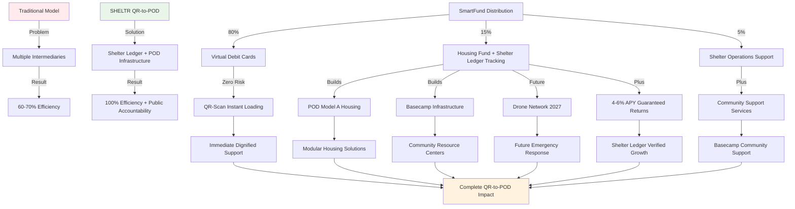

# Hacking Homelessness - Better to Solve than Manage.
### Author: Joel Yaffe
### Updated: December 12, 2025
### Status: Published ✅ - v3.0 QR-Scan-to-POD & Shelter Ledger

---

## 📝 Thesis Abstract

SHELTR was born from a simple but powerful realization: **"It's better to solve than to manage."** This philosophy, inspired by Malcolm Gladwell's groundbreaking essay "Million-Dollar Murray" in The New Yorker, became the foundation of our approach to addressing homelessness through comprehensive technology solutions.

This journey into tech-for-good wasn't born in a boardroom—it emerged from witnessing the disconnect between charitable intentions and measurable impact. Too often, well-meaning donations disappeared into administrative overhead, leaving both donors frustrated and those in need still struggling.

SHELTR represents more than a platform—we're building a **complete QR-Scan-to-POD ecosystem** powered by the Shelter Ledger dual-purpose blockchain. Our revolutionary POD Model A housing units, Basecamp community infrastructure, and future drone delivery systems (2027) transform donations into tangible assets. The **Shelter Ledger** provides immutable track & trace for every dollar while enabling SmartFund™ investment growth, proving that blockchain transparency and social innovation can create lasting, structural change.

Our revolutionary **SmartFund™ distribution model** ensures 80% of donations reach participants through virtual debit cards with zero cryptocurrency exposure, 15% builds POD Model A housing units tracked by the **Shelter Ledger with guaranteed 4-6% APY institutional staking**, and 5% supports the participant's registered shelter operations. The **Shelter Ledger dual-purpose token** provides immutable donation tracking AND SmartFund™ investment transparency, eliminating participant risk while maintaining complete public accountability.

**The QR-Scan-to-POD Ecosystem** transforms donations into tangible infrastructure:
- **POD Model A**: Single-SKU modular housing solution with climate control and security
- **Basecamp Infrastructure**: Community resource centers providing 24/7 support services
- **Shelter Ledger**: Dual-purpose blockchain for public track & trace + SmartFund™ transparency
- **QR-Scan System**: Instant donation-to-impact verification and virtual card loading
- **Drone Network (2027)**: Future rapid delivery of essential supplies and emergency services
- **Enterprise Payment Infrastructure**: Zero-risk virtual debit cards with global acceptance

We're not just building software—we're **"hacking homelessness"** through our ScanQR-Scan-to-POD system where every donation is tracked by the Shelter Ledger, transforming digital contributions into POD Model A housing units and Basecamp community infrastructure. The Shelter Ledger's dual-purpose architecture provides public accountability through immutable track & trace while enabling SmartFund™ investment growth, merging blockchain transparency with compassionate action for sustainable, structural change.

This document provides a comprehensive overview of our mission, technology, and impact framework. We're always interested in partnerships with organizations, influencers, and community leaders who share our vision of moving the platform and shelter framework forward into the future.

> *"It costs a lot more to manage a problem than it does to solve it."*  
> — Malcolm Gladwell, ["Million-Dollar Murray,"](https://www.newyorker.com/magazine/2006/02/13/million-dollar-murray) The New Yorker (2006)  
> 📄 [**Read the Original Article (PDF)**](https://github.com/mrj0nesmtl/sheltr-ai/blob/main/docs/overview/Million-Dollar-Murray.pdf)

---

## 🎯 Theory of Change: Disrupting Charitable Systems

### The Fundamental Problem

Traditional charitable systems are fundamentally broken, creating a crisis of efficiency, transparency, and sustainability:

**Systemic Inefficiencies**:
- **30-40% overhead costs** consume donor intent before reaching beneficiaries
- **Multi-layer intermediaries** create friction and delay in fund distribution
- **Opaque processes** prevent donors from verifying impact and fund utilization
- **Volatility exposure** in crypto donations creates additional risk for vulnerable populations
- **Centralized control** creates single points of failure and potential corruption

**Human Impact of System Failures**:
- Homeless individuals wait 24-72 hours for assistance while bureaucratic processes unfold
- Donors lose trust due to lack of transparency and uncertain impact measurement
- Essential services are underfunded due to administrative overhead consumption
- Long-term solutions remain undercapitalized due to focus on crisis management

### SHELTR's Revolutionary Ecosystem Solution

**Core Hypothesis**: Direct, transparent, Shelter Ledger-verified transactions combined with enterprise-grade payment infrastructure and QR-Scan instant deployment can increase charitable efficiency from 60% to 100% while building tangible, long-term infrastructure solutions. Every dollar donated reaches its intended purpose: 80% participant support via virtual cards + 15% POD Model A housing with guaranteed returns + 5% shelter operations.

**The QR-Scan-to-POD Ecosystem Approach**:
- **Shelter Ledger Foundation**: Dual-purpose blockchain for public track & trace + SmartFund™ transparency
- **Physical Infrastructure**: POD Model A housing units and Basecamp community centers
- **QR-Scan System**: Instant donation-to-deployment verification and virtual card loading
- **Future Service Delivery**: Drone network (2027) for rapid supply distribution and emergency response
- **Community Governance**: Shelter Ledger-based decision making for resource allocation and POD deployment priorities



### Three-Pillar Impact Framework

#### Pillar 1: Immediate Dignity & QR-Scan Stability (80% Virtual Card Allocation)

**Objective**: Preserve human dignity through instant, stable value delivery with zero cryptocurrency risk via QR-Scan technology.

**Technical Implementation**:
- **Virtual debit cards** provide traditional payment infrastructure with global acceptance
- **Zero transaction fees** for participants accessing essential services
- **QR-Scan instant loading** ensures immediate card activation via enterprise payment processing
- **24/7 access** through QR codes and global Visa/Mastercard network
- **Privacy protection** through secure payment processing without blockchain exposure
- **Shelter Ledger tracking** provides public donation accountability without participant risk

**Behavioral Economics Integration**:
- **Dignity preservation**: Private, secure transactions without stigmatization
- **Immediate gratification**: QR-Scan instant value delivery removes traditional delays
- **Autonomy enhancement**: Participants control fund utilization without restrictions
- **Public accountability**: Shelter Ledger tracks every dollar for donor transparency

**Measurable Outcomes**:
- Average support delivery: <1 hour via QR-Scan (vs. 24-72 hours traditional)
- Purchasing power preservation: 100% (zero volatility risk)
- Shelter Ledger tracking: 100% public donation verification
- Financial autonomy score: 85% participant satisfaction target

#### Pillar 2: POD Model A Deployment & Shelter Ledger Housing Fund (15% allocation)

**Objective**: Transform digital donations into POD Model A housing units and Basecamp infrastructure tracked by Shelter Ledger.

**SmartFund™ Infrastructure Initiative**:
- **Automatic allocation**: 15% of every donation flows to housing fund with guaranteed 4-6% APY returns
- **Shelter Ledger tracking**: Dual-purpose blockchain for public track & trace + SmartFund™ transparency
- **Coinbase institutional staking**: Enterprise-grade custody and guaranteed returns
- **POD Model A Manufacturing**: Single-SKU modular housing units fabricated through our production pipeline
- **Basecamp Infrastructure**: Community resource centers providing 24/7 support services
- **Drone Network (2027)**: Future delivery system infrastructure for rapid supply distribution
- **QR-to-POD verification**: Instant donation-to-deployment tracking and public accountability
- **Transparent tracking**: Real-time Shelter Ledger verification of fund growth and POD deployment

**Infrastructure Manufacturing Allocation**:
```typescript
interface InfrastructureFundAllocation {
  podModelA: {
    percentage: 60,
    unitCost: 15000, // USD per POD Model A unit
    capacity: 'Single-SKU modular housing',
    features: 'Climate control, security, mobility, solar power, standardized design',
    shelterLedgerTracking: 'Every POD deployment publicly verified'
  },
  basecampInfrastructure: {
    percentage: 20,
    facilityCost: 150000, // USD per Basecamp community center
    services: '24/7 support, resource distribution, community programs',
    purpose: 'Community resource centers and participant support hubs'
  },
  droneNetworkFuture: {
    percentage: 10,
    systemCost: 8000, // USD per drone + charging station
    timeline: '2027 deployment',
    purpose: 'Future emergency supplies, medication delivery, crisis response'
  },
  fabricationInfrastructure: {
    percentage: 10,
    purpose: 'Manufacturing equipment, facility operations, quality control',
    impact: 'Scales POD Model A production capacity and reduces unit costs',
    qrToPodIntegration: 'Instant deployment tracking via Shelter Ledger'
  }
}
```

**POD Model A Manufacturing Efficiency & Shelter Ledger Tracking**:
- **Single-SKU efficiency**: Streamlined production reduces unit costs by 15-25% annually
- **Quality assurance**: Rigorous testing ensures durability and participant safety
- **Community feedback**: User input drives POD Model A design improvements
- **Shelter Ledger verification**: Every POD deployment publicly tracked and verified
- **Supply chain management**: Strategic partnerships optimize material costs and delivery
- **Modular design**: Standardized components enable rapid POD Model A scaling
- **QR-to-POD tracking**: Instant donation-to-deployment verification for public accountability

#### Pillar 3: Shelter Operations & Basecamp Support (5% allocation)

**Objective**: Support the participant's registered shelter operations and Basecamp community infrastructure.

**Shelter & Basecamp Support Excellence**:
- **Infrastructure support**: Shelter maintenance, technology upgrades, facility improvements
- **Basecamp operations**: Community center management, resource distribution, 24/7 support services
- **Staff development**: Training programs, professional development, operational support
- **Program expansion**: New service offerings, enhanced capacity, community outreach
- **Technology integration**: Platform adoption, staff training, QR-Scan system optimization

**Special Rule**: If a participant was not onboarded via a registered shelter, this 5% allocation is automatically redirected to their individual housing fund account, creating a 20% total housing allocation for independent participants. All allocations tracked via Shelter Ledger for public accountability.

**Innovation Pipeline**:
- **Shelter Ledger enhancement**: Enhanced track & trace capabilities and public reporting
- **Partnership integration**: Corporate CSR programs, government collaboration
- **QR-to-POD optimization**: Improved instant deployment verification
- **Global expansion**: Multi-currency support, international Shelter Ledger deployment

---

## 🏗️ The QR-Scan-to-POD Ecosystem: Complete Infrastructure Solutions

### Comprehensive Product Line

SHELTR has evolved beyond a digital platform to encompass a complete QR-Scan-to-POD ecosystem powered by the Shelter Ledger dual-purpose blockchain, with physical infrastructure solutions designed to address homelessness through public accountability and tangible asset deployment.

#### POD Model A Housing System

**Revolutionary Single-SKU Modular Housing**:
POD Model A represents our streamlined approach to rapid, dignified housing deployment. This single-SKU design enables efficient manufacturing, consistent quality, and scalable production while maintaining long-term durability and comfort.

**POD Model A Technical Specifications**:
- **Single-SKU Design**: Standardized modular housing for production efficiency
- **Living Space**: Optimized compact living space with full amenities
- **Mobility**: Integrated caster wheels for flexible placement and relocation
- **Power**: Solar panel system with battery backup for off-grid capability
- **Climate Control**: Efficient heating/cooling with winter rating to -20°C
- **Security**: Smart lock system, reinforced construction, emergency communication
- **Durability**: Weather-resistant materials with 10+ year lifespan
- **Shelter Ledger Integration**: Every POD deployment tracked and publicly verified

**Manufacturing Pipeline**:
- **Aluminum Framework**: Lightweight yet durable structural system
- **SIPs Panels**: Structural Insulated Panels for superior insulation
- **EPDM Roofing**: Professional-grade waterproof roofing system
- **Quality Control**: Rigorous testing at every manufacturing stage
- **QR-to-POD Tracking**: Instant deployment verification via Shelter Ledger
- **Scalable Production**: Single-SKU design enables rapid manufacturing scaling

#### Basecamp Community Infrastructure

**Community Resource Centers**:
Basecamp facilities provide comprehensive support services and community resources, serving as central hubs for participant engagement, resource distribution, and ongoing support programs.

**Basecamp Specifications**:
- **24/7 Operations**: Round-the-clock access to support services and resources
- **Resource Distribution**: Centralized hub for essential supplies and services
- **Community Programs**: Job training, life skills workshops, peer support groups
- **Technology Access**: Computer labs, internet connectivity, QR-Scan stations
- **Support Services**: Case management, counseling, healthcare coordination
- **Shelter Ledger Integration**: All resource distribution tracked for public accountability

**Impact on Community Integration**:
- **Support Access**: Centralized location for comprehensive participant services
- **Community Building**: Peer support networks and social connection opportunities
- **Skill Development**: Job training and life skills programs for self-sufficiency
- **Resource Efficiency**: Centralized distribution reduces duplication and improves coordination
- **Public Accountability**: Shelter Ledger tracks all Basecamp activities and resource allocation

#### Drone Delivery Network (2027 Deployment)

**Future Rapid Response Infrastructure**:
Our planned drone network will provide immediate delivery of essential supplies, emergency medications, and crisis response capabilities. Scheduled for 2027 deployment pending regulatory approval and technology maturation.

**Planned System Capabilities**:
- **Delivery Range**: 5-mile radius per charging station
- **Payload**: Up to 10 pounds for essential supplies and medications
- **Response Time**: <15 minutes target for emergency deliveries
- **Weather Resilience**: All-weather operation capability in most conditions
- **Shelter Ledger Integration**: All deliveries tracked for public accountability

**Future Service Applications**:
- **Emergency Medications**: Critical prescription deliveries to POD Model A units
- **Essential Supplies**: Food, hygiene items, clothing during crises
- **Document Delivery**: Important paperwork, ID cards, benefits information
- **Basecamp Coordination**: Integration with Basecamp resource distribution systems
- **QR-to-POD Tracking**: Delivery verification via Shelter Ledger

### POD Model A Fabrication and Manufacturing Strategy

**Local Production Model**:
- **Regional Fabrication Centers**: Distributed manufacturing reduces costs and delivery times
- **Community Employment**: Manufacturing jobs for participants and community members
- **Single-SKU Efficiency**: POD Model A standardization ensures consistent quality
- **Supply Chain Optimization**: Local sourcing reduces environmental impact and costs
- **Shelter Ledger Tracking**: Every POD manufactured and deployed is publicly verified

**Scalability Framework**:
- **POD Model A Manufacturing**: Single-SKU design enables rapid scaling and cost reduction
- **QR-to-POD Integration**: Instant deployment tracking from factory to participant
- **Community Governance**: Shelter Ledger-based voting on production priorities and locations
- **Continuous Improvement**: User feedback drives POD Model A design enhancements
- **Basecamp Coordination**: Manufacturing aligned with Basecamp resource distribution

---

## 💡 Platform Sustainability & Growth Framework

SHELTR's innovative Shelter Ledger dual-purpose token model ensures long-term sustainability while maintaining our core mission focus. By combining enterprise payment infrastructure (Adyen virtual debit cards) with institutional-grade staking (Coinbase 4-6% APY) and Shelter Ledger public accountability (track & trace + SmartFund™ transparency), our platform growth is designed around guaranteed returns, zero participant risk, and complete public accountability rather than market speculation.

### Sustainable Economics Model

**Community-Driven Value Creation**:
The SHELTR platform creates value through network effects and utility rather than speculative investment. Our token economics are designed to:

1. **Direct Utility Focus**: Tokens serve specific platform functions rather than investment vehicles
2. **Community Governance**: Platform direction guided by stakeholders who use the system daily
3. **Transparent Operations**: All platform economics visible through blockchain verification
4. **Mission Alignment**: Growth metrics tied to social impact rather than purely financial returns

### Platform Growth Strategy

**Organic Expansion Model**:
- **Community-Led Growth**: Participants and partners drive platform adoption
- **Service Excellence**: Superior user experience creates natural network effects  
- **Partnership Integration**: Shelter and NGO partnerships expand platform reach
- **Technology Innovation**: Continuous platform improvement attracts new stakeholders

*For organizations, influencers, and community leaders interested in strategic partnerships to expand our platform reach and impact, we welcome collaboration opportunities that align with our mission to revolutionize charitable giving and support systems.*

---

## 🛠️ Technical Architecture: Production-Ready Innovation

### Shelter Ledger Dual-Purpose Token Architecture

**Shelter Ledger (Track & Trace + SmartFund™ Transparency)**:
- **Primary Purpose**: Immutable public track & trace for every donation dollar
- **Secondary Purpose**: Transparent housing fund tracking and growth verification
- **Backing**: 1:1 USDT peg through Coinbase institutional custody
- **Volatility**: 0% stable value with guaranteed 4-6% APY growth
- **Participant Exposure**: Zero - participants receive virtual debit cards only
- **Public Accountability**: Anyone can verify donation flow and POD deployment
- **QR-to-POD Integration**: Instant donation-to-deployment verification
- **Enterprise Integration**: Coinbase Prime for institutional-grade staking

**Enterprise Payment Infrastructure**:
- **Participant Cards**: Traditional virtual debit cards with global Visa/Mastercard acceptance
- **QR-Scan Loading**: Instant card funding through QR code technology
- **Processing**: Enterprise-grade payment processing with PCI DSS Level 1 compliance
- **Zero Fees**: No transaction costs for participants accessing essential services
- **Shelter Ledger Tracking**: All card loads tracked for public donation accountability
- **Privacy Protection**: Participant transactions remain private while donations are publicly tracked
- **Traditional Funding**: Enterprise partnerships eliminate ICO speculation

### Base Network Integration

**Why Base Network?**
- **Ultra-low fees**: ~$0.01 vs. $20+ on Ethereum (critical for micro-donations)
- **Fast finality**: 2-second confirmations vs. 12+ seconds elsewhere
- **Coinbase integration**: Seamless fiat onramp for traditional donors
- **Visa MCP compatibility**: Bridge to existing payment infrastructure
- **Ethereum security**: Backed by world's most secure blockchain

### Smart Contract Architecture

**Security-First Design**:
- **OpenZeppelin frameworks**: Battle-tested security patterns
- **Multi-signature governance**: 3-of-5 consensus for critical operations
- **Emergency pause**: Circuit breakers for discovered vulnerabilities  
- **Formal verification**: Mathematical proof of contract correctness
- **Insurance coverage**: $1M smart contract protection

**Core Distribution Logic with Shelter Ledger Tracking**:
```solidity
function processDonation(address donor, address participant, uint256 amount, bytes32 qrScanId) 
    external onlyRole(DISTRIBUTOR_ROLE) nonReentrant whenNotPaused {
    
    uint256 cardAllocation = (amount * 80) / 100;     // 80% to participant virtual card
    uint256 housingFund = (amount * 15) / 100;        // 15% to POD Model A housing fund
    uint256 shelterOps = (amount * 5) / 100;          // 5% to shelter/Basecamp operations
    
    // QR-Scan instant card loading
    paymentProcessor.loadVirtualCard(participant, cardAllocation, qrScanId);
    
    // Shelter Ledger dual-purpose tracking
    shelterLedger.trackDonation(donor, participant, amount, qrScanId);               // Public track & trace
    shelterLedger.depositHousingFund(participant, housingFund);                      // SmartFund™ transparency
    shelterLedger.recordPodAllocation(participant, housingFund);                     // POD Model A deployment tracking
    
    // Basecamp operations support
    basecampVault.deposit(shelterOps);
    
    emit DonationProcessed(donor, participant, amount, cardAllocation, housingFund, qrScanId);
    emit ShelterLedgerTracked(donor, participant, amount, block.timestamp);          // Public accountability event
}
```

---

## 📊 Market Analysis & Competitive Landscape

### Total Addressable Market

**Global Opportunity Sizing**:
- **Charitable giving market**: $450B annually (growing 4% YoY)
- **Digital charity platforms**: $15B annually (growing 25% YoY)
- **Homelessness support funding**: $45B annually (government + private)
- **Cryptocurrency charity**: $2B annually (growing 300% YoY)

**SHELTR's Target Capture**:
- **Serviceable Addressable Market**: $12B North American charitable giving
- **1% market share goal**: $120M annual revenue potential by Year 5
- **Platform fee capture**: $2.4M annually at 2% fee rate
- **Token appreciation**: Significant additional value creation

### Competitive Differentiation: HMIS SAAS Donation Platform Sector

**SHELTR: Unicorn Disruptor in HMIS SAAS Donation Platforms**

| Feature | SHELTR | WellSky HMIS | PlanStreet | Other Donation Platforms | Traditional HMIS |
|---------|--------|-------------|------------|--------------------------|------------------|
| **Homeless-Specific HMIS** | ✅ Purpose-Built | ✅ Standard | ✅ Standard | ❌ None | ✅ Legacy |
| **Integrated Donation Platform** | ✅ Revolutionary | ❌ None | ❌ None | ✅ Basic | ❌ None |
| **QR-Scan-to-POD System** | ✅ Core Innovation | ❌ None | ❌ None | ❌ Traditional | ❌ None |
| **Shelter Ledger Tracking** | ✅ Dual-Purpose Token | ❌ None | ❌ None | ❌ Limited | ❌ None |
| **Physical Infrastructure** | ✅ POD Model A + Basecamp | ❌ None | ❌ None | ❌ None | ❌ None |
| **Manufacturing Pipeline** | ✅ Single-SKU Fabrication | ❌ None | ❌ None | ❌ None | ❌ None |
| **Public Accountability** | ✅ Shelter Ledger Track & Trace | ❌ None | ❌ None | ❌ Limited | ❌ None |
| **SmartFund™ Transparency** | ✅ Guaranteed 4-6% APY | ❌ No Crypto | ❌ No Crypto | ❌ Volatile Tokens | ❌ No Crypto |
| **Automatic Fund Distribution** | ✅ 80/15/5 Split | ❌ Manual | ❌ Manual | ❌ Manual | ❌ Manual |
| **QR-Scan Virtual Cards** | ✅ Instant Loading | ❌ None | ❌ None | ❌ None | ❌ None |
| **POD Deployment Tracking** | ✅ Real-Time Verification | ❌ Basic Analytics | ❌ Basic Reports | ❌ No Tracking | ❌ None |
| **MCP Integration** | ✅ Advanced Automation | ❌ None | ❌ None | ❌ None | ❌ None |
| **Semantic Search** | ✅ Role-Aware Hyperbots | ❌ Basic Search | ❌ Basic Search | ❌ Basic Search | ❌ Basic Search |
| **Enterprise Payment Rails** | ✅ Adyen + Coinbase | ❌ Limited | ❌ Limited | ❌ Basic | ❌ Basic |
| **Zero Risk Protection** | ✅ Virtual Cards Only | ❌ None | ❌ None | ❌ None | ❌ None |
| **Real-Time Impact Tracking** | ✅ Shelter Ledger Verified | ❌ Manual Reports | ❌ Manual Reports | ❌ Manual Reports | ❌ Basic Reports |

**Unicorn Disruptor Advantages in HMIS SAAS Sector**:
- **First QR-Scan-to-POD Platform**: Revolutionary instant donation-to-deployment verification system
- **Shelter Ledger Dual-Purpose Token**: Only platform with public track & trace + SmartFund™ transparency
- **Physical Infrastructure Integration**: POD Model A single-SKU + Basecamp centers create tangible asset moats
- **Public Accountability**: Immutable Shelter Ledger tracking for every donation dollar and POD deployment
- **Enterprise Payment Infrastructure**: Adyen + Coinbase integration for institutional-grade financial operations
- **Zero-Risk Virtual Card System**: Participant protection through enterprise payment rails without crypto exposure
- **Single-SKU Manufacturing**: POD Model A standardization creates production efficiency and cost advantages
- **Guaranteed Returns Architecture**: 4-6% APY SmartFund™ with Shelter Ledger transparency
- **Network Effects**: Multi-stakeholder ecosystem (participants, donors, shelters, POD manufacturers) creating exponential value
- **Regulatory Compliance**: Purpose-built for HMIS requirements while pioneering blockchain accountability

**Market Disruption Thesis**: SHELTR transforms traditional HMIS from data collection tools into comprehensive QR-Scan-to-POD ecosystems, combining case management, direct giving, POD Model A housing, Basecamp infrastructure, and Shelter Ledger public accountability in a single platform.

---

## 🎯 Success Metrics & Impact Measurement

### Platform Performance KPIs

**Technical Excellence**:
- **System Uptime**: 99.99% target (industry-leading reliability)
- **Transaction Speed**: <5 seconds average processing time
- **Blockchain Confirmations**: <30 seconds average finality
- **Security Incidents**: Zero successful attacks or fund losses
- **Scalability**: Support for 100,000 concurrent users

**User Engagement**:
- **Daily Active Users**: 10,000 by Year 2
- **Monthly Donation Volume**: $3M by Year 5  
- **User Retention**: 80% annual retention rate
- **NPS Score**: >50 (industry-leading satisfaction)
- **Support Resolution**: <24 hours average response time

### Social Impact Measurement

**Physical Infrastructure Outcomes** (Shelter Ledger-Verified):
- **POD Model A Deployment**: Target 500 units deployed within 18 months (publicly tracked)
- **Basecamp Centers**: 25 community resource centers operational within 24 months
- **Shelter Ledger Tracking**: 100% public verification of all donations and POD deployments
- **Manufacturing Jobs**: 200+ community employment positions created
- **Transition Rate**: 65% achieve stable housing within 12 months (enhanced by POD Model A access)
- **Retention Rate**: 80% maintain housing after 18 months
- **Cost Effectiveness**: $12,000 average per successful transition (reduced through single-SKU efficiency)
- **Time to Housing**: 4 months average from platform enrollment (accelerated by POD Model A availability)
- **QR-to-POD Speed**: <24 hours from donation to POD deployment verification

**Quality of Life Improvements**:
- **Health Outcomes**: 40% reduction in emergency room visits (enhanced by POD Model A climate control)
- **Employment**: 55% employment rate within 18 months
- **Basecamp Access**: 90% of participants utilize Basecamp support services regularly
- **Future Emergency Response**: <15 minutes target for drone delivery (2027 deployment)
- **Financial Literacy**: 60% demonstrate improved money management
- **Community Integration**: 70% participate in Basecamp community activities
- **Housing Stability**: 90% satisfaction rate with POD Model A temporary housing solutions
- **Public Accountability**: 100% donation transparency via Shelter Ledger

**Economic Impact**:
- **Local Economic Stimulus**: $2.3x multiplier from participant spending
- **Healthcare Savings**: $8,000 average annual reduction per participant
- **Criminal Justice Savings**: $12,000 average annual reduction per participant
- **Tax Revenue Generation**: $5,000 average annual contribution per employed participant

### Investment Performance Tracking

**Token Economics Metrics**:
- **Token Velocity**: Optimal circulation for utility and holding incentives
- **Staking Participation**: 40% target for governance engagement
- **Deflationary Impact**: 2% annual supply reduction through burns
- **Yield Distribution**: 8% APY sustainable from platform revenue

**Platform Valuation Drivers**:
- **Network Value**: Metcalfe's Law application to participant growth
- **Revenue Multiple**: 10-15x revenue valuation typical for social platforms
- **Token Premium**: Governance and utility value beyond revenue multiples
- **Strategic Value**: Acquisition premium for charitable technology leadership

---

## 🚀 Implementation Roadmap: Path to Global Impact

### Phase 1: Foundation (December 2025) - QR-Scan-to-POD Launch ✅

**Technical Deliverables**:
- ✅ Complete platform architecture with QR-Scan system
- ✅ Firebase-backed infrastructure with real-time synchronization
- ✅ Comprehensive documentation consolidation (POD Model A, Basecamp, Shelter Ledger)
- ✅ Shelter Ledger smart contract design for Base network deployment
- ✅ QR-Scan-to-POD system architecture with automatic distribution
- ✅ Participant onboarding system with welcome bonus framework

**Ecosystem Milestones**:
- ✅ POD Model A technical specifications (single-SKU design)
- ✅ Basecamp community infrastructure planning and design
- ✅ Shelter Ledger dual-purpose token architecture (track & trace + SmartFund™)
- ✅ QR-to-POD verification system design
- ✅ Fabrication pipeline strategy for POD Model A manufacturing
- ✅ Strategic partnerships framework with shelter organizations

### Phase 2: Manufacturing Launch (Q1-Q2 2025) - POD Model A & Shelter Ledger Deployment

**Manufacturing Deliverables**:
- POD Model A prototype completion and testing (single-SKU design)
- First Basecamp community center establishment and operations launch
- Shelter Ledger smart contract deployment on Base network
- First fabrication facility establishment and equipment procurement
- Quality control and safety certification processes for POD Model A

**Deployment Objectives**:
- 50 POD Model A units manufactured and deployed for beta testing
- 3 Basecamp community centers operational providing 24/7 support
- Shelter Ledger live with public track & trace functionality
- QR-Scan-to-POD system operational with instant verification
- $150,000 monthly donation volume with 15% flowing to POD manufacturing
- Strategic partnerships with manufacturing and supply chain partners

### Phase 3: Scale (Q3-Q4 2025) - POD Model A Scale & National Expansion

**Manufacturing Scale-Up**:
- 500 POD Model A units in production with regional deployment
- 25 Basecamp community centers operational across North America
- Shelter Ledger tracking 100% of donations and POD deployments publicly
- 3 regional fabrication facilities operational for POD Model A
- Single-SKU efficiency reducing unit costs by 20%
- Quality certification and safety standards establishment

**Platform Evolution**:
- Native mobile applications (iOS/Android) with QR-Scan functionality
- Enterprise partnership portal for corporate CSR programs
- Government compliance and reporting tools for POD deployment
- Advanced Shelter Ledger governance features with community participation
- Real-time QR-to-POD tracking of infrastructure deployment and utilization

**Growth Targets**:
- 2,500 active participants with access to POD Model A and Basecamp services
- 50 partner organizations across North America
- $600,000 monthly donation volume with $90,000 monthly to POD manufacturing
- 200+ manufacturing and deployment jobs created

### Phase 4: Global Expansion (2026+) - QR-Scan-to-POD Global Replication

**International Infrastructure Scaling**:
- Regional fabrication facilities in major international markets for POD Model A
- Localized POD designs adapted for climate and regulatory requirements
- International Basecamp network with culturally adapted support services
- Global Shelter Ledger deployment with multi-currency support
- Drone delivery network (2027+) with regulatory compliance across jurisdictions

**Strategic Objectives**:
- 10,000+ participants globally with POD Model A and Basecamp access
- 2,000+ POD Model A units deployed internationally with Shelter Ledger tracking
- 100+ Basecamp community centers operational globally
- 100% public accountability via Shelter Ledger across all markets
- $5M+ monthly donation volume with $750,000 monthly to international POD manufacturing
- Industry leadership in blockchain-verified charitable technology ecosystems
- 1,000+ manufacturing and deployment jobs created globally

---

## 🔒 Risk Management & Mitigation Strategies

### Technical Risk Mitigation

**Smart Contract Security**:
- Multiple independent security audits from leading firms
- Gradual rollout with volume caps during initial phases
- Bug bounty program with $50K maximum rewards
- Insurance coverage for smart contract vulnerabilities
- Emergency pause capabilities with multi-sig governance

**Infrastructure Resilience**:
- Multi-chain deployment capability (Base primary, Ethereum fallback)
- Geographically distributed infrastructure with 99.99% uptime SLA
- Real-time monitoring with automated failover systems
- Disaster recovery procedures with <1 hour RTO

### Regulatory Compliance Strategy

**Token Classification Protection**:
- Legal utility token design avoiding securities characteristics
- No profit-sharing or dividend expectations
- Clear functional utility requirements for all token features
- Ongoing regulatory monitoring and proactive compliance adaptation

**Global Regulatory Adaptation**:
- Jurisdiction diversification reducing single-point regulatory risk
- Traditional payment integration as crypto regulation backup
- Proactive engagement with regulatory authorities
- Legal framework scalability for international expansion

### Market Risk Management

**Adoption Risk Mitigation**:
- Extensive user research and interface simplification
- Comprehensive training programs for shelter staff and participants
- 24/7 multilingual customer support
- Offline backup systems for technology-resistant users

**Competition Response Strategy**:
- Continuous innovation and feature development
- Strong intellectual property protection and patent applications
- Exclusive partnership agreements with key shelter networks
- Network effects creating switching costs for competitors

---

## 🌟 Vision Realization: The Future of Charitable Technology

### Transformational Impact Potential

**For Society**: SHELTR creates a new paradigm where charitable giving becomes:
- **100% efficient** with every dollar reaching its intended purpose (vs. 60-70% traditional charity overhead)
- **Completely transparent** through Shelter Ledger public track & trace of every donation dollar
- **Immediately impactful** via QR-Scan instant deployment and rapid POD Model A housing
- **Tangibly transformative** through POD Model A units and Basecamp infrastructure creating lasting change
- **Sustainably growing** through Shelter Ledger-governed housing funds with guaranteed 4-6% APY returns
- **Publicly accountable** ensuring anyone can verify donation flow and POD deployment
- **Job creating** through POD Model A manufacturing and Basecamp operations employing community members

**For Participants**: SHELTR preserves dignity while providing:
- **Immediate support** via QR-Scan instant card loading without bureaucratic delays
- **POD Model A housing** providing secure, climate-controlled temporary shelter
- **Basecamp access** to 24/7 community support services and resources
- **Financial stability** through volatility-free virtual debit cards with zero cryptocurrency exposure
- **Welcome bonus** of $100 value creating instant platform engagement
- **Privacy protection** while donations are publicly tracked via Shelter Ledger
- **Future emergency response** through drone delivery network (2027) for critical supplies
- **Autonomous control** over fund utilization and spending decisions
- **Community participation** via optional Shelter Ledger governance including POD deployment priorities
- **Public accountability** ensuring every dollar donated is tracked and verified

**For Donors**: SHELTR enables:
- **Complete transparency** with Shelter Ledger public track & trace of every donation dollar
- **Maximum efficiency** ensuring donations reach intended beneficiaries and create POD Model A housing
- **Immediate gratification** through QR-Scan instant deployment and visible infrastructure creation
- **Tangible impact tracking** watching donations transform into POD Model A units and Basecamp centers
- **Public accountability** via Shelter Ledger verification accessible to anyone, anytime
- **Community engagement** via governance participation including POD deployment decisions
- **Tax optimization** through Shelter Ledger-verified donation receipts and infrastructure documentation
- **Legacy creation** through permanent POD Model A and Basecamp infrastructure serving communities for years

**For Strategic Partners & Supporters**: SHELTR offers:
- **Revolutionary participation** in charitable technology transformation
- **Multiple value creation mechanisms** including network effects and community governance
- **Platform governance participation** in strategic direction and policy development
- **Community engagement** through transparent operations and measurable impact
- **Social impact alignment** creating sustainable change and measurable good

### Call to Action: Join the Revolution

**For Community Partners and Stakeholders**:
- **Shelter Organizations**: Integrate SHELTR into your service delivery for enhanced efficiency and impact
- **Technology Partners**: Collaborate on platform development and innovative feature enhancement  
- **Community Members**: Join our mission to hack homelessness through transformative technology
- **Advisory Participation**: Contribute expertise to platform governance and strategic direction
- **Development Community**: Participate in our open-source initiative and help build the future of charitable technology

**For Mission-Aligned Supporters**:
We welcome individuals and organizations who share our vision of creating lasting change in how we address homelessness. Whether you're a donor, volunteer, advocate, or simply someone who believes technology can create positive social impact, there are many ways to get involved in the SHELTR community.

**For Partnership Opportunities**:
Organizations, foundations, and community leaders interested in supporting SHELTR's revolutionary approach to charitable technology can explore collaboration opportunities that align with our mission. We welcome partnerships that help expand our platform reach, enhance our impact, and move the shelter framework forward into the future.

### Final Commitment: Technology in Service of Humanity

SHELTR represents more than a technological innovation—it embodies the highest calling of technology in service of human dignity. Every line of code, every Shelter Ledger transaction, every QR-Scan deployment, every POD Model A unit manufactured, every Basecamp center opened, and every publicly verified donation serves a single purpose: creating measurable, sustainable change in the lives of our most vulnerable community members.

We are not just building a platform; we are creating a complete QR-Scan-to-POD ecosystem that proves technology's greatest achievements come when innovation meets compassion, when digital donations become POD Model A housing, when Basecamp centers provide community support, and when Shelter Ledger transparency enables public accountability. Join us in hacking homelessness, one Shelter Ledger transaction and one POD deployment at a time.

**The future of charitable giving is transparent, publicly accountable, and community-governed. SHELTR's QR-Scan-to-POD ecosystem powered by Shelter Ledger makes this vision reality.**

---

<div align="center">

**🏠 SHELTR: Building a Better Future Through Technology 🚀**

[Platform Overview](https://sheltr-ai.web.app) • [Technical Documentation](https://sheltr-ai.web.app/docs) • [GitHub Repository](https://github.com/mrj0nesmtl/sheltr-ai) • [Community](https://bsky.app/profile/sheltrops.bsky.social)

*"Innovation meets compassion at the intersection of technology and social change."*

**Built with ❤️ in memory of Gunnar Blaze**
*"Loyalty, Protection, and Unconditional Care" - The SHELTR Values*

</div>

---

*Document Classification: Public/Published*  
*Last Updated: December 12, 2025*  
*Version: 3.0.0 - QR-Scan-to-POD & Shelter Ledger Edition*  
*Status: Enhanced with Shelter Ledger Dual-Purpose Token & POD Model A* ✅
