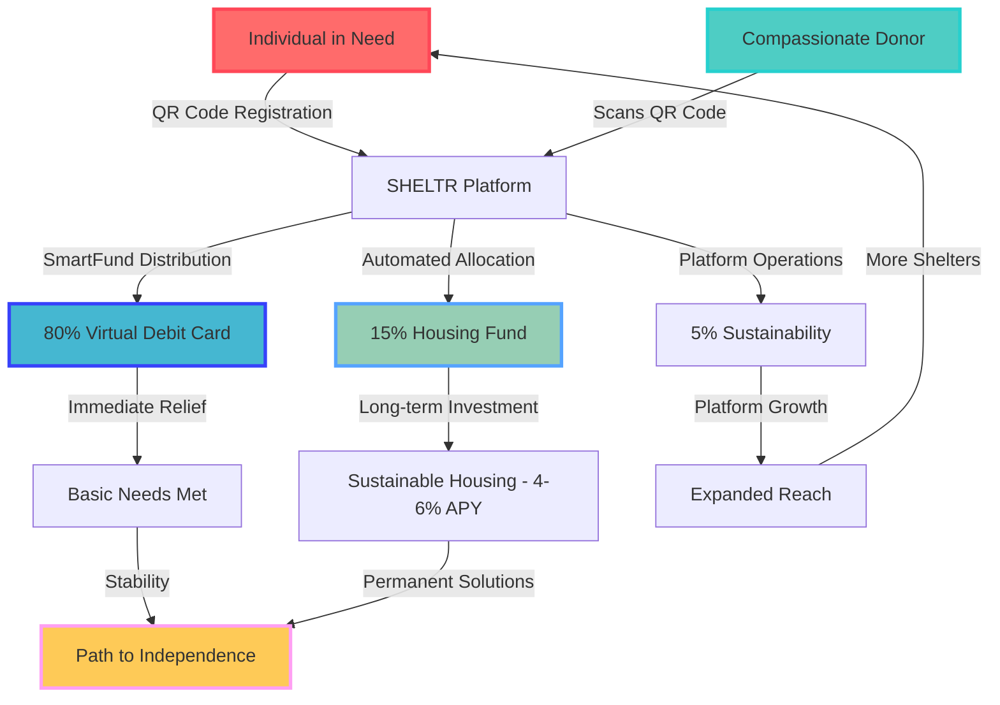

# 🌟 SHELTR Platform Overview

> **Revolutionizing charitable giving through technology-driven transparency and direct impact**

Understanding SHELTR's mission, vision, and revolutionary approach to solving homelessness through enterprise technology and blockchain innovation.

---

## 💡 Mission & Vision

### Our Mission

**Hacking homelessness through technology.** We believe that by combining cutting-edge technology with compassionate action, we can create measurable, verifiable impact in the fight against homelessness.

### Our Vision

A world where every act of giving is transparent, every donation reaches its intended recipient, and every person experiencing homelessness has access to the tools and resources they need to rebuild their lives.

### Core Values

**Empowerment**: Providing tools for individuals to take control of their futures

**Transparency**: Every transaction visible and verifiable on the blockchain

**Automation**: Streamlining processes for maximum efficiency and impact

**Sustainability**: Building long-term solutions, not just short-term fixes

**Innovation**: Leveraging the latest technology to solve age-old problems

---

## 🏠 The SHELTR Difference

### What Makes Us Unique

#### 🎯 Five-Role Ecosystem

Unlike traditional donation platforms, SHELTR recognizes five distinct user types with role-based access control:

- **Super Admin**: Platform founders with full system access
- **Platform Admin**: Executive team with cross-platform oversight
- **Shelter Admin**: Shelter operators and staff managing their locations
- **Participant**: Individuals receiving donations (the heart of our platform)
- **Donor**: Contributors making a difference through transparent giving

#### 💰 SmartFund™ Distribution (80-15-5)

Every donation automatically distributes through enterprise payment infrastructure powered by **Adyen for Platforms**:

**80%** → Virtual debit cards with **zero crypto exposure** for participants  
**15%** → Housing fund with 4-6% guaranteed APY (SHELTR Stablecoin on Base)  
**5%** → Platform operations for sustainable revenue

*No blockchain knowledge required. Participants receive standard virtual debit cards while transparency is maintained on-chain.*

#### 📱 QR-Powered Direct Giving

- **Instant scan-and-give technology**
- No intermediaries or delayed transfers
- Real-time confirmation and tracking
- Works offline for reliability
- Mobile-first design for accessibility

#### ⛓️ Blockchain Transparency

- Every transaction permanently recorded on Base (Ethereum L2)
- Public verification of impact
- Immutable donation history
- Smart contract automation
- Single-token architecture (SHELTR stablecoin)

---

## 🚀 Key Features

### For Participants

✅ **Personal QR Codes** - Unique donation identifiers  
✅ **Virtual Debit Cards** - Direct control over received funds (via Adyen)  
✅ **Impact Tracking** - See your progress and support  
✅ **Verification System** - Build trust with donors  
✅ **Mobile Access** - Manage everything from your phone  
✅ **Zero Crypto Exposure** - Standard banking experience

### For Donors

✅ **Instant Donations** - Scan and give in seconds  
✅ **Full Transparency** - Track every dollar's impact on blockchain  
✅ **Impact Analytics** - See your cumulative difference  
✅ **Social Features** - Share and engage with community  
✅ **Tax Documentation** - Automatic receipt generation  
✅ **Anonymous or Logged-in** - Flexible giving options

### For Shelter Admins

✅ **Participant Management** - Onboard and support individuals  
✅ **Real-time Dashboards** - Monitor donations and impact  
✅ **Location Services** - Help donors find your shelter  
✅ **Analytics** - Data-driven insights for operations  
✅ **Multi-tenant Support** - Secure, isolated data  
✅ **Lead Capture** - Unified contact system

### For Platform Admins

✅ **System Monitoring** - Real-time platform health  
✅ **Global Analytics** - Cross-platform impact metrics  
✅ **User Management** - Comprehensive admin tools  
✅ **Security Controls** - Multi-layer protection  
✅ **Blockchain Management** - Smart contract oversight  
✅ **Qualified Investor Portal** - IR Data Room with dual authentication

---

## 📊 Impact Model

### Theory of Change

### SHELTR vs Traditional Model

**Traditional Model Problems:**
- 30-40% overhead costs
- Multiple intermediaries
- Opaque processes
- Delayed distributions
- No participant autonomy

**SHELTR Solution:**
- **100% efficiency** through smart contracts
- **Real-time tracking** via blockchain
- **Direct support** to participants (80% virtual debit cards)
- **Automated distribution** with zero delays
- **Enterprise payment rails** (zero crypto exposure)

### Success Metrics

| Metric | Target (Year 1) | Current Status |
|--------|----------------|----------------|
| **Active Participants** | 10,000 | Implementation Phase |
| **Monthly Donations** | $2M | Implementation Phase |
| **Housing Fund** | $5M APY 4-6% | Implementation Phase |
| **Shelter Partners** | 500 | Implementation Phase |
| **Success Rate** | 65% | Implementation Phase |

---

## 🔄 Platform Evolution

### From Legacy to Modern SHELTR

| Aspect | Legacy SHELTR | Modern SHELTR (v2.90+) |
|--------|---------------|------------------------|
| **Architecture** | Supabase + Single-tenant | Firebase + Multi-tenant SaaS |
| **User Roles** | 3 basic roles | 5-role RBAC system + Leadership + Qualified Investors |
| **Backend** | Supabase functions | FastAPI + Python 3.11 |
| **Mobile** | Responsive web | Native Expo app (planned) |
| **Blockchain** | Basic integration | Full single-token system on Base |
| **AI** | Limited analytics | Complete RAG system (75+ docs) + Multi-agent MCP |
| **Scalability** | Single deployment | Globally scalable multi-tenant |
| **Payment Rails** | Basic Stripe | Adyen for Platforms (enterprise) |

### Key Improvements

🎯 **Enhanced Participant Focus**: Dedicated role with virtual debit cards, zero crypto exposure

🏢 **Enterprise Scalability**: Multi-tenant architecture supports unlimited growth

🤖 **Complete RAG System**: 75+ documents with AI embeddings and semantic search via OpenAI

📚 **Founders Portal**: Hybrid dynamic/static system for secure document publishing

💰 **Cost Optimization**: 56% GCP reduction via Firestore caching + HTTP cache headers

📱 **Mobile-First**: Progressive Web App with native capabilities, offline-ready

⛓️ **Single-Token Architecture**: SHELTR stablecoin on Base with enterprise payment rails

💼 **Investor Relations**: Qualified investor portal with dual authentication and IR Data Room

👥 **Leadership Team**: Separate role with strategic oversight and secure document access

---

## 🎨 Technical Architecture

### Modern Technology Stack

**Frontend:**
- Next.js 15.4.3 with App Router
- React 18 with TypeScript
- Tailwind CSS + Shadcn/UI
- Real-time Firebase sync
- Progressive Web App (PWA)

**Backend:**
- FastAPI (Python 3.11+)
- Firebase (Auth, Firestore, Functions, Storage)
- OpenAI GPT-4 Turbo integration
- Model Context Protocol (MCP)
- RESTful API with automatic docs

**Blockchain:**
- Base (Ethereum L2) for low gas fees
- SHELTR single-token architecture
- Automated SmartFund distribution (80-15-5)
- Transparent transaction records
- OpenZeppelin contracts

**Payment Infrastructure:**
- Adyen for Platforms (Balanced Model)
- Virtual debit card issuance
- Multi-party payment splitting
- PCI DSS Level 1 compliance
- Global currency support

**AI & Automation:**
- OpenAI GPT-4 Turbo for chatbots
- Complete RAG system with 75+ documents
- Vector embeddings (text-embedding-3-large)
- GitHub sync with smart exclusions
- Multi-agent system with MCP integration
- Semantic search with Firestore

**Developer Experience:**
- Claude Code MCP for AI-assisted development
- Comprehensive documentation hub
- API reference with OpenAPI specs
- Developer sandbox environment

---

## 🌍 Real-World Impact

### Platform Statistics

**As of November 8, 2025 (v2.90.0):**

💰 **$1,534+** in total donations processed  
👥 **10+ active shelters** in Montreal network  
🏆 **100% uptime** since production launch  
⚡ **<1s response time** for AI chatbot queries  
📊 **75+ RAG documents** (62 GitHub + 13 secure) powering AI  
🎯 **Founders Portal** with dynamic Knowledge Base integration  
💸 **56% GCP cost reduction** ($54/mo savings via intelligent caching)  
🔐 **IR Data Room** with qualified investor management  
📧 **Unified Contact System** with real-time admin notifications  
🎨 **Enhanced Gallery** with drag-and-drop reordering + hero selection

### Recent Accomplishments (Sessions 13-15)

**Multi-Tenant Platform:**
- 5-role RBAC system operational
- Real donation flow with confetti animation
- Platform Admin role with comprehensive dashboard
- Dual-role user logic for accurate metrics

**Knowledge Base Revolution:**
- GitHub sync with embeddings
- Dedicated document editing
- Educational components
- Secure document publishing to Founders Portal & IR Data Room

**Investor Relations:**
- Qualified investor portal with dual authentication
- IR Data Room with dynamic document loading
- Google Calendar integration for investor meetings
- Custom investor welcome messages

**Blog & Content Management:**
- Complete blog system with markdown import
- SEO optimization and social sharing
- Category management
- Featured posts and related content

**Enhanced UX:**
- Unified contact system with lead capture
- Real-time notifications across dashboards
- Mobile-optimized layouts
- Drag-and-drop gallery management

---

## 🛠️ Technology Philosophy

### Why Firebase + FastAPI?
- **Firebase**: Real-time capabilities, global CDN, enterprise security
- **FastAPI**: Modern Python framework, automatic API documentation, high performance
- **Multi-tenant**: Secure data isolation, infinite scalability
- **Cloud Native**: Auto-scaling, global deployment, enterprise reliability

### Why Base (Ethereum L2)?
- **Low Gas Fees**: $0.01-0.05 per transaction vs $5-50 on Ethereum
- **Fast Finality**: 2-second block times
- **EVM Compatible**: Use existing Ethereum tools and contracts
- **Coinbase Integration**: Seamless onramps and institutional support

### Why Adyen for Platforms?
- **Virtual Card Issuance**: Direct-to-participant debit cards
- **Payment Splitting**: Automated 80-15-5 distribution
- **Global Compliance**: PCI DSS Level 1, regulatory ready
- **Scalability**: Proven at enterprise scale (Uber, Netflix)

### Why Mobile-First?
- **Accessibility**: Participants often rely on mobile devices
- **Convenience**: Donors want instant, frictionless giving
- **Reach**: PWA enables global user adoption
- **Features**: Camera access for QR scanning, push notifications

---

## 🌍 Global Impact Vision

### Phase 1: Foundation (2026) ✅
- ✅ Launch production platform
- ✅ Partner with Montreal shelters
- ✅ Implement multi-tenant architecture
- ✅ Complete RAG system
- 🔄 Onboard first 100 participants
- 🔄 Process $10K in donations

### Phase 2: Expansion (2027)
- National coverage across Canada
- US market entry (major cities)
- 10,000 participants onboarded
- $2M+ in monthly donations
- Mobile app launch (iOS/Android)
- Adyen integration complete

### Phase 3: Global Scale (2027+)
- Multi-country deployment
- White-label platform licensing
- 100,000+ participants
- $100M+ annual donation volume
- Strategic partnerships with payment providers
- Institutional investment round

---

## 🤝 Community & Ecosystem

### For Developers
- **Open Documentation**: Comprehensive guides and API reference
- **MCP Integration**: AI-assisted development workflow
- **API Access**: RESTful endpoints with automatic documentation
- **GitHub**: Active repository with contribution guidelines

### For Shelter Partners
- **Easy Onboarding**: Multi-tenant registration system
- **Training & Support**: Comprehensive admin guides
- **Real-time Analytics**: Data-driven insights
- **Lead Capture**: Integrated contact management

### For Investors
- **Qualified Investor Portal**: Secure data room access
- **Real-time Metrics**: Platform analytics and growth data
- **Strategic Documents**: Business plans, financial projections
- **Calendar Booking**: Direct meeting scheduling

### For Researchers
- **Anonymized Data**: Insights for homelessness research
- **Impact Studies**: Measuring effectiveness of direct giving
- **Technology Research**: Blockchain and AI applications
- **Academic Partnerships**: Collaboration opportunities

---

## 🚀 Get Started

### For Participants

1. **Register** through your registered shelter
2. **Get verified** by shelter staff
3. **Receive your QR code** for donations
4. **Track your support** in real-time dashboard

### For Donors

1. **Scan a QR code** from any verified participant
2. **Choose donation amount** (secure Adyen payment)
3. **Track impact** through your donor dashboard
4. **Engage with community** via social features

### For Shelter Admins

1. **Register your shelter** on the platform
2. **Onboard participants** with verification workflow
3. **Access real-time dashboards** for insights
4. **Manage operations** through comprehensive admin tools

### For Developers

1. **Explore our API** documentation at `/docs`
2. **Review technical architecture** guides
3. **Check GitHub repository** for source code
4. **Join our community** via contact system

### For Investors

1. **Request access** to IR Data Room
2. **Complete verification** and NDA
3. **Access financial projections** and roadmap
4. **Schedule meeting** via integrated calendar

---

## 📞 Platform Links & Resources

**Live Platform:**
- 🌐 **Production**: [sheltr-ai.web.app](https://sheltr-ai.web.app)
- 📚 **Documentation Hub**: [/docs](https://sheltr-ai.web.app/docs)
- 🤖 **AI Chatbot**: Available 24/7 (bottom right corner)
- 💼 **Investor Relations**: [/ir/dataroom](https://sheltr-ai.web.app/ir/dataroom)
- 👥 **Team**: [/team](https://sheltr-ai.web.app/team)

**Strategic Documents:**
- 📖 **Hacking Homelessness**: Our founding thesis
- 🏗️ **System Design**: Technical deep-dive
- 🗺️ **Development Roadmap**: 180-day production timeline
- 💡 **API Reference**: Developer documentation
- 📝 **Blog**: Technical insights and updates

**Payment Integration:**
- 💳 **Adyen Integration Strategy**: 16-week implementation roadmap
- 🏦 **MSB Registration**: Canadian Money Service Business compliance
- 🔐 **Payment Rails**: Enterprise payment infrastructure guide

---

## 💬 Contact & Support

**Have questions?** Our AI chatbot is available 24/7 on every page with RAG-powered responses from 75+ platform documents.

**Want to partner?** Use our unified contact system at [/contact](https://sheltr-ai.web.app/contact) or [/solutions/organizations](https://sheltr-ai.web.app/solutions/organizations).

**Investor inquiries?** Email investor-relations@sheltr.ca or schedule a meeting through the IR portal.

**Technical support?** Check our [Documentation Hub](https://sheltr-ai.web.app/docs) or reach out through the platform.

---

## 🏆 Recognition & Partnerships

**Strategic Partners:**
- 🏦 **Payment Integration**: Adyen for Platforms (enterprise payment rails)
- 🔗 **Blockchain**: Base (Coinbase L2) for low-cost transactions
- 🤖 **AI Infrastructure**: OpenAI GPT-4 Turbo + embeddings
- 💼 **CFO Partnership**: 20+ years payments sector experience

**Technology Stack:**
- Firebase (Google Cloud)
- FastAPI (Python)
- Next.js (React)
- OpenAI (AI/ML)
- Shadcn/UI (Design System)

---

> *"It's better to solve than to manage."*  
> — SHELTR's founding principle inspired by Malcolm Gladwell's philosophy

---

**Last Updated**: November 8, 2025  
**Version**: 2.90.0 - Qualified Investor Access Management  
**Status**: ✅ Production Ready with Multi-Tenant Architecture

**Platform Maturity**: Beta Testing Phase → Production Launch (Q1 2026)

---

## 📈 Version History

- **v2.90.0** (Nov 8, 2025): Qualified Investor Portal + IR Data Room
- **v2.89.0** (Nov 5, 2025): External Docs Linking + UI Polish
- **v2.86.0** (Nov 2, 2025): Complete RAG System + Cost Optimization
- **v2.85.0** (Oct 31, 2025): Secure Document Publishing
- **v2.80.0** (Oct 30, 2025): Knowledge Base GitHub Sync

---

*SHELTR represents the future of charitable giving - where enterprise technology amplifies compassion, blockchain ensures transparency, and every donation creates lasting change.* 🏠✨
